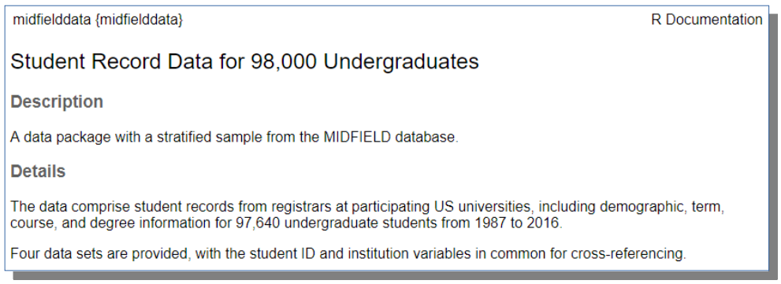

<!-- README.md is generated from README.Rmd. Please edit that file -->

```{r setup, echo = FALSE, message = FALSE}
library("midfieldr")
library("dplyr")
library("knitr")
load("R/sysdata.rda")

knitr::opts_chunk$set(
  # these options tend to vary from one Rmd to another
  echo = TRUE,
  fig.path = "man/figures/README-",

  # these options tend to remain constant
  collapse = TRUE,
  comment = "#>",
  message = FALSE,
  warning = FALSE,
  fig.width = 6,
  fig.asp = 1 / 1.6,
  out.width = "70%",
  fig.align = "center",

  # http://r-pkgs.had.co.nz/vignettes.html: error = TRUE captures errors in
  # the block and shows them inline. This is useful for demonstrating what
  # happens if code throws an error. If you use error = TRUE, set
  # purl = FALSE. Vignettes are accompanied by files containing all the
  # code from the vignette. purl = FALSE prevents the code from being
  # inserted into that file
  error = TRUE,
  purl = FALSE
)

knitr::knit_hooks$set(inline = function(x) {
  if (!is.numeric(x)) {
    x
  } else if (x >= 10000) {
    prettyNum(round(x, 2), big.mark = ",")
  } else {
    prettyNum(round(x, 2))
  }
})
```

# midfieldr <span class="border-wrap"></span>

```{r, echo = FALSE}
# Usage <- c(
#   "[](https://www.gnu.org/licenses/gpl-3.0)",
#   "[](https://cran.r-project.org/package=midfieldr)"
# )
# Release <- c(
#   "[](http://cran.r-project.org/package=midfieldr)",
#   ""
# )
# Development <- c(
#   "[](https://travis-ci.org/MIDFIELDR/midfieldr) [](https://codecov.io/github/MIDFIELDR/midfieldr?branch=master)",
#   "[](https://www.tidyverse.org/lifecycle/#experimental) [](http://www.repostatus.org/#active)"
# )
# df <- tibble(Usage, Release, Development)
```

[](https://www.gnu.org/licenses/gpl-3.0)
[](https://cran.r-project.org/package=midfieldr)
[](http://cran.r-project.org/package=midfieldr)
[](https://travis-ci.org/MIDFIELDR/midfieldr)
[](https://codecov.io/github/MIDFIELDR/midfieldr?branch=master)
[](https://www.tidyverse.org/lifecycle/#experimental)
[](https://www.repostatus.org/#wip)

## Undergoing major revision

Based on feedback from workshop attendees, the package is undergoing major revision to the vignettes and the underlying functionality. 

While in this ambiguous state, the package should be used experimentally only. We hope to have the update complete by the end of August 2020. 

```{r, echo = FALSE}
dt <- data_traits(cip)
obs_cip  <- dt$n_obs
var_cip  <- dt$n_var
size_cip <- dt$n_bytes

dt <- data_traits(midfielddata::midfieldstudents)
obs_students  <- dt$n_obs
var_students  <- dt$n_var
size_students <- dt$n_bytes

dt <- data_traits(midfielddata::midfieldcourses)
obs_courses  <- dt$n_obs
var_courses  <- dt$n_var
size_courses <- dt$n_bytes

dt <- data_traits(midfielddata::midfielddegrees)
obs_degrees  <- dt$n_obs
var_degrees  <- dt$n_var
size_degrees <- dt$n_bytes

dt <- data_traits(midfielddata::midfieldterms)
obs_terms  <- dt$n_obs
var_terms  <- dt$n_var
size_terms <- dt$n_bytes

n_inst      <- dt$n_inst
year_limits <- dt$year_limits
```


## Tools for student records research
 
MIDFIELD---the  *Multiple-Institution Database for Investigating Engineering Longitudinal Development*---is a partnership of US higher education institutions with engineering programs [(link)](https://engineering.purdue.edu/MIDFIELD). As of June, 2020, MIDFIELD contains registrar's population data for 1.7M undergraduates at 19 institutions from 1987--2019. The data are organized in four related tables: students, courses, terms, and degrees. A sample of the MIDFIELD data is provided by the midfielddata package.   

**midfieldr** is an R package that provides tools specialized for the midfielddata sample data set. 

**midfielddata** is an R package that provides a stratified sample of the MIDFIELD population data set. The sample contains data for `r obs_students` undergraduates at `r n_inst` institutions from `r year_limits[1]`--`r year_limits[2]` [(link)](https://midfieldr.github.io/midfielddata/). 

For members of MIDFIELD partner institutions: data dictionaries for midfielddata are a subset of those for MIDFIELD. When creating midfielddata, some MIDFIELD variables were omitted and some were re-coded to preserve confidentiality. In general, however, scripts written for the midfielddata sample data set will work for the MIDFIELD population data set. 


## Installation

Install midfielddata first. 

Because of its size, the data package is stored in a drat repository. Installation takes time; please be patient and wait for the Console prompt ">" to reappear.

```r
# install midfielddata first 
install.packages("midfielddata", 
                 repos = "https://MIDFIELDR.github.io/drat/", 
                 type = "source")
```

To confirm a successful installation, run the following to view the data package help page. A portion of the help page is shown below. 

```r
library(midfielddata)
? midfielddata
```




Once the midfielddata installation is confirmed successful, install midfieldr. The package should be submitted to CRAN by September 2020.  

```r
# install from CRAN (when available)
# install.packages("midfieldr")

# or install the development version from GitHub (available now)
# install.packages("devtools")
devtools::install_github("MIDFIELDR/midfieldr")
```


## Data

The midfieldr package includes: 

- `cip`  A data frame with `r obs_cip` observations and `r var_cip` CIP variables of program codes and names at the 2, 4, and 6-digit levels. Each observation is a unique program keyed by a 6-digit CIP code. Occupies `r size_cip` of memory.  Data dictionary [(link)](https://midfieldr.github.io/midfieldr/reference/cip.html). 

The midfielddata package contains four datasets that constitute a stratified sample of the MIDFIELD database. 

- `midfieldstudents` A data frame with `r obs_students` observations and `r var_students` demographic variables. Each observation is a unique student keyed by student ID. Occupies `r size_students` of memory. Data dictionary   [(link)](https://midfieldr.github.io/midfielddata/reference/midfieldstudents.html). 

- `midfieldcourses` A data frame with `r round(obs_courses/1e6, 1)` M observations and `r var_courses` academic course variables keyed by student ID, term, and course. Each observation is one course in one term for one student. Occupies `r size_courses` of memory. Data dictionary  [(link)](https://midfieldr.github.io/midfielddata/reference/midfieldcourses.html).

- `midfieldterms` A data frame with `r obs_terms` observations and `r var_terms` academic term variables keyed by student ID and term. Each observation is one term for one student. Occupies `r size_terms` of memory. Data dictionary  [(link)](https://midfieldr.github.io/midfielddata/reference/midfieldterms.html).

- `midfielddegrees` A data frame with `r obs_degrees` observations and `r var_degrees` graduation variables keyed by student ID. Each observation is a unique student. Occupies `r size_degrees` of memory. Data dictionary  [(link)](https://midfieldr.github.io/midfielddata/reference/midfielddegrees.html).


## Usage

**data manipulation ecosystem** We use base R in the examples. A user who prefers a dplyr or data.table ecosystem should find the translation to be straightforward.  

**data frames** midfieldr functions do not preserve data frame extensions such as tibble or data.table. Data frames returned by midfieldr functions are always base R `data.frame` objects. 

**graphs** We use ggplot2 in the examples. A translation to lattice or base R graphics should be easily managed by users familiar with those systems. 

**midfieldr functions** are designed to work with MIDFIELD-structured data to access and manipulate student records. A typical workflow might include:  

- `get_cip()` search the CIP data set for program codes  
- `label_programs()` isolate and label specific programs to study  
- `get_enrollees()` gather students ever enrolled in the programs 
- `completion_feasible()` subset students for 6-year completion feasibility
- `get_race_sex()` obtain student sex and race/ethnicity 
- `order_multiway()` condition multiway data for graphing 

**examples**  A complete example that starts with program selection and concludes with a persistence metric is given in the [vignette ("Using midfieldr")](articles/using_midfieldr.html).

A short example below illustrates applying of some of these functions. Suppose we want to graph the number of students ever enrolled in Engineering, grouped by sex and race/ethnicity, for whom graduation is feasible within the range of data available. 

We start with the CIP code---Engineering CIPs start with 14. `get_cip()` accesses the `cip` dataset. 

```{r}
# packages used
library(midfieldr)
library(ggplot2)

# gather the program CIPs
engr_cip <- get_cip(keep_any = "^14")
engr <- label_programs(data = engr_cip, label = "Engineering")

# examine the result
str(engr)
```

`get_enrollees()` accesses the `midfieldterms` dataset using the `engr` 6-digit CIP column to obtain the IDs of all students ever enrolled in these programs. 

```{r}
# extract students ever enrolled
enrollees <- get_enrollees(codes = engr$cip6)

# examine the result
str(enrollees)
```

`completion_feasible()` accesses the students, terms, and degrees datasets to 
filter for feasible program completion within the limits of the data. 

```{r}
# apply the feasible completion filter
ids_we_want  <- completion_feasible(id = enrollees$id)
rows_we_want <- enrollees$id %in% ids_we_want
enrollees    <- enrollees[rows_we_want, , drop = FALSE]

# examine the result
str(enrollees)
```

`get_race_sex()` accesses the `midfieldstudents` dataset using the enrollees IDs.  

```{r}
# get student demographics 
demographics <- get_race_sex(keep_id = ids_we_want)

# examine the result
str(demographics)
```

To the working data frame, join the student race/ethnicity and sex and the program names. 

```{r}
# join demographics and program labels to working data frame 
enrollees <- merge(enrollees, demographics, all.x = TRUE)
enrollees <- merge(enrollees, engr, all.x = TRUE)

# examine the result
str(enrollees)
```

Group and summarize by race/ethnicity and sex. 

```{r}
# initialize the summarizing column
enrollees$ever <- 0

# group and summarize
grouped_enrollees <- aggregate(ever ~ race + sex,
  data = enrollees,
  FUN = function(x) ever = sum(!is.na(x))
)

# examine the result
grouped_enrollees
```

Prepare data for graphing. 

```{r}
# remove ambiguous levels of race/ethnicity
pre_mw <- grouped_enrollees
rows_we_want <- !pre_mw$race %in% c("International", "Other", "Unknown")
pre_mw <- pre_mw[rows_we_want, , drop = FALSE]

# complete the transformation to multiway form
columns_we_want <- c("race", "sex", "ever")
pre_mw <- pre_mw[, columns_we_want, drop = FALSE]

# examine the result
str(pre_mw)
```

`order_multiway()` converts the categorical variables to factors and orders the levels by the median of the quantitative variable. 

```{r}
data_mw <- order_multiway(pre_mw)

# examine the result
str(data_mw)

# total number of students for graph subtitle
n_ever <- sum(data_mw$ever) 
n_ever
```

And we're ready to graph the results. 

```{r fig1, fig.asp = 1.2/1.6}
ggplot(data = data_mw, mapping = aes(x = ever, y = race)) +
  facet_wrap(facets = vars(sex), ncol = 1, as.table = FALSE) +
  geom_point(na.rm = TRUE) +
  scale_x_continuous(trans = 'log2', breaks = 2^seq(0, 15)) +
  labs(x = "Number of students, log-2 scale", 
       y = "", 
       title = "Ever enrolled in Engineering", 
       subtitle = bquote(N == .(n_ever)), 
       caption = "Source: midfielddata"
       ) +
  theme(panel.grid.minor.x = element_blank())
```


 


## Meta

- Data provided by MIDFIELD [(link)](https://engineering.purdue.edu/MIDFIELD)   
- Get citation information with `citation("midfieldr")` 
- This project is released with a Code of Conduct  [(link)](https://midfieldr.github.io/midfieldr/CONDUCT.html). If you contribute to this project you agree to abide by its terms. 


