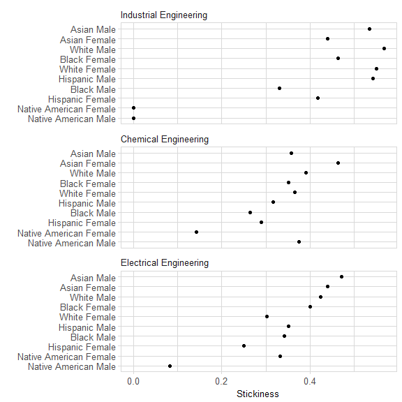

<!-- README.md is generated from README.Rmd. Please edit that file -->

```{r setup, echo = FALSE, message = FALSE}
knitr::opts_knit$set(root.dir = "../")
knitr::opts_chunk$set(
  echo = TRUE, # varies from one Rmd to another
  message = FALSE,
  warning = FALSE,
  collapse = TRUE,
  comment = "#>",
  error = TRUE,
  purl = FALSE,
  fig.width = 6,
  fig.asp = 1 / 1.6,
  out.width = "70%",
  fig.align = "center",
  fig.path = "../man/figures/ABOUT-"
)
knitr::knit_hooks$set(inline = function(x) {
  if (!is.numeric(x)) {
    x
  } else if (x >= 10000) {
    prettyNum(round(x, 2), big.mark = ",")
  } else {
    prettyNum(round(x, 2))
  }
})
options(tibble.print_min = 8L, tibble.print_max = 8L)
```


# midfieldr <a href="https://engineering.purdue.edu/MIDFIELD" target="blank"></a>

[](https://www.gnu.org/licenses/gpl-3.0)
[](http://cran.r-project.org/package=midfieldr)
[](https://travis-ci.org/MIDFIELDR/midfieldr)
[](https://codecov.io/github/MIDFIELDR/midfieldr?branch=master)

```{r databits, echo = FALSE}
# unpack data bits
data_bits <- midfieldr:::data_bits_cip
obs_cip <- round(data_bits$data[data_bits$name == "obs_cip"] / 1e+0, 1)
var_cip <- data_bits$data[data_bits$name == "var_cip"]
size_cip <- round(data_bits$data[data_bits$name == "size_cip"] / 1e+3, 0)

data_bits <- midfieldstudents:::data_bits_students
obs_student <- round(data_bits$data[data_bits$name == "obs_student"] / 1e+0, 1)
size_student <- round(data_bits$data[data_bits$name == "size_student"] / 1e+6, 0)
var_student <- data_bits$data[data_bits$name == "var_student"]
year_min <- data_bits$data[data_bits$name == "year_min"]

data_bits <- midfielddegrees:::data_bits_degrees
obs_degree <- round(data_bits$data[data_bits$name == "obs_degree"] / 1e+0, 1)
var_degree <- data_bits$data[data_bits$name == "var_degree"]
size_degree <- round(data_bits$data[data_bits$name == "size_degree"] / 1e+6, 0)
award_degree <- round(data_bits$data[data_bits$name == "award_degree"] / 1e+0, 1)
year_max <- data_bits$data[data_bits$name == "year_max"]

data_bits <- midfieldterms:::data_bits_terms
obs_term <- round(data_bits$data[data_bits$name == "obs_term"] / 1e+0, 1)
var_term <- data_bits$data[data_bits$name == "var_term"]
size_term <- round(data_bits$data[data_bits$name == "size_term"] / 1e+6, 0)

data_bits <- midfieldcourses:::data_bits_courses
obs_course <- round(data_bits$data[data_bits$name == "obs_course"] / 1e+6, 1)
var_course <- data_bits$data[data_bits$name == "var_course"]
size_course <- round(data_bits$data[data_bits$name == "size_course"] / 1e+6, 0)
```

midfieldr is a package for investigating student record data provided by registrars at US universities participating in the MIDFIELD project. 

A stratified sample of the MIDFIELD database is accessible using midfieldr. The sample comprises demographic, term, course, and degree information for `r obs_student` undergraduate students from `r year_min` to `r year_max`. Because of their size, the sample datasets are provided in separate data packages.

midfieldr includes functions for selecting specific fields of study and  aggregating, computing, and graphing student persistence metrics.

## Installation

The development version:

    install.packages("devtools")
    devtools::install_github("MIDFIELDR/midfieldr")

## Data 

The sample of the MIDFIELD database that is accessible using midfieldr and its data packages includes:   

- `cip` in the [midfieldr](https://github.com/MIDFIELDR/midfieldr) package. A tidy data frame with `r obs_cip` observations and `r var_cip` CIP variables of program codes and names at the 2, 4, and 6-digit levels. Each observation is a unique program. Occupies `r size_cip` kb of memory.  

- `midfieldstudents` in the [midfieldstudents](https://github.com/MIDFIELDR/midfieldstudents) package. A tidy data frame with `r obs_student` observations and `r var_student` demographic variables. Each observation is a unique student. Occupies `r size_student` Mb of memory.  

- `midfieldcourses` in the [midfieldcourses](https://github.com/MIDFIELDR/midfieldcourses) package. A tidy data frame with `r obs_course` M observations and `r var_course` academic course variables. Each observation is one course in one term for one student. Occupies `r size_course` Mb of memory. 

- `midfieldterms` in the [midfieldterms](https://github.com/MIDFIELDR/midfieldterms) package. A tidy data frame with `r obs_term` observations and `r var_term` academic term variables. Each observation is one term for one student. Occupies `r size_term` Mb of memory. 

- `midfielddegrees` in the [midfielddegrees](https://github.com/MIDFIELDR/midfielddegrees) package. A tidy data frame with `r obs_degree` observations and `r var_degree` graduation variables. Each observation is a unique student. Occupies `r size_degree` Mb of memory.


## Usage

Packages used in this demonstration:

```{r packages, message = FALSE}
library(midfieldr)
library(tidyverse)
```

We can illustrate some of the functionality of midfieldr by demonstrating how to compute and graph the stickiness metric. Additional detail is provided in   the [vignettes](articles/index.html). 

"Stickiness" is the ratio of the number of students graduating from a program to the number ever enrolled in the program [@stickiness2012]. In this example we compare the stickiness of three engineering programs: Chemical, Electrical, and Industrial Engineering.  

### Select programs to study

Begin by using `cip_filter()` to search for engineering codes. 

```{r first_cip_search}
cip_search <- cip_filter(series = "Engineering")
cip_search
```

In the CIP data, engineering program codes all start with "14". We can use this to narrow the search.  

```{r second_cip_search}
cip_search <- cip_filter(series = "^14") %>%
  cip_filter(series = c("Chemical", "Electrical", "Industrial"))

cip_search
```

Thus, the 4-digit CIP codes we are looking for are 1407 for Chemical Engineering, 1410 for Electrical, and 1435 for Industrial Engineering. We extract the CIP codes for each major and assign our own program label. 

```{r extract_specific_cip}
set1 <- cip_filter(series = "^1407") %>%
  add_column(program = "Chemical Engineering")
set2 <- cip_filter(series = "^1410") %>%
  add_column(program = "Electrical Engineering")
set3 <- cip_filter(series = "^1435") %>%
  add_column(program = "Industrial Engineering")
```

Combine the data frames and retain our custom program label and the 6-digit CIP codes. 

```{r cip_group}
cip_group <- bind_rows(set1, set2, set3) %>%
  select(program, CIP6)
```

For additional information, try the help page `?cip_filter()` and the  [Selecting CIP codes](cip_filter.html) vignette. 

### Compute the metric

Use `gather_ever()` to access the `midfieldterms` dataset and extract all students who ever enrolled in these programs. 

```{r gather_ever}
students <- gather_ever(cip_group)
```

Use `race_sex_join()` to access the `midfieldstudents` dataset and append students' race and sex to the data frame. 

```{r demographics}
students <- students %>%
  race_sex_join()
```

Count the numbers of students grouped by program, race, and sex using the  dplyr `group_by()` and `summarize()` functions. 

```{r ever_enrolled}
ever_enrolled <- students %>%
  group_by(program, race, sex) %>%
  summarize(ever = n()) %>%
  ungroup()
```

Use `zero_fill()` to expand the data frame to include all missing combinations of variables (if any) and insert a count of zero in the numerical column.  The arguments of `zero_fill()` should be the arguments of `group_by()` above.

```{r zero_fill}
ever_enrolled <- ever_enrolled %>%
  zero_fill(program, race, sex)
```

Use `gather_grad()` to access the `midfielddegrees` dataset and extract all students who graduated from in these programs. We group and summarize the counts using `grad` as the new count variable.  

```{r graduated}
graduated <- gather_grad(cip_group) %>%
  race_sex_join() %>%
  group_by(program, race, sex) %>%
  summarize(grad = n()) %>%
  ungroup() %>%
  zero_fill(program, race, sex)
```

The two data frames `ever_enrolled` and `graduated` are the arguments for the `tally_stickiness()` function that joins the two data frames by their common variables and computes stickiness. 

For a discussion of each step in greater detail, see the [Stickiness metric](stickiness.html) vignette.

```{r stickiness}
stickiness <- tally_stickiness(ever = ever_enrolled, grad = graduated)
```

### Graph the results 

To prepare the stickiness data for graphing, we remove ambiguous race levels (Unknown, International, or Other) and then combine race and sex into a single variable. 

```{r filter_race}
stickiness <- stickiness %>%
  filter(!race %in% c("Unknown", "International", "Other")) %>%
  mutate(race_sex = str_c(race, sex, sep = " "))
```

We graph these results in a *multiway dot plot*, a display type based on a data structure of two categorical variables (factors) and one quantitative variable [@cleveland1993]. 

We select `program` and `race_sex` as the two categorical variables and `stick` as the one quantitative variable. `multiway_order()` converts the two categorical variables to factors and orders their levels by median stickiness.

```{r multiway_order}
stickiness <- stickiness %>%
  select(program, race_sex, stick) %>%
  multiway_order()

glimpse(stickiness)
```

We use conventional ggplot2 functions to graph stickiness in a multiway dot plot. We also apply our own `midfield_theme()` to edit the visual properties of the graph. 

For additional information on multiways, see the [Multiway data, graphs, and tables](multiway.html) vignette. 

```{r ggplot_stickiness, fig.asp = 1.6/1.6, fig.show = "hide"}
ggplot(stickiness, aes(x = stick, y = race_sex)) +
  facet_wrap(~program, ncol = 1, as.table = FALSE) +
  geom_point(na.rm = TRUE) +
  labs(x = "Stickiness", y = "") +
  midfield_theme()
```


```{r graph_stickiness, fig.asp = 1.6/1.6, echo = FALSE}
# previous code chunk saves figure to file 
# for webpage, this chunk reads figure from file

```

## Meta

- Please [report any issues or bugs](https://github.com/MIDFIELDR/midfieldr/issues). 
- License: GPL-3. 
- Get citation information with `citation(package = 'midfieldr')`. 
- Please note that this project is released with a [Code of Conduct](CONDUCT.md). If you contribute to this project you agree to abide by its terms. 
  
## References
