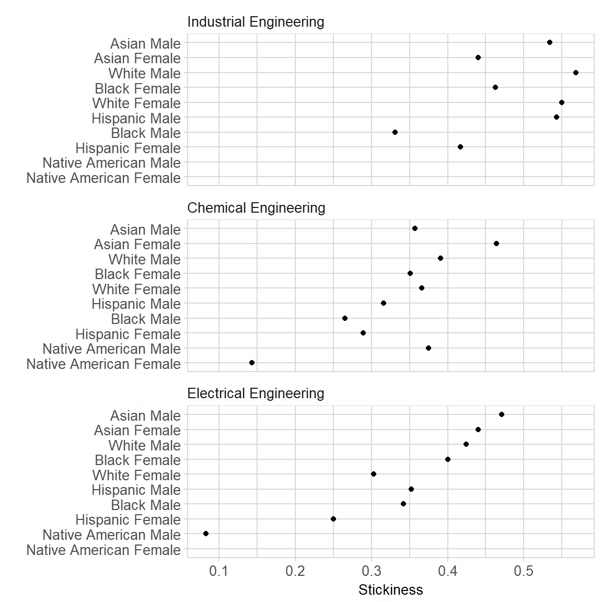

<!-- README.md is generated from README.Rmd. Please edit that file -->

# midfieldr <a href="https://engineering.purdue.edu/MIDFIELD" target="blank"></a>

[](https://www.gnu.org/licenses/gpl-3.0)
[](http://cran.r-project.org/package=midfieldr)
[](https://travis-ci.org/MIDFIELDR/midfieldr)
[](https://codecov.io/github/MIDFIELDR/midfieldr?branch=master)

A package for investigating student record data provided by registrars
at US universities participating in the MIDFIELD project.

midfieldr provides tools for accessing and analyizing s stratified
sample of the MIDFIELD database. The sample comprises demographic, term,
course, and degree information for 97,640 undergraduate students from
1987 to 2016. The sample data are provided in a separate data package.

midfieldr includes functions for selecting specific fields of study and
aggregating, computing, and graphing student persistence metrics.

## Installation

The development version:

    install.packages("devtools")
    devtools::install_github("MIDFIELDR/midfieldr")

## Data

The midfieldr package includes:

  - `cip`. A tidy data frame with 1546 observations and 6 CIP variables
    of program codes and names at the 2, 4, and 6-digit levels. Each
    observation is a unique program. Occupies 362 kb of memory.

The [midfielddata](https://github.com/MIDFIELDR/midfielddata) package
contains the four datasets that comprise a stratified sample of the
MIDFIELD database.

  - `midfieldstudents`. A tidy data frame with 97,640 observations and
    15 demographic variables. Each observation is a unique student.
    Occupies 19 Mb of memory.

  - `midfieldcourses`. A tidy data frame with 3.5 M observations and 12
    academic course variables. Each observation is one course in one
    term for one student. Occupies 348 Mb of memory.

  - `midfieldterms`. A tidy data frame with 729,014 observations and 13
    academic term variables. Each observation is one term for one
    student. Occupies 82 Mb of memory.

  - `midfielddegrees`. A tidy data frame with 97,640 observations and 5
    graduation variables. Each observation is a unique student. Occupies
    10 Mb of memory.

## Usage

Packages used in this demonstration:

``` r
library(midfieldr)
library(tidyverse)
```

We can illustrate some of the functionality of midfieldr by
demonstrating how to compute and graph the stickiness metric.
“Stickiness” is the ratio of the number of students graduating from a
program to the number ever enrolled in the program (Ohland et al. 2012).
In this example we compare the stickiness of three engineering programs:
Chemical, Electrical, and Industrial Engineering. (Additional detail is
provided in the [vignettes](articles/index.html).)

### Select programs to study

Begin by using `cip_filter()` to search for engineering codes.

``` r
search_results <- cip_filter(series = "Engineering")
search_results
#> # A tibble: 122 x 6
#>   CIP2  CIP2name    CIP4  CIP4name              CIP6  CIP6name            
#>   <chr> <chr>       <chr> <chr>                 <chr> <chr>               
#> 1 14    Engineering 1401  Engineering/General   1401~ Engineering - Gener~
#> 2 14    Engineering 1401  Engineering/General   1401~ Pre-Engineering     
#> 3 14    Engineering 1402  Aerospace/Aeronautic~ 1402~ Aerospace/Aeronauti~
#> 4 14    Engineering 1403  Agricultural/Biologi~ 1403~ Agricultural/Biolog~
#> 5 14    Engineering 1404  Architectural Engine~ 1404~ Architectural Engin~
#> 6 14    Engineering 1405  Biomedical/Medical E~ 1405~ Biomedical/Medical ~
#> 7 14    Engineering 1406  Ceramic Sciences and~ 1406~ Ceramic Sciences an~
#> 8 14    Engineering 1407  Chemical Engineering  1407~ Chemical Engineering
#> # ... with 114 more rows
```

In the CIP data, engineering program codes all start with “14”. We can
use this to narrow the search.

``` r
search_results <- cip_filter(series = "^14") %>%
  cip_filter(series = c("Chemical", "Electrical", "Industrial"))

search_results
#> # A tibble: 8 x 6
#>   CIP2  CIP2name    CIP4  CIP4name             CIP6  CIP6name             
#>   <chr> <chr>       <chr> <chr>                <chr> <chr>                
#> 1 14    Engineering 1407  Chemical Engineering 1407~ Chemical Engineering 
#> 2 14    Engineering 1407  Chemical Engineering 1407~ Chemical and Biomole~
#> 3 14    Engineering 1407  Chemical Engineering 1407~ Chemical Engineering~
#> 4 14    Engineering 1410  Electrical/Electron~ 1410~ Electrical/Electroni~
#> 5 14    Engineering 1410  Electrical/Electron~ 1410~ Laser and Optical En~
#> 6 14    Engineering 1410  Electrical/Electron~ 1410~ Telecommunications E~
#> 7 14    Engineering 1410  Electrical/Electron~ 1410~ Electrical/Electroni~
#> 8 14    Engineering 1435  Industrial Engineer~ 1435~ Industrial Engineeri~
```

Thus, the 4-digit CIP codes we are looking for are 1407 for Chemical
Engineering, 1410 for Electrical, and 1435 for Industrial Engineering.
We extract the CIP codes for each major and assign our own program
label.

``` r
set1 <- cip_filter(series = "^1407") %>%
  add_column(program = "Chemical Engineering")
set2 <- cip_filter(series = "^1410") %>%
  add_column(program = "Electrical Engineering")
set3 <- cip_filter(series = "^1435") %>%
  add_column(program = "Industrial Engineering")
```

Combine the data frames.

``` r
cip_group <- bind_rows(set1, set2, set3)
```

For additional information, try the help page `?cip_filter()` and the
[Selecting CIP codes](cip_filter.html) vignette.

### Compute the metric

Use `gather_ever()` to access the `midfieldterms` dataset and extract
all students who ever enrolled in these programs.

``` r
students <- gather_ever(cip_group)
```

Use `race_sex_join()` to access the `midfieldstudents` dataset and
append students’ race and sex to the data frame.

``` r
students <- students %>%
  race_sex_join()
```

Count the numbers of students grouped by program, race, and sex using
the dplyr `group_by()` and `summarize()` functions.

``` r
ever_enrolled <- students %>%
  group_by(program, race, sex) %>%
  summarize(ever = n()) %>%
  ungroup()
```

Use `zero_fill()` to expand the data frame to include all missing
combinations of variables (if any) and insert a count of zero in the
numerical column. The arguments of `zero_fill()` should be the arguments
of `group_by()` above.

``` r
ever_enrolled <- ever_enrolled %>%
  zero_fill(program, race, sex)
```

Use `gather_grad()` to access the `midfielddegrees` dataset and extract
all students who graduated from these programs. We group and summarize
the counts using `grad` as the new count variable.

``` r
graduated <- gather_grad(cip_group) %>%
  race_sex_join() %>%
  group_by(program, race, sex) %>%
  summarize(grad = n()) %>%
  ungroup() %>%
  zero_fill(program, race, sex)
```

The two data frames `ever_enrolled` and `graduated` are the arguments
for the `tally_stickiness()` function that joins the two data frames by
their common variables and computes stickiness.

For a discussion of each step in greater detail, see the [Stickiness
metric](stickiness.html) vignette.

``` r
stickiness <- tally_stickiness(ever = ever_enrolled, grad = graduated)
```

### Graph the results

To prepare the stickiness data for graphing, we remove ambiguous race
levels (Unknown, International, or Other) and then combine race and sex
into a single variable.

``` r
stickiness <- stickiness %>%
  filter(!race %in% c("Unknown", "International", "Other")) %>%
  mutate(race_sex = str_c(race, sex, sep = " "))
```

We graph these results in a *multiway dot plot*, a display type based on
a data structure of two categorical variables (factors) and one
quantitative variable (Cleveland 1993).

We select `program` and `race_sex` as the two categorical variables and
`stick` as the one quantitative variable. `multiway_order()` converts
the two categorical variables to factors and orders their levels by
median stickiness.

``` r
stickiness <- stickiness %>%
  select(program, race_sex, stick) %>%
  multiway_order()

glimpse(stickiness)
#> Observations: 30
#> Variables: 3
#> $ program  <fct> Chemical Engineering, Chemical Engineering, Chemical ...
#> $ race_sex <fct> Asian Female, Asian Male, Black Female, Black Male, H...
#> $ stick    <dbl> 0.464, 0.357, 0.351, 0.265, 0.289, 0.316, 0.143, 0.37...
```

We use conventional ggplot2 functions to graph stickiness in a multiway
dot plot. We also apply our own `midfield_theme()` to edit the visual
properties of the graph.

For additional information on multiways, see the [Multiway data, graphs,
and tables](multiway.html) vignette.

``` r
ggplot(stickiness, aes(x = stick, y = race_sex)) +
  facet_wrap(~program, ncol = 1, as.table = FALSE) +
  geom_point(na.rm = TRUE) +
  labs(x = "Stickiness", y = "") +
  theme_midfield()
```



## Meta

  - Please [report any issues or
    bugs](https://github.com/MIDFIELDR/midfieldr/issues).
  - License: GPL-3.
  - Get citation information with `citation(package = 'midfieldr')`.
  - Please note that this project is released with a [Code of
    Conduct](CONDUCT.md). If you contribute to this project you agree to
    abide by its terms.

## References

<div id="refs" class="references">

<div id="ref-cleveland1993">

Cleveland, William S. 1993. *Visualizing Data*. Summit, NJ: Hobart
Press.

</div>

<div id="ref-stickiness2012">

Ohland, Matthew, Marisa Orr, Richard Layton, Susan Lord, and Russell
Long. 2012. “Introducing Stickiness as a Versatile Metric of Engineering
Persistence.” In *Proceedings of the Frontiers in Education Conference*,
1–5.

</div>

</div>
