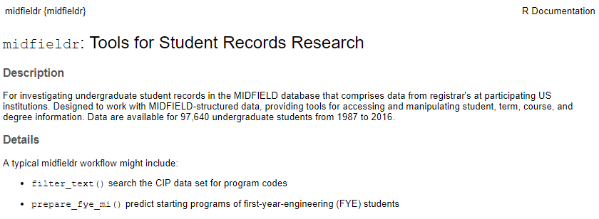
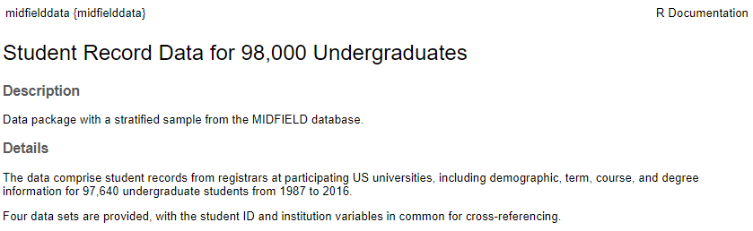

<!-- README.md is generated from README.Rmd. Please edit that file -->

# midfieldr

Tools for Studying MIDFIELD Student Unit Record Data in R

<!-- badges: start -->

[](https://github.com/MIDFIELDR/midfieldr/actions)
[](https://app.codecov.io/gh/MIDFIELDR/midfieldr)
[](https://CRAN.R-project.org/package=midfieldr)
[](https://www.gnu.org/licenses/old-licenses/gpl-2.0.en.html)
<!-- badges: end -->

The goal of midfieldr is to provide tools and guides for working with
longitudinal data from the MIDFIELD database.

## Overview

<a href="https://engineering.purdue.edu/MIDFIELD"
target="_blank"><strong>MIDFIELD</strong></a> contains individual
Student Unit Record (SUR) data for 1.7M students at 21 US institutions
(as of June 2022). MIDFIELD is large enough to permit grouping and
summarizing by multiple characteristics, enabling researchers to examine
student characteristics (race/ethnicity, sex, prior achievement) and
curricular pathways (including coursework and major) by institution and
over time.

**midfieldr** is an R package that provides tools for working with
MIDFIELD SURs. The tools in midfieldr work with the research data in the
MIDFIELD database and with the practice data in the midfielddata
package.

<a href="https://midfieldr.github.io/midfielddata/"
target="_blank"><strong>midfielddata</strong></a> is an R package that
provides practice data (a proportionate stratified sample of MIDFIELD)
with longitudinal SURs for nearly 98,000 undergraduates at 12
institutions from 1987–2016 organized in four data tables:

<table class=" lightable-paper" style="font-family: &quot;Arial Narrow&quot;, arial, helvetica, sans-serif; margin-left: auto; margin-right: auto;">
<thead>
<tr>
<th style="text-align:left;background-color: #c7eae5 !important;">
Data set
</th>
<th style="text-align:left;background-color: #c7eae5 !important;">
Each row is
</th>
<th style="text-align:right;background-color: #c7eae5 !important;">
N rows
</th>
<th style="text-align:right;background-color: #c7eae5 !important;">
N columns
</th>
</tr>
</thead>
<tbody>
<tr>
<td style="text-align:left;font-family: monospace;color: black !important;background-color: white !important;">
student
</td>
<td style="text-align:left;color: black !important;background-color: white !important;">
a student upon being admitted
</td>
<td style="text-align:right;color: black !important;background-color: white !important;">
98k
</td>
<td style="text-align:right;color: black !important;background-color: white !important;">
13
</td>
</tr>
<tr>
<td style="text-align:left;font-family: monospace;color: black !important;background-color: white !important;">
course
</td>
<td style="text-align:left;color: black !important;background-color: white !important;">
a student in a course
</td>
<td style="text-align:right;color: black !important;background-color: white !important;">
3.4M
</td>
<td style="text-align:right;color: black !important;background-color: white !important;">
12
</td>
</tr>
<tr>
<td style="text-align:left;font-family: monospace;color: black !important;background-color: white !important;">
term
</td>
<td style="text-align:left;color: black !important;background-color: white !important;">
a student in a term
</td>
<td style="text-align:right;color: black !important;background-color: white !important;">
711k
</td>
<td style="text-align:right;color: black !important;background-color: white !important;">
13
</td>
</tr>
<tr>
<td style="text-align:left;font-family: monospace;color: black !important;background-color: white !important;">
degree
</td>
<td style="text-align:left;color: black !important;background-color: white !important;">
a student who completes their program
</td>
<td style="text-align:right;color: black !important;background-color: white !important;">
48k
</td>
<td style="text-align:right;color: black !important;background-color: white !important;">
5
</td>
</tr>
</tbody>
</table>

All four data tables are keyed by student ID. Tables `student` and
`degree` have one observation (row) per student. Tables `course` and
`term` have multiple observations per student because students can be
enrolled in more than one course in a term and more than one term over
their program.

## Usage

The outline of our typical workflow is:

-   Define the study parameters
-   Transform the data to yield the observations of interest
-   Calculate summary statistics and metrics
-   Create tables and charts to display results
-   Iterate

In this brief usage example, the goal is to tabulate counts of
engineering students by race/ethnicity, sex, and graduation status. Data
processing is performed using data.table syntax. From the midfielddata
package, we use data sets `student`, `term`, and `degree`. From the
midfieldr package, we use the functions:

-   `add_timely_term()`
-   `add_data_sufficiency()`
-   `add_completion_status()`

``` r
# Packages used
library("midfieldr")
library("midfielddata")
suppressPackageStartupMessages(library("data.table"))

# Load the midfielddata practice data used here
data(student, term, degree)

# Initialize the working data table
DT <- copy(term)

# Timely completion term required for data sufficiency
DT <- add_timely_term(DT, term)

# Filter for data sufficiency
DT <- add_data_sufficiency(DT, term)
DT <- DT[data_sufficiency == "include"]

# Filter observations for degree-seeking using an inner join
DT <- DT[student, .(mcid, cip6, timely_term), on = c("mcid"), nomatch = NULL]

# Filter observations for engineering programs
DT <- DT[cip6 %like% "^14"]

# Filter observations for unique students (first instance)
DT <- DT[, .SD[1], by = c("mcid")]

# Add completion status
DT <- add_completion_status(DT, degree)

# Add race and sex using a left outer join
DT <- student[DT, .(completion_status, sex, race), on = c("mcid")]

# Calculate summary statistics
DT <- DT[, .N, by = c("completion_status", "sex", "race")]

# Tabulate results
DT[, people := paste(race, sex)]
DT_display <- dcast(DT, people ~ completion_status, value.var = "N")
setcolorder(DT_display, c("people", "timely", "late"))
setnames(DT_display,
  old = c("people", "timely", "late", "NA"),
  new = c("People", "Timely completion", "Late completion", "Did not complete")
)
```

Tabulated results of usage example. “Timely completion” is the count of
graduates completing their programs in no more than 6 years; “Late
completion” is the count of those graduating in more than 6 years; “Did
not complete” is the count of non-graduates.

<table class=" lightable-paper" style="font-family: &quot;Arial Narrow&quot;, arial, helvetica, sans-serif; margin-left: auto; margin-right: auto;">
<thead>
<tr>
<th style="text-align:left;background-color: #c7eae5 !important;">
People
</th>
<th style="text-align:right;background-color: #c7eae5 !important;">
Timely completion
</th>
<th style="text-align:right;background-color: #c7eae5 !important;">
Late completion
</th>
<th style="text-align:right;background-color: #c7eae5 !important;">
Did not complete
</th>
</tr>
</thead>
<tbody>
<tr>
<td style="text-align:left;color: black !important;background-color: white !important;">
Asian Female
</td>
<td style="text-align:right;color: black !important;background-color: white !important;">
124
</td>
<td style="text-align:right;color: black !important;background-color: white !important;">
19
</td>
<td style="text-align:right;color: black !important;background-color: white !important;">
59
</td>
</tr>
<tr>
<td style="text-align:left;color: black !important;background-color: white !important;">
Asian Male
</td>
<td style="text-align:right;color: black !important;background-color: white !important;">
388
</td>
<td style="text-align:right;color: black !important;background-color: white !important;">
89
</td>
<td style="text-align:right;color: black !important;background-color: white !important;">
180
</td>
</tr>
<tr>
<td style="text-align:left;color: black !important;background-color: white !important;">
Black Female
</td>
<td style="text-align:right;color: black !important;background-color: white !important;">
309
</td>
<td style="text-align:right;color: black !important;background-color: white !important;">
47
</td>
<td style="text-align:right;color: black !important;background-color: white !important;">
201
</td>
</tr>
<tr>
<td style="text-align:left;color: black !important;background-color: white !important;">
Black Male
</td>
<td style="text-align:right;color: black !important;background-color: white !important;">
376
</td>
<td style="text-align:right;color: black !important;background-color: white !important;">
104
</td>
<td style="text-align:right;color: black !important;background-color: white !important;">
423
</td>
</tr>
<tr>
<td style="text-align:left;color: black !important;background-color: white !important;">
Hispanic/Latinx Female
</td>
<td style="text-align:right;color: black !important;background-color: white !important;">
63
</td>
<td style="text-align:right;color: black !important;background-color: white !important;">
6
</td>
<td style="text-align:right;color: black !important;background-color: white !important;">
21
</td>
</tr>
<tr>
<td style="text-align:left;color: black !important;background-color: white !important;">
Hispanic/Latinx Male
</td>
<td style="text-align:right;color: black !important;background-color: white !important;">
188
</td>
<td style="text-align:right;color: black !important;background-color: white !important;">
27
</td>
<td style="text-align:right;color: black !important;background-color: white !important;">
103
</td>
</tr>
<tr>
<td style="text-align:left;color: black !important;background-color: white !important;">
International Female
</td>
<td style="text-align:right;color: black !important;background-color: white !important;">
22
</td>
<td style="text-align:right;color: black !important;background-color: white !important;">
6
</td>
<td style="text-align:right;color: black !important;background-color: white !important;">
12
</td>
</tr>
<tr>
<td style="text-align:left;color: black !important;background-color: white !important;">
International Male
</td>
<td style="text-align:right;color: black !important;background-color: white !important;">
114
</td>
<td style="text-align:right;color: black !important;background-color: white !important;">
30
</td>
<td style="text-align:right;color: black !important;background-color: white !important;">
74
</td>
</tr>
<tr>
<td style="text-align:left;color: black !important;background-color: white !important;">
Native American Female
</td>
<td style="text-align:right;color: black !important;background-color: white !important;">
10
</td>
<td style="text-align:right;color: black !important;background-color: white !important;">
3
</td>
<td style="text-align:right;color: black !important;background-color: white !important;">
3
</td>
</tr>
<tr>
<td style="text-align:left;color: black !important;background-color: white !important;">
Native American Male
</td>
<td style="text-align:right;color: black !important;background-color: white !important;">
27
</td>
<td style="text-align:right;color: black !important;background-color: white !important;">
11
</td>
<td style="text-align:right;color: black !important;background-color: white !important;">
19
</td>
</tr>
<tr>
<td style="text-align:left;color: black !important;background-color: white !important;">
Other/Unknown Female
</td>
<td style="text-align:right;color: black !important;background-color: white !important;">
29
</td>
<td style="text-align:right;color: black !important;background-color: white !important;">
3
</td>
<td style="text-align:right;color: black !important;background-color: white !important;">
14
</td>
</tr>
<tr>
<td style="text-align:left;color: black !important;background-color: white !important;">
Other/Unknown Male
</td>
<td style="text-align:right;color: black !important;background-color: white !important;">
71
</td>
<td style="text-align:right;color: black !important;background-color: white !important;">
19
</td>
<td style="text-align:right;color: black !important;background-color: white !important;">
56
</td>
</tr>
<tr>
<td style="text-align:left;color: black !important;background-color: white !important;">
White Female
</td>
<td style="text-align:right;color: black !important;background-color: white !important;">
1226
</td>
<td style="text-align:right;color: black !important;background-color: white !important;">
154
</td>
<td style="text-align:right;color: black !important;background-color: white !important;">
468
</td>
</tr>
<tr>
<td style="text-align:left;color: black !important;background-color: white !important;">
White Male
</td>
<td style="text-align:right;color: black !important;background-color: white !important;">
4527
</td>
<td style="text-align:right;color: black !important;background-color: white !important;">
634
</td>
<td style="text-align:right;color: black !important;background-color: white !important;">
2191
</td>
</tr>
</tbody>
</table>

## Documentation

-   <a href="https://midfieldr.github.io/midfieldr/articles/"
    target="_blank">Articles.</a> For a listing of all vignettes.
-   <a href="https://midfieldr.github.io/midfieldr/reference/"
    target="_blank">Reference (midfieldr).</a> For a listing of all
    midfieldr functions and prepared data.
-   <a href="https://midfieldr.github.io/midfielddata/reference/"
    target="_blank">Reference (midfielddata).</a> For a listing of the
    four practice MIDFIELD data tables.

## Requirements

-   <a href="https://www.r-project.org/" target="_blank">R</a> (\>=
    3.5.0)
-   <a href="https://rdatatable.gitlab.io/data.table/"
    target="_blank">data.table</a> (\>= 1.9.8)  
-   <a href="https://ggplot2.tidyverse.org/" target="_blank">ggplot2</a>
    recommended for data graphics, but not required.

## Install midfieldr

midfieldr is not yet available from [CRAN](https://cran.r-project.org/).
To install the development version of midfieldr from its `drat`
repository, type in the Console:

``` r
# Install midfieldr from drat repo
install.packages("midfieldr", 
                 repos = "https://MIDFIELDR.github.io/drat/", 
                 type = "source")
```

You can confirm a successful installation by running the following lines
to bring up the package help page in the Help window.

``` r
# Run in Console
library("midfieldr")
help("midfieldr-package")
```

<figure>

<figcaption aria-hidden="true">midfieldr help page</figcaption>
</figure>

## Install midfielddata

Because of its size, installing the practice data takes time; please be
patient and wait for the prompt “\>” to reappear. In the Console, run:

``` r
# Install midfielddata  
install.packages("midfielddata", 
                 repos = "https://MIDFIELDR.github.io/drat/", 
                 type = "source")
# be patient
```

You can confirm a successful installation by running the following lines
to bring up the package help page in the Help window.

``` r
# Run in Console
library("midfielddata")
help("midfielddata-package")
```

<figure>

<figcaption aria-hidden="true">midfielddata help page</figcaption>
</figure>

## Contributing

To contribute to midfieldr,

-   Please clone this repo locally.  
-   Commit your code on a separate branch.
-   Use the *checkmate* package to include runtime argument checks in
    functions.
-   Use the *tinytest* package to write unit tests for your code. Save
    tests in the `inst/tinytest/` directory.

To provide feedback or report a bug,

-   Use the GitHub
    <a href="https://github.com/MIDFIELDR/midfieldr/issues"
    target="_blank">Issues</a> page.
-   Please run the package unit tests and report the results with your
    bug report. Any user can run the package tests by installing the
    *tinytest* package and running:

``` r
    test_results <- tinytest::test_package("midfieldr")
    as.data.frame(test_results)
```

Participation in this open source project is subject to a [Code of
Conduct](CONDUCT.html).

## Acknowledgments

This work is supported by a grant from the US National Science
Foundation (EEC 1545667).

## License

midfieldr is licensed under GPL (\>= 2.0) [(full
license)](LICENSE.html)  
© 2018–2022 Richard Layton, Russell Long, Susan Lord, Matthew Ohland,
and Marisa Orr.
