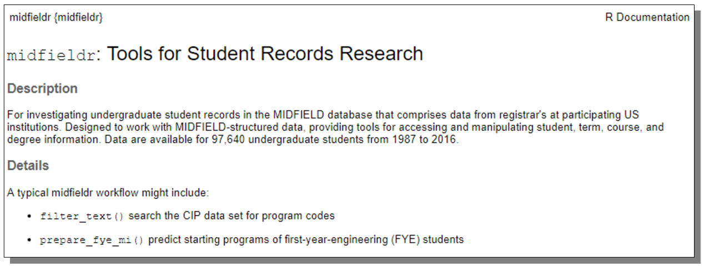
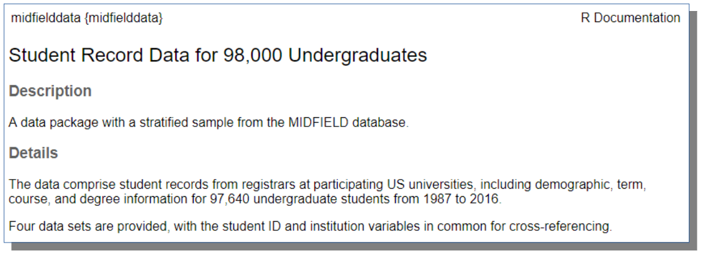

<!-- README.md is generated from README.Rmd. Please edit that file -->

# midfieldr <span class="border-wrap"></span>

<!-- badges: start -->

[](https://github.com/MIDFIELDR/midfieldr/actions)
[](http://cran.r-project.org/package=midfieldr)
[](https://www.gnu.org/licenses/old-licenses/gpl-2.0.en.html)
[](https://cran.r-project.org/package=midfieldr)
[](https://www.tidyverse.org/lifecycle/#experimental)
[](https://www.repostatus.org/#wip)
[](https://codecov.io/github/MIDFIELDR/midfieldr?branch=main)
<!-- badges: end -->

## Undergoing major revision

Based on feedback from workshop attendees and use-testing, the package
is undergoing significant, non-backwards-compatible revision to th API.

While in this ambiguous state, the package should be used experimentally
only. We hope to have a stable release by the end of July 2021.

## Tools for student records research

The *Multiple-Institution Database for Investigating Engineering
Longitudinal Development* (MIDFIELD) is a partnership of US higher
education institutions with engineering programs. MIDFIELD contains
registrar’s data for 1.7M undergraduates in all majors at 19
institutions from 1987–2019 ([Ohland and Long,
2016](#ref-Ohland+Long:2016)).

Our software environment comprises two R packages:

-   **midfieldr** An R package providing functions specialized for
    manipulating MIDFIELD data to examine the intersectionality of
    race/ethnicity, sex, and discipline in persistence metrics such as
    stickiness (retention by a discipline) and graduation rate.

-   [**midfielddata**](https://midfieldr.github.io/midfielddata/) An R
    package with practice data for users to learn about student record
    analysis using R. However, these data are not suitable for drawing
    inferences about student performance, i.e., not for research.

## Data

**Taxonomy of programs**

midfieldr includes `cip`, a data frame of the 2010 *Classification of
Instructional Programs* (CIP)—a taxonomy of academic programs curated by
the US Department of Education, National Center for Education Statistics
(NCES), Integrated Postsecondary Education Data System (IPEDS).

-   `cip` [(Link to data dictionary)](reference/cip.html) Data frame
    with 1584 observations and 6 variables providing program codes and
    names at the 2, 4, and 6-digit levels. Each observation is a unique
    program keyed by a 6-digit CIP code. Occupies 380 kB of memory.

**Student records for practice**

midfielddata provides a proportionate stratified random sample of the
MIDFIELD research data. The sampling strata are institution, cip4 (the
first four digits of the 6-digit CIP code), transfer status,
race/ethnicity, and sex. Contains data for 97,640 undergraduates at 12
institutions from 1987–2016 in four data sets:

-   `student` [(Link to data
    dictionary)](https://midfieldr.github.io/midfielddata/reference/student.html)
    Data frame with 97,640 observations and 13 demographic variables.
    Each observation is a unique student keyed by student ID. Occupies
    19 MB of memory.

-   `course` [(Link to data
    dictionary)](https://midfieldr.github.io/midfielddata/reference/course.html)
    Data frame with 3.5 M observations and 12 academic course variables
    keyed by student ID, term, and course. Each observation is one
    course in one term for one student. Occupies 349 MB of memory.

-   `term` [(Link to data
    dictionary)](https://midfieldr.github.io/midfielddata/reference/term.html)
    Data frame with 727,369 observations and 13 academic term variables
    keyed by student ID and term. Each observation is one term for one
    student. Occupies 82 MB of memory.

-   `degree` [(Link to data
    dictionary)](https://midfieldr.github.io/midfielddata/reference/degree.html)
    A data frame with 97,640 observations and 5 graduation variables
    keyed by student ID. Each observation is a unique student. Occupies
    10.2 MB of memory.

In making the midfielddata package public, maintaining confidentiality
required that some variables be omitted and that student and institution
identifiers be anonymized.

**Student records for research**

Complete MIDFIELD data suitable for student-records research are
available to researchers under the following conditions:

-   Your institutional IRB has granted approval for your project to
    study students using MIDFIELD. At most institutions, the use of
    MIDFIELD data for research is in the IRB “Exempt” category, but
    institutional practices vary.

-   Each researcher using the data signs a letter of confidentiality
    describing the guidelines for how the data may be reported.

The research data and practice data have the same structure (`student`,
`course`, `term`, and `degree`) with the same variable names, though
some research variables are omitted from the practice data, as noted
above. Thus R scripts written for the practice data should generally
work with the research data.

For more information about obtaining access to MIDFIELD research data,
contact Russell Long (<ralong@purdue.edu>)

## Install midfieldr

We use the `install_github()` function from the remotes package to
install midfieldr from GitHub. In the Console, run:

``` r
# install remotes
install.packages("remotes")

# install midfieldr
remotes::install_github("MIDFIELDR/midfieldr")
```

You can confirm a successful installation by viewing the package help
page. In the Console, run:

``` r
library("midfieldr")
? midfieldr
```

If the installation is successful, the code chunk above should produce a
view of the help page as shown here.



## Install the practice data

Because of its size, the data package is stored in a “drat” repository.
Installation takes time; please be patient and wait for the Console
prompt “\>” to reappear. In the Console, run:

``` r
# install midfielddata  
install.packages("midfielddata", 
                 repos = "https://MIDFIELDR.github.io/drat/", 
                 type = "source")
# be patient
```

Once the Console prompt “\>” reappears, you can confirm a successful
installation by viewing the package help page. In the Console, run:

``` r
library("midfielddata")
? midfielddata
```

If the installation is successful, the code chunk above should produce a
view of the help page as shown here. If this step is successful, you can
go on to the next step.



## Usage

**midfieldr functions** work with MIDFIELD-structured data to access and
manipulate student records. Usage examples are given in the vignettes,
but an outline of a typical workflow might include these midfieldr
functions:

-   `filter_search()` identify program names and codes
-   `filter_match()` limit the study to degree-seeking students
-   `add_timely_term()` estimate the latest term for which program
    completion could be considered timely
-   `add_data_sufficiency()` determine if data have sufficient span to
    fairly assess a student’s record
-   `add_completion_timely()` determine if a student completes their
    program in a timely manner
-   `add_race_sex()` obtain student demographics
-   `condition_multiway()` condition multiway data for graphing

**R ecosystem**. Internally, midfieldr and midfielddata use a data.table
syntax and structure. Thus data frames returned by midfieldr functions
and the practice data sets are of class “data.table.” In general the
midfieldr vignettes use the following packages:

-   midfieldr
-   midfielddata
-   data.table ([Dowle and Srinivasan,
    2020](#ref-Dowle+Srinivasan:2020:data.table))
-   ggplot2 ([Wickham, 2016](#ref-Wickham:2016:ggplot2))

For users preferring the dplyr “dialect”, the midfieldr functions are
generally magrittr-pipe friendly, but class “tibble” data frames are
converted to class “data.table” (both of which are class “data.frame”.)

**Testing**. If a midfieldr user encounters a bug, they can check if the
package unit tests run successfully on their system by installing the
tinytest package ([van der Loo, 2020](#ref-van_der_Loo:2020:tinytest))
and running,

``` r
tinytest::test_package("midfieldr")
```

The results of that test can be helpful to the midfieldr maintainers
when responding to bug reports.

## Meta

-   For more information about
    [MIDFIELD](https://engineering.purdue.edu/MIDFIELD)  
-   Getting started with R using [MIDFIELD workshop
    materials](https://midfieldr.github.io/2021-asee-workshop/)  
-   This project is released with a [Code of Conduct](CONDUCT.html). If
    you contribute to this project you agree to abide by its terms.
-   Get citation information with `citation("midfieldr")`

## References

<div id="refs"
class="references csl-bib-body hanging-indent references csl-bib-body hanging-indent">

<div id="ref-Dowle+Srinivasan:2020:data.table" class="csl-entry">

Dowle, Matt and Srinivasan, Arun (2020) *<span
class="nocase">data.table: Extension of data.frame</span>*. R package
version 1.13.0. Available at:
<https://CRAN.R-project.org/package=data.table>.

</div>

<div id="ref-Ohland+Long:2016" class="csl-entry">

Ohland, Matthew W. and Long, Russell A. (2016) <span class="nocase">The
Multiple-Institution Database for Investigating Engineering Longitudinal
Development: An experiential case study of data sharing and
reuse</span>. *Advances in Engineering Education* 5(2): 398–404.
Available at:
<http://advances.asee.org/wp-content/uploads/vol05/issue02/Papers/AEE-18-Ohland.pdf>.

</div>

<div id="ref-van_der_Loo:2020:tinytest" class="csl-entry">

van der Loo, Mark PJ (2020) *<span class="nocase">tinytest: Lightweight
but Feature Complete Unit Testing Framework</span>*. R package
version 1.2.4. Available at:
<https://github.com/markvanderloo/tinytest>.

</div>

<div id="ref-Wickham:2016:ggplot2" class="csl-entry">

Wickham, Hadley (2016) *<span class="nocase">ggplot2: Elegant Graphics
for Data Analysis</span>*. ISBN 978-3-319-24277-4; Springer-Verlag New
York. Available at: <https://ggplot2.tidyverse.org>.

</div>

</div>
