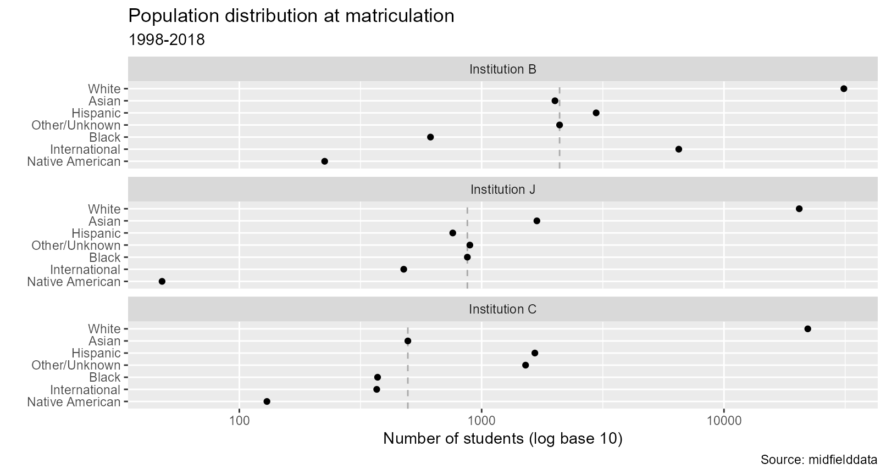

# Introduction to midfieldr

When working with student-level records, you should:

- Know the structure of your data
- Define the metrics you plan to use
- Develop the data processing steps that transform data to metrics

*midfieldr* ([Layton et al.
2026b](#ref-Layton+Long+Ohland:2026:midfieldr)) provides functions that
contribute to this workflow in three ways:

1.  Subsetting data frames in a MIDFIELD-tailored fashion.
    - [`filter_cip()`](https://midfieldr.github.io/midfieldr/reference/filter_cip.md)
    - [`select_required()`](https://midfieldr.github.io/midfieldr/reference/select_required.md)
2.  Adding decision variables to data frames for retaining records that
    satisfy constraints.
    - [`add_timely_term()`](https://midfieldr.github.io/midfieldr/reference/add_timely_term.md)
    - [`add_data_sufficiency()`](https://midfieldr.github.io/midfieldr/reference/add_data_sufficiency.md)
    - [`add_completion_status()`](https://midfieldr.github.io/midfieldr/reference/add_completion_status.md)
3.  Conditioning data frames for specific tasks.
    - [`prep_fye_mice()`](https://midfieldr.github.io/midfieldr/reference/prep_fye_mice.md)
    - [`order_multiway()`](https://midfieldr.github.io/midfieldr/reference/order_multiway.md)

*midfielddata* ([Layton et al.
2026a](#ref-Layton+Long+Ohland:2026:midfielddata)) contributes to this
workflow by providing student-level records suitable for learning how to
work with such data. However, the practice data are not suitable for
drawing inferences about program attributes or student experiences.
midfielddata supplies data for *practice*, not *research*.

If you are writing your own script to follow along, we use these
packages in this article:

``` r

library(midfieldr)
library(midfielddata)
library(data.table)
```

We use a couple of other packages as well for incidental tasks. We will
load them at the point of use.

## Data structure

*CIP data.*   Classification of Instructional Programs (CIP) is a
taxonomy of academic programs, encoded by 6-digit numeric codes curated
by the US Department of Education ([NCES 2010](#ref-NCES:2010)).

The 2010 codes are loaded with midfieldr. `cip` contains codes and names
for 1582 instructional programs organized on three levels: a 2-digit
series, a 4-digit series, and a 6-digit series.

CIP data are documented in
[`?cip`](https://midfieldr.github.io/midfieldr/reference/cip.md).

``` r

# View data set
cip
#> Index: <cip6>
#>         cip2                                                  cip2name   cip4
#>       <char>                                                    <char> <char>
#>    1:     01 Agriculture, Agricultural Operations and Related Sciences   0100
#>    2:     01 Agriculture, Agricultural Operations and Related Sciences   0101
#>    3:     01 Agriculture, Agricultural Operations and Related Sciences   0101
#>   ---                                                                        
#> 1580:     54                                                   History   5401
#> 1581:     54                                                   History   5401
#> 1582:     99                         NonIPEDS - Undecided, Unspecified   9999
#>                                   cip4name   cip6
#>                                     <char> <char>
#>    1:                 Agriculture, General 010000
#>    2: Agricultural Business and Management 010101
#>    3: Agricultural Business and Management 010102
#>   ---                                            
#> 1580:                              History 540108
#> 1581:                              History 540199
#> 1582:    NonIPEDS - Undecided, Unspecified 999999
#>                                             cip6name
#>                                               <char>
#>    1:                           Agriculture, General
#>    2:  Agricultural Business and Management, General
#>    3: Agribusiness, Agricultural Business Operations
#>   ---                                               
#> 1580:                               Military History
#> 1581:                                 History, Other
#> 1582:              NonIPEDS - Undecided, Unspecified
```

`cip` is a “data.table” class of data frame (a format we use throughout
midfieldr and midfielddata). The data.table “enhanced data.frame” is
designed for fast manipulation of large data sets.

``` r

# Reveal the data.table class
class(cip)
#> [1] "data.table" "data.frame"
```

Users can transform a data.table to a base R data.frame or a tidyverse
tibble easily enough if they prefer.

``` r

# Base R
cip_DF <- as.data.frame(cip)

class(cip_DF)
#> [1] "data.frame"

# Tidyverse tibble
library(tibble)
cip_tbl <- as_tibble(cip)

class(cip_tbl)
#> [1] "tbl_df"     "tbl"        "data.frame"
```

  

*Student-records data.*   midfielddata is an R data package containing a
sample of the larger MIDFIELD database ([Ohland
2023](#ref-ohland:midfield:2023)). midfieldr is designed to work with
either database, as both are organized in four data tables (student,
course, term, and degree) and have variable names in common.

| Table | Each row is | N students | N rows | N columns | Mb memory |
|----|----|----|----|----|----|
| course | one student per course per term | 97,555 | 3,289,532 | 12 | 324.3 |
| term | one student per term | 97,555 | 639,915 | 13 | 72.8 |
| student | one student | 97,555 | 97,555 | 13 | 17.3 |
| degree | one student per degree | 49,543 | 49,665 | 5 | 5.2 |

Table 1. Student-level records in midfielddata {.table .gt_table
quarto-disable-processing="false" quarto-bootstrap="false"}

  

Data tables from midfielddata can be loaded individually or collectively
as needed.

``` r

# Load one table as needed
data(student)

# Or load multiple tables
data(course, term, degree)
```

*Resources.*   If you are new to these data, the best place to start is
the following articles at the midfielddata website:

- Data dictionaries are documented in
  [`?student`](https://midfieldr.github.io/midfielddata/reference/student.html),
  [`?course`](https://midfieldr.github.io/midfielddata/reference/course.html),
  [`?term`](https://midfieldr.github.io/midfielddata/reference/term.html),
  and
  [`?degree`](https://midfieldr.github.io/midfielddata/reference/degree.html).

- [MIDFIELD data
  structure.](https://midfieldr.github.io/midfielddata/articles/data-structure.html)
  We examine the structure of the four data tables in midfielddata:
  number of observations, number and class of variables, representative
  values, and database keys.

- [Data linked by student
  ID.](https://midfieldr.github.io/midfielddata/articles/individual-students.html)
  To examine the variables and some representative values in
  midfielddata, we take a closer look at the records of individual
  students across the four data tables.

  

## `filter_cip()` to subset CIP data

[`filter_cip()`](https://midfieldr.github.io/midfieldr/reference/filter_cip.md)
acts on the `cip` data frame to select rows that match case-independent
search terms, including regular expressions.

``` r

# Sociology program codes
filter_cip("sociology")
#>      cip2        cip2name   cip4                   cip4name   cip6
#>    <char>          <char> <char>                     <char> <char>
#> 1:     45 Social Sciences   4511                  Sociology 451101
#> 2:     45 Social Sciences   4513 Sociology and Anthropology 451301
#> 3:     45 Social Sciences   4514            Rural Sociology 451401
#>                      cip6name
#>                        <char>
#> 1:                  Sociology
#> 2: Sociology and Anthropology
#> 3:            Rural Sociology

# All music-related programs
filter_cip("music")
#>       cip2                                         cip2name   cip4
#>     <char>                                           <char> <char>
#>  1:     13                                        Education   1313
#>  2:     36              Leisure and Recreational Activities   3601
#>  3:     39      Theological Studies and Religious Vocations   3905
#> ---                                                               
#> 23:     50                       Visual and Performing Arts   5009
#> 24:     50                       Visual and Performing Arts   5010
#> 25:     51 Health Professions and Related Clinical Sciences   5123
#>                                                                   cip4name
#>                                                                     <char>
#>  1: Teacher Education and Professional Development, Specific Subject Areas
#>  2:                                    Leisure and Recreational Activities
#>  3:                                                Religious, Sacred Music
#> ---                                                                       
#> 23:                                                                  Music
#> 24:                               Arts, Entertainment and Media Management
#> 25:                             Rehabilitation and Therapeutic Professions
#>       cip6                 cip6name
#>     <char>                   <char>
#>  1: 131312  Music Teacher Education
#>  2: 360115                    Music
#>  3: 390501  Religious, Sacred Music
#> ---                                
#> 23: 500999             Music, Other
#> 24: 501003         Music Management
#> 25: 512305 Music Therapy, Therapist
```

Having started a search, multiple passes are often need to narrow the
search results.

``` r

# data.table printout option
options(datatable.print.topn = 20)

# First pass
first_pass <- filter_cip("music")

# Use the first pass as input to the second pass, select columns
filter_cip("^50", 
           cip = first_pass, 
           select = c("cip6", "cip6name"))
#>       cip6                                             cip6name
#>     <char>                                               <char>
#>  1: 500102                                         Digital Arts
#>  2: 500509                                      Musical Theatre
#>  3: 500901                                       Music, General
#>  4: 500902                 Music History, Literature and Theory
#>  5: 500903                           Music Performance, General
#>  6: 500904                         Music Theory and Composition
#>  7: 500905                       Musicology and Ethnomusicology
#>  8: 500906                                           Conducting
#>  9: 500907                                      Piano and Organ
#> 10: 500908                                      Voice and Opera
#> 11: 500909                   Music Management and Merchandising
#> 12: 500910                                   Jazz, Jazz Studies
#> 13: 500911 Violin, Viola, Guitar and Other Stringed Instruments
#> 14: 500912                                       Music Pedagogy
#> 15: 500913                                     Music Technology
#> 16: 500914                                    Brass Instruments
#> 17: 500915                                 Woodwind Instruments
#> 18: 500916                               Percussion Instruments
#> 19: 500999                                         Music, Other
#> 20: 501003                                     Music Management
#>       cip6                                             cip6name
#>     <char>                                               <char>

# restore original data.table printout option
options(datatable.print.topn = 3)
```

We develop these concepts further in
[Programs](https://midfieldr.github.io/midfieldr/articles/articles/art-040-programs.md).

  

## `select_required()` to subset student-level data

[`select_required()`](https://midfieldr.github.io/midfieldr/reference/select_required.md)
selects key columns as well as all columns required by other midfieldr
functions. Operates on a data frame to retain columns having names that
match or partially match default search terms. Rows are unaffected.

Term records are significantly more compact if we select this minimum
set of columns.

``` r

# Select variables required by midfieldr functions
select_required(term)
#>                   mcid   institution   term   cip6         level
#>                 <char>        <char> <char> <char>        <char>
#>      1: MCID3111142225 Institution B  19881 140901 01 First-year
#>      2: MCID3111142283 Institution J  19881 240102 01 First-year
#>      3: MCID3111142283 Institution J  19883 240102 01 First-year
#>     ---                                                         
#> 639913: MCID3112898894 Institution B  20181 451001 01 First-year
#> 639914: MCID3112898895 Institution B  20181 302001 01 First-year
#> 639915: MCID3112898940 Institution B  20181 050103 01 First-year
```

We can add columns if we need them.

``` r

# Select additional columns
select_required(term, select_add = c("gpa_term"))
#>                   mcid   institution   term   cip6         level gpa_term
#>                 <char>        <char> <char> <char>        <char>    <num>
#>      1: MCID3111142225 Institution B  19881 140901 01 First-year     2.56
#>      2: MCID3111142283 Institution J  19881 240102 01 First-year     1.85
#>      3: MCID3111142283 Institution J  19883 240102 01 First-year     1.93
#>     ---                                                                  
#> 639913: MCID3112898894 Institution B  20181 451001 01 First-year     3.52
#> 639914: MCID3112898895 Institution B  20181 302001 01 First-year     3.50
#> 639915: MCID3112898940 Institution B  20181 050103 01 First-year     2.18
```

Regular expressions can be used.

``` r

# Add columns using a regular expression
select_required(term, select_add = c("^gpa"))
#>                   mcid   institution   term   cip6         level gpa_term
#>                 <char>        <char> <char> <char>        <char>    <num>
#>      1: MCID3111142225 Institution B  19881 140901 01 First-year     2.56
#>      2: MCID3111142283 Institution J  19881 240102 01 First-year     1.85
#>      3: MCID3111142283 Institution J  19883 240102 01 First-year     1.93
#>     ---                                                                  
#> 639913: MCID3112898894 Institution B  20181 451001 01 First-year     3.52
#> 639914: MCID3112898895 Institution B  20181 302001 01 First-year     3.50
#> 639915: MCID3112898940 Institution B  20181 050103 01 First-year     2.18
#>         gpa_cumul
#>             <num>
#>      1:      2.56
#>      2:      1.85
#>      3:      1.90
#>     ---          
#> 639913:      3.52
#> 639914:      3.50
#> 639915:      2.18
```

## `add_timely_term()` to add decision variables

[`add_timely_term()`](https://midfieldr.github.io/midfieldr/reference/add_timely_term.md)
adds a new variable (plus supporting variables) for the term in which a
student is expected to complete their program in a timely manner. This
variable is used to make decisions about including or excluding records
due to data sufficiency and whether or not a graduate is counted as a
timely or late completer. Timely term is required for both
[`add_data_sufficiency()`](https://midfieldr.github.io/midfieldr/reference/add_data_sufficiency.md)
and
[`add_completion_status()`](https://midfieldr.github.io/midfieldr/reference/add_completion_status.md).

``` r

# Initialize the working data frame using term
DT <- term[, .(mcid)]

# Retain a unique set of IDs
DT <- unique(DT)

# Add variables relating to the timely term
DT <- add_timely_term(DT, term)

# View the result
DT
#>                  mcid term_i       level_i adj_span timely_term
#>                <char> <char>        <char>    <num>      <char>
#>     1: MCID3111142225  19881 01 First-year        6       19933
#>     2: MCID3111142283  19881 01 First-year        6       19933
#>     3: MCID3111142290  19881 01 First-year        6       19933
#>    ---                                                         
#> 97553: MCID3112898894  20181 01 First-year        6       20233
#> 97554: MCID3112898895  20181 01 First-year        6       20233
#> 97555: MCID3112898940  20181 01 First-year        6       20233
```

## `add_data_sufficiency()` to add decision variables

[`add_data_sufficiency()`](https://midfieldr.github.io/midfieldr/reference/add_data_sufficiency.md)
adds a new variable (plus supporting variables) for data sufficiency
status.

``` r

# Retain a minimum number of variables
DT <- DT[, .(mcid, timely_term)]

# Add variables relating to data sufficiency
DT <- add_data_sufficiency(DT, term)

# View the result
DT[order(data_sufficiency)]
#>                  mcid timely_term term_i lower_limit upper_limit
#>                <char>      <char> <char>      <char>      <char>
#>     1: MCID3111142225       19933  19881       19881       20181
#>     2: MCID3111142283       19933  19881       19881       20096
#>     3: MCID3111142290       19933  19881       19881       20096
#>    ---                                                          
#> 97553: MCID3112785480       20123  20071       19901       20154
#> 97554: MCID3112800920       20153  20101       19881       20181
#> 97555: MCID3112870009       20003  19951       19881       20181
#>        data_sufficiency
#>                  <char>
#>     1:    exclude-lower
#>     2:    exclude-lower
#>     3:    exclude-lower
#>    ---                 
#> 97553:          include
#> 97554:          include
#> 97555:          include
```

We develop these concepts further in [Data sufficiency
article](https://midfieldr.github.io/midfieldr/articles/art-020-data-sufficiency.md).

  

## `add_completion_status()` to add decision variables

[`add_completion_status()`](https://midfieldr.github.io/midfieldr/reference/add_completion_status.md)
adds a new variable (plus supporting variables) for program completion
status.

``` r

# Retain a minimum number of variables
DT <- DT[, .(mcid, timely_term, data_sufficiency)]

# Add variables relating to completion status
DT <- add_completion_status(DT, degree)

# View the result
DT[order(completion_status)]
#>                  mcid timely_term data_sufficiency term_degree
#>                <char>      <char>           <char>      <char>
#>     1: MCID3111143001       19933    exclude-lower       19993
#>     2: MCID3111144032       19933    exclude-lower       19943
#>     3: MCID3111145257       19933    exclude-lower       19953
#>    ---                                                        
#> 97553: MCID3112898894       20233    exclude-upper        <NA>
#> 97554: MCID3112898895       20233    exclude-upper        <NA>
#> 97555: MCID3112898940       20233    exclude-upper        <NA>
#>        completion_status
#>                   <char>
#>     1:              late
#>     2:              late
#>     3:              late
#>    ---                  
#> 97553:              <NA>
#> 97554:              <NA>
#> 97555:              <NA>
```

Note we have not yet excluded any student records. We still have the
97,555 unique students from midfielddata.

We develop these concepts further in
[Graduates](https://midfieldr.github.io/midfieldr/articles/articles/art-080-graduates.md).

## Decisions

The data sufficiency criterion is nearly always imposed. We retain the
records labeled “include”.

``` r

# Retain a minimum number of variables
DT <- DT[, .(mcid, data_sufficiency, completion_status)]
DT <- unique(DT)

# Filter for data sufficiency
DT <- DT[data_sufficiency == "include"]

# View the result
DT
#>                  mcid data_sufficiency completion_status
#>                <char>           <char>            <char>
#>     1: MCID3111142689          include            timely
#>     2: MCID3111142782          include            timely
#>     3: MCID3111142881          include            timely
#>    ---                                                  
#> 76873: MCID3112785480          include              <NA>
#> 76874: MCID3112800920          include              <NA>
#> 76875: MCID3112870009          include              <NA>
```

The number of students has dropped to 76,875. When the timely completion
criterion is imposed, We retain the records labeled “timely”.

``` r

# Filter for timely completion
DT <- DT[completion_status == "timely"]
DT <- unique(DT)

# View the result
DT
#>                  mcid data_sufficiency completion_status
#>                <char>           <char>            <char>
#>     1: MCID3111142689          include            timely
#>     2: MCID3111142782          include            timely
#>     3: MCID3111142881          include            timely
#>    ---                                                  
#> 40438: MCID3112692944          include            timely
#> 40439: MCID3112694738          include            timely
#> 40440: MCID3112730841          include            timely
```

The number of students has dropped to 40,440.

## Next steps

Having filtered our set of student records to satisfy the constraints of
data sufficiency and timely completion, we typically omit all variables
except ID and use this data frame of IDs as the baseline for the next
step of the analysis.

``` r

# Retain ID only
DT <- DT[, .(mcid)]

# Ensure unique IDs
DT <- unique(DT)

# View the result
DT
#>                  mcid
#>                <char>
#>     1: MCID3111142689
#>     2: MCID3111142782
#>     3: MCID3111142881
#>    ---               
#> 40438: MCID3112692944
#> 40439: MCID3112694738
#> 40440: MCID3112730841
```

## `prep_fye_mice()` to condition data for imputation

One of the most common (though flawed) program metrics is “graduation
rate”, roughly defined as the ratio of the number of timely completers
to the number of starters in a major. However, some engineering programs
require that students enroll in a First-Year Engineering (FYE) program
(CIP “140102”) before they can enroll in their preferred,
degree-granting, engineering major.

To credibly assign FYE students to a “starting” major, we introduce the
idea of “FYE proxies”—estimates of the 6-digit CIP codes of the
degree-granting engineering programs that FYE students would have
declared had they not been required to enroll in FYE.
[`prep_fye_mice()`](https://midfieldr.github.io/midfieldr/reference/prep_fye_mice.md)
estimates some of the FYE proxies, treats the remainder as missing
values, and conditions the data frame for imputation using the mice R
package.

``` r

# Condition data for imputation by mice
prep_fye_mice(student, term)
#>                 mcid   race    sex   institution  proxy
#>               <char> <fctr> <fctr>        <fctr> <fctr>
#>    1: MCID3111190643  Asian Female Institution J   <NA>
#>    2: MCID3111190747  Asian Female Institution J   <NA>
#>    3: MCID3111288144  Asian Female Institution J   <NA>
#>   ---                                                  
#> 5787: MCID3112328635  White   Male Institution J 143501
#> 5788: MCID3112328655  White   Male Institution J 143501
#> 5789: MCID3112382784  White   Male Institution J 143501
```

The function returns one row per FYE student keyed by student ID. All
variables except ID are returned as factors to meet the requirements of
`mice()`. The NA values in the proxy column are the unknowns CIP 6-digit
codes to be imputed.

We develop these concepts further in [FYE
proxies](https://midfieldr.github.io/midfieldr/articles/articles/art-060-fye-proxies.md).

## `order_multiway()` to condition data for multiway charts

In working with longitudinal student-level records, we regularly
encounter data structured as *multiway data*. The basic structure of
multiway data is:

- a categorical variable with \small m levels
- a categorical variable (independent of the first variable) with \small
  n levels
- a quantitative variable (the response) of length \small m \times n
  with a value of the response for each combination of categorical
  levels

For example, from the `student` data table, if we count the number of
students at matriculation by race/ethnicity and institution, the
resulting data structure is:

- category 1: institution with 3 levels
- category 2: race/ethnicity with 7 levels
- quantitative response: N students with 21 observations

``` r

# Extract two columns from student
DT <- student[, .(institution, race_ethn = race)]

# Count by race/ethnicity and institution
DT <- DT[, .(N_matric = .N), by = c("institution", "race_ethn")]

# Convert integer N to numeric N
DT[, N_matric := as.double(N_matric)]

# Order the rows for viewing
setorderv(DT, c("institution", "race_ethn"))

# View the result
DT
#>       institution       race_ethn N_matric
#>            <char>          <char>    <num>
#>  1: Institution B           Asian     2007
#>  2: Institution B           Black      615
#>  3: Institution B        Hispanic     2968
#> ---                                       
#> 19: Institution J Native American       48
#> 20: Institution J   Other/Unknown      894
#> 21: Institution J           White    20441
```

[`order_multiway()`](https://midfieldr.github.io/midfieldr/reference/order_multiway.md)
conditions such data for plotting in a *multiway chart*, a set of
faceted dot charts. The categorical variables are converted to factors
with levels ordered by the response variable. This ordering creates the
row and panel ordering that is so crucial to the visual perception of
effects in a multiway chart.

``` r

# Order the categorical variables by the median of the response
DT_multiway <- order_multiway(DT, 
                              quantity = "N_matric", 
                              categories = c("institution", "race_ethn"), 
                              method = "median") 
# View result
DT_multiway
#>       institution       race_ethn N_matric institution_median race_ethn_median
#>            <fctr>          <fctr>    <num>              <num>            <num>
#>  1: Institution B           Asian     2007               2097             1690
#>  2: Institution B           Black      615               2097              615
#>  3: Institution B        Hispanic     2968               2097             1658
#> ---                                                                           
#> 19: Institution J Native American       48                873              130
#> 20: Institution J   Other/Unknown      894                873             1518
#> 21: Institution J           White    20441                873            22169
```

[`order_multiway()`](https://midfieldr.github.io/midfieldr/reference/order_multiway.md)
adds variables documenting the median values used to order each of the
categories. This ordering contributes to the row and panel order in the
faceted chart we plot below.

``` r

library(ggplot2)
ggplot(DT_multiway, aes(x = N_matric, y = race_ethn)) +
  facet_wrap(vars(institution), ncol = 1, as.table = FALSE) +
  geom_vline(aes(xintercept = institution_median), 
             linetype = 2, 
             color = "darkgray") +
  scale_x_log10() +
  labs(x = "Number of students (log base 10)", 
       y = "", 
       title = "Population distribution at matriculation", 
       subtitle = "1998-2018", 
       caption = "Source: midfielddata") +
  geom_point()
```



The vertical references lines are the median value by race/ethnicity at
the institution. We use a log-base-10 scale because of the orders of
magnitude difference in values. Observations:

- Inst. B: International students in greater numbers than expected
- Inst. J: Hispanic students in fewer numbers than expected
- Inst. B and C: Asian students in fewer numbers than expected

By greater or fewer “than expected”, we mean in comparison to their
overall numbers across all institutions.

We develop these concepts further in [Multiway data and
charts](https://midfieldr.github.io/midfieldr/articles/articles/art-120-multiway.md).

## Reusable code

*Preparation.*   The immediate prerequisites or “intake” required by the
reusable code chunk are the source data tables.

``` r

# Load source data (as needed)
data(student, course, term, degree)
```

*Initial data processing.*   A summary code chunk for ready reference.

``` r

# Optional. Copy of source files with all variables
source_student <- copy(student)
source_course  <- copy(course)
source_term    <- copy(term)
source_degree  <- copy(degree)

# Optional. Select variables required by midfieldr functions
student <- select_required(source_student)
course  <- select_required(source_course)
term    <- select_required(source_term)
degree  <- select_required(source_degree)
```

The [`copy()`](https://rdrr.io/pkg/data.table/man/copy.html) function
ensures that “by-reference” changes to the working copies have no effect
on the source copies we set aside. For example, editing `student` will
have no effect on `source_student`. Thus the variables in the source
material are always available if we need them. Concepts of data.table
“reference semantics” are discussed further in ([Dowle and Srinivasan
2022](#ref-data.table-reference-semantics)).

------------------------------------------------------------------------

[◁ midfieldr](https://midfieldr.github.io/midfieldr/index.md)   [▲ top
of page](#top)  [Case study goals
▷](https://midfieldr.github.io/midfieldr/articles/art-001-case-goals.md)

------------------------------------------------------------------------

## References

Dowle, Matt, and Arun Srinivasan. 2022. *Reference semantics
\[data.table\]*.
<https://rdatatable.gitlab.io/data.table/articles/datatable-reference-semantics.html>.

Layton, Richard, Russell Long, Susan Lord, Matthew Ohland, and Marisa
Orr. 2026a. *midfielddata: MIDFIELD Data Sample*. R package
version 0.2.3. <https://midfieldr.github.io/midfielddata/>.

Layton, Richard, Russell Long, Susan Lord, Matthew Ohland, and Marisa
Orr. 2026b. *midfieldr: Tools and Methods for Working with MIDFIELD Data
in R*. R package version 1.0.3.
<https://github.com/MIDFIELDR/midfieldr>.

NCES. 2010. *IPEDS Classification of Instructional Programs (CIP)*.
National Center for Education Statistics.
<https://nces.ed.gov/ipeds/cipcode/>.

Ohland, Matthew. 2023. *MIDFIELD, 2004–2023*.
<https://midfield.online/>.
