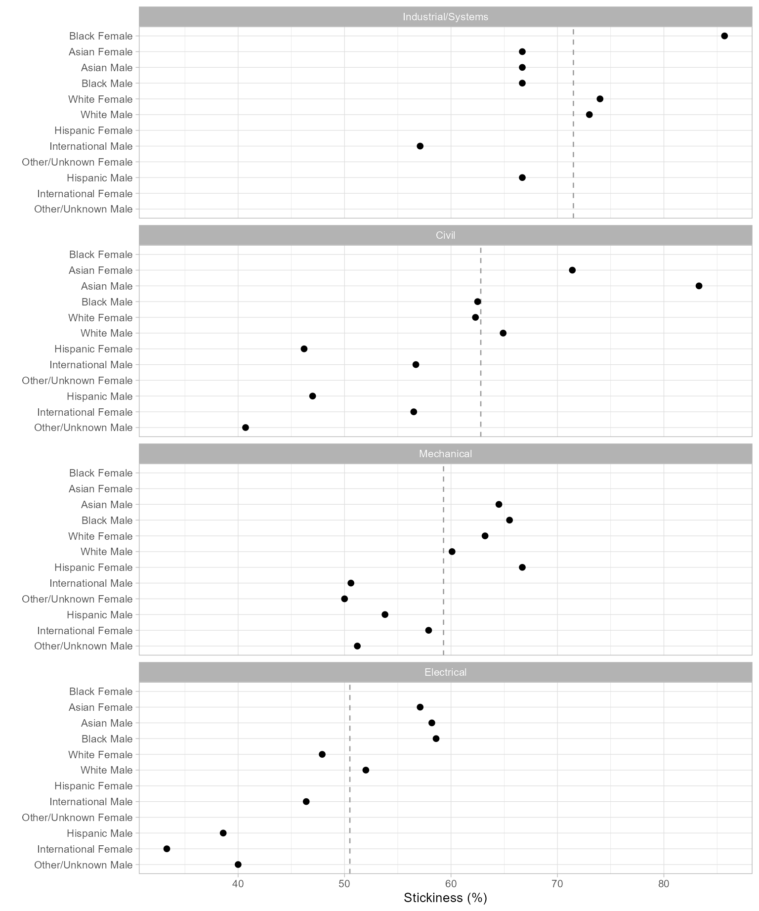

# Case study

In this study we present a complete case, from initial description to
graphing the results, in as concise a fashion as we can, emphasizing
*process* over details. (Terminology and functions are described in
detail in subsequent articles.) Here we emphasize how we work with
longitudinal data and how midfieldr supports that process.

Like most midfieldr articles, this case is worked using data.table
syntax. An alternate version using dplyr syntax is available
[here](https://midfieldr.github.io/midfieldr/articles/articles/art-005-case-dplyr.md).

## Description

We define the parameters of our case study as follows:

*Data.*   Program CIP codes from midfieldr `cip`. Student records from
midfielddata `student, term,` and `degree`.

*Metric.*   Program *stickiness:* the ratio \small (S) of the number of
graduates of a program \small (N\_\textrm{grad}) to the number ever
enrolled in the program \small (N\_\textrm{ever}), including part-time
students, migrators, transfers, and students admitted in any term
([Ohland et al. 2012](#ref-Ohland+Orr+others:2012)).

\small S = \frac{\small N\_\textrm{grad}}{\small N\_\textrm{ever}} =
\frac{\small\mathrm{number\\ of\\ graduates\\ of\\ a\\
program}}{\small\mathrm{number\\ ever\\ enrolled\\ in\\ the\\ program}}

*Programs.*   Civil, Electrical, Industrial/Systems, and Mechanical
Engineering.

*Records.*   Exclude records later than a student’s first degree term;
filter for data sufficiency and degree seeking; no exclusions due to
part-time status, transfer status, admission term, or starting program.

*Population.*   The set of unique IDs from the above records.

*Blocs.*   Students ever enrolled in the programs and timely graduates
of the programs are required by the metric.

*Groupings.*   We select program, race/ethnicity, and sex for grouping
and summarizing. Groups too small to preserve anonymity will be
excluded.

*Outcome.*   To calculate the metric, we construct a data frame with
columns for each grouping variable (program, race/ethnicity, and sex)
and the counts by group \small N\_\textrm{grad} and \small
N\_\textrm{ever}.

If you are writing your own script to follow along, we use these
packages in this article:

``` r

library(midfieldr)
library(midfielddata)
library(data.table)
```

## Programs

One can start an analysis with program data or with student record
data—the choice is arbitrary. We start with programs and set the results
aside until needed when constructing our blocs. Our goal in this section
is to search the CIP data table for the 6-digit codes for our programs.
The `cip` dataset loads with midfieldr.

### *Search for program codes*

Unless you already know your program CIP codes, finding them entails
some trial and error.

[`filter_cip()`](https://midfieldr.github.io/midfieldr/reference/filter_cip.md)
takes a string as it’s first argument. Our search on “civil engineering”
yields programs in Engineering that we want and some in Engineering
Technology that we do not.

``` r

filter_cip("civil engineering")
#>                                          cip6name   cip6
#>                                            <char> <char>
#> 1:                     Civil Engineering, General 140801
#> 2:                       Geotechnical Engineering 140802
#> 3:                         Structural Engineering 140803
#> 4:         Transportation and Highway Engineering 140804
#> 5:                    Water Resources Engineering 140805
#> 6:                       Civil Engineering, Other 140899
#> 7:       Civil Engineering Technology, Technician 150201
#> 8: Civil Drafting and Civil Engineering CAD, CADD 151304
#>                                                  cip4name   cip4
#>                                                    <char> <char>
#> 1:                                      Civil Engineering   1408
#> 2:                                      Civil Engineering   1408
#> 3:                                      Civil Engineering   1408
#> 4:                                      Civil Engineering   1408
#> 5:                                      Civil Engineering   1408
#> 6:                                      Civil Engineering   1408
#> 7:            Civil Engineering Technologies, Technicians   1502
#> 8: Drafting, Design Engineering Technologies, Technicians   1513
#>                  cip2name   cip2
#>                    <char> <char>
#> 1:            Engineering     14
#> 2:            Engineering     14
#> 3:            Engineering     14
#> 4:            Engineering     14
#> 5:            Engineering     14
#> 6:            Engineering     14
#> 7: Engineering Technology     15
#> 8: Engineering Technology     15
```

These results suggest that Engineering has the 2-digit code “14” and
that Civil Engineering has the 4-digit code “1408”. We can extract Civil
Engineering alone by searching `cip` for lines that start with “1408”,
yielding six 6-digit codes. Regular expressions such as “^1408” are
accepted.

``` r

filter_cip("^1408")
#>                                  cip6name   cip6          cip4name   cip4
#>                                    <char> <char>            <char> <char>
#> 1:             Civil Engineering, General 140801 Civil Engineering   1408
#> 2:               Geotechnical Engineering 140802 Civil Engineering   1408
#> 3:                 Structural Engineering 140803 Civil Engineering   1408
#> 4: Transportation and Highway Engineering 140804 Civil Engineering   1408
#> 5:            Water Resources Engineering 140805 Civil Engineering   1408
#> 6:               Civil Engineering, Other 140899 Civil Engineering   1408
#>       cip2name   cip2
#>         <char> <char>
#> 1: Engineering     14
#> 2: Engineering     14
#> 3: Engineering     14
#> 4: Engineering     14
#> 5: Engineering     14
#> 6: Engineering     14
```

Knowing the 2-digit code for Engineering programs, our next search is
for lines that start with “14”. Note that the `cip` *argument* takes the
`cip` dataset as its default *value.* The result is an Engineering
subset of `cip` with 54 rows.

``` r

engr_cip <- filter_cip("^14", cip = cip)
engr_cip
#>                                                         cip6name   cip6
#>                                                           <char> <char>
#>  1:                                         Engineering, General 140101
#>  2:                                              Pre-Engineering 140102
#>  3: Aerospace, Aeronautical and Astronautical, Space Engineering 140201
#>  4:      Agricultural, Biological Engineering and Bioengineering 140301
#>  5:                                    Architectural Engineering 140401
#> ---                                                                    
#> 50:            Mechatronics, Robotics and Automation Engineering 144201
#> 51:                                      Biochemical Engineering 144301
#> 52:                                        Engineering Chemistry 144401
#> 53:                           Biological, Biosystems Engineering 144501
#> 54:                                           Engineering, Other 149999
#>                                                    cip4name   cip4    cip2name
#>                                                      <char> <char>      <char>
#>  1:                                    Engineering, General   1401 Engineering
#>  2:                                    Engineering, General   1401 Engineering
#>  3:   Aerospace, Aeronautical and Astronautical Engineering   1402 Engineering
#>  4: Agricultural, Biological Engineering and Bioengineering   1403 Engineering
#>  5:                               Architectural Engineering   1404 Engineering
#> ---                                                                           
#> 50:       Mechatronics, Robotics and Automation Engineering   1442 Engineering
#> 51:                                 Biochemical Engineering   1443 Engineering
#> 52:                                   Engineering Chemistry   1444 Engineering
#> 53:                      Biological, Biosystems Engineering   1445 Engineering
#> 54:                                      Engineering, Other   1499 Engineering
#>       cip2
#>     <char>
#>  1:     14
#>  2:     14
#>  3:     14
#>  4:     14
#>  5:     14
#> ---       
#> 50:     14
#> 51:     14
#> 52:     14
#> 53:     14
#> 54:     14
```

Next, to search this result for Electrical Engineering, we assign
`engr_cip` to the `cip` argument, yielding four 6-digit codes.

``` r

filter_cip("electrical", cip = engr_cip)
#>                                                         cip6name   cip6
#>                                                           <char> <char>
#> 1:        Electrical, Electronics and Communications Engineering 141001
#> 2:                                 Laser and Optical Engineering 141003
#> 3:                                Telecommunications Engineering 141004
#> 4: Electrical, Electronics and Communications Engineering, Other 141099
#>                                                  cip4name   cip4    cip2name
#>                                                    <char> <char>      <char>
#> 1: Electrical, Electronics and Communications Engineering   1410 Engineering
#> 2: Electrical, Electronics and Communications Engineering   1410 Engineering
#> 3: Electrical, Electronics and Communications Engineering   1410 Engineering
#> 4: Electrical, Electronics and Communications Engineering   1410 Engineering
#>      cip2
#>    <char>
#> 1:     14
#> 2:     14
#> 3:     14
#> 4:     14
```

Continuing in a similar fashion, we find that our programs have the
following 4-digit codes:

- Civil Engineering 1408
- Electrical Engineering 1410
- Mechanical Engineering 1419  
- Industrial/Systems Engineering 1427, 1435, 1436, and 1437.

### *Construct the programs table*

To collect all our 6-digit codes, we create a search string of the
desired 4-digit codes. We drop all columns except the 6-digit names and
6-digit codes.

``` r

codes_we_want <- c("^1408", "^1410", "^1419", "^1427", "^1435", "^1436", "^1437")
programs <- filter_cip(codes_we_want)
programs <- programs[, .(cip6name, cip6)]

programs
#>                                                          cip6name   cip6
#>                                                            <char> <char>
#>  1:                                    Civil Engineering, General 140801
#>  2:                                      Geotechnical Engineering 140802
#>  3:                                        Structural Engineering 140803
#>  4:                        Transportation and Highway Engineering 140804
#>  5:                                   Water Resources Engineering 140805
#>  6:                                      Civil Engineering, Other 140899
#>  7:        Electrical, Electronics and Communications Engineering 141001
#>  8:                                 Laser and Optical Engineering 141003
#>  9:                                Telecommunications Engineering 141004
#> 10: Electrical, Electronics and Communications Engineering, Other 141099
#> 11:                                        Mechanical Engineering 141901
#> 12:                                           Systems Engineering 142701
#> 13:                                        Industrial Engineering 143501
#> 14:                                     Manufacturing Engineering 143601
#> 15:                                           Operations Research 143701
```

The program names in `cip` are usually too long for effective
use—user-defined names are nearly always required. So we add a `program`
variable with values “CE” (Civil Engineering), “EE” (electrical), “ME”
(Mechanical), and “ISE” (Industrial/Systems Engineering). We also
abbreviate a couple of terms for a slightly more compact display.

``` r

programs[, program := fcase(
  cip6 %like% "^1408", "CE",
  cip6 %like% "^1410", "EE",
  cip6 %like% "^1419", "ME",
  cip6 %like% c("^1427|^1435|^1436|^1437"), "ISE",
  default = NA_character_
)]
programs[, cip6name := gsub("Engineering", "Engng", cip6name)]
programs[, cip6name := gsub("Communications", "Commn", cip6name)]

programs
#>                                           cip6name   cip6 program
#>                                             <char> <char>  <char>
#>  1:                           Civil Engng, General 140801      CE
#>  2:                             Geotechnical Engng 140802      CE
#>  3:                               Structural Engng 140803      CE
#>  4:               Transportation and Highway Engng 140804      CE
#>  5:                          Water Resources Engng 140805      CE
#>  6:                             Civil Engng, Other 140899      CE
#>  7:        Electrical, Electronics and Commn Engng 141001      EE
#>  8:                        Laser and Optical Engng 141003      EE
#>  9:                       Telecommunications Engng 141004      EE
#> 10: Electrical, Electronics and Commn Engng, Other 141099      EE
#> 11:                               Mechanical Engng 141901      ME
#> 12:                                  Systems Engng 142701     ISE
#> 13:                               Industrial Engng 143501     ISE
#> 14:                            Manufacturing Engng 143601     ISE
#> 15:                            Operations Research 143701     ISE
```

Our programs data frame is complete: 15 six-digit codes are encoded
using 4 program labels. This data frame can sit in memory (or written to
file) until we’re ready to filter the blocs by program, joining data
frames by matching on the `cip6` variable.

## Records

For this study we load three of the midfielddata data tables.

``` r

data(student, term, degree)
```

We usually copy the source data, giving them new names (and new
locations in memory), to keep them intact while we use the original
names — `student`, `term`, and `degree` — to do our work, preventing the
source data from being updated “by reference” as we work. *Reference
semantics* in data.table is discussed in ([Vignettes: data.table
2026](#ref-reference-semantics:2026)).

``` r

student_source <- copy(student)
term_source <- copy(term)
degree_source <- copy(degree)
```

The working data frames `student, term,` and `degree` should always be
present in our computing environment so we can take advantage of
midfieldr default argument values. For example,
[`add_term_cluster()`](https://midfieldr.github.io/midfieldr/reference/add_term_cluster.md)
accesses the `degree` table to do its work. If `degree` is in the
environment, the following lines yield the same results:

``` r

x <- add_term_cluster(term, midfield_degree = degree)
y <- add_term_cluster(term, degree)
z <- add_term_cluster(term)

check_equiv_frames(x, y)
#> [1] TRUE
check_equiv_frames(y, z)
#> [1] TRUE
```

In this article, we use the latter form.

### *Select basic columns*

Optional, but convenient for viewing data frames at intermediate stages.
We reduce the number of columns to those required by other midfieldr
functions plus the key or composite key variables of the data tables.

``` r

student <- select_basic_cols(student)
term <- select_basic_cols(term)
degree <- select_basic_cols(degree)
```

[`look_at()`](https://midfieldr.github.io/midfieldr/reference/look_at.md)
is a midfieldr convenience function that wraps `base::str()`.

``` r

look_at(student)
#> Classes 'data.table' and 'data.frame':   97555 obs. of  4 variables:
#>  $ mcid       : chr  "MCID3111142225" "MCID3111142283" "MCID3111142290" "MCID"..
#>  $ institution: chr  "Institution B" "Institution J" "Institution J" "Institu"..
#>  $ race       : chr  "Asian" "Asian" "Asian" "Asian" ...
#>  $ sex        : chr  "Male" "Female" "Male" "Male" ...

look_at(term)
#> Classes 'data.table' and 'data.frame':   639915 obs. of  5 variables:
#>  $ mcid       : chr  "MCID3111142225" "MCID3111142283" "MCID3111142283" "MCID"..
#>  $ institution: chr  "Institution B" "Institution J" "Institution J" "Institu"..
#>  $ term       : chr  "19881" "19881" "19883" "19885" ...
#>  $ cip6       : chr  "140901" "240102" "240102" "190601" ...
#>  $ level      : chr  "01 First-year" "01 First-year" "01 First-year" "01 Firs"..

look_at(degree)
#> Classes 'data.table' and 'data.frame':   49665 obs. of  4 variables:
#>  $ mcid       : chr  "MCID3111142225" "MCID3111142290" "MCID3111142294" "MCID"..
#>  $ institution: chr  "Institution B" "Institution J" "Institution J" "Institu"..
#>  $ term_degree: chr  "19881" "19921" "19903" "19921" ...
#>  $ cip6       : chr  "141001" "141001" "141001" "141001" ...
```

### *Exclude post-baccalaureate terms*

We are not generally interested in terms beyond the first degree term,
so we identify and exclude terms later than the first degree term.
Multiple degrees earned in the first degree term are retained, but any
courses, terms, or degrees after the first baccalaureate are excluded.

[`add_term_cluster()`](https://midfieldr.github.io/midfieldr/reference/add_term_cluster.md)
adds a column of labels indicating that a term belongs to one of three
clusters: terms that are prior to, equal to, or subsequent to the
student’s first degree term.

``` r

term <- add_term_cluster(term)
degree <- add_term_cluster(degree)

look_at(term)
#> Classes 'data.table' and 'data.frame':   639915 obs. of  7 variables:
#>  $ mcid             : chr  "MCID3111142225" "MCID3111142283" "MCID3111142283""..
#>  $ institution      : chr  "Institution B" "Institution J" "Institution J" "I"..
#>  $ term             : chr  "19881" "19881" "19883" "19885" ...
#>  $ cip6             : chr  "140901" "240102" "240102" "190601" ...
#>  $ level            : chr  "01 First-year" "01 First-year" "01 First-year" "0"..
#>  $ first_degree_term: chr  "19881" NA NA NA ...
#>  $ term_cluster     : chr  "first-degree" "pre-degree" "pre-degree" "pre-degr"..

look_at(degree)
#> Classes 'data.table' and 'data.frame':   49665 obs. of  6 variables:
#>  $ mcid             : chr  "MCID3111142225" "MCID3111142290" "MCID3111142294""..
#>  $ institution      : chr  "Institution B" "Institution J" "Institution J" "I"..
#>  $ term_degree      : chr  "19881" "19921" "19903" "19921" ...
#>  $ cip6             : chr  "141001" "141001" "141001" "141001" ...
#>  $ first_degree_term: chr  "19881" "19921" "19903" "19921" ...
#>  $ term_cluster     : chr  "first-degree" "first-degree" "first-degree" "firs"..
```

To quickly assess the relative size of the three clusters, we count
observations by the `term_cluster` variable.

``` r

term[, .N, by = c("term_cluster")][order(-N)]
#>         term_cluster      N
#>               <char>  <int>
#> 1:        pre-degree 598477
#> 2:      first-degree  34440
#> 3: post-first-degree   6998

degree[, .N, by = c("term_cluster")][order(-N)]
#>         term_cluster     N
#>               <char> <int>
#> 1:      first-degree 49618
#> 2: post-first-degree    47
```

We exclude the rows labeled “post-first-degree.” This step does not
apply to the `student` table because it contains no term information.

``` r

term <- term[!"post-first-degree", on = "term_cluster"]
degree <- degree[!"post-first-degree", on = "term_cluster"]
```

We can drop the added columns by applying
[`select_basic_cols()`](https://midfieldr.github.io/midfieldr/reference/select_basic_cols.md)
again.

``` r

term <- select_basic_cols(term)
degree <- select_basic_cols(degree)

look_at(term)
#> Classes 'data.table' and 'data.frame':   632917 obs. of  5 variables:
#>  $ mcid       : chr  "MCID3111142225" "MCID3111142283" "MCID3111142283" "MCID"..
#>  $ institution: chr  "Institution B" "Institution J" "Institution J" "Institu"..
#>  $ term       : chr  "19881" "19881" "19883" "19885" ...
#>  $ cip6       : chr  "140901" "240102" "240102" "190601" ...
#>  $ level      : chr  "01 First-year" "01 First-year" "01 First-year" "01 Firs"..

look_at(degree)
#> Classes 'data.table' and 'data.frame':   49618 obs. of  4 variables:
#>  $ mcid       : chr  "MCID3111142225" "MCID3111142290" "MCID3111142294" "MCID"..
#>  $ institution: chr  "Institution B" "Institution J" "Institution J" "Institu"..
#>  $ term_degree: chr  "19881" "19921" "19903" "19921" ...
#>  $ cip6       : chr  "141001" "141001" "141001" "141001" ...
```

### *Filter for data sufficiency*

The next few steps are easier to follow if we start with the unique IDs
from our current term table as our draft population. We filter these IDs
for data sufficiency and degree-seeking, then filter the records to
retain those IDs only.

``` r

DT <- term[, .(mcid)]
DT <- unique(DT)
DT
#>                  mcid
#>                <char>
#>     1: MCID3111142225
#>     2: MCID3111142283
#>     3: MCID3111142290
#>     4: MCID3111142294
#>     5: MCID3111142299
#>    ---               
#> 97532: MCID3112898886
#> 97533: MCID3112898890
#> 97534: MCID3112898894
#> 97535: MCID3112898895
#> 97536: MCID3112898940
```

The data sufficiency criterion limits student records to those for which
available data are sufficient to credibly assess timely completion. To
make that assessment, we need the last term in which a student’s degree
completion would be considered timely—in many cases, 6 years after
admission.

[`add_timely_term()`](https://midfieldr.github.io/midfieldr/reference/add_timely_term.md)
adds a column of timely completion terms, encoded YYYYT.

``` r

DT <- add_timely_term(DT)
DT
#>                  mcid term_i       level_i adj_span timely_term
#>                <char> <char>        <char>    <num>      <char>
#>     1: MCID3111142225  19881 01 First-year        6       19933
#>     2: MCID3111142283  19881 01 First-year        6       19933
#>     3: MCID3111142290  19881 01 First-year        6       19933
#>     4: MCID3111142294  19881 01 First-year        6       19933
#>     5: MCID3111142299  19881 01 First-year        6       19933
#>    ---                                                         
#> 97532: MCID3112898886  20181 01 First-year        6       20233
#> 97533: MCID3112898890  20181 01 First-year        6       20233
#> 97534: MCID3112898894  20181 01 First-year        6       20233
#> 97535: MCID3112898895  20181 01 First-year        6       20233
#> 97536: MCID3112898940  20181 01 First-year        6       20233
```

[`add_data_sufficiency()`](https://midfieldr.github.io/midfieldr/reference/add_data_sufficiency.md)
(which requires the `timely_term` column) adds a column of labels
indicating that a student ID should be included (or excluded) because
for that student, the institution’s data range satisfies (or does not
satisfy) the data sufficiency criteria.

``` r

DT <- add_data_sufficiency(DT)
DT
#>                  mcid       level_i adj_span timely_term term_i lower_limit
#>                <char>        <char>    <num>      <char> <char>      <char>
#>     1: MCID3111142225 01 First-year        6       19933  19881       19881
#>     2: MCID3111142283 01 First-year        6       19933  19881       19881
#>     3: MCID3111142290 01 First-year        6       19933  19881       19881
#>     4: MCID3111142294 01 First-year        6       19933  19881       19881
#>     5: MCID3111142299 01 First-year        6       19933  19881       19881
#>    ---                                                                     
#> 97532: MCID3112898886 01 First-year        6       20233  20181       19881
#> 97533: MCID3112898890 01 First-year        6       20233  20181       19881
#> 97534: MCID3112898894 01 First-year        6       20233  20181       19881
#> 97535: MCID3112898895 01 First-year        6       20233  20181       19881
#> 97536: MCID3112898940 01 First-year        6       20233  20181       19881
#>        upper_limit data_sufficiency
#>             <char>           <char>
#>     1:       20181    exclude-lower
#>     2:       20096    exclude-lower
#>     3:       20096    exclude-lower
#>     4:       20096    exclude-lower
#>     5:       20096    exclude-lower
#>    ---                             
#> 97532:       20181    exclude-upper
#> 97533:       20181    exclude-upper
#> 97534:       20181    exclude-upper
#> 97535:       20181    exclude-upper
#> 97536:       20181    exclude-upper
```

Again, a quick assessment of the relative size of the three possible
labels.

``` r

DT[, .N, by = c("data_sufficiency")][order(-N)]
#>    data_sufficiency     N
#>              <char> <int>
#> 1:          include 76865
#> 2:    exclude-upper 17925
#> 3:    exclude-lower  2746
```

We retain the rows labeled “include” for which we have sufficient data
from the institution and retain the ID column only.

``` r

DT <- DT["include", on = "data_sufficiency", .(mcid)]
DT
#>                  mcid
#>                <char>
#>     1: MCID3111142689
#>     2: MCID3111142782
#>     3: MCID3111142881
#>     4: MCID3111142884
#>     5: MCID3111142893
#>    ---               
#> 76861: MCID3112727985
#> 76862: MCID3112730841
#> 76863: MCID3112785480
#> 76864: MCID3112800920
#> 76865: MCID3112870009
```

### *Filter for degree seeking*

We require all students in our study to be degree-seeking. By design,
the `student` table contains only degree-seeking students. We inner-join
the ID column from the `student` table, matching on `mcid`. In effect,
the inner join filters our population to remove any non-degree-seeking
students.

``` r

student_cols <- student[, .(mcid)]
DT <- student_cols[DT, on = "mcid", nomatch = NULL]
DT
#>                  mcid
#>                <char>
#>     1: MCID3111142689
#>     2: MCID3111142782
#>     3: MCID3111142881
#>     4: MCID3111142884
#>     5: MCID3111142893
#>    ---               
#> 76861: MCID3112727985
#> 76862: MCID3112730841
#> 76863: MCID3112785480
#> 76864: MCID3112800920
#> 76865: MCID3112870009
```

It happens that all students in this case are degree-seeking, so this
step did not reduce the size of our population. (We include the step to
illustrate our complete process.)

### *Finalize the records*

The previous column of IDs is our baseline population.

``` r

population <- copy(DT)
population <- unique(population)
population
#>                  mcid
#>                <char>
#>     1: MCID3111142689
#>     2: MCID3111142782
#>     3: MCID3111142881
#>     4: MCID3111142884
#>     5: MCID3111142893
#>    ---               
#> 76861: MCID3112727985
#> 76862: MCID3112730841
#> 76863: MCID3112785480
#> 76864: MCID3112800920
#> 76865: MCID3112870009
```

We now filter the records to retain only those observations associated
with the IDs in our population data frame. We use inner joins between
`population` and `student, term,` and `degree` to do so.

``` r

student <- population[student, on = "mcid", nomatch = NULL]
term <- population[term, on = "mcid", nomatch = NULL]
degree <- population[degree, on = "mcid", nomatch = NULL]
```

Ensuring rows are unique yields the baseline records in their final
configuration.

``` r

student <- unique(student)
term <- unique(term)
degree <- unique(degree)
```

These three data frames are our final set of records on which all
further analysis is based. We’ve reduced the number of unique students
from 97,555 in the original source data to 76,865 that have met our
several constraints.

``` r

look_at(student)
#> Classes 'data.table' and 'data.frame':   76865 obs. of  4 variables:
#>  $ mcid       : chr  "MCID3111142689" "MCID3111142782" "MCID3111142881" "MCID"..
#>  $ institution: chr  "Institution B" "Institution J" "Institution B" "Institu"..
#>  $ race       : chr  "Hispanic" "Hispanic" "International" "International" ...
#>  $ sex        : chr  "Female" "Female" "Male" "Male" ...

look_at(term)
#> Classes 'data.table' and 'data.frame':   525446 obs. of  5 variables:
#>  $ mcid       : chr  "MCID3111142689" "MCID3111142782" "MCID3111142782" "MCID"..
#>  $ institution: chr  "Institution B" "Institution J" "Institution J" "Institu"..
#>  $ term       : chr  "19883" "19883" "19885" "19893" ...
#>  $ cip6       : chr  "090401" "260101" "260101" "260101" ...
#>  $ level      : chr  "01 First-year" "01 First-year" "02 Second-year" "02 Sec"..

look_at(degree)
#> Classes 'data.table' and 'data.frame':   43847 obs. of  4 variables:
#>  $ mcid       : chr  "MCID3111142689" "MCID3111142782" "MCID3111142881" "MCID"..
#>  $ institution: chr  "Institution B" "Institution J" "Institution B" "Institu"..
#>  $ term_degree: chr  "19913" "19903" "19894" "19901" ...
#>  $ cip6       : chr  "090401" "260101" "450601" "141001" ...
```

## Blocs and groupings

The work up to this point is applicable to most studies. In summary, we
have configured our:

- `programs` 6-digit program codes, names, and custom labels
- `student, term,` and `degree` records with post-baccalaureate terms
  removed and filtered for data sufficiency and degree seeking
- `population` the unique IDs in these records

The next steps depend on the metric and the groupings we assigned at the
beginning. The stickiness metric requires these blocs:

- students with timely completion from the study programs
- students ever enrolled in these programs

And we selected these groupings:

- program
- race/ethnicity
- sex

We have a lot of flexibility in the order in which we construct our
blocs and groupings, so what follows is only one of several effective
solutions. Our approach here is to construct a bloc, filter by program,
join the demographics, and repeat for the next bloc.

## Timely graduates

We start with the baseline population. Like we did with the original
source data files, we copy it to protect `population` from “by
reference” changes.

``` r

DT <- copy(population)
DT
#>                  mcid
#>                <char>
#>     1: MCID3111142689
#>     2: MCID3111142782
#>     3: MCID3111142881
#>     4: MCID3111142884
#>     5: MCID3111142893
#>    ---               
#> 76861: MCID3112727985
#> 76862: MCID3112730841
#> 76863: MCID3112785480
#> 76864: MCID3112800920
#> 76865: MCID3112870009
```

### *Filter for timely completion*

We want to retain timely graduates, so first we add the timely
completion term (the same term we used for determining data sufficiency)
to our population then apply the completion status function.

[`add_completion_status()`](https://midfieldr.github.io/midfieldr/reference/add_completion_status.md)
adds a column of labels indicating that program completion was timely,
late, or NA (for non-completers).

``` r

DT <- add_timely_term(DT)
DT <- add_completion_status(DT)
DT
#>                  mcid term_i       level_i adj_span timely_term term_degree
#>                <char> <char>        <char>    <num>      <char>      <char>
#>     1: MCID3111142689  19883 01 First-year        6       19941       19913
#>     2: MCID3111142782  19883 01 First-year        6       19941       19903
#>     3: MCID3111142881  19893 01 First-year        6       19951       19894
#>     4: MCID3111142884  19883 01 First-year        6       19941        <NA>
#>     5: MCID3111142893  19883 01 First-year        6       19941        <NA>
#>    ---                                                                     
#> 76861: MCID3112727985  20114 01 First-year        6       20173        <NA>
#> 76862: MCID3112730841  20121 01 First-year        6       20173       20164
#> 76863: MCID3112785480  20071 01 First-year        6       20123        <NA>
#> 76864: MCID3112800920  20101 01 First-year        6       20153        <NA>
#> 76865: MCID3112870009  19951 01 First-year        6       20003        <NA>
#>        completion_status
#>                   <char>
#>     1:            timely
#>     2:            timely
#>     3:            timely
#>     4:              <NA>
#>     5:              <NA>
#>    ---                  
#> 76861:              <NA>
#> 76862:            timely
#> 76863:              <NA>
#> 76864:              <NA>
#> 76865:              <NA>
```

Another brief assessment. Here we compare the relative size of the three
possible status labels.

``` r

DT[, .N, by = c("completion_status")][order(-N)]
#>    completion_status     N
#>               <char> <int>
#> 1:            timely 40430
#> 2:              <NA> 33089
#> 3:              late  3346
```

We retain the rows labeled “timely” and the drop all the columns except
the ID column.

``` r

DT <- DT["timely", on = "completion_status", .(mcid)]
DT
#>                  mcid
#>                <char>
#>     1: MCID3111142689
#>     2: MCID3111142782
#>     3: MCID3111142881
#>     4: MCID3111142965
#>     5: MCID3111143066
#>    ---               
#> 40426: MCID3112675459
#> 40427: MCID3112675472
#> 40428: MCID3112692944
#> 40429: MCID3112694738
#> 40430: MCID3112730841
```

### *Filter by program*

We left-join the CIP column from the `degree` table, matching on `mcid`.
That we increase the number of rows indicates that some students have
more than one degree in their first degree term.

``` r

degree_cols <- degree[, .(mcid, cip6)]
DT <- degree_cols[DT, on = "mcid"]
DT
#>                  mcid   cip6
#>                <char> <char>
#>     1: MCID3111142689 090401
#>     2: MCID3111142782 260101
#>     3: MCID3111142881 450601
#>     4: MCID3111142965 141001
#>     5: MCID3111143066 090401
#>    ---                      
#> 40486: MCID3112675459 261310
#> 40487: MCID3112675472 500703
#> 40488: MCID3112692944 090101
#> 40489: MCID3112694738 230101
#> 40490: MCID3112730841 040401
```

Now we use an inner-join with our `programs` data frame, matching on
`cip6`, to retain only those students who complete one of our study
programs. We retain the `program` column and drop the `cip6` column.

``` r

programs_cols <- programs[, .(cip6, program)]
DT <- programs_cols[DT, on = "cip6", nomatch = NULL]
DT[, cip6 := NULL]
DT
#>       program           mcid
#>        <char>         <char>
#>    1:      EE MCID3111142965
#>    2:      EE MCID3111145102
#>    3:      EE MCID3111146537
#>    4:      EE MCID3111146674
#>    5:     ISE MCID3111150194
#>   ---                       
#> 3259:      ME MCID3112618553
#> 3260:      ME MCID3112618574
#> 3261:      ME MCID3112618976
#> 3262:      EE MCID3112619484
#> 3263:      ME MCID3112641535
```

Another brief assessment. Here we compare the relative numbers of
program graduates.

``` r

DT[, .N, by = c("program")][order(-N)]
#>    program     N
#>     <char> <int>
#> 1:      ME  1353
#> 2:      CE   936
#> 3:      EE   736
#> 4:     ISE   238
```

### *Join demographics*

To add columns for student demographics, we left-join selected columns
from the `student` table, matching on `mcid`.

``` r

student_cols <- student[, .(mcid, race, sex)]
DT <- student_cols[DT, on = "mcid"]
DT
#>                 mcid          race    sex program
#>               <char>        <char> <char>  <char>
#>    1: MCID3111142965 International   Male      EE
#>    2: MCID3111145102         White   Male      EE
#>    3: MCID3111146537         Asian Female      EE
#>    4: MCID3111146674         Asian   Male      EE
#>    5: MCID3111150194         Black   Male     ISE
#>   ---                                            
#> 3259: MCID3112618553 International   Male      ME
#> 3260: MCID3112618574 International   Male      ME
#> 3261: MCID3112618976         White   Male      ME
#> 3262: MCID3112619484         White   Male      EE
#> 3263: MCID3112641535         White   Male      ME
```

### *Bloc of timely graduates*

This is the bloc of timely graduates required by our metric. We add a
`bloc` variable with the value “grad” and ensure we have unique rows.

``` r

graduates <- copy(DT)
graduates[, bloc := "grad"]
graduates <- unique(graduates)
graduates
#>                 mcid          race    sex program   bloc
#>               <char>        <char> <char>  <char> <char>
#>    1: MCID3111142965 International   Male      EE   grad
#>    2: MCID3111145102         White   Male      EE   grad
#>    3: MCID3111146537         Asian Female      EE   grad
#>    4: MCID3111146674         Asian   Male      EE   grad
#>    5: MCID3111150194         Black   Male     ISE   grad
#>   ---                                                   
#> 3259: MCID3112618553 International   Male      ME   grad
#> 3260: MCID3112618574 International   Male      ME   grad
#> 3261: MCID3112618976         White   Male      ME   grad
#> 3262: MCID3112619484         White   Male      EE   grad
#> 3263: MCID3112641535         White   Male      ME   grad
```

## Ever enrolled

Again we start with the baseline population.

``` r

DT <- copy(population)
DT
#>                  mcid
#>                <char>
#>     1: MCID3111142689
#>     2: MCID3111142782
#>     3: MCID3111142881
#>     4: MCID3111142884
#>     5: MCID3111142893
#>    ---               
#> 76861: MCID3112727985
#> 76862: MCID3112730841
#> 76863: MCID3112785480
#> 76864: MCID3112800920
#> 76865: MCID3112870009
```

### *Filter by program*

We left-join the CIP column from the `term` table, matching on `mcid`.

``` r

term_cols <- term[, .(mcid, cip6)]
term_cols <- unique(term_cols)
DT <- term_cols[DT, on = "mcid"]
DT
#>                   mcid   cip6
#>                 <char> <char>
#>      1: MCID3111142689 090401
#>      2: MCID3111142782 260101
#>      3: MCID3111142881 450601
#>      4: MCID3111142884 260406
#>      5: MCID3111142893 400801
#>     ---                      
#> 126164: MCID3112785480 240102
#> 126165: MCID3112785480 261201
#> 126166: MCID3112800920 240102
#> 126167: MCID3112800920 240199
#> 126168: MCID3112870009 240102
```

We repeat the process we used earlier to inner-join our `programs` data
frame, matching on `cip6`.

``` r

programs_cols <- programs[, .(cip6, program)]
DT <- programs_cols[DT, on = "cip6", nomatch = NULL]
DT[, cip6 := NULL]
```

With the CIP code removed, we filter for unique rows. This is an
important step because a student may switch CIP codes yet stay within a
program as defined by our custom labels. We want to avoid counting that
student as ever-enrolled more than once.

``` r

DT <- unique(DT)
DT
#>       program           mcid
#>        <char>         <char>
#>    1:      EE MCID3111142965
#>    2:      EE MCID3111145102
#>    3:      EE MCID3111146537
#>    4:      EE MCID3111146674
#>    5:     ISE MCID3111150194
#>   ---                       
#> 5579:      EE MCID3112619484
#> 5580:      ME MCID3112619666
#> 5581:      ME MCID3112641399
#> 5582:      ME MCID3112641535
#> 5583:      ME MCID3112698681
```

Another brief assessment. Here we compare the relative numbers of
students ever enrolled in our programs.

``` r

DT[, .N, by = c("program")][order(-N)]
#>    program     N
#>     <char> <int>
#> 1:      ME  2289
#> 2:      CE  1494
#> 3:      EE  1464
#> 4:     ISE   336
```

### *Join demographics*

Again, we left-join selected columns from the `student` table, matching
on `mcid`.

``` r

student_cols <- student[, .(mcid, race, sex)]
DT <- student_cols[DT, on = "mcid"]
DT
#>                 mcid          race    sex program
#>               <char>        <char> <char>  <char>
#>    1: MCID3111142965 International   Male      EE
#>    2: MCID3111145102         White   Male      EE
#>    3: MCID3111146537         Asian Female      EE
#>    4: MCID3111146674         Asian   Male      EE
#>    5: MCID3111150194         Black   Male     ISE
#>   ---                                            
#> 5579: MCID3112619484         White   Male      EE
#> 5580: MCID3112619666         White   Male      ME
#> 5581: MCID3112641399         White   Male      ME
#> 5582: MCID3112641535         White   Male      ME
#> 5583: MCID3112698681         White   Male      ME
```

### *Bloc of ever-enrolled*

This is the bloc of students ever enrolled in our programs required by
our metric. We add a `bloc` variable with the value “ever” and ensure we
have unique rows.

``` r

ever_enrolled <- copy(DT)
ever_enrolled[, bloc := "ever"]
ever_enrolled <- unique(ever_enrolled)
ever_enrolled
#>                 mcid          race    sex program   bloc
#>               <char>        <char> <char>  <char> <char>
#>    1: MCID3111142965 International   Male      EE   ever
#>    2: MCID3111145102         White   Male      EE   ever
#>    3: MCID3111146537         Asian Female      EE   ever
#>    4: MCID3111146674         Asian   Male      EE   ever
#>    5: MCID3111150194         Black   Male     ISE   ever
#>   ---                                                   
#> 5579: MCID3112619484         White   Male      EE   ever
#> 5580: MCID3112619666         White   Male      ME   ever
#> 5581: MCID3112641399         White   Male      ME   ever
#> 5582: MCID3112641535         White   Male      ME   ever
#> 5583: MCID3112698681         White   Male      ME   ever
```

## Outcomes

Combining the two data frames (blocs) by rows, we obtain the data
structure we need for grouping and summarizing.

``` r

DT <- rbindlist(list(graduates, ever_enrolled), use.names = TRUE)
DT
#>                 mcid          race    sex program   bloc
#>               <char>        <char> <char>  <char> <char>
#>    1: MCID3111142965 International   Male      EE   grad
#>    2: MCID3111145102         White   Male      EE   grad
#>    3: MCID3111146537         Asian Female      EE   grad
#>    4: MCID3111146674         Asian   Male      EE   grad
#>    5: MCID3111150194         Black   Male     ISE   grad
#>   ---                                                   
#> 8842: MCID3112619484         White   Male      EE   ever
#> 8843: MCID3112619666         White   Male      ME   ever
#> 8844: MCID3112641399         White   Male      ME   ever
#> 8845: MCID3112641535         White   Male      ME   ever
#> 8846: MCID3112698681         White   Male      ME   ever
```

### *Group and summarize*

Count the numbers of observations for each combination of the grouping
variables.

``` r

DT <- DT[, .N, by = c("bloc", "program", "race", "sex")]
DT
#>       bloc program            race    sex     N
#>     <char>  <char>          <char> <char> <int>
#>  1:   grad      EE   International   Male    90
#>  2:   grad      EE           White   Male   439
#>  3:   grad      EE           Asian Female    12
#>  4:   grad      EE           Asian   Male    71
#>  5:   grad     ISE           Black   Male     6
#> ---                                            
#> 94:   ever      EE Native American Female     1
#> 95:   ever      CE   Other/Unknown Female     5
#> 96:   ever      ME Native American   Male     5
#> 97:   ever      ME   Other/Unknown Female     8
#> 98:   ever      CE Native American Female     1
```

### *Reshape*

*Reshaping the data frame to calculate the metric.*

Transform from block-record form to row-record form. The `N` column
values are moved to two new columns, `ever` and `grad`, one for each
bloc, leaving the grouping variables (program, race/ethnicity, and sex)
in place. This operation is known by a number of different names, e.g.,
pivot, crosstab, unstack, spread, or widen ([Mount and Zumel
2019](#ref-Mount+Zumel:2019:fluid-data)). The result has the data
structure we called out in our project description for calculating the
metric.

``` r

DT <- dcast(DT, program + sex + race ~ bloc, value.var = "N", fill = 0)
setkey(DT, NULL)
DT
#>     program    sex            race  ever  grad
#>      <char> <char>          <char> <int> <int>
#>  1:      CE Female           Asian    14    10
#>  2:      CE Female           Black     4     1
#>  3:      CE Female        Hispanic    13     6
#>  4:      CE Female   International    23    13
#>  5:      CE Female Native American     1     1
#> ---                                           
#> 46:      ME   Male        Hispanic    78    42
#> 47:      ME   Male   International   176    89
#> 48:      ME   Male Native American     5     1
#> 49:      ME   Male   Other/Unknown    80    41
#> 50:      ME   Male           White  1584   952
```

### *Calculate the metric*

*Completes the initial analysis.*

Stickiness is the ratio of the number of graduates to the number ever
enrolled, expressed as a percentage. Stickiness is calculated for each
combination of program, race/ethnicity, and sex.

``` r

DT[, stickiness := round(100 * grad / ever, 1)]
setkey(DT, NULL)
DT[order(-grad, -ever)]
#>     program    sex            race  ever  grad stickiness
#>      <char> <char>          <char> <int> <int>      <num>
#>  1:      ME   Male           White  1584   952       60.1
#>  2:      CE   Male           White   943   612       64.9
#>  3:      EE   Male           White   845   439       52.0
#>  4:      CE Female           White   260   162       62.3
#>  5:      ME Female           White   212   134       63.2
#>  6:     ISE   Male           White   178   130       73.0
#>  7:      EE   Male   International   194    90       46.4
#>  8:      ME   Male   International   176    89       50.6
#>  9:      EE   Male           Asian   122    71       58.2
#> 10:      EE Female           White   117    56       47.9
#> 11:      CE   Male   International    97    55       56.7
#> 12:     ISE Female           White    73    54       74.0
#> 13:      ME   Male           Asian    76    49       64.5
#> 14:      ME   Male        Hispanic    78    42       53.8
#> 15:      ME   Male   Other/Unknown    80    41       51.2
#> 16:      CE   Male        Hispanic    66    31       47.0
#> 17:      CE   Male           Asian    30    25       83.3
#> 18:      ME   Male           Black    29    19       65.5
#> 19:      EE   Male        Hispanic    44    17       38.6
#> 20:      EE   Male           Black    29    17       58.6
#> 21:      EE   Male   Other/Unknown    40    16       40.0
#> 22:     ISE   Male           Asian    21    14       66.7
#> 23:      CE Female   International    23    13       56.5
#> 24:      EE Female           Asian    21    12       57.1
#> 25:     ISE   Male   International    21    12       57.1
#> 26:      CE   Male   Other/Unknown    27    11       40.7
#> 27:      ME Female   International    19    11       57.9
#> 28:     ISE Female           Asian    15    10       66.7
#> 29:      CE Female           Asian    14    10       71.4
#> 30:      EE Female   International    27     9       33.3
#> 31:      ME Female        Hispanic    12     8       66.7
#> 32:      CE Female        Hispanic    13     6       46.2
#> 33:     ISE   Male           Black     9     6       66.7
#> 34:     ISE Female           Black     7     6       85.7
#> 35:      CE   Male           Black     8     5       62.5
#> 36:      ME Female   Other/Unknown     8     4       50.0
#> 37:     ISE   Male        Hispanic     6     4       66.7
#> 38:      EE Female        Hispanic     8     3       37.5
#> 39:      EE Female   Other/Unknown     7     3       42.9
#> 40:      EE Female           Black     6     3       50.0
#> 41:      CE Female   Other/Unknown     5     3       60.0
#> 42:     ISE Female   International     6     2       33.3
#> 43:      ME Female           Black     3     2       66.7
#> 44:      ME Female           Asian     7     1       14.3
#> 45:      ME   Male Native American     5     1       20.0
#> 46:      CE Female           Black     4     1       25.0
#> 47:      CE   Male Native American     3     1       33.3
#> 48:      CE Female Native American     1     1      100.0
#> 49:      EE   Male Native American     3     0        0.0
#> 50:      EE Female Native American     1     0        0.0
#>     program    sex            race  ever  grad stickiness
#>      <char> <char>          <char> <int> <int>      <num>
```

## Dissemination

We take several additional steps before disseminating these results.

To preserve the anonymity of the people involved, we remove observations
with \small N or fewer observations. When dealing with the full MIDFIELD
research data, we typically use \small N = 10, but for these practice
data we illustrate the procedure using \small N = 3.

``` r

DT <- DT[grad > 3]
DT
#>     program    sex          race  ever  grad stickiness
#>      <char> <char>        <char> <int> <int>      <num>
#>  1:      CE Female         Asian    14    10       71.4
#>  2:      CE Female      Hispanic    13     6       46.2
#>  3:      CE Female International    23    13       56.5
#>  4:      CE Female         White   260   162       62.3
#>  5:      CE   Male         Asian    30    25       83.3
#> ---                                                    
#> 33:      ME   Male         Black    29    19       65.5
#> 34:      ME   Male      Hispanic    78    42       53.8
#> 35:      ME   Male International   176    89       50.6
#> 36:      ME   Male Other/Unknown    80    41       51.2
#> 37:      ME   Male         White  1584   952       60.1
```

We have found it useful to report such data with a variable that
combines race/ethnicity and sex.

``` r

DT[, people := paste(race, sex)]
setcolorder(DT, c("program", "race", "sex", "people"))
DT
#>     program          race    sex               people  ever  grad stickiness
#>      <char>        <char> <char>               <char> <int> <int>      <num>
#>  1:      CE         Asian Female         Asian Female    14    10       71.4
#>  2:      CE      Hispanic Female      Hispanic Female    13     6       46.2
#>  3:      CE International Female International Female    23    13       56.5
#>  4:      CE         White Female         White Female   260   162       62.3
#>  5:      CE         Asian   Male           Asian Male    30    25       83.3
#> ---                                                                         
#> 33:      ME         Black   Male           Black Male    29    19       65.5
#> 34:      ME      Hispanic   Male        Hispanic Male    78    42       53.8
#> 35:      ME International   Male   International Male   176    89       50.6
#> 36:      ME Other/Unknown   Male   Other/Unknown Male    80    41       51.2
#> 37:      ME         White   Male           White Male  1584   952       60.1
```

Readers can more readily interpret our charts and tables if the programs
are unabbreviated.

``` r

DT[, program := fcase(
  program %like% "CE", "Civil",
  program %like% "EE", "Electrical",
  program %like% "ME", "Mechanical",
  program %like% "ISE", "Industrial/Systems"
)]
DT
#>        program          race    sex               people  ever  grad stickiness
#>         <char>        <char> <char>               <char> <int> <int>      <num>
#>  1:      Civil         Asian Female         Asian Female    14    10       71.4
#>  2:      Civil      Hispanic Female      Hispanic Female    13     6       46.2
#>  3:      Civil International Female International Female    23    13       56.5
#>  4:      Civil         White Female         White Female   260   162       62.3
#>  5:      Civil         Asian   Male           Asian Male    30    25       83.3
#> ---                                                                            
#> 33: Mechanical         Black   Male           Black Male    29    19       65.5
#> 34: Mechanical      Hispanic   Male        Hispanic Male    78    42       53.8
#> 35: Mechanical International   Male   International Male   176    89       50.6
#> 36: Mechanical Other/Unknown   Male   Other/Unknown Male    80    41       51.2
#> 37: Mechanical         White   Male           White Male  1584   952       60.1
```

### *Table*

Omit columns that won’t appear in the table.

``` r

DT_table <- copy(DT)
DT_table[, c("race", "sex", "ever", "grad") := NULL]
DT_table
#>        program               people stickiness
#>         <char>               <char>      <num>
#>  1:      Civil         Asian Female       71.4
#>  2:      Civil      Hispanic Female       46.2
#>  3:      Civil International Female       56.5
#>  4:      Civil         White Female       62.3
#>  5:      Civil           Asian Male       83.3
#> ---                                           
#> 33: Mechanical           Black Male       65.5
#> 34: Mechanical        Hispanic Male       53.8
#> 35: Mechanical   International Male       50.6
#> 36: Mechanical   Other/Unknown Male       51.2
#> 37: Mechanical           White Male       60.1
```

Transform the data from block-records to row-records with one row per
“people” category (race/ethnicity/sex grouping).

``` r

DT_table <- dcast(DT_table, people ~ program, value.var = "stickiness")
setnames(DT_table, old = "people", new = "People", skip_absent = TRUE)
setkey(DT_table, NULL)
DT_table
#>                   People Civil Electrical Industrial/Systems Mechanical
#>                   <char> <num>      <num>              <num>      <num>
#>  1:         Asian Female  71.4       57.1               66.7         NA
#>  2:           Asian Male  83.3       58.2               66.7       64.5
#>  3:         Black Female    NA         NA               85.7         NA
#>  4:           Black Male  62.5       58.6               66.7       65.5
#>  5:      Hispanic Female  46.2         NA                 NA       66.7
#>  6:        Hispanic Male  47.0       38.6               66.7       53.8
#>  7: International Female  56.5       33.3                 NA       57.9
#>  8:   International Male  56.7       46.4               57.1       50.6
#>  9: Other/Unknown Female    NA         NA                 NA       50.0
#> 10:   Other/Unknown Male  40.7       40.0                 NA       51.2
#> 11:         White Female  62.3       47.9               74.0       63.2
#> 12:           White Male  64.9       52.0               73.0       60.1
```

Format the table for publication.

``` r

library(gt)
DT_table |>
  gt() |>
  tab_caption("Table 1. Engineering program stickiness (%)") |>
  tab_options(table.font.size = "small") |>
  opt_stylize(style = 1, color = "gray") |>
  tab_style(
    style = list(cell_fill(color = "#c7eae5")),
    locations = cells_column_labels(columns = everything())
  )
```

| People               | Civil | Electrical | Industrial/Systems | Mechanical |
|----------------------|-------|------------|--------------------|------------|
| Asian Female         | 71.4  | 57.1       | 66.7               | NA         |
| Asian Male           | 83.3  | 58.2       | 66.7               | 64.5       |
| Black Female         | NA    | NA         | 85.7               | NA         |
| Black Male           | 62.5  | 58.6       | 66.7               | 65.5       |
| Hispanic Female      | 46.2  | NA         | NA                 | 66.7       |
| Hispanic Male        | 47.0  | 38.6       | 66.7               | 53.8       |
| International Female | 56.5  | 33.3       | NA                 | 57.9       |
| International Male   | 56.7  | 46.4       | 57.1               | 50.6       |
| Other/Unknown Female | NA    | NA         | NA                 | 50.0       |
| Other/Unknown Male   | 40.7  | 40.0       | NA                 | 51.2       |
| White Female         | 62.3  | 47.9       | 74.0               | 63.2       |
| White Male           | 64.9  | 52.0       | 73.0               | 60.1       |

Table 1. Engineering program stickiness (%) {.table .gt_table
quarto-disable-processing="false" quarto-bootstrap="false"}

### *Chart*

To use
[`ggplot()`](https://ggplot2.tidyverse.org/reference/ggplot.html), we
want the data in its block-record form.

``` r

DT_chart <- copy(DT)
DT_chart
#>        program          race    sex               people  ever  grad stickiness
#>         <char>        <char> <char>               <char> <int> <int>      <num>
#>  1:      Civil         Asian Female         Asian Female    14    10       71.4
#>  2:      Civil      Hispanic Female      Hispanic Female    13     6       46.2
#>  3:      Civil International Female International Female    23    13       56.5
#>  4:      Civil         White Female         White Female   260   162       62.3
#>  5:      Civil         Asian   Male           Asian Male    30    25       83.3
#> ---                                                                            
#> 33: Mechanical         Black   Male           Black Male    29    19       65.5
#> 34: Mechanical      Hispanic   Male        Hispanic Male    78    42       53.8
#> 35: Mechanical International   Male   International Male   176    89       50.6
#> 36: Mechanical Other/Unknown   Male   Other/Unknown Male    80    41       51.2
#> 37: Mechanical         White   Male           White Male  1584   952       60.1
```

With one quantitative variable (stickiness) for every combination of the
levels of two categorical variables (program and people), these are
*multiway data* ([Cleveland 1993](#ref-Cleveland:1993)). How one orders
the categorical variables is critical for visualizing effects.

[`order_multiway()`](https://midfieldr.github.io/midfieldr/reference/order_multiway.md)
converts the two categorical variables to ordered factors to support the
ordering of rows and panels in the chart. The calculated stickiness
values by group—which determine the ordering—are added in new columns.

``` r

DT_chart <- order_multiway(DT_chart,
  quantity = "stickiness",
  categories = c("program", "people"),
  method = "percent",
  ratio_of = c("grad", "ever")
)
DT_chart
#>        program               people  grad  ever stickiness          race    sex
#>         <fctr>               <fctr> <num> <num>      <num>        <char> <char>
#>  1:      Civil         Asian Female    10    14       71.4         Asian Female
#>  2:      Civil      Hispanic Female     6    13       46.2      Hispanic Female
#>  3:      Civil International Female    13    23       56.5 International Female
#>  4:      Civil         White Female   162   260       62.3         White Female
#>  5:      Civil           Asian Male    25    30       83.3         Asian   Male
#> ---                                                                            
#> 33: Mechanical           Black Male    19    29       65.5         Black   Male
#> 34: Mechanical        Hispanic Male    42    78       53.8      Hispanic   Male
#> 35: Mechanical   International Male    89   176       50.6 International   Male
#> 36: Mechanical   Other/Unknown Male    41    80       51.2 Other/Unknown   Male
#> 37: Mechanical           White Male   952  1584       60.1         White   Male
#>     program_stickiness people_stickiness
#>                  <num>             <num>
#>  1:               62.8              64.0
#>  2:               62.8              56.0
#>  3:               62.8              47.8
#>  4:               62.8              61.3
#>  5:               62.8              63.9
#> ---                                     
#> 33:               59.3              62.7
#> 34:               59.3              48.5
#> 35:               59.3              50.4
#> 36:               59.3              46.3
#> 37:               59.3              60.1
```

Format the chart for publication.

``` r

library(ggplot2)
ggplot(DT_chart, aes(x = stickiness, y = people)) +
  facet_wrap(vars(program),
    ncol = 1,
    as.table = FALSE
  ) +
  geom_vline(aes(xintercept = program_stickiness),
    linetype = 2,
    color = "gray60"
  ) +
  geom_point(size = 1.8) +
  labs(x = "Stickiness (%)", y = "") +
  theme_light(base_size = 10)
```



Figure 1: Program stickiness.

## References

Cleveland, William S. 1993. *Visualizing Data*. Hobart Press.

Mount, John, and Nina Zumel. 2019. *Coordinatized data: A fluid data
specification*. Win Vector LLC.
[http://winvector.github.io/FluidData/RowsAndColumns.html](http://winvector.github.io/FluidData/RowsAndColumns.md).

Ohland, Matthew, Marisa Orr, Richard Layton, Susan Lord, and Russell
Long. 2012. “Introducing stickiness as a versatile metric of engineering
persistence.” *Proceedings of the Frontiers in Education Conference*,
1–5.

Vignettes: data.table. 2026. *Reference Semantics*.
<https://r-datatable.com/articles/datatable-reference-semantics.html>.
