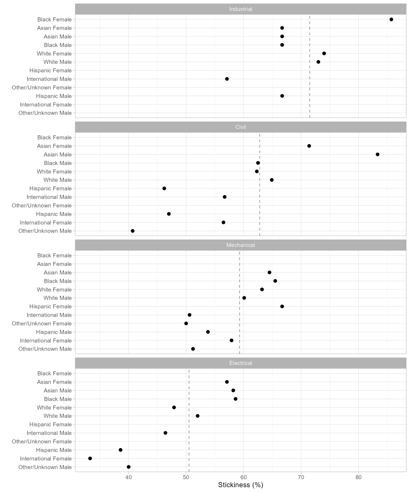

# Case study using dplyr

In this study we present the same case as in the [Case
study](https://midfieldr.github.io/midfieldr/articles/articles/art-004-case-study.md)
article, but translated to use the syntax of the dplyr package and
friends.

The study is concise, emphasizing *process* over details. (Terminology
and functions are described in detail in subsequent articles.) Here we
emphasize how we work with longitudinal data and how midfieldr supports
that process.

## Description

We define the parameters of our case study as follows:

*Data.*   Program CIP codes from midfieldr `cip`. Student records from
midfielddata `student, term,` and `degree`.

*Metric.*   Program *stickiness:* the ratio \small (S) of the number of
graduates of a program \small (N\_\textrm{grad}) to the number ever
enrolled in the program \small (N\_\textrm{ever}), including part-time
students, migrators, transfers, and students admitted in any term
([Ohland et al. 2012](#ref-Ohland+Orr+others:2012)).

\small S = \frac{\small N\_\textrm{grad}}{\small N\_\textrm{ever}} =
\frac{\small\mathrm{number\\ of\\ graduates\\ of\\ a\\
program}}{\small\mathrm{number\\ ever\\ enrolled\\ in\\ the\\ program}}

*Programs.*   Civil, Electrical, Industrial/Systems, and Mechanical
Engineering.

*Records.*   Exclude records later than a student’s first degree term;
filter for data sufficiency and degree seeking; no exclusions due to
part-time status, transfer status, admission term, or starting program.

*Population.*   The set of unique IDs from the above records.

*Blocs.*   Students ever enrolled in the programs and timely graduates
of the programs are required by the metric.

*Groupings.*   We select program, race/ethnicity, and sex for grouping
and summarizing.

*Outcome.*   To calculate the metric, we construct a data frame with
columns for each grouping variable (program, race/ethnicity, and sex)
and the counts by group \small N\_\textrm{grad} and \small
N\_\textrm{ever}.

*Dissemination.*   Exclude groupings too small to preserve anonymity.
Edit column names to suit the audience. Condition/transform data as
needed for tables or charts.

If you are writing your own script to follow along, we use these
packages in this article:

``` r

library(midfieldr)
library(midfielddata)
library(dplyr)
library(tidyr)
library(stringr)
```

## Programs

One can start an analysis with program data or with student record
data—the choice is arbitrary. We start with programs and set the results
aside until needed when constructing our blocs. Our goal in this section
is to search the CIP data table for the 6-digit codes for our programs.
The `cip` dataset loads with midfieldr.

### *Search for program codes*

The `cip` dataset loads with midfieldr. For compatibility with the dplyr
syntax, we covert it to a tibble.

``` r

cip <- as_tibble(cip)
```

Unless you already know your program CIP codes, finding them entails
some trial and error.

[`filter_programs()`](https://midfieldr.github.io/midfieldr/reference/filter_programs.md)
searches `cip` for string patterns. Searching for “civil engineering”
yields programs in Engineering that we want and some in Engineering
Technology that we do not.

``` r

filter_programs(cip, "civil engineering")
#> # A tibble: 8 × 6
#>   cip6name                                       cip6  
#>   <chr>                                          <chr> 
#> 1 Civil Engineering, General                     140801
#> 2 Geotechnical Engineering                       140802
#> 3 Structural Engineering                         140803
#> 4 Transportation and Highway Engineering         140804
#> 5 Water Resources Engineering                    140805
#> 6 Civil Engineering, Other                       140899
#> 7 Civil Engineering Technology, Technician       150201
#> 8 Civil Drafting and Civil Engineering CAD, CADD 151304
#>   cip4name                                               cip4 
#>   <chr>                                                  <chr>
#> 1 Civil Engineering                                      1408 
#> 2 Civil Engineering                                      1408 
#> 3 Civil Engineering                                      1408 
#> 4 Civil Engineering                                      1408 
#> 5 Civil Engineering                                      1408 
#> 6 Civil Engineering                                      1408 
#> 7 Civil Engineering Technologies, Technicians            1502 
#> 8 Drafting, Design Engineering Technologies, Technicians 1513 
#>   cip2name               cip2 
#>   <chr>                  <chr>
#> 1 Engineering            14   
#> 2 Engineering            14   
#> 3 Engineering            14   
#> 4 Engineering            14   
#> 5 Engineering            14   
#> 6 Engineering            14   
#> 7 Engineering Technology 15   
#> 8 Engineering Technology 15
```

These results suggest that Engineering has the 2-digit code “14” and
that Civil Engineering has the 4-digit code “1408”. We can extract Civil
Engineering alone by searching `cip` for lines that start with “1408”,
yielding six 6-digit codes. Regular expressions such as “^1408” are
accepted.

``` r

cip |>
  filter_programs("^1408")
#> # A tibble: 6 × 6
#>   cip6name                               cip6   cip4name          cip4 
#>   <chr>                                  <chr>  <chr>             <chr>
#> 1 Civil Engineering, General             140801 Civil Engineering 1408 
#> 2 Geotechnical Engineering               140802 Civil Engineering 1408 
#> 3 Structural Engineering                 140803 Civil Engineering 1408 
#> 4 Transportation and Highway Engineering 140804 Civil Engineering 1408 
#> 5 Water Resources Engineering            140805 Civil Engineering 1408 
#> 6 Civil Engineering, Other               140899 Civil Engineering 1408 
#>   cip2name    cip2 
#>   <chr>       <chr>
#> 1 Engineering 14   
#> 2 Engineering 14   
#> 3 Engineering 14   
#> 4 Engineering 14   
#> 5 Engineering 14   
#> 6 Engineering 14
```

Knowing the 2-digit code for Engineering programs, our next search is
for lines that start with “14”. The result is an Engineering subset of
`cip` with 54 rows.

``` r

cip |>
  filter_programs("^14")
#> # A tibble: 54 × 6
#>   cip6name                                                     cip6  
#>   <chr>                                                        <chr> 
#> 1 Engineering, General                                         140101
#> 2 Pre-Engineering                                              140102
#> 3 Aerospace, Aeronautical and Astronautical, Space Engineering 140201
#> 4 Agricultural, Biological Engineering and Bioengineering      140301
#> 5 Architectural Engineering                                    140401
#>   cip4name                                                cip4  cip2name   
#>   <chr>                                                   <chr> <chr>      
#> 1 Engineering, General                                    1401  Engineering
#> 2 Engineering, General                                    1401  Engineering
#> 3 Aerospace, Aeronautical and Astronautical Engineering   1402  Engineering
#> 4 Agricultural, Biological Engineering and Bioengineering 1403  Engineering
#> 5 Architectural Engineering                               1404  Engineering
#>   cip2 
#>   <chr>
#> 1 14   
#> 2 14   
#> 3 14   
#> 4 14   
#> 5 14   
#> # ℹ 49 more rows
```

Next, to search this result for Electrical Engineering, we assign
`engr_cip` to the `cip` argument, yielding four 6-digit codes.

``` r

cip |>
  filter_programs("^14") |>
  filter_programs("electrical")
#> # A tibble: 4 × 6
#>   cip6name                                                      cip6  
#>   <chr>                                                         <chr> 
#> 1 Electrical, Electronics and Communications Engineering        141001
#> 2 Laser and Optical Engineering                                 141003
#> 3 Telecommunications Engineering                                141004
#> 4 Electrical, Electronics and Communications Engineering, Other 141099
#>   cip4name                                               cip4  cip2name    cip2 
#>   <chr>                                                  <chr> <chr>       <chr>
#> 1 Electrical, Electronics and Communications Engineering 1410  Engineering 14   
#> 2 Electrical, Electronics and Communications Engineering 1410  Engineering 14   
#> 3 Electrical, Electronics and Communications Engineering 1410  Engineering 14   
#> 4 Electrical, Electronics and Communications Engineering 1410  Engineering 14
```

Continuing in a similar fashion, we find that our programs have the
following 4-digit codes:

- Civil Engineering 1408
- Electrical Engineering 1410
- Mechanical Engineering 1419  
- Industrial/Systems Engineering 1427, 1435, 1436, and 1437.

### *Construct the programs table*

To collect all our 6-digit codes, we create a search string of the
desired 4-digit codes. We drop all columns except the 6-digit names and
6-digit codes.

``` r

codes_we_want <- c("^1408", "^1410", "^1419", "^1427", "^1435", "^1436", "^1437")
programs <- cip |>
  filter_programs(codes_we_want) |>
  select(cip6name, cip6)

programs
#> # A tibble: 15 × 2
#>   cip6name                               cip6  
#>   <chr>                                  <chr> 
#> 1 Civil Engineering, General             140801
#> 2 Geotechnical Engineering               140802
#> 3 Structural Engineering                 140803
#> 4 Transportation and Highway Engineering 140804
#> 5 Water Resources Engineering            140805
#> # ℹ 10 more rows
```

The program names in `cip` are usually too long for effective
use—user-defined names are nearly always required. So we add a `program`
variable with values “CE” (Civil Engineering), “EE” (electrical), “ME”
(Mechanical), and “ISE” (Industrial-Systems Engineering). We also
abbreviate a couple of terms for a slightly more compact display.

``` r

programs <- programs |>
  mutate(program = case_when(
    grepl("^1408", cip6) ~ "CE",
    grepl("^1410", cip6) ~ "EE",
    grepl("^1419", cip6) ~ "ME",
    grepl("^1427|^1435|^1436|^1437", cip6) ~ "ISE"
  )) |>
  mutate(across(cip6name, \(x) str_replace(x, "Engineering", "Engng"))) |>
  mutate(across(cip6name, \(x) str_replace(x, "Communication", "Commn")))

programs
#> # A tibble: 15 × 3
#>   cip6name                         cip6   program
#>   <chr>                            <chr>  <chr>  
#> 1 Civil Engng, General             140801 CE     
#> 2 Geotechnical Engng               140802 CE     
#> 3 Structural Engng                 140803 CE     
#> 4 Transportation and Highway Engng 140804 CE     
#> 5 Water Resources Engng            140805 CE     
#> # ℹ 10 more rows
```

Our programs data frame is complete: 15 six-digit codes are encoded
using 4 program labels. This data frame can sit in memory (or written to
file) until we’re ready to filter the blocs by program, joining data
frames by matching on the `cip6` variable.

## Records

For this study we load three of the midfielddata data tables. We convert
these data frames to tibbles as well.

``` r

data(student, term, degree)

student <- as_tibble(student)
term <- as_tibble(term)
degree <- as_tibble(degree)
```

We usually copy the source data, giving them new names (and new
locations in memory), to keep them intact while we use the original
names — `student`, `term`, and `degree` — to do our work. Unlike when
using data.table, tibbles do not update by reference.

``` r

student_source <- student
term_source <- term
degree_source <- degree
```

The working data frames `student, term,` and `degree` should always be
present in our computing environment so we can take advantage of
midfieldr default argument values. For example,
[`post_bacc_terms()`](https://midfieldr.github.io/midfieldr/reference/post_bacc_terms.md)
accesses the `degree` table to do its work. If `degree` is in the
environment, the following lines yield the same results:

``` r

# not run
post_bacc_terms(term, midfield_rec = degree)
post_bacc_terms(term, degree)
post_bacc_terms(term)
```

In this article, we use the latter form.

### *Select basic columns*

Optional, but convenient for viewing data frames at intermediate stages.
We reduce the number of columns to those required by other midfieldr
functions plus the key or composite key variables of the data tables.

``` r

student <- select_records(student, type = "s")
term <- select_records(term, "t")
degree <- select_records(degree, "d")
```

[`look_at()`](https://midfieldr.github.io/midfieldr/reference/look_at.md)
is a midfieldr convenience function that wraps `base::str()`.

``` r

look_at(student)
#> tibble [97,555 × 3] (S3: tbl_df/tbl/data.frame)
#>  $ mcid: chr  "MCID3111142225" "MCID3111142283" "MCID3111142290" "MCID3111142"..
#>  $ race: chr  "Asian" "Asian" "Asian" "Asian" ...
#>  $ sex : chr  "Male" "Female" "Male" "Male" ...

look_at(term)
#> tibble [639,915 × 5] (S3: tbl_df/tbl/data.frame)
#>  $ mcid       : chr  "MCID3111142225" "MCID3111142283" "MCID3111142283" "MCID"..
#>  $ term       : chr  "19881" "19881" "19883" "19885" ...
#>  $ cip6       : chr  "140901" "240102" "240102" "190601" ...
#>  $ institution: chr  "Institution B" "Institution J" "Institution J" "Institu"..
#>  $ level      : chr  "01 First-year" "01 First-year" "01 First-year" "01 Firs"..

look_at(degree)
#> tibble [49,665 × 3] (S3: tbl_df/tbl/data.frame)
#>  $ mcid       : chr  "MCID3111142225" "MCID3111142290" "MCID3111142294" "MCID"..
#>  $ term_degree: chr  "19881" "19921" "19903" "19921" ...
#>  $ cip6       : chr  "141001" "141001" "141001" "141001" ...
```

``` r

class(student)
#> [1] "tbl_df"     "tbl"        "data.frame"

x <- student

class(x)
#> [1] "tbl_df"     "tbl"        "data.frame"

y <- as.data.frame(x)
class(y)
#> [1] "data.frame"
data.table::setattr(y, "class", c("tbl_df", "tbl", "data.frame"))
class(y)
#> [1] "tbl_df"     "tbl"        "data.frame"

y
#> # A tibble: 97,555 × 3
#>   mcid           race  sex   
#>   <chr>          <chr> <chr> 
#> 1 MCID3111142225 Asian Male  
#> 2 MCID3111142283 Asian Female
#> 3 MCID3111142290 Asian Male  
#> 4 MCID3111142294 Asian Male  
#> 5 MCID3111142299 Asian Male  
#> # ℹ 97,550 more rows

z <- y |> group_by(race)
class(z)
#> [1] "grouped_df" "tbl_df"     "tbl"        "data.frame"
z <- as.data.frame(z)
data.table::setattr(z, "class", c("tbl_df", "tbl", "data.frame"))
class(z)
#> [1] "tbl_df"     "tbl"        "data.frame"
```

### *Exclude post-baccalaureate terms*

We are not generally interested in terms beyond the first degree term,
so we identify and exclude terms later than the first degree term.
Multiple degrees earned in the first degree term are retained, but any
courses, terms, or degrees after the first baccalaureate are excluded.

[`post_bacc_terms()`](https://midfieldr.github.io/midfieldr/reference/post_bacc_terms.md)
adds a column of labels indicating that a term belongs to one of three
clusters: terms that are prior to, equal to, or subsequent to the
student’s first degree term.

``` r

term <- post_bacc_terms(term)
degree <- post_bacc_terms(degree)

look_at(term)
#> tibble [639,915 × 7] (S3: tbl_df/tbl/data.frame)
#>  $ mcid             : chr  "MCID3111142225" "MCID3111142283" "MCID3111142283""..
#>  $ term             : chr  "19881" "19881" "19883" "19885" ...
#>  $ cip6             : chr  "140901" "240102" "240102" "190601" ...
#>  $ institution      : chr  "Institution B" "Institution J" "Institution J" "I"..
#>  $ level            : chr  "01 First-year" "01 First-year" "01 First-year" "0"..
#>  $ first_degree_term: chr  "19881" NA NA NA ...
#>  $ term_cluster     : chr  "first-degree" "pre-degree" "pre-degree" "pre-degr"..

look_at(degree)
#> tibble [49,665 × 5] (S3: tbl_df/tbl/data.frame)
#>  $ mcid             : chr  "MCID3111142225" "MCID3111142290" "MCID3111142294""..
#>  $ term_degree      : chr  "19881" "19921" "19903" "19921" ...
#>  $ cip6             : chr  "141001" "141001" "141001" "141001" ...
#>  $ first_degree_term: chr  "19881" "19921" "19903" "19921" ...
#>  $ term_cluster     : chr  "first-degree" "first-degree" "first-degree" "firs"..
```

To quickly assess the relative size of the three clusters, we count
observations by the `term_cluster` variable.

``` r

term |>
  group_by(term_cluster) |>
  tally() |>
  arrange(desc(n))
#> # A tibble: 3 × 2
#>   term_cluster           n
#>   <chr>              <int>
#> 1 pre-degree        598477
#> 2 first-degree       34440
#> 3 post-first-degree   6998

degree |>
  group_by(term_cluster) |>
  tally() |>
  arrange(desc(n))
#> # A tibble: 2 × 2
#>   term_cluster          n
#>   <chr>             <int>
#> 1 first-degree      49618
#> 2 post-first-degree    47
```

We exclude the rows labeled “post-first-degree.” This step does not
apply to the `student` table because it contains no term information.

``` r

term <- term |>
  filter(term_cluster != "post-first-degree")

degree <- degree |>
  filter(term_cluster != "post-first-degree")
```

We can drop the added columns by applying
[`select_records()`](https://midfieldr.github.io/midfieldr/reference/select_records.md)
again.

``` r

term <- select_records(term, "t")
degree <- select_records(degree, "d")

look_at(term)
#> tibble [632,917 × 5] (S3: tbl_df/tbl/data.frame)
#>  $ mcid       : chr  "MCID3111142225" "MCID3111142283" "MCID3111142283" "MCID"..
#>  $ term       : chr  "19881" "19881" "19883" "19885" ...
#>  $ cip6       : chr  "140901" "240102" "240102" "190601" ...
#>  $ institution: chr  "Institution B" "Institution J" "Institution J" "Institu"..
#>  $ level      : chr  "01 First-year" "01 First-year" "01 First-year" "01 Firs"..

look_at(degree)
#> tibble [49,618 × 3] (S3: tbl_df/tbl/data.frame)
#>  $ mcid       : chr  "MCID3111142225" "MCID3111142290" "MCID3111142294" "MCID"..
#>  $ term_degree: chr  "19881" "19921" "19903" "19921" ...
#>  $ cip6       : chr  "141001" "141001" "141001" "141001" ...
```

### *Filter for data sufficiency*

The next few steps are easier to follow if we start with the unique IDs
from our current term table as our draft population. We filter these IDs
for data sufficiency and degree-seeking, then filter the records to
retain those IDs only.

``` r

DT <- term |>
  select(mcid) |>
  unique()
DT
#> # A tibble: 97,536 × 1
#>   mcid          
#>   <chr>         
#> 1 MCID3111142225
#> 2 MCID3111142283
#> 3 MCID3111142290
#> 4 MCID3111142294
#> 5 MCID3111142299
#> # ℹ 97,531 more rows
```

The data sufficiency criterion limits student records to those for which
available data are sufficient to credibly assess timely completion. To
make that assessment, we need the last term in which a student’s degree
completion would be considered timely—in many cases, 6 years after
admission.

[`timely_term()`](https://midfieldr.github.io/midfieldr/reference/timely_term.md)
adds a column of timely completion terms, encoded YYYYT.

``` r

DT <- timely_term(DT)
DT
#> # A tibble: 97,536 × 5
#>   mcid           term_i level_i       adj_span timely_term
#>   <chr>          <chr>  <chr>            <dbl> <chr>      
#> 1 MCID3111142225 19881  01 First-year        6 19933      
#> 2 MCID3111142283 19881  01 First-year        6 19933      
#> 3 MCID3111142290 19881  01 First-year        6 19933      
#> 4 MCID3111142294 19881  01 First-year        6 19933      
#> 5 MCID3111142299 19881  01 First-year        6 19933      
#> # ℹ 97,531 more rows
```

[`data_sufficiency()`](https://midfieldr.github.io/midfieldr/reference/data_sufficiency.md)
(which requires the `timely_term` column) adds a column of labels
indicating that a student ID should be included (or excluded) because
for that student, the institution’s data range satisfies (or does not
satisfy) the data sufficiency criteria.

``` r

DT <- data_sufficiency(DT)
DT
#> # A tibble: 632,917 × 7
#>   mcid           term_i timely_term institution   lower_limit upper_limit
#>   <chr>          <chr>  <chr>       <chr>         <chr>       <chr>      
#> 1 MCID3111142225 19881  19933       Institution B 19881       20181      
#> 2 MCID3111142283 19881  19933       Institution J 19881       20096      
#> 3 MCID3111142283 19881  19933       Institution J 19881       20096      
#> 4 MCID3111142283 19881  19933       Institution J 19881       20096      
#> 5 MCID3111142283 19881  19933       Institution J 19881       20096      
#>   data_sufficiency
#>   <chr>           
#> 1 exclude-lower   
#> 2 exclude-lower   
#> 3 exclude-lower   
#> 4 exclude-lower   
#> 5 exclude-lower   
#> # ℹ 632,912 more rows
```

Again, a quick assessment of the relative size of the three possible
labels.

``` r

DT |>
  group_by(data_sufficiency) |>
  tally() |>
  arrange(desc(n))
#> # A tibble: 3 × 2
#>   data_sufficiency      n
#>   <chr>             <int>
#> 1 include          525446
#> 2 exclude-upper     87982
#> 3 exclude-lower     19489
```

We retain the rows labeled “include” for which we have sufficient data
from the institution and retain the ID column only.

``` r

DT <- DT |>
  filter(data_sufficiency == "include") |>
  select(mcid)
DT
#> # A tibble: 525,446 × 1
#>   mcid          
#>   <chr>         
#> 1 MCID3111142689
#> 2 MCID3111142782
#> 3 MCID3111142782
#> 4 MCID3111142782
#> 5 MCID3111142782
#> # ℹ 525,441 more rows
```

### *Filter for degree seeking*

We require all students in our study to be degree-seeking. By design,
the `student` table contains only degree-seeking students. We inner-join
the ID column from the `student` table, matching on `mcid`. In effect,
the inner join filters our population to remove any non-degree-seeking
students.

``` r

DT <- inner_join(DT, student, by = join_by(mcid)) |>
  select(mcid)
DT
#> # A tibble: 525,446 × 1
#>   mcid          
#>   <chr>         
#> 1 MCID3111142689
#> 2 MCID3111142782
#> 3 MCID3111142782
#> 4 MCID3111142782
#> 5 MCID3111142782
#> # ℹ 525,441 more rows
```

It happens that all students in this case are degree-seeking, so this
step did not reduce the size of our population. (We include the step to
illustrate our complete process.)

### *Finalize the records*

The previous column of IDs is our baseline population.

``` r

population <- unique(DT)
population
#> # A tibble: 76,865 × 1
#>   mcid          
#>   <chr>         
#> 1 MCID3111142689
#> 2 MCID3111142782
#> 3 MCID3111142881
#> 4 MCID3111142884
#> 5 MCID3111142893
#> # ℹ 76,860 more rows
```

We now filter the records to retain only those observations associated
with the IDs in our population data frame. We use inner joins between
`population` and `student, term,` and `degree` to do so. Ensuring rows
are unique yields the baseline records in their final configuration.

``` r

student <- inner_join(student, population, by = join_by(mcid)) |>
  unique()
term <- inner_join(term, population, by = join_by(mcid)) |>
  unique()
degree <- inner_join(degree, population, by = join_by(mcid)) |>
  unique()
```

These three data frames are our final set of records on which all
further analysis is based. We’ve reduced the number of unique students
from 97,555 in the original source data to 76,865 that have met our
several constraints.

``` r

look_at(student)
#> tibble [76,865 × 3] (S3: tbl_df/tbl/data.frame)
#>  $ mcid: chr  "MCID3111142689" "MCID3111142782" "MCID3111142881" "MCID3111142"..
#>  $ race: chr  "Hispanic" "Hispanic" "International" "International" ...
#>  $ sex : chr  "Female" "Female" "Male" "Male" ...

look_at(term)
#> tibble [525,446 × 5] (S3: tbl_df/tbl/data.frame)
#>  $ mcid       : chr  "MCID3111142689" "MCID3111142782" "MCID3111142782" "MCID"..
#>  $ term       : chr  "19883" "19883" "19885" "19893" ...
#>  $ cip6       : chr  "090401" "260101" "260101" "260101" ...
#>  $ institution: chr  "Institution B" "Institution J" "Institution J" "Institu"..
#>  $ level      : chr  "01 First-year" "01 First-year" "02 Second-year" "02 Sec"..

look_at(degree)
#> tibble [43,847 × 3] (S3: tbl_df/tbl/data.frame)
#>  $ mcid       : chr  "MCID3111142689" "MCID3111142782" "MCID3111142881" "MCID"..
#>  $ term_degree: chr  "19913" "19903" "19894" "19901" ...
#>  $ cip6       : chr  "090401" "260101" "450601" "141001" ...
```

## Blocs and groupings

The work up to this point is applicable to most studies. In summary, we
have configured our:

- `programs` 6-digit program codes, names, and custom labels
- `student, term,` and `degree` records with post-baccalaureate terms
  removed and filtered for data sufficiency and degree seeking
- `population` the unique IDs in these records

The next steps depend on the metric and the groupings we assigned at the
beginning. The stickiness metric requires these blocs:

- students with timely completion from the study programs
- students ever enrolled in these programs

And we selected these groupings:

- program
- race/ethnicity
- sex

We have a lot of flexibility in the order in which we construct our
blocs and groupings, so what follows is only one of several effective
solutions. Our approach here is to construct a bloc, filter by program,
join the demographics, and repeat for the next bloc.

## Timely graduates

We start with the baseline population. Like we did with the original
source data files, we copy it to protect `population` from “by
reference” changes.

``` r

DT <- population
DT
#> # A tibble: 76,865 × 1
#>   mcid          
#>   <chr>         
#> 1 MCID3111142689
#> 2 MCID3111142782
#> 3 MCID3111142881
#> 4 MCID3111142884
#> 5 MCID3111142893
#> # ℹ 76,860 more rows
```

### *Filter for timely completion*

We want to retain timely graduates, so first we add the timely
completion term (the same term we used for determining data sufficiency)
to our population then apply the completion status function.

[`completion_status()`](https://midfieldr.github.io/midfieldr/reference/completion_status.md)
adds a column of labels indicating that program completion was timely,
late, or NA (for non-completers).

``` r

DT <- DT |>
  timely_term() |>
  completion_status()
DT
#> # A tibble: 76,865 × 4
#>   mcid           timely_term term_degree completion_status
#>   <chr>          <chr>       <chr>       <chr>            
#> 1 MCID3111142689 19941       19913       timely           
#> 2 MCID3111142782 19941       19903       timely           
#> 3 MCID3111142881 19951       19894       timely           
#> 4 MCID3111142884 19941       NA          NA               
#> 5 MCID3111142893 19941       NA          NA               
#> # ℹ 76,860 more rows
```

Another brief assessment. Here we compare the relative size of the three
possible status labels.

``` r

DT |>
  group_by(completion_status) |>
  tally() |>
  arrange(desc(n))
#> # A tibble: 3 × 2
#>   completion_status     n
#>   <chr>             <int>
#> 1 timely            40430
#> 2 NA                33089
#> 3 late               3346
```

We retain the rows labeled “timely” and the drop all the columns except
the ID column.

``` r

DT <- DT |>
  filter(completion_status == "timely") |>
  select(mcid)
DT
#> # A tibble: 40,430 × 1
#>   mcid          
#>   <chr>         
#> 1 MCID3111142689
#> 2 MCID3111142782
#> 3 MCID3111142881
#> 4 MCID3111142965
#> 5 MCID3111143066
#> # ℹ 40,425 more rows
```

### *Filter by program*

We left-join the CIP column from the `degree` table, matching on `mcid`.
That we increase the number of rows indicates that some students have
more than one degree in their first degree term.

``` r

degree_cols <- degree |>
  select(mcid, cip6)
DT <- left_join(DT, degree_cols, by = join_by(mcid))
DT
#> # A tibble: 40,490 × 2
#>   mcid           cip6  
#>   <chr>          <chr> 
#> 1 MCID3111142689 090401
#> 2 MCID3111142782 260101
#> 3 MCID3111142881 450601
#> 4 MCID3111142965 141001
#> 5 MCID3111143066 090401
#> # ℹ 40,485 more rows
```

Now we use an inner-join with our `programs` data frame, matching on
`cip6`, to retain only those students who complete one of our study
programs. We retain the `program` column and drop the `cip6` column.

``` r

programs_cols <- programs |>
  select(cip6, program)
DT <- inner_join(DT, programs_cols, by = join_by(cip6)) |>
  select(-cip6)
DT
#> # A tibble: 3,263 × 2
#>   mcid           program
#>   <chr>          <chr>  
#> 1 MCID3111142965 EE     
#> 2 MCID3111145102 EE     
#> 3 MCID3111146537 EE     
#> 4 MCID3111146674 EE     
#> 5 MCID3111150194 ISE    
#> # ℹ 3,258 more rows
```

Another brief assessment. Here we compare the relative numbers of
program graduates.

``` r

DT |>
  group_by(program) |>
  tally() |>
  arrange(desc(n))
#> # A tibble: 4 × 2
#>   program     n
#>   <chr>   <int>
#> 1 ME       1353
#> 2 CE        936
#> 3 EE        736
#> 4 ISE       238
```

### *Join demographics*

To add columns for student demographics, we left-join selected columns
from the `student` table, matching on `mcid`.

``` r

student_cols <- student |>
  select(mcid, race, sex)
DT <- left_join(DT, student_cols, by = join_by(mcid))
DT
#> # A tibble: 3,263 × 4
#>   mcid           program race          sex   
#>   <chr>          <chr>   <chr>         <chr> 
#> 1 MCID3111142965 EE      International Male  
#> 2 MCID3111145102 EE      White         Male  
#> 3 MCID3111146537 EE      Asian         Female
#> 4 MCID3111146674 EE      Asian         Male  
#> 5 MCID3111150194 ISE     Black         Male  
#> # ℹ 3,258 more rows
```

### *Bloc of timely graduates*

This is the bloc of timely graduates required by our metric. We add a
`bloc` variable with the value “grad” and ensure we have unique rows.

``` r

graduates <- DT |>
  mutate(bloc = "grad") |>
  unique()

graduates
#> # A tibble: 3,263 × 5
#>   mcid           program race          sex    bloc 
#>   <chr>          <chr>   <chr>         <chr>  <chr>
#> 1 MCID3111142965 EE      International Male   grad 
#> 2 MCID3111145102 EE      White         Male   grad 
#> 3 MCID3111146537 EE      Asian         Female grad 
#> 4 MCID3111146674 EE      Asian         Male   grad 
#> 5 MCID3111150194 ISE     Black         Male   grad 
#> # ℹ 3,258 more rows
```

## Ever enrolled

Again we start with the baseline population.

``` r

DT <- population
DT
#> # A tibble: 76,865 × 1
#>   mcid          
#>   <chr>         
#> 1 MCID3111142689
#> 2 MCID3111142782
#> 3 MCID3111142881
#> 4 MCID3111142884
#> 5 MCID3111142893
#> # ℹ 76,860 more rows
```

### *Filter by program*

We left-join the CIP column from the `term` table, matching on `mcid`.

``` r

term_cols <- term |>
  select(mcid, cip6) |>
  unique()
DT <- left_join(DT, term_cols, by = join_by(mcid))
DT
#> # A tibble: 126,168 × 2
#>   mcid           cip6  
#>   <chr>          <chr> 
#> 1 MCID3111142689 090401
#> 2 MCID3111142782 260101
#> 3 MCID3111142881 450601
#> 4 MCID3111142884 260406
#> 5 MCID3111142893 400801
#> # ℹ 126,163 more rows
```

We repeat the process we used earlier to inner-join our `programs` data
frame, matching on `cip6`.

``` r

programs_cols <- programs |>
  select(cip6, program)
DT <- inner_join(DT, programs_cols, by = join_by(cip6)) |>
  select(-cip6)
DT
#> # A tibble: 5,583 × 2
#>   mcid           program
#>   <chr>          <chr>  
#> 1 MCID3111142965 EE     
#> 2 MCID3111145102 EE     
#> 3 MCID3111146537 EE     
#> 4 MCID3111146674 EE     
#> 5 MCID3111150194 ISE    
#> # ℹ 5,578 more rows
```

With the CIP code removed, we filter for unique rows. This is an
important step because a student may switch CIP codes yet stay within a
program as defined by our custom labels. We want to avoid counting that
student as ever-enrolled more than once.

``` r

DT <- unique(DT)
DT
#> # A tibble: 5,583 × 2
#>   mcid           program
#>   <chr>          <chr>  
#> 1 MCID3111142965 EE     
#> 2 MCID3111145102 EE     
#> 3 MCID3111146537 EE     
#> 4 MCID3111146674 EE     
#> 5 MCID3111150194 ISE    
#> # ℹ 5,578 more rows
```

Another brief assessment. Here we compare the relative numbers of
students ever enrolled in our programs.

``` r

DT |>
  group_by(program) |>
  tally() |>
  arrange(desc(n))
#> # A tibble: 4 × 2
#>   program     n
#>   <chr>   <int>
#> 1 ME       2289
#> 2 CE       1494
#> 3 EE       1464
#> 4 ISE       336
```

### *Join demographics*

Again, we left-join selected columns from the `student` table, matching
on `mcid`.

``` r

student_cols <- student |>
  select(mcid, race, sex)
DT <- left_join(DT, student_cols, by = join_by(mcid))
DT
#> # A tibble: 5,583 × 4
#>   mcid           program race          sex   
#>   <chr>          <chr>   <chr>         <chr> 
#> 1 MCID3111142965 EE      International Male  
#> 2 MCID3111145102 EE      White         Male  
#> 3 MCID3111146537 EE      Asian         Female
#> 4 MCID3111146674 EE      Asian         Male  
#> 5 MCID3111150194 ISE     Black         Male  
#> # ℹ 5,578 more rows
```

### *Bloc of ever-enrolled*

This is the bloc of students ever enrolled in our programs required by
our metric. We add a `bloc` variable with the value “ever” and ensure we
have unique rows.

``` r

ever_enrolled <- DT |>
  mutate(bloc = "ever") |>
  unique()

ever_enrolled
#> # A tibble: 5,583 × 5
#>   mcid           program race          sex    bloc 
#>   <chr>          <chr>   <chr>         <chr>  <chr>
#> 1 MCID3111142965 EE      International Male   ever 
#> 2 MCID3111145102 EE      White         Male   ever 
#> 3 MCID3111146537 EE      Asian         Female ever 
#> 4 MCID3111146674 EE      Asian         Male   ever 
#> 5 MCID3111150194 ISE     Black         Male   ever 
#> # ℹ 5,578 more rows
```

## Outcomes

Combining the two data frames (blocs) by rows, we obtain the data
structure we need for grouping and summarizing.

``` r

DT <- bind_rows(graduates, ever_enrolled)
DT
#> # A tibble: 8,846 × 5
#>   mcid           program race          sex    bloc 
#>   <chr>          <chr>   <chr>         <chr>  <chr>
#> 1 MCID3111142965 EE      International Male   grad 
#> 2 MCID3111145102 EE      White         Male   grad 
#> 3 MCID3111146537 EE      Asian         Female grad 
#> 4 MCID3111146674 EE      Asian         Male   grad 
#> 5 MCID3111150194 ISE     Black         Male   grad 
#> # ℹ 8,841 more rows
```

### *Group and summarize*

Count the numbers of observations for each combination of the grouping
variables.

``` r

DT <- DT %>%
  count(bloc, program, race, sex, name = "N")
DT
#> # A tibble: 98 × 5
#>   bloc  program race     sex        N
#>   <chr> <chr>   <chr>    <chr>  <int>
#> 1 ever  CE      Asian    Female    14
#> 2 ever  CE      Asian    Male      30
#> 3 ever  CE      Black    Female     4
#> 4 ever  CE      Black    Male       8
#> 5 ever  CE      Hispanic Female    13
#> # ℹ 93 more rows
```

### *Reshape*

*Reshaping the data frame to calculate the metric.*

Transform from block-record form to row-record form. The `N` column
values are moved to two new columns, `ever` and `grad`, one for each
bloc, leaving the grouping variables (program, race/ethnicity, and sex)
in place. This operation is known by a number of different names, e.g.,
pivot, crosstab, unstack, spread, or widen ([Mount and Zumel
2019](#ref-Mount+Zumel:2019:fluid-data)). The result has the data
structure we called out in our project description for calculating the
metric.

``` r

DT <- DT |>
  pivot_wider(
    names_from = bloc,
    values_from = N,
    values_fill = 0
  )
DT
#> # A tibble: 50 × 5
#>   program race     sex     ever  grad
#>   <chr>   <chr>    <chr>  <int> <int>
#> 1 CE      Asian    Female    14    10
#> 2 CE      Asian    Male      30    25
#> 3 CE      Black    Female     4     1
#> 4 CE      Black    Male       8     5
#> 5 CE      Hispanic Female    13     6
#> # ℹ 45 more rows
```

### *Calculate the metric*

*Completes the initial analysis.*

Stickiness is the ratio of the number of graduates to the number ever
enrolled, expressed as a percentage. Stickiness is calculated for each
combination of program, race/ethnicity, and sex.

``` r

DT <- DT |>
  mutate(stickiness = round(100 * grad / ever, 1))
DT
#> # A tibble: 50 × 6
#>   program race     sex     ever  grad stickiness
#>   <chr>   <chr>    <chr>  <int> <int>      <dbl>
#> 1 CE      Asian    Female    14    10       71.4
#> 2 CE      Asian    Male      30    25       83.3
#> 3 CE      Black    Female     4     1       25  
#> 4 CE      Black    Male       8     5       62.5
#> 5 CE      Hispanic Female    13     6       46.2
#> # ℹ 45 more rows
```

## Dissemination

We take several additional steps before disseminating these results.

To preserve the anonymity of the people involved, we remove observations
with \small N or fewer observations. When dealing with the full MIDFIELD
research data, we typically use \small N = 10, but for these practice
data we illustrate the procedure using \small N = 3.

``` r

DT <- DT |>
  filter(grad > 3)
DT
#> # A tibble: 37 × 6
#>   program race     sex     ever  grad stickiness
#>   <chr>   <chr>    <chr>  <int> <int>      <dbl>
#> 1 CE      Asian    Female    14    10       71.4
#> 2 CE      Asian    Male      30    25       83.3
#> 3 CE      Black    Male       8     5       62.5
#> 4 CE      Hispanic Female    13     6       46.2
#> 5 CE      Hispanic Male      66    31       47  
#> # ℹ 32 more rows
```

We have found it useful to report such data with a variable that
combines race/ethnicity and sex.

``` r

DT <- DT |>
  mutate(people = paste(race, sex)) |>
  select(program, race, sex, people, everything())
DT
#> # A tibble: 37 × 7
#>   program race     sex    people           ever  grad stickiness
#>   <chr>   <chr>    <chr>  <chr>           <int> <int>      <dbl>
#> 1 CE      Asian    Female Asian Female       14    10       71.4
#> 2 CE      Asian    Male   Asian Male         30    25       83.3
#> 3 CE      Black    Male   Black Male          8     5       62.5
#> 4 CE      Hispanic Female Hispanic Female    13     6       46.2
#> 5 CE      Hispanic Male   Hispanic Male      66    31       47  
#> # ℹ 32 more rows
```

Readers can more readily interpret our charts and tables if the programs
are unabbreviated.

``` r

DT <- DT |>
  mutate(program = case_when(
    program == "CE" ~ "Civil",
    program == "EE" ~ "Electrical",
    program == "ME" ~ "Mechanical",
    program == "ISE" ~ "Industrial"
  ))
DT
#> # A tibble: 37 × 7
#>   program race     sex    people           ever  grad stickiness
#>   <chr>   <chr>    <chr>  <chr>           <int> <int>      <dbl>
#> 1 Civil   Asian    Female Asian Female       14    10       71.4
#> 2 Civil   Asian    Male   Asian Male         30    25       83.3
#> 3 Civil   Black    Male   Black Male          8     5       62.5
#> 4 Civil   Hispanic Female Hispanic Female    13     6       46.2
#> 5 Civil   Hispanic Male   Hispanic Male      66    31       47  
#> # ℹ 32 more rows
```

### *Table*

Omit columns that won’t appear in the table.

``` r

DT_table <- DT |>
  select(program, people, stickiness)
DT_table
#> # A tibble: 37 × 3
#>   program people          stickiness
#>   <chr>   <chr>                <dbl>
#> 1 Civil   Asian Female          71.4
#> 2 Civil   Asian Male            83.3
#> 3 Civil   Black Male            62.5
#> 4 Civil   Hispanic Female       46.2
#> 5 Civil   Hispanic Male         47  
#> # ℹ 32 more rows
```

Transform the data from block-records to row-records with one row per
“people” category (race/ethnicity/sex grouping).

``` r

DT_table <- DT_table |>
  pivot_wider(
    names_from = program,
    values_from = stickiness,
    values_fill = NA
  ) |>
  arrange(people) |>
  rename(People = people)
DT_table
#> # A tibble: 12 × 5
#>   People          Civil Electrical Industrial Mechanical
#>   <chr>           <dbl>      <dbl>      <dbl>      <dbl>
#> 1 Asian Female     71.4       57.1       66.7       NA  
#> 2 Asian Male       83.3       58.2       66.7       64.5
#> 3 Black Female     NA         NA         85.7       NA  
#> 4 Black Male       62.5       58.6       66.7       65.5
#> 5 Hispanic Female  46.2       NA         NA         66.7
#> # ℹ 7 more rows
```

Format the table for publication.

``` r

library(gt)
DT_table |>
  gt() |>
  tab_caption("Table 1. Engineering program stickiness (%)") |>
  tab_options(table.font.size = "small") |>
  opt_stylize(style = 1, color = "gray") |>
  tab_style(
    style = list(cell_fill(color = "#c7eae5")),
    locations = cells_column_labels(columns = everything())
  )
```

| People               | Civil | Electrical | Industrial | Mechanical |
|----------------------|-------|------------|------------|------------|
| Asian Female         | 71.4  | 57.1       | 66.7       | NA         |
| Asian Male           | 83.3  | 58.2       | 66.7       | 64.5       |
| Black Female         | NA    | NA         | 85.7       | NA         |
| Black Male           | 62.5  | 58.6       | 66.7       | 65.5       |
| Hispanic Female      | 46.2  | NA         | NA         | 66.7       |
| Hispanic Male        | 47.0  | 38.6       | 66.7       | 53.8       |
| International Female | 56.5  | 33.3       | NA         | 57.9       |
| International Male   | 56.7  | 46.4       | 57.1       | 50.6       |
| Other/Unknown Female | NA    | NA         | NA         | 50.0       |
| Other/Unknown Male   | 40.7  | 40.0       | NA         | 51.2       |
| White Female         | 62.3  | 47.9       | 74.0       | 63.2       |
| White Male           | 64.9  | 52.0       | 73.0       | 60.1       |

Table 1. Engineering program stickiness (%) {.table .gt_table
quarto-disable-processing="false" quarto-bootstrap="false"}

### *Chart*

To use
[`ggplot()`](https://ggplot2.tidyverse.org/reference/ggplot.html), we
want the data in its block-record form.

``` r

DT_chart <- DT
DT_chart
#> # A tibble: 37 × 7
#>   program race     sex    people           ever  grad stickiness
#>   <chr>   <chr>    <chr>  <chr>           <int> <int>      <dbl>
#> 1 Civil   Asian    Female Asian Female       14    10       71.4
#> 2 Civil   Asian    Male   Asian Male         30    25       83.3
#> 3 Civil   Black    Male   Black Male          8     5       62.5
#> 4 Civil   Hispanic Female Hispanic Female    13     6       46.2
#> 5 Civil   Hispanic Male   Hispanic Male      66    31       47  
#> # ℹ 32 more rows
```

With one quantitative variable (stickiness) for every combination of the
levels of two categorical variables (program and people), these are
*multiway data* ([Cleveland 1993](#ref-Cleveland:1993)). How one orders
the categorical variables is critical for visualizing effects.

[`order_multiway()`](https://midfieldr.github.io/midfieldr/reference/order_multiway.md)
converts the two categorical variables to ordered factors to support the
ordering of rows and panels in the chart. The calculated stickiness
values by group—which determine the ordering—are added in new columns.

``` r

DT_chart <- order_multiway(DT_chart,
  quantity = "stickiness",
  categories = c("program", "people"),
  method = "percent",
  ratio_of = c("grad", "ever")
)
DT_chart
#> # A tibble: 37 × 9
#>   program people           grad  ever stickiness race     sex   
#>   <fct>   <fct>           <dbl> <dbl>      <dbl> <chr>    <chr> 
#> 1 Civil   Asian Female       10    14       71.4 Asian    Female
#> 2 Civil   Asian Male         25    30       83.3 Asian    Male  
#> 3 Civil   Black Male          5     8       62.5 Black    Male  
#> 4 Civil   Hispanic Female     6    13       46.2 Hispanic Female
#> 5 Civil   Hispanic Male      31    66       47   Hispanic Male  
#>   program_stickiness people_stickiness
#>                <dbl>             <dbl>
#> 1               62.8              64  
#> 2               62.8              63.9
#> 3               62.8              62.7
#> 4               62.8              56  
#> 5               62.8              48.5
#> # ℹ 32 more rows
```

Format the chart for publication.

``` r

library(ggplot2)
ggplot(DT_chart, aes(x = stickiness, y = people)) +
  facet_wrap(vars(program),
    ncol = 1,
    as.table = FALSE
  ) +
  geom_vline(aes(xintercept = program_stickiness),
    linetype = 2,
    color = "gray60"
  ) +
  geom_point(size = 1.8) +
  labs(x = "Stickiness (%)", y = "") +
  theme_light(base_size = 10)
```



Figure 1: Program stickiness.

## References

Cleveland, William S. 1993. *Visualizing Data*. Hobart Press.

Mount, John, and Nina Zumel. 2019. *Coordinatized data: A fluid data
specification*. Win Vector LLC.
[http://winvector.github.io/FluidData/RowsAndColumns.html](http://winvector.github.io/FluidData/RowsAndColumns.md).

Ohland, Matthew, Marisa Orr, Richard Layton, Susan Lord, and Russell
Long. 2012. “Introducing stickiness as a versatile metric of engineering
persistence.” *Proceedings of the Frontiers in Education Conference*,
1–5.
