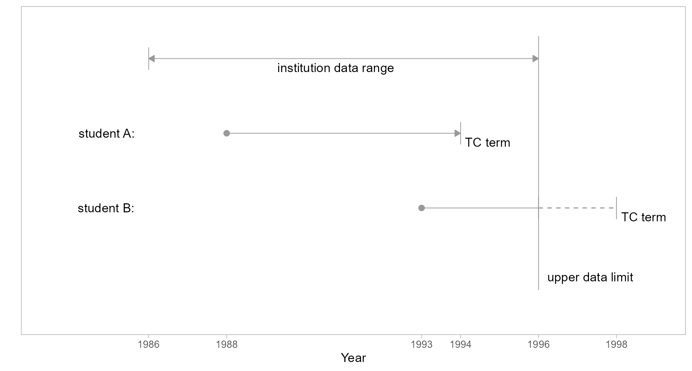
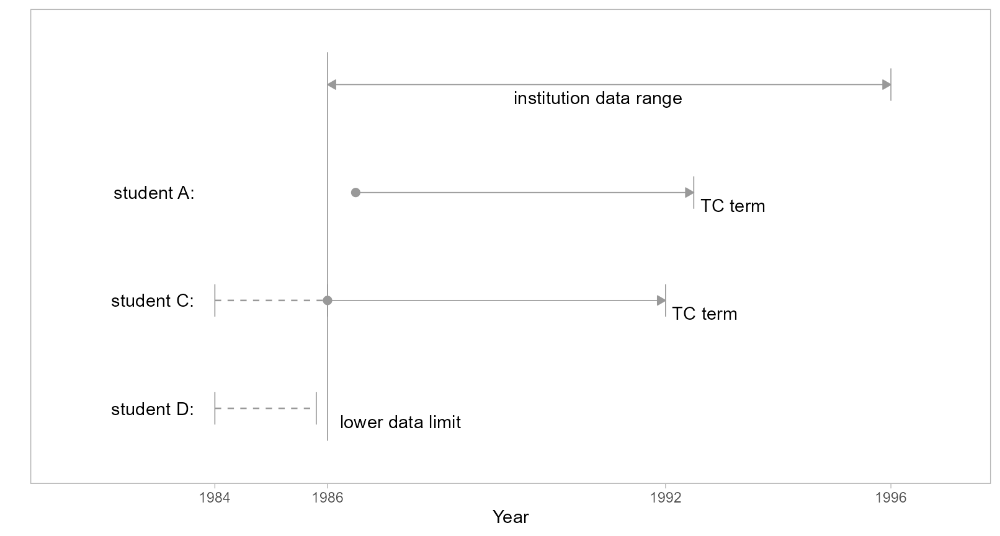

# Data sufficiency

The time span (or range) of MIDFIELD data varies by institution. At the
upper and lower limits of a data range, a potential for false counts
exists when a metric (such as graduation rate) requires knowledge of
timely degree completion. For such metrics, student records that produce
problematic results due to insufficient data are nearly always excluded
from study.

This article in the MIDFIELD workflow.

1.  Planning  
2.  Initial processing
    - Data sufficiency $`\longleftarrow`$
    - Degree seeking  
    - Identify programs  
3.  Blocs  
4.  Groupings  
5.  Metrics  
6.  Displays

## Definitions

- **data range**:

  The overall span of academic terms of student unit record data
  provided by an institution. We are particularly interested in the
  lower and upper limits of a continuous range.

- **timely completion term**:

  The last term in which a student’s degree completion would be
  considered timely. In many cases the timely completion (TC) term is 6
  years after admission. The TC term can be adjusted to account for
  transfer credits. (Currently, there is no mechanism for extending the
  TC term for co-ops or migrators.)

- **data sufficiency criterion**:

  Student records are limited to those for which available data are
  sufficient to assess timely completion without biased counts of
  completers or non-completers.

## Upper-limit data sufficiency

For students admitted too near the upper limit of their institution’s
data range, the available data cover an insufficient number of years to
know if completion is timely. To illustrate, in the figure we compare
two students admitted in different terms with representative time spans
shown for timely completion. In this scenario, we assume institution
data is available from 1986 to 1996.

  



Figure 1: Upper limit data sufficiency.

- Student A:

  Student A enters in 1988 with a timely completion (TC) term in 1994.
  In both of the following cases, the data sufficiency criterion is
  satisfied and the records are included in a study.

&nbsp;

- A-1: First time in college (FTIC), so we know their first term is
  their entry term (i.e., they are not a continuing student) and we can
  determine their TC term.

- A-2: Transfer student, and we know their first term in a MIDFIELD
  institution. We have no knowledge of how much time was spent
  accumulating their pre-MIDFIELD credit hours, but we can estimate a TC
  term with respect to their “level” at entry, that is, entering as a
  first-year student, second-year student, etc.

&nbsp;

- Student B:

  Student B enters in 1993 with a TC term in 1998, two years beyond the
  range of the data. We have several possible cases,

&nbsp;

- B-1: Before the data limit, the student completes their program
  (timely completion, known record)

- B-2: Before the data limit, the student leaves the data base
  (non-completion, known record)

- B-3: After the data limit, the student completes before their TC term
  (timely completion, no record)

- B-4: After the data limit, the student completes after their TC term
  or fails to complete (late completion or non-completion, no record)

Because the outcomes in cases B-3 and B-4 are not in the record, to
include case B-1 and B-2 invariably produces a miscount of timely
completers, late completers, and non-completers. Thus all student B
records are excluded from the study.

## Lower-limit data sufficiency

To determine data sufficiency record exclusions at the lower limit of
the data range, we compare a student’s first term (non-summer) to the
first term of the data range (also non-summer). When these two terms are
identical, the complete unit record is excluded. We illustrate with the
three scenarios described below.

  



Figure 2: Lower limit data sufficiency.

- Student A:

  Like Student A in Figure 1, they enter the dataset in a term following
  the data lower limit and are included in a study.

- Student C:

  Student C enters the institution before the lower limit of the data
  range (a “continuing” student) or they enter the institution at the
  lower limit precisely.

&nbsp;

- C-1: If student C is continuing, regardless of status (FTIC or
  transfer), making an estimate of their TC term invariably leads to
  false counts because we have no knowledge of how much time was spent
  accumulating credit hours at their MIDFIELD institution before the
  lower data limit. Including C-1 would also produce false counts
  because of student D (discussed below).

- C-2: If student C is not continuing, that is, their first time entry
  to a MIDFIELD institution is at the lower data limit (here, 1986), we
  would include them in a study if we could. Unfortunately, we cannot
  distinguish them from continuing students. Having to exclude C-1
  inherently excludes C-2 as well.

&nbsp;

- Student D:

  Student D enters the institution at the same time as continuing
  student C but leaves the database before the data lower limit term.

&nbsp;

- D-1: Student D did not timely-complete their program. In this case, if
  we include student C our count of *non-completers* is low (D-1 cases
  are missing), resulting in an inflated ratio of completers to
  non-completers.

- D-2: Student D did timely-complete their program. Here, if we include
  student C our count of *completers* is low (D-2 cases are missing),
  resulting in a diminished ratio of completers to non-completers.

The balance of these two effects is unknowable. Since student D cannot
possibly be included, Student C must also be excluded.

## Method

Specific student unit records at the upper and lower limits of an
institution’s data range must be excluded to prevent false counts due to
insufficient data. Based on the discussion above, two specific filters
are implemented:

- *Lower limit.* All IDs extant in the non-summer lower limit of an
  institution’s data range are labeled for possible exclusion.

- *Upper limit.* All IDs for which the timely completion term exceeds
  the upper limit of the institution’s data range are labeled for
  possible exclusion.

*Reminder.*   midfielddata datasets are for practice, not research.

## Load data

*Start.*   If you are writing your own script to follow along, we use
these packages in this article:

``` r

library(midfieldr)
library(midfielddata)
library(data.table)
```

*Load.*   Practice datasets. View data dictionary via
[`?term`](https://midfieldr.github.io/midfielddata/reference/term.html).

``` r

# Load data
data(term)
```

## Initial processing

*Select (optional).*   Reduce the number of columns. Code reproduced
from [Getting
started](https://midfieldr.github.io/midfieldr/articles/art-000-getting-started.html#reusable-code).

``` r

# Copy of source files with all variables
source_term <- copy(term)

# Select variables required by midfieldr functions
term <- select_required(source_term)
```

*Initialize.*   Assign a working data frame.

``` r

# Working data frame
DT <- copy(term)
DT
#>                   mcid   institution   term   cip6         level
#>                 <char>        <char> <char> <char>        <char>
#>      1: MCID3111142225 Institution B  19881 140901 01 First-year
#>      2: MCID3111142283 Institution J  19881 240102 01 First-year
#>      3: MCID3111142283 Institution J  19883 240102 01 First-year
#>     ---                                                         
#> 639913: MCID3112898894 Institution B  20181 451001 01 First-year
#> 639914: MCID3112898895 Institution B  20181 302001 01 First-year
#> 639915: MCID3112898940 Institution B  20181 050103 01 First-year
```

*Select.*   The ID column is required. The institution column is not,
but is convenient when taking a closer look at the results.

``` r

# Retain the minimum number of columns
DT <- DT[, .(mcid, institution)]
```

*Filter.*   Retain unique IDs.

``` r

# Filter for unique IDs
DT <- unique(DT)
DT
#>                  mcid   institution
#>                <char>        <char>
#>     1: MCID3111142225 Institution B
#>     2: MCID3111142283 Institution J
#>     3: MCID3111142290 Institution J
#>    ---                             
#> 97553: MCID3112898894 Institution B
#> 97554: MCID3112898895 Institution B
#> 97555: MCID3112898940 Institution B
```

## `add_timely_term()`

Add a column to a data frame of student-level data that indicates the
latest term by which degree completion would be considered timely for
every student.

*Arguments.*

- **`dframe`**   Data frame of student-level records keyed by student
  ID. Required variable (column) is `mcid`.

- **`midfield_term`**   Data frame of student-level term observations
  keyed by student ID. Default is `term`. Required variables (columns)
  are `mcid`, `term`, and `level`.

- **`span`**   Optional integer scalar, number of years to define timely
  completion. Commonly used values are are 100%, 150%, and 200% of
  `sched_span`. Default 6 years. Argument to be used by name.

- **`sched_span`**   Optional integer scalar, the number of years an
  institution officially schedules for completing a program. Default 4
  years. Argument to be used by name.

*Equivalent usage.*   The following implementations yield identical
results,

``` r

# Required arguments in order and explicitly named
x <- add_timely_term(dframe = DT, midfield_term = term)

# Required arguments in order, but not named
y <- add_timely_term(DT, term)

# Using the implicit default for the midfield_term argument
z <- add_timely_term(DT)

# Demonstrate equivalence
check_equiv_frames(x, y)
#> [1] TRUE
check_equiv_frames(x, z)
#> [1] TRUE
```

*Output.*   Adds the following columns to the data frame.

- **`term_i`**   Student initial term, encoded YYYYT.

- **`level_i`**   Student level (01 Freshman, 02 Sophomore, etc.) in
  their initial term.

- **`adj_span`**   Integer span of years for timely completion, adjusted
  for a student’s initial level

- **`timely_term`**   Latest term by which degree completion would be
  considered timely. Encoded YYYYT.

``` r

# Add timely term column and supporting variables
DT <- add_timely_term(DT, term)
DT
#>                  mcid   institution term_i       level_i adj_span timely_term
#>                <char>        <char> <char>        <char>    <num>      <char>
#>     1: MCID3111142225 Institution B  19881 01 First-year        6       19933
#>     2: MCID3111142283 Institution J  19881 01 First-year        6       19933
#>     3: MCID3111142290 Institution J  19881 01 First-year        6       19933
#>    ---                                                                       
#> 97553: MCID3112898894 Institution B  20181 01 First-year        6       20233
#> 97554: MCID3112898895 Institution B  20181 01 First-year        6       20233
#> 97555: MCID3112898940 Institution B  20181 01 First-year        6       20233
```

### Closer look

Examining the records of selected students in detail.

*Example 1.*   The student’s initial term is Fall 2007 (encoded `20071`)
and their initial level is `01 First-year`. The number of years to
timely completion is 6 years, that is, academic years 2007–08, 08–09,
09–10, 10–11, 11–12, 12–13. Thus their timely completion term is Spring
2013 (encoded `20123`).

``` r

# Display one student by ID
DT[mcid == "MCID3112785480"]
#>              mcid   institution term_i       level_i adj_span timely_term
#>            <char>        <char> <char>        <char>    <num>      <char>
#> 1: MCID3112785480 Institution C  20071 01 First-year        6       20123
```

*Example 2.*   The student’s initial term is Spring 2002 (encoded
`20013`) and their initial level is `03 Third-year` from which we infer
they have completed two years of their program, yielding an adjusted
span of 4 years. Those four years would encompass terms `20013`–`20021`,
`20023`–`20031`, `20033`–`20041`, and `20043`–`20051`, yielding a timely
completion term of Fall 2005.

``` r

# Display one student by ID
DT[mcid == "MCID3111860641"]
#>              mcid   institution term_i       level_i adj_span timely_term
#>            <char>        <char> <char>        <char>    <num>      <char>
#> 1: MCID3111860641 Institution J  20013 03 Third-year        4       20051
```

### Alternate source names

Arguments of midfieldr functions accept alternate names, should the
source-data file names in your workspace be named something other than
`student`, `term`, etc. For example, if we were working with the “toy”
(exercise) data sets included with midfieldr, we might write something
like this,

``` r

# A toy set of IDs
toy_mcid <- toy_student[, .(mcid)]

# Source data table names that differ from the defaults
toy_DT <- add_timely_term(dframe = toy_mcid, midfield_term = toy_term)

# Equivalently
toy_DT <- add_timely_term(toy_mcid, toy_term)
toy_DT
#>            mcid term_i      level_i adj_span timely_term
#>          <char> <char>       <char>    <num>      <char>
#>  1: MID25784187  19885  01 Freshman        6       19943
#>  2: MID25784974  19883 02 Sophomore        5       19931
#>  3: MID25816209  19881 02 Sophomore        5       19923
#> ---                                                     
#> 97: MID26691066  20103  01 Freshman        6       20161
#> 98: MID26692025  20131    04 Senior        3       20153
#> 99: MID26692254  20143 02 Sophomore        5       20191
```

### Silent overwriting

Existing columns with the same names as one of the added columns are
deleted and replaced. Using the toy data to illustrate, we drop the
columns added by timely term except `adj_span`.

``` r

# Drop three columns
toy_DT <- toy_DT[, c("term_i", "level_i", "timely_term") := NULL]
toy_DT
```

Reapplying the function, the `adj_span` column is silently deleted and
replaced.

``` r

# Demonstrate overwriting
toy_DT <- add_timely_term(toy_DT, toy_term)
toy_DT
#>            mcid term_i      level_i adj_span timely_term
#>          <char> <char>       <char>    <num>      <char>
#>  1: MID25784187  19885  01 Freshman        6       19943
#>  2: MID25784974  19883 02 Sophomore        5       19931
#>  3: MID25816209  19881 02 Sophomore        5       19923
#> ---                                                     
#> 97: MID26691066  20103  01 Freshman        6       20161
#> 98: MID26692025  20131    04 Senior        3       20153
#> 99: MID26692254  20143 02 Sophomore        5       20191
```

## `add_data_sufficiency()`

Add a column to a data frame of Student Unit Record (SUR) observations
that labels each row for inclusion or exclusion based on data
sufficiency near the upper and lower bounds of an institution’s data
range.

*Arguments.*

- **`dframe`**   Data frame of student-level records keyed by student
  ID. Required variables are `mcid` and `timely_term`.

- **`midfield_term`**   Data frame of student-level term observations
  keyed by student ID. Default is `term`. Required variables are `mcid`,
  `institution`, and `term`.

*Equivalent usage.*   The following implementations yield identical
results,

``` r

# Required arguments in order and explicitly named
x <- add_data_sufficiency(dframe = DT, midfield_term = term)

# Required arguments in order, but not named
y <- add_data_sufficiency(DT, term)

# Using the implicit default for the midfield_term argument
z <- add_data_sufficiency(DT)

# Demonstrate equivalence
check_equiv_frames(x, y)
#> [1] TRUE
check_equiv_frames(x, z)
#> [1] TRUE
```

*Output.*   Adds the following columns to the data frame.

- **`term_i`**   Student initial term, encoded YYYYT.

- **`lower_limit`**   Initial term of an institution’s data range,
  encoded YYYYT.

- **`upper_limit`**   Final term of an institution’s data range, encoded
  YYYYT.

- **`data_sufficiency`**   Label each observation for inclusion or
  exclusion based on data sufficiency: “include”, indicating that
  available data are sufficient for estimating timely degree completion;
  “exclude-upper”, indicating that data are insufficient at the upper
  limit of a data range; or “exclude-lower”, indicating that data are
  insufficient at the lower limit.

``` r

# Un-clutter the printout
DT <- DT[, .(mcid, institution, timely_term)]

# Add data sufficiency column and supporting variables
DT <- add_data_sufficiency(DT, term)
DT
#>                  mcid   institution timely_term term_i lower_limit upper_limit
#>                <char>        <char>      <char> <char>      <char>      <char>
#>     1: MCID3111142225 Institution B       19933  19881       19881       20181
#>     2: MCID3111142283 Institution J       19933  19881       19881       20096
#>     3: MCID3111142290 Institution J       19933  19881       19881       20096
#>    ---                                                                        
#> 97553: MCID3112898894 Institution B       20233  20181       19881       20181
#> 97554: MCID3112898895 Institution B       20233  20181       19881       20181
#> 97555: MCID3112898940 Institution B       20233  20181       19881       20181
#>        data_sufficiency
#>                  <char>
#>     1:    exclude-lower
#>     2:    exclude-lower
#>     3:    exclude-lower
#>    ---                 
#> 97553:    exclude-upper
#> 97554:    exclude-upper
#> 97555:    exclude-upper
```

Similar to the details described in the previous section,
[`add_data_sufficiency()`](https://midfieldr.github.io/midfieldr/reference/add_data_sufficiency.md)
accepts [Alternate source names](#alternate-source-names) and uses
[Silent overwriting](#silent-overwriting) when existing columns have the
same name as one of the added columns.

### Closer look

The data range for the institutions are:

``` r

# Data range by institution
term[order(institution), .(min_term = min(term), max_term = max(term)), by = "institution"]
#>      institution min_term max_term
#>           <char>   <char>   <char>
#> 1: Institution B    19881    20181
#> 2: Institution C    19901    20154
#> 3: Institution J    19881    20096
```

*Example 3.*   Exemplifies “Student A” in Figure 1 or Figure 2. The
student attends Institution C which has a data range of 1990–2015. The
student’s initial term is Fall 2007 so the 1990 lower-limit exclusion
does not apply; the student’s timely completion term is Spring 2013, so
the 2015 upper-limit exclusion does not apply.

``` r

# Display one student by ID
DT[mcid == "MCID3112785480"]
#>              mcid   institution timely_term term_i lower_limit upper_limit
#>            <char>        <char>      <char> <char>      <char>      <char>
#> 1: MCID3112785480 Institution C       20123  20071       19901       20154
#>    data_sufficiency
#>              <char>
#> 1:          include
```

*Example 4.*   Exemplifies “Student B” in Figure 1. The student attends
Institution B which has a data range of 1988–2018. The student’s initial
term is Spring 2013 so the 1988 lower-limit exclusion does not apply;
the student’s timely completion term is Fall 2019, so the 2018
upper-limit exclusion does apply.

``` r

# Display one student by ID
DT[mcid == "MCID3111170322"]
#>              mcid   institution timely_term term_i lower_limit upper_limit
#>            <char>        <char>      <char> <char>      <char>      <char>
#> 1: MCID3111170322 Institution B       20191  20133       19881       20181
#>    data_sufficiency
#>              <char>
#> 1:    exclude-upper
```

*Example 5.*   Exemplifies “Student C” in Figure 2. The student attends
Institution B which has a data range of 1988–2009. The student’s initial
term is Fall 1988 so the 1988 lower-limit exclusion applies.

``` r

# Display one student by ID
DT[mcid == "MCID3112056754"]
#>              mcid   institution timely_term term_i lower_limit upper_limit
#>            <char>        <char>      <char> <char>      <char>      <char>
#> 1: MCID3112056754 Institution J       19933  19881       19881       20096
#>    data_sufficiency
#>              <char>
#> 1:    exclude-lower
```

## Reusable code

*Preparation.*   The `term` data table is the intake for this section.

``` r

DT <- copy(term)
```

*Data sufficiency.*   A summary code chunk for ready reference.

``` r

# Filter for data sufficiency, output unique IDs
DT <- add_timely_term(DT, term)
DT <- add_data_sufficiency(DT, term)
DT <- DT[data_sufficiency == "include", .(mcid)]
DT <- unique(DT)
```

## References
