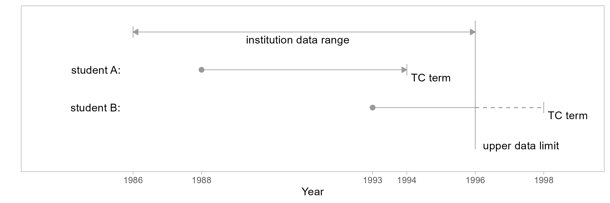

```{r setup}
#| include: false

# code chunks
knitr::opts_chunk$set(
  echo = FALSE,
  message = FALSE,
  warning = FALSE,
  collapse = FALSE,
  comment = "#>",
  error = FALSE
)

# figures
knitr::opts_chunk$set(
    fig.path = "../man/figures/art-010-data-sufficiency-", 
    fig.width = 6,
    fig.asp = 1 / 1.6,
    out.width = "70%",
    fig.align = "center"
)

# inline numbers
knitr::knit_hooks$set(inline = function(x) {
  if (!is.numeric(x)) {
    x
  } else if (x >= 10000) {
    prettyNum(round(x, 2), big.mark = ",")
  } else {
    prettyNum(round(x, 2))
  }
})
```

The time span (or range) of MIDFIELD data varies by institution. At the upper and lower limits of a data range, a potential for false counts exists when a metric (such as graduation rate) requires knowledge of timely program completion.  For such metrics, student records that produce problematic results due to insufficient data are nearly always excluded from study. 

## Definitions

data range

: The overall span of academic terms of student unit record data provided by an institution. We are particularly interested in the lower and upper limits of a continuous range.   

timely completion term  

: The last term in which a student's program completion would be considered timely. In many cases the timely completion (TC) term is 6 years after admission. The TC term can be adjusted to account for transfer credits. (Currently, we do not include an adjustment for co-ops.)

data sufficiency criterion

: Student records are limited to those for which available data are sufficient to assess timely completion without biased counts of completers or non-completers. 


## Upper-limit data sufficiency

For students admitted too near the upper limit of their institution’s data range, the available data cover an insufficient number of years to know if completion is timely. To illustrate, in the figure we compare two students admitted in different terms with representative time spans shown for timely completion. In this scenario, we assume institution data is available from 1986 to 1996.

<br>

{width="80%"}

<br>

Student A

: Student A enters in 1988 with a timely completion (TC) term in 1994.  In both of the following cases, the data sufficiency criterion is satisfied and the records are included in a study.

- A-1: First time in college (FTIC), so we know their first term is their entry term (i.e., they are not a continuing student) and we can determine their TC term.
- A-2: Transfer student, and we know their first term in a MIDFIELD institution. We have no knowledge of how much time was spent accumulating their pre-MIDFIELD credit hours, but we can estimate a TC term with respect to their MIDFIELD entry level. 

Student B

: Student B enters in 1993 with a TC term in 1998, two years beyond the range of the data. We have several possible cases,  

- B-1: Before the data limit, the student completes their program (timely and known)
- B-2: Before the data limit, the student leaves the data base (untimely and known)
- B-3: After the data limit, the student completes before their TC term (timely but unknown)
- B-4: After the data limit, the student completes after their TC term  or fails to complete  (untimely and unknown)     

Because of unknown outcomes in cases B-3 and B-4, including case B-1 and B-2 invariably produces a miscount of completers and non-completers. Thus the criterion is not satisfied and student B records are excluded from the study.


## Lower-limit data sufficiency

To determine data sufficiency record exclusions at the lower limit of the data range, we compare a student's first term (non-summer) to the first term of the data range (also non-summer). When these two terms are identical, the complete unit record is excluded. We illustrate with the three scenarios described below. 

<br>

{width="80%"}

<br>

Student C

: Student C makes their first appearance in the database in a term following the data lower limit. The conditions for student C (FTIC or transfer) are identical to those for student A, thus student C is included in a study. 

Student D

: Student D enters the institution before the lower limit of the data range (a "continuing" student) or they enter the institution at the lower limit precisely.  

- D-1: If student D is continuing, regardless of status (FTIC or transfer), making an estimate of their TC term invariably leads to false counts because we have no knowledge of how much time was spent accumulating credit hours at their MIDFIELD institution before the lower data limit. Including D-1 also produces false counts because of student E (discussed below). 
- D-2: If student D is not continuing, that is, their first time entry to a MIDFIELD institution is at the lower data limit (here, 1986), we would include them in a study if we could. Unfortunately, we cannot distinguish them from continuing students. Having to exclude D-1 inherently excludes D-2 as well. 

Student E

: Student E enters the institution at the same time as continuing student D but leaves the database before the data lower limit term.

- E-1: Student E did not timely-complete their program. In this case, if we include student D our count of *non-completers* is low (E-1 cases are missing), resulting in an inflated ratio of completers to non-completers.
- E-2: Student E did timely-complete their program. Here, if we include student D our count of *completers* is low (E-2 cases are missing), resulting in a diminished ratio of completers to non-completers. 

The balance of these two effects is unknowable. Since student E cannot possibly be included, Student D must also be excluded.


## Method

The data sufficiency criterion is applied when a metric requires counting the number of students who complete their programs in a timely fashion. Specific student unit records at the upper and lower limits of an institution's data range must be excluded to prevent false counts due to insufficient data. 

The method for applying the data sufficiency criterion is to exclude observations that 

- are present in the non-summer lower limit of the institution data range 
- have a timely completion term that exceeds the upper limit of the data range

This is the method implemented by `add_data_sufficiency()`. 


## Population

Of the four MIDFIELD data tables, `course` and `term` are the most inclusive, with observations of all students enrolled in a course in a term. Since `term` is the smaller of the two, we generally start an analysis with the term data frame. 

If you are writing your own script to follow along, we start with these packages: 

```{r}
# set echo for example
knitr::opts_chunk$set(echo = TRUE)
```

```{r}
# Packages
library("midfieldr")
library("midfielddata")
suppressPackageStartupMessages(library("data.table"))

# Printing options for data.table
options(
  datatable.print.nrows = 55,
  datatable.print.topn = 5,
  datatable.print.class = TRUE
)
```

**Importing.** Load the midfielddata data table. Copy the `term` data set to create the working data frame (`DT`), leaving `term` unaltered for later use. 

```{r}
# Load data set from midfielddata
data(term)

# Create a working data frame
DT <- copy(term)
str(DT)
```

The result has `r nrow(DT)` observations. We will usually note the number of observations as they change. 

To apply the data sufficiency criterion, two variables are required: a student's ID and their timely completion term.

**Filtering.** For illustrating the functions, we need start with the ID column only.  

```{r}
# Retain the minimum number of columns
DT <- DT[, .(mcid)]
```

In this form, the data frame will have duplicate rows for the multiple terms in which a student is enrolled in a program. We filter unique IDs. 

```{r}
DT <- unique(DT)
DT[]

# Count unique IDs
length(unique(DT$mcid))
```

The result has `r nrow(DT)` unique observations.


## `add_timely_term()`

Starting with a data frame of Student Unit Record (SUR) observations (like `DT` above) that includes an ID variable, we add a timely completion term column using `add_timely_term()`. 

You can view the function help page by running, 

    # Run in Console to view help page
    ? add_timely_term
    
Its arguments are: 

`dframe`

: Data frame of student unit record (SUR) observations keyed by student ID. Required variable (column) is `mcid`.

`midfield_term`	

: Data frame of SUR term observations keyed by student ID. Default is `term`. Required variables (columns) are `mcid`, `term`, and `level`. 

`span`	

: Optional integer scalar, number of years to define timely completion. Commonly used values are are 100%, 150%, and 200% of `sched_span`. Default 6 years.

`sched_span`

: Optional integer scalar, the number of years an institution officially schedules for completing a program. Default 4 years.

The function adds four columns to the SUR data frame: the `timely_term` result  plus three supporting variables:  

- `term_i` is the initial term of a student's longitudinal record, encoded YYYYT 
- `level_i` is the student level (01 Freshman, 02 Sophomore, etc.) in their initial term
- `adj_span` is the integer span of years for timely completion adjusted for a student's initial level

```{r}
# Display timely term and supporting variables 
DT <- add_timely_term(DT, term)
DT[]
```

**Closer look.** Let's examine two specific observations to illustrate.

```{r}
DT[mcid == "MID25783135"]
```

The student's initial term is Fall 1991 (encoded `19911`) and their initial level is `01 Freshman`. The number of years to timely completion is 6 years, that is, academic years 1991--92, 92--93, 93--94, 94--95, 95--96, 96--97. Thus their timely completion term is Spring 1997 (encoded `19963`). 

```{r}
DT[mcid == "MID26697689"]
```

The student's initial term is Spring 2017 (encoded `20163`) and their initial level is `04 Senior` from which we infer they have completed three years of their program, yielding an adjusted span of 3 years. Those three years would encompass terms `20163`--`20171`, `20173`--`20181`, and `20183`--`20191`, yielding a timely completion term of Fall 2019 (encoded `20191`). 

**Usage.** The following implementations yield identical results, 

```{r}
#| collapse: true
# Required arguments in order and explicitly named 
x <- add_timely_term(dframe = DT, midfield_term = term)

# Required arguments in order, but not named   
y <- add_timely_term(DT, term)

# Using the implicit default for the midfield_term argument
z <- add_timely_term(DT)

# Equality test between the data tables
all.equal(x, y)
all.equal(x, z)
```

In the vignettes, I will typically write required arguments without names to remind us which midfielddata table is being used, e.g., 

    add_timely_term(DT, term)
    
Your term data set can be named something other than `term`. For example, if we were working with the "toy" (exercise) data sets bundled with midfieldr, we would write something like this, 

```{r}
# Using term data named something else
toy_DT <- toy_student[, .(mcid)]
toy_DT <- add_timely_term(toy_DT, toy_term)
toy_DT[]
```

**Caution! Silent overwriting!**  Existing columns with the same names as one of the added columns are deleted and replaced. 

Using the toy data to illustrate, I'll drop the columns added by timely term except `adj_span`.

```{r}
# Drop three columns
toy_DT <- toy_DT[, c("term_i", "level_i", "timely_term") := NULL]
toy_DT[]
```

Reapplying the function, the `adj_span` column is silently deleted and replaced. 

```{r}
toy_DT <- add_timely_term(toy_DT, toy_term)
toy_DT[]
```


## `add_data_sufficiency()`

Continuing with a data frame of SUR observations, we add the data sufficiency column using `add_data_sufficiency()`. 

You can view the function help page by running, 

    ? add_data_sufficiency()

Its arguments are:

`dframe`

: Data frame of student unit record (SUR) observations keyed by student ID. Required variables are `mcid` and `timely_term`.

`midfield_term`

: Data frame of SUR term observations keyed by student ID. Default is `term`. Required variables are `mcid`, `institution`, and `term`.

The function adds four columns to the SUR data frame: the `data_sufficiency` result plus three supporting variables: 

`term_i`

: Character. Initial term of a student's longitudinal record, encoded YYYYT. Not overwritten if present in dframe.

`lower_limit`

: Character. Initial term of an institution's data range, encoded YYYYT

`upper_limit`

: Character. Final term of an institution's data range, encoded YYYYT


The data sufficiency column labels each observation for inclusion or exclusion. Possible values are: 

- `include`, indicating that available data are sufficient for estimating timely program completion
- `exclude-upper`, indicating that data are insufficient at the upper limit of a data range  
- `exclude-lower`, indicating that data are insufficient at the lower limit.

```{r}
# Drop unnecessary columns
DT <- DT[, .(mcid, timely_term)]

# Display data sufficiency and supporting variables
DT <- add_data_sufficiency(DT, term)
DT[]
```

**Closer look.** Let's examine three specific observations to illustrate. In these excerpts, the data range for the institution is Fall 1987 to Summer 2003.

```{r}
# Student A
DT[mcid == "MID25783135"]
```

The student's initial term is Fall 1991 so the lower-limit exclusion does not apply; the student's timely completion term is Spring 1996, so the upper-limit exclusion does not apply. The record satisfies the data sufficiency criterion.   

```{r}
# Student B
DT[mcid == "MID25783156"]
```

The student's initial term is Fall 2001 so the lower-limit exclusion does not apply; the student's timely completion term is Spring 2006, so the upper-limit exclusion does apply. 

```{r}
# Student D
DT[mcid == "MID25783197"]
```

The student's initial term is Fall 1987 so the lower-limit exclusion applies.

**Usage.** The following implementations yield identical results, 

```{r}
#| collapse: true
# Required arguments in order and explicitly named 
x <- add_data_sufficiency(dframe = DT, midfield_term = term)

# Required arguments in order, but not named   
y <- add_data_sufficiency(DT, term)

# Using the implicit default for the midfield_term argument
z <- add_data_sufficiency(DT)

# Equality test between the data tables
all.equal(x, y)
all.equal(x, z)
```

Again, your term data set can be named something other than `term`. For example, using the "toy" data sets again, 

```{r}
# Using term data named something else
toy_DT <- toy_DT[, .(mcid, timely_term)]
toy_DT <- add_data_sufficiency(toy_DT, toy_term)
toy_DT[]
```

**Caution! Silent overwriting!** In this case, existing columns with the same name as one of the added columns are deleted and replaced except for `term_i`. 

Using the toy data to illustrate, I'll drop the columns added by data sufficiency except `upper_limit`. 

```{r}
# Drop three columns
toy_DT <- toy_DT[, c("lower_limit", "data_sufficiency") := NULL]
toy_DT[]
```

Reapplying the function, the `term_i` column is silently overwritten and the other three columns added as before. 

```{r}
toy_DT <- add_data_sufficiency(toy_DT, toy_term)
toy_DT[]
```

**Filtering.** In most cases, we retain only those observations for which the data are sufficient. 

```{r}
DT <- DT[data_sufficiency == "include"]
DT[]
```

The result has `r nrow(DT)` unique observations. 

## Closing

To prepare for applying the data sufficiency criterion, we first estimate students' timely completion terms using `add_timely_term()`. We then label observations for inclusion and exclusion using `add_data_sufficiency()`. 

Subsetting a population for data sufficiency is typically the first filter applied to SUR data.
