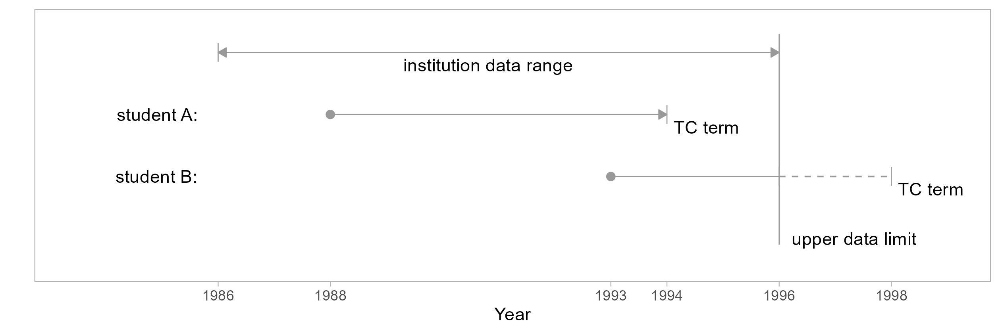
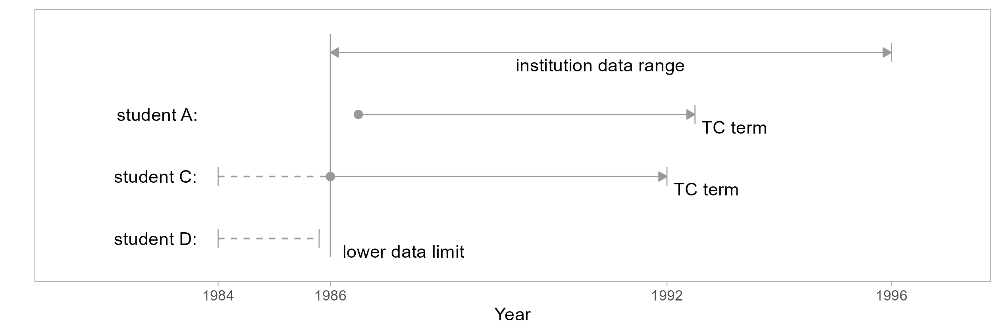

```{r child = "../man/rmd/common-setup.Rmd"}
```

```{r}
#| include: false
knitr::opts_chunk$set(fig.path = "../man/figures/art-020-")
```

The time span (or range) of MIDFIELD data varies by institution. At the upper and lower limits of a data range, a potential for false counts exists when a metric (such as graduation rate) requires knowledge of timely degree completion. For such metrics, student records that produce problematic results due to insufficient data are nearly always excluded from study.

This article in the MIDFIELD workflow. 

1. Planning  
1. `r accent("Initial processing")`    
    - `r accent("Data sufficiency")`  
    - Degree seeking  
    - Identify programs  
1. Blocs  
1. Groupings  
1. Metrics  
1. Displays 


## Definitions

```{r child = "../man/rmd/define-data-range.Rmd"}
```

```{r child = "../man/rmd/define-timely-completion-term.Rmd"}
```

```{r child = "../man/rmd/define-data-sufficiency-criterion.Rmd"}
```


## Upper-limit data sufficiency

For students admitted too near the upper limit of their institution's data range, the available data cover an insufficient number of years to know if completion is timely. To illustrate, in the figure we compare two students admitted in different terms with representative time spans shown for timely completion. In this scenario, we assume institution data is available from 1986 to 1996.

<br>

{width="100%"}

Student A

:   Student A enters in 1988 with a timely completion (TC) term in 1994. In both of the following cases, the data sufficiency criterion is satisfied and the records are included in a study.

-   A-1: First time in college (FTIC), so we know their first term is their entry term (i.e., they are not a continuing student) and we can determine their TC term.

-   A-2: Transfer student, and we know their first term in a MIDFIELD institution. We have no knowledge of how much time was spent accumulating their pre-MIDFIELD credit hours, but we can estimate a TC term with respect to their "level" at entry, that is, entering as a first-year student, second-year student, etc. 

Student B

:   Student B enters in 1993 with a TC term in 1998, two years beyond the range of the data. We have several possible cases,

-   B-1: Before the data limit, the student completes their program (timely completion, known record)

-   B-2: Before the data limit, the student leaves the data base (non-completion, known record)

-   B-3: After the data limit, the student completes before their TC term (timely completion, no record)

-   B-4: After the data limit, the student completes after their TC term or fails to complete (late completion or non-completion, no record)

Because the outcomes in cases B-3 and B-4 are not in the record, to include  case B-1 and B-2 invariably produces a miscount of timely completers, late completers, and non-completers. Thus all student B records are excluded from the study.

## Lower-limit data sufficiency

To determine data sufficiency record exclusions at the lower limit of the data range, we compare a student's first term (non-summer) to the first term of the data range (also non-summer). When these two terms are identical, the complete unit record is excluded. We illustrate with the three scenarios described below.

<br>

{width="100%"}

Student A

:   Like Student A in Figure 1, they enter the dataset in a term following the data lower limit and are included in a study.

Student C

:   Student C enters the institution before the lower limit of the data range (a "continuing" student) or they enter the institution at the lower limit precisely.

-   C-1: If student C is continuing, regardless of status (FTIC or transfer), making an estimate of their TC term invariably leads to false counts because we have no knowledge of how much time was spent accumulating credit hours at their MIDFIELD institution before the lower data limit. Including C-1 would also produce false counts because of student D (discussed below).

-   C-2: If student C is not continuing, that is, their first time entry to a MIDFIELD institution is at the lower data limit (here, 1986), we would include them in a study if we could. Unfortunately, we cannot distinguish them from continuing students. Having to exclude C-1 inherently excludes C-2 as well.

Student D

:   Student D enters the institution at the same time as continuing student C but leaves the database before the data lower limit term.

-   D-1: Student D did not timely-complete their program. In this case, if we include student C our count of *non-completers* is low (D-1 cases are missing), resulting in an inflated ratio of completers to non-completers.

-   D-2: Student D did timely-complete their program. Here, if we include student C our count of *completers* is low (D-2 cases are missing), resulting in a diminished ratio of completers to non-completers.

The balance of these two effects is unknowable. Since student D cannot possibly be included, Student C must also be excluded.

## Method

Specific student unit records at the upper and lower limits of an institution's data range must be excluded to prevent false counts due to insufficient data. Based on the discussion above, two specific filters are implemented:

-   *Lower limit.* All IDs extant in the non-summer lower limit of an institution’s data range are labeled for possible exclusion.

-   *Upper limit.* All IDs for which the timely completion term exceeds the upper limit of the institution's data range are labeled for possible exclusion.

 

```{r child = "../man/rmd/note-for-practice-only-2.Rmd"}
```


## Load data

*Start.* &nbsp; If you are writing your own script to follow along, we use these packages in this article:

```{r}
library(midfieldr)
library(midfielddata)
library(data.table)
```

*Load.* &nbsp; Practice datasets. View data dictionary via `?term`. 

```{r}
# Load data
data(term)
```


## Initial processing

*Select (optional).* &nbsp; Reduce the number of columns. Code reproduced from [Getting started](art-000-getting-started.html#reusable-code). 

```{r}
# Copy of source files with all variables
source_term <- copy(term)

# Select variables required by midfieldr functions
term <- select_required(source_term)
```

*Initialize.* &nbsp; Assign a working data frame. 

```{r}
# Working data frame
DT <- copy(term)
DT
```

*Select.* &nbsp; The ID column is required. The institution column is not, but is convenient when taking a closer look at the results. 

```{r}
# Retain the minimum number of columns
DT <- DT[, .(mcid, institution)]
```

*Filter.* &nbsp; Retain unique IDs.

```{r}
# Filter for unique IDs
DT <- unique(DT)
DT
```


## `add_timely_term()`

Add a column to a data frame of student-level data that indicates the latest term by which degree completion would be considered timely for every student.

*Arguments.*

- **`dframe`** &nbsp; Data frame of student-level records keyed by student ID. Required variable (column) is `mcid`.

- **`midfield_term`** &nbsp; Data frame of student-level term observations keyed by student ID. Default is `term`. Required variables (columns) are `mcid`, `term`, and `level`.

- **`span`** &nbsp; Optional integer scalar, number of years to define timely completion. Commonly used values are are 100%, 150%, and 200% of `sched_span`. Default 6 years. Argument to be used by name.

- **`sched_span`** &nbsp; Optional integer scalar, the number of years an institution officially schedules for completing a program. Default 4 years. Argument to be used by name.


*Equivalent usage.*  &nbsp; The following implementations yield identical results,

```{r}
# Required arguments in order and explicitly named
x <- add_timely_term(dframe = DT, midfield_term = term)

# Required arguments in order, but not named
y <- add_timely_term(DT, term)

# Using the implicit default for the midfield_term argument
z <- add_timely_term(DT)

# Demonstrate equivalence
same_content(x, y)
same_content(x, z)
```

    
*Output.* &nbsp; Adds the following columns to the data frame. 

- **`term_i`** &nbsp; Student initial term, encoded YYYYT.

- **`level_i`** &nbsp; Student level (01 Freshman, 02 Sophomore, etc.) in their initial term.

- **`adj_span`** &nbsp; Integer span of years for timely completion, adjusted for a student's initial level

- **`timely_term`** &nbsp; Latest term by which degree completion would be considered timely. Encoded YYYYT.

```{r}
# Add timely term column and supporting variables
DT <- add_timely_term(DT, term)
DT
```


### Closer look

Examining the records of selected students in detail.

*Example 1.*  &nbsp; The student's initial term is Fall 2007 (encoded `20071`) and their initial level is `01 First-year`. The number of years to timely completion is 6 years, that is, academic years 2007--08, 08--09, 09--10, 10--11, 11--12, 12--13. Thus their timely completion term is Spring 2013 (encoded `20123`).

```{r}
# Display one student by ID
DT[mcid == "MCID3112785480"]
```


*Example 2.*  &nbsp; The student's initial term is Spring 2002 (encoded `20013`) and their initial level is `03 Third-year` from which we infer they have completed two years of their program, yielding an adjusted span of 4 years. Those four years would encompass terms `20013`--`20021`, `20023`--`20031`, `20033`--`20041`, and `20043`--`20051`, yielding a timely completion term of Fall 2005.

```{r}
# Display one student by ID
DT[mcid == "MCID3111860641"]
```


### Alternate source names

Arguments of midfieldr functions accept alternate names, should the source-data file names in your workspace be named something other than `student`, `term`, etc. For example, if we were working with the "toy" (exercise) data sets included with midfieldr, we might write something like this,

```{r}
# A toy set of IDs
toy_mcid <- toy_student[, .(mcid)]

# Source data table names that differ from the defaults
toy_DT <- add_timely_term(dframe = toy_mcid, midfield_term = toy_term)

# Equivalently
toy_DT <- add_timely_term(toy_mcid, toy_term)
toy_DT
```


### Silent overwriting

Existing columns with the same names as one of the added columns are deleted and replaced. Using the toy data to illustrate, we drop the columns added by timely term except `adj_span`.

```{r}
# Drop three columns
toy_DT <- toy_DT[, c("term_i", "level_i", "timely_term") := NULL]
toy_DT
```

Reapplying the function, the `adj_span` column is silently deleted and replaced.

```{r}
# Demonstrate overwriting
toy_DT <- add_timely_term(toy_DT, toy_term)
toy_DT
```

## `add_data_sufficiency()`

Add a column to a data frame of Student Unit Record (SUR) observations that labels each row for inclusion or exclusion based on data sufficiency near the upper and lower bounds of an institution's data range.

*Arguments.*

- **`dframe`** &nbsp; Data frame of student unit record (SUR) observations keyed by student ID. Required variables are `mcid` and `timely_term`.

- **`midfield_term`** &nbsp; Data frame of SUR term observations keyed by student ID. Default is `term`. Required variables are `mcid`, `institution`, and `term`.


*Equivalent usage.*  &nbsp; The following implementations yield identical results,

```{r}
# Required arguments in order and explicitly named
x <- add_data_sufficiency(dframe = DT, midfield_term = term)

# Required arguments in order, but not named
y <- add_data_sufficiency(DT, term)

# Using the implicit default for the midfield_term argument
z <- add_data_sufficiency(DT)

# Demonstrate equivalence
same_content(x, y)
same_content(x, z)
```

*Output.* &nbsp; Adds the following columns to the data frame. 

- **`term_i`** &nbsp; Student initial term, encoded YYYYT.

- **`lower_limit`** &nbsp; Initial term of an institution's data range, encoded YYYYT.

- **`upper_limit`** &nbsp; Final term of an institution's data range, encoded YYYYT.

- **`data_sufficiency`** &nbsp;  Label each observation for inclusion or exclusion based on data sufficiency: "include", indicating that available data are sufficient for estimating timely degree completion; "exclude-upper", indicating that data are insufficient at the upper limit of a data range; or "exclude-lower", indicating that data are insufficient at the lower limit.

```{r}
# Un-clutter the printout
DT <- DT[, .(mcid, institution, timely_term)]

# Add data sufficiency column and supporting variables
DT <- add_data_sufficiency(DT, term)
DT
```

Similar to the details described in the previous section, `add_data_sufficiency()` accepts [Alternate source names] and uses [Silent overwriting] when existing columns have the same name as one of the added columns. 

```{r}
#| include: false
# Find the closer look IDs

x <- copy(DT)
x[data_sufficiency == "exclude-lower"]


DT[mcid == "MCID3111142689"]


x <- add_timely_term(x)
x[adj_span == 4]
```


### Closer look

The data range for the institutions are: 

```{r}
# Data range by institution
term[order(institution), .(min_term = min(term), max_term = max(term)), by = "institution"]
```


*Example 3.*  &nbsp; Exemplifies "Student A" in Figure 1 or Figure 2. The student attends Institution C which has a data range of 1990--2015. The student's initial term is Fall 2007 so the 1990  lower-limit exclusion does not apply; the student's timely completion term is Spring 2013, so the 2015 upper-limit exclusion does not apply.

```{r}
# Display one student by ID
DT[mcid == "MCID3112785480"]
```

*Example 4.*  &nbsp;  Exemplifies "Student B" in Figure 1. The student attends Institution B which has a data range of 1988--2018. The student's initial term is Spring 2013 so the 1988 lower-limit exclusion does not apply; the student's timely completion term is Fall 2019, so the 2018 upper-limit exclusion does apply. 

```{r}
# Display one student by ID
DT[mcid == "MCID3111170322"]
```

*Example 5.*  &nbsp;  Exemplifies "Student C" in Figure 2. The student attends Institution B which has a data range of 1988--2009.  The student's initial term is Fall 1988 so the 1988 lower-limit exclusion applies. 

```{r}
# Display one student by ID
DT[mcid == "MCID3112056754"]
```


## Reusable code

*Preparation.* &nbsp; The `term` data table is the intake for this section.  

```{r}
DT <- copy(term)
```

*Data sufficiency.* &nbsp; A summary code chunk for ready reference.  

```{r}
# Filter for data sufficiency, output unique IDs
DT <- add_timely_term(DT, term)
DT <- add_data_sufficiency(DT, term)
DT <- DT[data_sufficiency == "include", .(mcid)]
DT <- unique(DT)
```


<!-- ## References -->
<!-- <div id="refs"> -->

```{r child = "../man/rmd/common-closing.Rmd"}
```

<!-- draw a line if there are no references to end the article  -->
---
