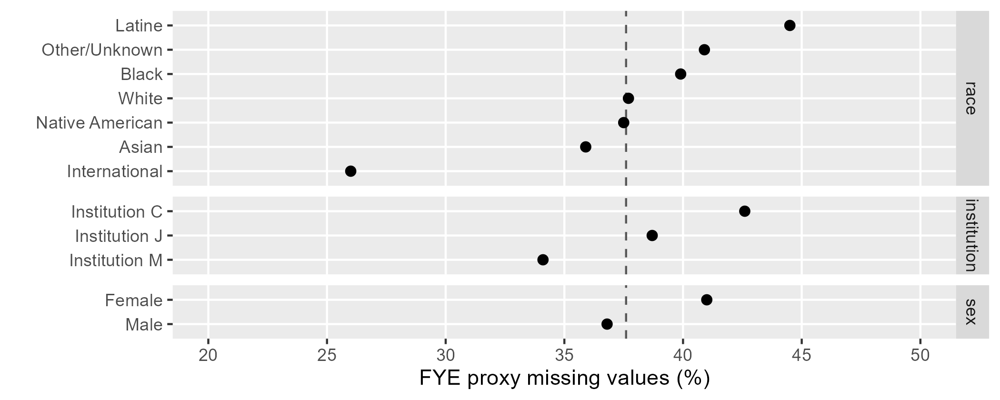

```{r setup}
#| include: false

# code chunks
knitr::opts_chunk$set(
  echo = TRUE,
  message = FALSE,
  warning = FALSE,
  collapse = FALSE,
  comment = "#>",
  error = FALSE
)

# figures
knitr::opts_chunk$set(
  fig.path = "../man/figures/art-070-creating-fye-proxies-",
  fig.width = 6,
  fig.asp = 1 / 1.6,
  out.width = "70%",
  fig.align = "center"
)

# inline numbers
knitr::knit_hooks$set(inline = function(x) {
  if (!is.numeric(x)) {
    x
  } else if (x >= 10000) {
    prettyNum(round(x, 2), big.mark = ",")
  } else {
    prettyNum(round(x, 2))
  }
})
```


Part 1 of 2 parts illustrating how we work with First-Year Engineering (FYE) programs when a count of "starters" is needed. 

1. Creating FYE proxies (this page). Estimating the 6-digit CIP codes of the degree-granting engineering programs that FYE students would have declared in their first term had they not been required to enroll in FYE

2. [Using FYE proxies](art-071-using-fye-proxies.html). Incorporating a set of prepared FYE proxies with other first-term CIP codes when a count of starters in degree-granting engineering programs is required. 


## Preface

At some US institutions, engineering students are required to complete a  First-Year Engineering (FYE) program as a prerequisite for declaring an engineering major. Administratively, degree-granting engineering programs such as Electrical Engineering or Mechanical Engineering treat their incoming post-FYE students as their "starting" cohorts.  However, when computing a metric that requires a count of starters---graduation rate, for example---FYE records must be treated with special care to avoid a miscount. 

To illustrate the potential for miscounting starters, suppose we wish to calculate a Mechanical Engineering (ME) graduation rate. Students starting in ME constitute the starting pool and the fraction of that pool graduating in ME is the graduation rate. 

At FYE institutions, an ME program would typically define their starting pool as the post-FYE cohort entering their program. This may be the best information available, but it invariably undercounts starters by failing to account for FYE students who do not transition (post-FYE) to degree-granting engineering programs---students who may have left the institution or switched to  non-engineering majors. In the absence of the FYE requirement some of these students would have been ME starters. By neglecting these students, the count of ME starters is artificially low resulting in an ME graduation rate that is artificially high. The same is true for every degree-granting engineering discipline in an FYE institution. 

Because of the special nature of FYE programs, we cannot address starter miscounts by grouping FYE students with those admitted with "undecided" or  "unknown" CIP codes---FYE students are neither. They were admitted as Engineering majors (2-digit CIP 14). We simply don't know to which degree-granting program (6-digit CIP) they intended to transition.  
 
Therefore, to avoid miscounting starters at FYE institutions, we have to estimate the 6-digit CIP codes of the degree-granting engineering programs that  FYE students would have declared had they not been required to enroll in FYE. 


## Definitions

FYE

: First-Year Engineering program, a common-first-year curriculum that is a prerequisite for declaring an engineering major at some US institutions. 

migrator

: A student who changes majors. In dealing with FYE records, we are concerned with migrators into or out of Engineering at the 2-digit program level (CIP 14). 

FYE proxy

: The degree-granting engineering program we estimate an FYE student would have declared had they not been required to enroll in FYE. The proxy, a 6-digit CIP code, acts as a substitute for the FYE CIP code as needed. Applies only to students enrolled in FYE in their first term.

multiple imputation

: Method of imputing missing categorical data, in this case, the 6-digit CIP codes of FYE proxy programs. 


## Method

*This section is optional if you are working with the midfielddata practice data and are more interested (at this time) in using a set of proxies than creating a set of proxies. You may skip to [Using FYE proxies](art-071-using-fye-proxies.html).*

Start here if you are working with MIDFIELD research data or if you want to practice the estimation/imputation process using the midfielddata practice data. 

In this section, we apply `prep_fye_mice()` to the `student` and `term` data tables to construct a data frame suitable for imputation using the mice R package. Three outcomes are possible, depending on your goals and available data:

1. Using midfielddata practice data, recreate the `fye_proxy` data set included with midfieldr. This is the example used in this vignette.  

2. Using midfielddata practice data, you can create an alternate set of FYE proxies using a different random number generator seed or using different predictor variables for imputation. The resulting data frame will have the same IDs and number of rows as `fye_proxy`. 

3. Using MIDFIELD research data, constructing your own proxy data set is required. The resulting data frame will have as many rows as your research data has first-term FYE students. 


For a given set of `student` and `term` data, FYE proxies can be created once and written to file to be reused as needed unless the source files change. The procedure has four steps: 

1. Use `prep_fye_mice()` from the midfieldr package to estimate some of the FYE proxy CIPs, treat the remainder as missing values, and structure the data frame for imputation. 

2. Optional. Define a custom set of imputation predictor variables if the defaults (institution, race/ethnicity, and sex) do not meet the needs of your study. 

3. Use `mice()` from the mice package to impute the 6-digit CIP missing values. 

4. Post-processing to limit the results to first-term FYE students only.


If you are writing your own script to follow along, we start with these packages:

```{r}
# Packages
library("midfieldr")
library("midfielddata")
suppressPackageStartupMessages(library("data.table"))
suppressPackageStartupMessages(library("ggplot2"))

# Only if creating your own FYE proxies
library("mice")

# Printing options for data.table
options(
  datatable.print.nrows = 17,
  datatable.print.topn = 5,
  datatable.print.class = TRUE
)
```


## Data

**Importing.** Data tables from midfielddata.

```{r}
# Load data sets from midfielddata
data(student, term)
```

You can view the help pages (and data dictionaries) by running

```{r}
#| eval: false

# Run in Console
? student
? term
```


## `prep_fye_mice()`

This function prepares FYE data for multiple imputation. You can view the help page by running

```{r}
#| eval: false

# Run in Console
? prep_fye_mice
```
 
**Arguments:**

midfield_student

: Data frame of student observations, keyed by student ID. Default is `student`. Required variables are `mcid`, `race`, and `sex`. Use all rows of your source `student` data table. 

midfield_term	

: Data frame of term observations keyed by student ID. Default is `term`.  Required variables are `mcid`, `institution`, `term`, and `cip6`. Use all rows of your source `term` data table. 

fye_codes

: Optional character vector of 6-digit CIP codes assigned to FYE programs.  Default is "140102". 

**Usage.** The following implementations yield identical results. 

```{r}
#| collapse: true

# Required arguments in order and explicitly named
x <- prep_fye_mice(midfield_student = student, midfield_term = term)

# Required arguments in order, but not named
y <- prep_fye_mice(student, term)

# Using the implicit defaults
z <- prep_fye_mice()

# Equality test between the data tables
all.equal(x, y)
all.equal(x, z)
```

The arguments of `prep_fye_mice()` should include all rows of the `student` and `term` data tables to provide as many observations as possible of FYE students. Filters normally applied for measures of program completion, e.g., [data sufficiency](art-010-data-sufficiency.html), unnecessarily restrict the estimation/imputation process by potentially removing observations of FYE students' first post-FYE majors. The only required filter is [degree-seeking](art-020-degree-seeking.html)---which is an inherent property of the `student` data table. 

The function extracts all terms for all FYE students, including migrators, and returns one row per FYE student with columns for institution, race, sex, and proxy CIP code if any. All variables except ID are are factors as required by `mice()`. 

```{r}
# Create the working data frame
fye <- prep_fye_mice(student, term)

# Display the result
fye[]
```

The function identifies the CIP code, if any, of the first post-FYE program in which the student enrolls. This treatment yields a CIP code or NA in the `proxy` column as follows: 

1. The student completes FYE and enrolls in an engineering major. For this outcome, we know that at the student's first opportunity, they enrolled in an engineering program of their choosing. The CIP code of that program is returned by `prep_fye_mice()` as the student's FYE proxy. 

2. The student does not enroll post-FYE in an engineering major. Such students have no further records in the database or migrated to a non-engineering program. For this outcome, the data provide no information regarding what engineering program the student would have declared originally had the institution not required them to enroll in FYE. For these students, `prep_fye_mice()` returns a proxy value of NA. These are the data treated as missing values to be imputed by `mice()`.


## Missing data 

```{r}
#| echo: false
N_ever_fye <- length(unique(fye$mcid))
N_to_impute <- sum(is.na(fye$proxy))
```

We construct the data frame for imputation such that the only missing  values are in the proxy column. Other variables are complete. A race/ethnicity or sex value of "unknown" is treated as an observed value, not missing data. And while no values of ID or institution are unknown or missing in this example, such observations (if they existed) would have to be removed. 

Checking that all variables except `proxy` are complete. 

```{r}
#| collapse: true 

# Number of complete cases on four variables
(N_complete <- sum(complete.cases(fye[, .(mcid, race, sex, institution)])))
```

Number of missing observations in `proxy`.  

```{r}
#| collapse: true 

# Number NAs in proxy
(N_impute <- sum(is.na(fye$proxy)))
```

These missing `proxy` data are caused by a student's decision to migrate to a non-engineering major or to leave the database. At the time of making that decision, the student would not yet have enrolled in a degree-granting engineering major, thus their decision is unlikely to be related to any specific engineering major. 

Hence, that a CIP is missing is unlikely to be related to a specific CIP value---but may be related to other observations such as institution, race/ethnicity, or sex. Missing data of this type are classified as "missing at random" (MAR) which are suitable for multiple imputation and yield unbiased results [@GraceMartin:2012].  

```{r}
#| echo: false
pct_missing <- round(100 * N_impute / N_complete, 0)
```

Lastly, while 5--10 imputations are generally considered adequate for unbiasedness, Bodner [-@Bodner:2008] recommends having as many imputations as the percentage of missing data. As shown here, the overall percentage of missing data is `r pct_missing`%, suggesting we set the number of imputations to 38. 

```{r}
#| collapse: true

# Percent missing proxies
round(100 * N_impute / N_complete, 3)
```

Percent missing data grouped by category are shown in the chart. The vertical dashed line indicates the overall percentage of missing data. 

{width="100%"}

**Data set-aside.** The current `fye` data set with missing proxies is set aside for use in creating the chart. The script for the chart is given in the [Missing data chart] appendix. 

```{r}
# Set aside for the chart
fye_missing_proxy <- copy(fye)
```


## Using `mice()`

The mice package [@vanBuuren+Oudshoorn:2011] implements multiple imputation by chained equations (MICE). MICE is also known as "fully conditional specification" or "sequential regression multiple imputation" and is suitable for categorical variables such as ours [@azur2011]. Our computational procedure follows the approach suggested  by Dhana [-@dhana2017].

**Framework.** Our first use of `mice()` is to examine the imputation framework by calling the function with zero iterations on the `fye` data frame. `mice()` produces a "multiply-imputed data set", an R object of class "mids".

```{r}
# Imputation framework
framework <- mice(fye, maxit = 0)

# Display the results
framework
```

**Imputation methods.** We look more closely at two elements of this framework. The first is the imputation method vector. 

```{r}
# Imputation method
method_vector <- framework[["method"]]

# Display the results
method_vector
```

The "polyreg" imputation method (polytomous logistic regression) is appropriate for  data, like ours, comprising unordered categorical variables. Variable `proxy` is imputed using the polyreg method; the other variables, being predictors, are not imputed, thus their methods are empty.  

Had the method not been correctly assigned, we would assign it as follows, 

```{r}
# Manually assign the variable(s) being imputed
method_vector[c("proxy")] <- "polyreg"

# Manually assign the variable(s) not being imputed
method_vector[c("mcid", "institution", "race", "sex")] <- ""

# Display the results
method_vector
```

**Predictor matrix.** The second element to review is the predictor matrix. A row label identifies the variable being predicted; the columns indicate the predictor variables.  

```{r}
# Imputation predictor matrix
predictor_matrix <- framework[["predictorMatrix"]]

# Display the results
predictor_matrix
```

However, only those variables assigned a method are imputed. In our case, the only variable to be imputed is `proxy`, so the only row of this matrix that gets used is the last row. 

```{r}
# Predictor row for this example
predictor_matrix["proxy", ]
```

The zeros and ones tell us that `proxy` is going to be predicted by institution, race, and sex. 

Had the default setting been incorrect, we can set them manually. Again, note that the bottom row is the only row we need because only the `proxy` variable is being imputed. 

```{r}
# Manually assign zero columns
predictor_matrix[, c("mcid", "proxy")] <- c(0, 0, 0, 0, 0)

# Manually assign predictor columns
predictor_matrix[, c("institution", "race", "sex")] <- c(0, 0, 0, 0, 1)

# Display the result
predictor_matrix
```


## Optional predictors

The default predictors set up by `prep_fye_mice()` are institution (required), race/ethnicity, and sex. If these are acceptable, you can skip to the next section, [Imputing missing values]. 

Predictors can be edited or added before invoking `mice()`. As before, ensure that the only missing values are in the proxy column. Other variables are expected to be complete (no NA values). A value of "unknown" in a predictor column, e.g., race/ethnicity or sex, is an acceptable value, not missing data. Observations with missing or unknown values in the ID or institution columns should be removed.

For example, suppose we wish to replace race/ethnicity and sex with a `people` variable that has four possible values (`Domestic Female`, `Domestic Male`, `International Female`, and `International Male`) where "domestic" means a US citizen; and we want to add a variable that encodes the `year` of a student's first term in FYE.  

**Creating variables.** Remove any unknown observations of race/ethnicity and sex to create the desired `people` variable. 

```{r}
# Data frame to illustrate optional predictors
opt_fye <- copy(fye)

# Factor to character
cols_to_edit <- c("race", "sex")
opt_fye[, (cols_to_edit) := lapply(.SD, as.character), .SDcols = cols_to_edit]

# Filter unknown race and sex
opt_fye <- opt_fye[sex != "Unknown"]
opt_fye <- opt_fye[race != "Other/Unknown"]

# Create origin variable
opt_fye[, origin := fcase(
    race != "International", "Domestic", 
    race == "International", "International", 
    default = NA_character_
)]
opt_fye <- opt_fye[!is.na(origin)]

# Create people variable
opt_fye[, people := paste(origin, sex)]
opt_fye[, people := as.factor(people)]
opt_fye[, c("race", "sex", "origin") := NULL]

# Display result
setcolorder(opt_fye, c("mcid", "people", "institution", "proxy"))
opt_fye[]
```

Check the unique values. 

```{r}
#| collapse: true
# Display unique people
sort(unique(opt_fye$people))
```

**Adding a variable.** Obtain the student's first term in the data set from the `term` data table using a left-outer join. 

```{r}
# Add all term variables by ID
cols_to_join <- term[, .(mcid, term)]
opt_fye <- cols_to_join[opt_fye, on = c("mcid")]

# Filter for first term
setkeyv(opt_fye, c("mcid", "term"))
opt_fye <- opt_fye[, .SD[1], by = c("mcid")]

# Create year variable
opt_fye[, year := substr(term, 1, 4)]
opt_fye[, year := as.factor(year)]
opt_fye[, term := NULL]

# Display result
setcolorder(opt_fye, c("mcid", "people", "institution", "year", "proxy"))
opt_fye[]
```

**Filtering.** Ensure complete cases except in `proxy`. 

```{r}
# Identify complete cases in predictor variables 
rows_we_want <- complete.cases(opt_fye[, .(mcid, people, institution, year)])

# Filter for complete predictors
opt_fye <- opt_fye[rows_we_want]

# Display the result
opt_fye[]
```

**Framework** for optional predictors. 

```{r}
# Imputation framework
opt_framework <- mice(opt_fye, maxit = 0)

# Display the results
opt_framework
```

**Imputation method** for optional predictors. 

```{r}
# Imputation framework
opt_method_vector <- opt_framework[["method"]]

# Display the results
opt_method_vector
```

**Predictor matrix** for optional predictors. 

```{r}
# Imputation predictor matrix
opt_predictor_matrix <- opt_framework[["predictorMatrix"]]

# Display the results
opt_predictor_matrix
```

**Percent missing data** for setting the number of multiple imputations. 

```{r}
N_impute <- sum(is.na(opt_fye$proxy))
N_fye <- nrow(opt_fye)

# Percent missing data
round(100 * N_impute / N_fye, 0)
```


## Imputing missing values

The three essential arguments for `mice()` are the `fye` data frame, the `method_vector`, and the `predictor_matrix`. The number of multiple imputations `m` is set to 38 as discussed in [Missing data]. The default `seed` argument is NULL, but by setting the seed as shown the vignette results are reproducible. Setting `printFlag = TRUE` displays progress in the console. 

**Imputation.** For the practice data, 5 iterations of 38 imputations takes about 3 minutes (depending on your machine). For MIDFIELD research data, however, imputation runs significantly longer.  

```{r}
#| echo: false

# load fye_mids, don't have to repeatedly run mice() 
load(here::here("R", "sysdata.rda"))
```

```{r}
#| eval: false

# Impute missing proxy data
fye_mids <- mice(
  data = fye,
  m = 38, 
  maxit = 5, # default
  method = method_vector,
  predictorMatrix = predictor_matrix,
  seed = 20180624,
  printFlag = TRUE
)
```

```{r}
# output in console with printFlag = TRUE
# >  iter imp variable
# >   1   1  proxy
# >   1   2  proxy
# >   1   3  proxy
# >   1   4  proxy
# >   1   5  proxy
# >   ---
# >   5  34  proxy
# >   5  35  proxy
# >   5  36  proxy
# >   5  37  proxy
# >   5  38  proxy
```

**Extracting the result.** We apply `mice::complete()` to extract the data from the `mids` object. The missing data have been replaced by imputed values. 

```{r}
# Revert to default random number generation
set.seed(NULL)

# Extract data from the mids object
fye <- mice::complete(fye_mids)

# Convert to data.table structure
setDT(fye)

# Display the result
fye <- fye[order(mcid)]
fye[]
```


## Post-processing

**Selecting columns.** To use the result, we need only two columns: IDs and the the predicted starting programs.

```{r}
# Subset the data
fye <- fye[, .(mcid, proxy)]

# Display the result
fye
```

**Recoding.**  We convert the CIP codes from factor to character.

```{r}
# Convert factors
fye[, proxy := as.character(proxy)]

# Display the result
fye
```

**Filtering.** For imputing missing values we used all students ever enrolled in FYE, including migrators. In use, however, the proxies are substitutes for students starting in FYE. Therefore, we filter to retain the proxies of first-term FYE students only. 

```{r}
# Obtain first term of all students in term data
all_start <- term[, .(mcid, term, cip6)]
setorderv(all_start, cols = c("mcid", "term"))
all_start <- all_start[, .SD[1], by = c("mcid")]

# Subset for FYE only
fye_start <- all_start[cip6 == "140102", .(mcid)]
fye_start

# Inner join to retain the FYE starters
fye <- fye_start[fye, on = c("mcid"), nomatch = NULL]

# Display the result
fye
```

```{r}
#| eval: false
#| echo: false

# Run manually if necessary for reproducibility
# Writing internal file sysdata.rda to save fye_mids
# Writing external file fye_proxy

# Internal files
usethis::use_data(
  fye_mids,
  subset_student,
  subset_course,
  subset_term,
  subset_degree,
  internal  = TRUE,
  overwrite = TRUE
)

# External file
fye_proxy <- copy(fye)
usethis::use_data(fye_proxy, overwrite = TRUE)
```


**Confirming results.**  This process is how the built-in data set `fye_proxy` was constructed, using the same random number seed that we used above. To confirm they are identical, 

```{r}
#| collapse: true

# Verify that result matches the built-in data set
all.equal(fye, fye_proxy)
```


*This step concludes the procedure for creating FYE proxy data.*


## Closing

At institutions with First-Year Engineering (FYE) programs, students "starting" in degree-granting engineering majors are under-counted unless care is taken to account for FYE students who do not transition (post-FYE) to degree-granting engineering programs

We address this problem using FYE "proxies"---6-digit CIP codes of the  degree-granting engineering programs we estimate FYE students would have declared had they not been required to enroll in FYE. Estimated values are based on the engineering program in which a student enrolls immediately post-FYE and are otherwise treated a missing data for a multiple imputation. 


## References

<div id="refs"></div>


## Appendix

### Missing data chart

Script for creating the chart of percent missing data grouped by category. 

```{r}
#| fig.asp: 0.6

# New memory location
x <- copy(fye_missing_proxy)

# Convert factors to characters
x <- x[, lapply(.SD, as.character)]

# Overall percentage missing proxies
overall_miss <- 100 * round(nrow(x[is.na(proxy)]) / nrow(x), 3)

# Determine percent missing proxies by category
missing_fraction <- function(DT, cat_level) {
  DT[, group := fcase(
      is.na(proxy), "missing", 
      default = "not_missing"
  )]
  DT <- DT[, .N, by = c("group", "cat_level")]
  DT <- dcast(DT, cat_level ~ group, value.var = "N")
  DT[, pct_miss := 100 * round(missing / (missing + not_missing), 3)]
  DT <- DT[, .(cat_level, pct_miss)]
}


y <- x[, .(cat_level = institution, proxy)]
inst <- missing_fraction(y, cat_level = "institution")
inst[, category := "institution"]

y <- x[, .(cat_level = race, proxy)]
race <- missing_fraction(y, cat_level = "race")
race[, category := "race"]

y <- x[, .(cat_level = sex, proxy)]
sex <- missing_fraction(y, cat_level = "sex")
sex[, category := "sex"]

DT <- rbindlist(list(inst, race, sex))

p <- ggplot(DT, aes(x = pct_miss, y = reorder(cat_level, pct_miss))) +
    geom_vline(xintercept = overall_miss, linetype = 2, color = "gray35") +
    geom_point(size = 2) +
    facet_grid(rows = vars(reorder(category, pct_miss)), 
               as.table = TRUE, 
               scales = "free_y",
               space = "free_y") +
    labs(x = "FYE proxy missing values (%)", y = "") +
    scale_x_continuous(breaks = seq(0, 100, 5), limits = c(20, 50)) +
    theme(panel.grid.minor.x = element_blank())

ggsave(
  filename = "man/figures/art-070-fye-pct-missing.png",
  plot = p,
  width = 7,
  height = 0.4 * 7,
  units = "in"
)
```


### Complete script

The vignette code chunks are collected below in a single, condensed script. 

```{r}
#| eval: false

# Packages
library("midfieldr")
library("midfielddata")
suppressPackageStartupMessages(library("data.table"))
suppressPackageStartupMessages(library("ggplot2"))

# Only if creating your own FYE proxies
library("mice")

# Printing options for data.table
options(
  datatable.print.nrows = 17,
  datatable.print.topn = 5,
  datatable.print.class = TRUE
)

# Creating FYE proxies
data(student, term)
fye <- prep_fye_mice(student, term)

# Percent missing proxy data 
N_complete <- sum(complete.cases(fye[, .(mcid, race, sex, institution)]))
N_impute <- sum(is.na(fye$proxy))
round(100 * N_impute / N_complete, 3)

# Set aside for the chart
fye_missing_proxy <- copy(fye)

# Using mice()
framework <- mice(fye, maxit = 0)

# Method vector
method_vector <- framework[["method"]]
method_vector[c("proxy")] <- "polyreg"
method_vector[c("mcid", "institution", "race", "sex")] <- ""

# Imputation predictor matrix
predictor_matrix <- framework[["predictorMatrix"]]
predictor_matrix[, c("mcid", "proxy")] <- c(0, 0, 0, 0, 0)
predictor_matrix[, c("institution", "race", "sex")] <- c(0, 0, 0, 0, 1)

# Optional predictors
opt_fye <- copy(fye)
cols_to_edit <- c("race", "sex")
opt_fye[, (cols_to_edit) := lapply(.SD, as.character), .SDcols = cols_to_edit]
opt_fye <- opt_fye[sex != "Unknown"]
opt_fye <- opt_fye[race != "Other/Unknown"]
opt_fye[, origin := fcase(
    race != "International", "Domestic", 
    race == "International", "International", 
    default = NA_character_
)]
opt_fye <- opt_fye[!is.na(origin)]
opt_fye[, people := paste(origin, sex)]
opt_fye[, people := as.factor(people)]
opt_fye[, c("race", "sex", "origin") := NULL]

# Optional predictors add a variable
cols_to_join <- term[, .(mcid, term)]
opt_fye <- cols_to_join[opt_fye, on = c("mcid")]
setkeyv(opt_fye, c("mcid", "term"))
opt_fye <- opt_fye[, .SD[1], by = c("mcid")]
opt_fye[, year := substr(term, 1, 4)]
opt_fye[, year := as.factor(year)]
opt_fye[, term := NULL]
setcolorder(opt_fye, c("mcid", "people", "institution", "year", "proxy"))

# Optional predictors filter complete cases
rows_we_want <- complete.cases(opt_fye[, .(mcid, people, institution, year)])
opt_fye <- opt_fye[rows_we_want]

# Optional predictors framework and method
opt_framework <- mice(opt_fye, maxit = 0)
opt_method_vector <- opt_framework[["method"]]
opt_predictor_matrix <- opt_framework[["predictorMatrix"]]

# Optional predictors percent missing data
N_impute <- sum(is.na(opt_fye$proxy))
N_fye <- nrow(opt_fye)
round(100 * N_impute / N_fye, 0)

# Imputing missing values
fye_mids <- mice(
  data = fye,
  m = 38, 
  maxit = 5, # default
  method = method_vector,
  predictorMatrix = predictor_matrix,
  seed = 20180624,
  printFlag = TRUE
)

# Extract the result
set.seed(NULL)
fye <- mice::complete(fye_mids)
setDT(fye)
fye <- fye[order(mcid)]

# Post-processing
fye <- fye[, .(mcid, proxy)]
fye[, proxy := as.character(proxy)]
all_start <- term[, .(mcid, term, cip6)]
setorderv(all_start, cols = c("mcid", "term"))
all_start <- all_start[, .SD[1], by = c("mcid")]
fye_start <- all_start[cip6 == "140102", .(mcid)]
fye <- fye_start[fye, on = c("mcid"), nomatch = NULL]

# Confirming results
all.equal(fye, fye_proxy)
```

```{r}
#| echo: false
# to change the CSS file for block quotes
# per https://github.com/rstudio/rmarkdown/issues/732
knitr::opts_chunk$set(echo = FALSE)
```

```{css}
blockquote {
    padding: 10px 20px;
    margin: 0 0 20px;
    border-left: 0px
}
```
