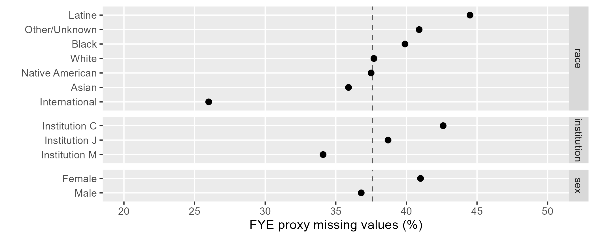

```{r setup}
#| include: false

# code chunks
knitr::opts_chunk$set(
  echo = TRUE,
  message = FALSE,
  warning = FALSE,
  collapse = FALSE,
  comment = "#>",
  error = FALSE
)

# figures
knitr::opts_chunk$set(
  fig.path = "../man/figures/art-070-fye-proxies-",
  fig.width = 6,
  fig.asp = 1 / 1.6,
  out.width = "70%",
  fig.align = "center"
)

# inline numbers
knitr::knit_hooks$set(inline = function(x) {
  if (!is.numeric(x)) {
    x
  } else if (x >= 10000) {
    prettyNum(round(x, 2), big.mark = ",")
  } else {
    prettyNum(round(x, 2))
  }
})

# accented text
accent <- function (text_string){
    kableExtra::text_spec(text_string, color = "#b35806", bold = TRUE)
}
```

A treatment of First-Year Engineering (FYE) programs when a count of starters is required. We estimate the 6-digit CIP codes of the degree-granting engineering programs  FYE students would have declared had they not been required to enroll in FYE.

Users of midfielddata practice data are not required to reproduce this vignette---the results are included with midfieldr in the `fye_proxy` data set.

You can skip this vignette if your study includes no FYE-style Engineering programs. 


## Potential for starter miscounts

At some US institutions, engineering students are required to complete a  First-Year Engineering (FYE) program as a prerequisite for declaring an engineering major. Administratively, degree-granting engineering programs such as Electrical Engineering or Mechanical Engineering treat their incoming post-FYE students as their "starting" cohorts.  However, when computing a metric such as graduation rate that requires a count of starters, FYE records must be treated with special care to avoid a miscount. 

To illustrate the potential for miscounting starters, suppose we wish to calculate a Mechanical Engineering (ME) graduation rate. Students starting in ME constitute the starting pool and the fraction of that pool graduating in ME is the graduation rate. 

At FYE institutions, an ME program would typically define their starting pool as the post-FYE cohort entering their program. This may be the best information available, but it invariably undercounts starters by failing to account for FYE students who do not transition (post-FYE) to degree-granting engineering programs---students who may have left the institution or switched to  non-engineering majors. In the absence of the FYE requirement some of these students would have been ME starters. By neglecting these students, the count of ME starters is artificially low resulting in an ME graduation rate that is artificially high. The same is true for every degree-granting engineering major  in an FYE institution. 

Because of the special nature of FYE programs, we cannot address starter miscounts by grouping FYE students with those admitted with "undecided" or  "unknown" CIP codes---FYE students are neither. They were admitted as Engineering majors (2-digit CIP 14). We simply don't know to which degree-granting program (6-digit CIP) they intended to transition.  
 
Therefore, to avoid miscounting starters at FYE institutions, we estimate the 6-digit CIP codes of the degree-granting engineering programs that  FYE students would have declared had they not been required to enroll in FYE. 


## Definitions

FYE

: First-Year Engineering program, a common-first-year curriculum that is a prerequisite for declaring an engineering major at some US institutions. Denoted by its own CIP code, FYE is not a degree-granting program. 

FYE proxy

: Our estimate of the degree-granting engineering program in which an FYE student would have enrolled had they not been required to enroll in FYE. The proxy, a 6-digit CIP code, denotes the program of which the FYE student can be considered a starter.

starter

: A degree-seeking student in their initial term enrolled in a degree-granting program. 

migrator

: A student who leaves one program to enroll in another. Also called *switchers.*

multiple imputation

: Method of imputing missing categorical data, in this case, imputing the FYE proxy 6-digit CIP codes.


## Method

We apply `prep_fye_mice()` to the `student` and `term` source files to construct a data frame suitable for imputation using the mice R package. The procedure has four steps: 

1. Use `prep_fye_mice()` from the midfieldr package to estimate some of the FYE proxy CIPs, treat the remainder as missing values, and structure the data frame for imputation. 

2. Optional. If the default predictor variables (institution, race/ethnicity, and sex) do not meet the needs of your study, you can define your own. 

3. Use `mice()` from the mice package to impute the 6-digit CIP missing values. 

4. Post-processing to limit the results to first-term FYE students only.


Three outcomes are possible, depending on your goals and available data:

- Using midfielddata practice data, recreate the `fye_proxy` data set included with midfieldr---as we do in this vignette. 

- Using midfielddata practice data, create an alternate set of FYE proxies using a different random number generator seed or using different predictor variables for imputation. The resulting data frame will have the same IDs and number of rows as `fye_proxy` but different ID-proxy pairings.  

- Using MIDFIELD research data, construct your own FYE proxies. The resulting data frame will have as many rows as your research data has first-term FYE students. 

For a given set of source files, FYE proxies need be created only once and written to file. The result can be used as needed unless the source files change. 

This vignette in the MIDFIELD workflow. 

1. Planning  
1. Initial processing  
1. Blocs  
    - Ever-enrolled in programs  
    - Graduates of programs  
    - Completion status  
    - `r accent("FYE proxies")`  
    - Starters in programs  
1. Grouping variables  
1. Metrics  
1. Results  


*Caveat:* The Student Unit Records included with midfieldr and midfielddata are practice data, not research data, suitable for practice working with SURs but not for drawing inferences about program attributes or student experiences.


## Load practice data

*Start a script*. If you are writing your own script to follow along, we use these packages in this vignette:

```{r}
# FYE proxies
# midfieldr vignette

# Packages
library("midfieldr")
library("midfielddata")
suppressPackageStartupMessages(library("data.table"))
suppressPackageStartupMessages(library("ggplot2"))
library("mice")

# Printing options for data.table
options(
  datatable.print.nrows = 17,
  datatable.print.topn = 5,
  datatable.print.class = TRUE
)
```

*Load source data.* MIDFIELD practice data tables as described in [Getting started](art-000-getting-started.html). 

```{r}
# Load practice data sets
data(student, term, package = "midfielddata")
```

*Optional.* A step to reduce the number of columns in the source data table(s) to the minimum number required by midfieldr functions. Particularly useful in interactive sessions when viewing the data tables at various stages of an analysis. 

```{r}
#| collapse: true

# Select required midfieldr variables
student <- select_required(student)
term <- select_required(term)

# View top few rows of the result
head(student, n = 3L)
head(term, n = 3L)
```


*Prepared data.* `study_programs`, included with midfieldr, contains the CIP codes and custom program names for the case study as developed in [Programs](art-030-programs.html#case-study). 

```{r}
#| collapse: true

# Display prepared data
study_programs
```


## `prep_fye_mice()`

The purpose of `prep_fye_mice()` is preparing a data frame for the mice R package.  Operates on the complete, unfiltered `student` and `term` source data to create a data frame with three predictor variables and an FYE proxy variable. The values in `proxy` are determined by a student's first post-FYE program code, as follows:   

1. *Post-FYE: Engineering.* The student completes FYE and enrolls in an engineering major. For this outcome, we know that at the student's first opportunity, they enrolled in an engineering major of their choosing. The CIP code of that program is returned as the student's FYE proxy. 

2. *Post-FYE: Non-engineering.* The student migrates to a non-engineering major or has no post-FYE records in the database. The data provide no indication of the student's preferred degree-granting engineering major. Thus their FYE proxy value is returned as NA, to be treated as missing data. 


*Arguments*

- **`midfield_student`** &nbsp; Data frame of student observations, keyed by student ID. Default is `student`. Required variables are `mcid`, `race`, and `sex`. Use all rows of your source `student` data table. 

- **`midfield_term`** &nbsp; Data frame of term observations keyed by student ID. Default is `term`.  Required variables are `mcid`, `institution`, `term`, and `cip6`. Use all rows of your source `term` data table. 

- **`fye_codes`** &nbsp; Optional character vector of 6-digit CIP codes assigned to FYE programs. Default is "140102". Argument to be used by name.   


*Implicit arguments.* &nbsp; The following implementations yield identical results. 

```{r}
#| collapse: true

# Required arguments in order and explicitly named
x <- prep_fye_mice(midfield_student = student, midfield_term = term)

# Required arguments in order, but not named
y <- prep_fye_mice(student, term)

# Using the implicit defaults
z <- prep_fye_mice()

# Equality test between the data tables
all.equal(x, y)
all.equal(x, z)
```


*Output.* &nbsp; The function returns one row per FYE student keyed by student ID. As required by `mice()`, all variables except ID are factors. 

- `mcid` (character)
- `race` (factor) 
- `sex` (factor)
- `institution` (factor)
- `proxy` (factor) 6-digit CIP code or NA

```{r}
# Working data frame
DT <- prep_fye_mice(student, term)

# Display the result
DT[]
```


## Missing data 

```{r}
#| echo: false
N_ever_fye <- length(unique(DT$mcid))
N_to_impute <- sum(is.na(DT$proxy))
```

The output of `prep_fye_mive()` should contain missing values in the proxy column only. Other variables are complete. A race/ethnicity or sex value of "unknown" is treated as an observed value, not missing data. And while no values of ID or institution are unknown or missing in this example, such observations (if they existed) would have to be removed. 

Checking that all variables except `proxy` are complete. 

```{r}
#| collapse: true 

# Number of unique IDs
(N_mcid <- length(unique(DT$mcid)))

# Number of complete cases on four variables
(N_complete <- sum(complete.cases(DT[, .(mcid, race, sex, institution)])))

# Confirm equality
all.equal(N_mcid, N_complete)
```

Number of missing observations in `proxy`.  

```{r}
#| collapse: true 

# Number NAs in proxy
(N_impute <- sum(is.na(DT$proxy)))
```

*Missing at random (MAR).* These missing `proxy` data are caused by a student's decision to migrate to a non-engineering major or to leave the database. At the time of making that decision, the FYE student would not yet have enrolled in a degree-granting engineering major, thus their decision is unlikely to be related to any specific engineering major. 

That a CIP is missing, therefore, is unlikely to be related to a specific CIP value---but may be related to other observations such as institution, race/ethnicity, or sex. Missing data of this type are classified as "missing at random" (MAR) which are suitable for multiple imputation and yield unbiased results [@GraceMartin:2012].  

```{r}
#| echo: false
pct_missing <- round(100 * N_impute / N_complete, 0)
```

*Multiple imputation.* Lastly, while 5--10 imputations are generally considered adequate for unbiasedness, Bodner [-@Bodner:2008] recommends having as many imputations as the percentage of missing data. As shown here, the overall percentage of missing data is `r pct_missing`%, suggesting we set the number of imputations to 38. 

```{r}
#| collapse: true

# Percent missing proxies
round(100 * N_impute / N_complete, 3)
```

*Chart.* Percent missing data by category is shown in the chart. (The script, given in the [Chart script] appendix, uses a copy of `DT` that we set aside here.)

```{r}
# Set aside for the chart
NA_proxies <- copy(DT)
```

The vertical dashed line indicates the `r pct_missing`% percent missing data overall. 

{width="100%"}


## Setting up `mice()`

The mice package [@vanBuuren+Oudshoorn:2011] implements multiple imputation by chained equations (MICE). MICE is also known as "fully conditional specification" or "sequential regression multiple imputation" and is suitable for categorical variables such as ours [@azur2011]. Our computational procedure follows the approach suggested  by Dhana [-@dhana2017].

### Standard predictors

*Framework.* Our first use of `mice()` is to examine the imputation framework by calling the function with zero iterations on the `DT` data frame. `mice()` produces a "multiply-imputed data set", an R object of class "mids".

```{r}
# Imputation framework
framework <- mice(DT, maxit = 0)

# Display the results
framework
```

*Imputation methods.* We look more closely at two elements of this framework. The first is the imputation method vector. 

```{r}
# Imputation method
method_vector <- framework[["method"]]

# Display the results
method_vector
```

The "polyreg" imputation method (polytomous logistic regression) is appropriate for  data, like ours, comprising unordered categorical variables. Variable `proxy` is imputed using the polyreg method; the other variables, being predictors, are not imputed, thus their methods are empty.  

Had the method not been correctly assigned, we would assign it as follows, 

```{r}
# Manually assign the variable(s) being imputed
method_vector[c("proxy")] <- "polyreg"

# Manually assign the variable(s) not being imputed
method_vector[c("mcid", "institution", "race", "sex")] <- ""

# Display the results
method_vector
```

*Predictor matrix.* The second element to review is the predictor matrix. A row label identifies the variable being predicted; the columns indicate the predictor variables.  

```{r}
# Imputation predictor matrix
predictor_matrix <- framework[["predictorMatrix"]]

# Display the results
predictor_matrix
```

However, only those variables assigned a method are imputed. In our case, the only variable to be imputed is `proxy`, so the only row of this matrix that gets used is the last row. 

```{r}
# Predictor row for this example
predictor_matrix["proxy", ]
```

The zeros and ones tell us that `proxy` is going to be predicted by institution, race, and sex. 

Had the default setting been incorrect, we can set them manually. Again, note that the bottom row is the only row we need because only the `proxy` variable is being imputed. 

```{r}
# Manually assign zero columns
predictor_matrix[, c("mcid", "proxy")] <- c(0, 0, 0, 0, 0)

# Manually assign predictor columns
predictor_matrix[, c("institution", "race", "sex")] <- c(0, 0, 0, 0, 1)

# Display the result
predictor_matrix
```


### Optional predictors

The default predictors set up by `prep_fye_mice()` are institution (required), race/ethnicity, and sex. If these are acceptable, you can skip to the next section, [Imputing missing values]. 

Predictors can be edited or added before invoking `mice()`. As before, ensure that the only missing values are in the proxy column. Other variables are expected to be complete (no NA values). A value of "unknown" in a predictor column, e.g., race/ethnicity or sex, is an acceptable value, not missing data. Observations with missing or unknown values in the ID or institution columns should be removed.

For example, suppose we wish to replace race/ethnicity and sex with a `people` variable that has four possible values (`Domestic Female`, `Domestic Male`, `International Female`, and `International Male`) where "domestic" means a US citizen; and we want to add a variable that encodes the `year` of a student's first term in FYE.  

*Creating variables.* Remove any unknown observations of race/ethnicity and sex to create the desired `people` variable. 

```{r}
# Data frame to illustrate optional predictors
opt_DT <- copy(DT)

# Factor to character
cols_to_edit <- c("race", "sex")
opt_DT[, (cols_to_edit) := lapply(.SD, as.character), .SDcols = cols_to_edit]

# Filter unknown race and sex
opt_DT <- opt_DT[sex != "Unknown"]
opt_DT <- opt_DT[race != "Other/Unknown"]

# Create origin variable
opt_DT[, origin := fcase(
    race != "International", "Domestic", 
    race == "International", "International", 
    default = NA_character_
)]
opt_DT <- opt_DT[!is.na(origin)]

# Create people variable
opt_DT[, people := paste(origin, sex)]
opt_DT[, people := as.factor(people)]
opt_DT[, c("race", "sex", "origin") := NULL]

# Display result
setcolorder(opt_DT, c("mcid", "people", "institution", "proxy"))
opt_DT[]
```

Check the unique values. 

```{r}
#| collapse: true
# Display unique people
sort(unique(opt_DT$people))
```

*Adding a variable.* Obtain the student's first term in the data set from the `term` data table using a left-outer join. 

```{r}
# Add all term variables by ID
cols_to_join <- term[, .(mcid, term)]
opt_DT <- cols_to_join[opt_DT, on = c("mcid")]

# Filter for first term
setkeyv(opt_DT, c("mcid", "term"))
opt_DT <- opt_DT[, .SD[1], by = c("mcid")]

# Create year variable
opt_DT[, year := substr(term, 1, 4)]
opt_DT[, year := as.factor(year)]
opt_DT[, term := NULL]

# Display result
setcolorder(opt_DT, c("mcid", "people", "institution", "year", "proxy"))
opt_DT[]
```

*Filtering.* Ensure complete cases except in `proxy`. 

```{r}
# Identify complete cases in predictor variables 
rows_we_want <- complete.cases(opt_DT[, .(mcid, people, institution, year)])

# Filter for complete predictors
opt_DT <- opt_DT[rows_we_want]

# Display the result
opt_DT[]
```

*Framework* for optional predictors. 

```{r}
# Imputation framework
opt_framework <- mice(opt_DT, maxit = 0)

# Display the results
opt_framework
```

*Imputation method* for optional predictors. 

```{r}
# Imputation framework
opt_method_vector <- opt_framework[["method"]]

# Display the results
opt_method_vector
```

*Predictor matrix* for optional predictors. 

```{r}
# Imputation predictor matrix
opt_predictor_matrix <- opt_framework[["predictorMatrix"]]

# Display the results
opt_predictor_matrix
```

*Percent missing data* for setting the number of multiple imputations. 

```{r}
N_impute <- sum(is.na(opt_DT$proxy))
N_fye <- nrow(opt_DT)

# Percent missing data
round(100 * N_impute / N_fye, 0)
```


## Imputing missing values

The three essential arguments for `mice()` are the `DT` data frame, the `method_vector`, and the `predictor_matrix`. The number of multiple imputations `m` is set to `r pct_missing` as discussed in [Missing data]. The default `seed` argument is NULL, but by setting the seed as shown the vignette results are reproducible. Setting `printFlag = TRUE` displays progress in the console. 

For the practice data, 5 iterations of `r pct_missing`  imputations takes about 3 minutes (depending on your machine). For MIDFIELD research data, however, imputation runs significantly longer.  

```{r}
#| echo: false

# load DT_mids, don't have to repeatedly run mice() 
load(here::here("R", "sysdata.rda"))
```

```{r}
#| eval: false

# Impute missing proxy data
DT_mids <- mice(
  data = DT,
  m = 38, 
  maxit = 5, # default
  method = method_vector,
  predictorMatrix = predictor_matrix,
  seed = 20180624,
  printFlag = TRUE
)
```

```{r}
# output in console with printFlag = TRUE
# >  iter imp variable
# >   1   1  proxy
# >   1   2  proxy
# >   1   3  proxy
# >   1   4  proxy
# >   1   5  proxy
# >   ---
# >   5  34  proxy
# >   5  35  proxy
# >   5  36  proxy
# >   5  37  proxy
# >   5  38  proxy
```


## Post-processing

*Extracting the result.* We apply `mice::complete()` to extract the data from the `mids` object. The missing data have been replaced by imputed values. 

```{r}
# Revert to default random number generation
set.seed(NULL)

# Extract data from the mids object
DT <- mice::complete(DT_mids)

# Convert to data.table structure
setDT(DT)

# Display the result
DT <- DT[order(mcid)]
DT[]
```

*Selecting columns.* To use the result, we need only two columns: IDs and the the predicted starting programs.

```{r}
# Subset the data
DT <- DT[, .(mcid, proxy)]

# Display the result
DT
```

*Recoding.*  We convert the CIP codes from factor to character.

```{r}
# Convert factors
DT[, proxy := as.character(proxy)]

# Display the result
DT[]
```

*Filtering.* Proxies are substitutes for students *starting* in FYE. Thus we filter to remove migrators, retaining the proxies of first-term FYE students only. 

```{r}
# Order term data by ID and term
ordered_term <- term[, .(mcid, term, cip6)]
setorderv(ordered_term, cols = c("mcid", "term"))

# Obtain first term of all students
first_term <- ordered_term[, .SD[1], by = c("mcid")]

# Reduce to first term in FYE
first_term_fye_mcid <- first_term[cip6 == "140102", .(mcid)]

# Inner join to remove migrators from working data frame
DT <- first_term_fye_mcid[DT, on = c("mcid"), nomatch = NULL]

# Display the result
DT[]
```

```{r}
#| eval: false
#| echo: false

# Run manually if necessary for reproducibility
# Writing internal file sysdata.rda to save DT_mids
# Writing external file fye_proxy

# Internal files
usethis::use_data(
  DT_mids,
  subset_student,
  subset_course,
  subset_term,
  subset_degree,
  internal  = TRUE,
  overwrite = TRUE
)

# External file
fye_proxy <- copy(DT)
usethis::use_data(fye_proxy, overwrite = TRUE)
```

*Verify built-in data.* To avoid deriving this data frame each time it is needed in other vignettes, the same information is provided in the `fye_proxy` data frame included with midfieldr. Here we verify that the two data frames are identical. 

```{r}
#| collapse: true

# Verify built-in data
all.equal(DT, fye_proxy)
```

*This step concludes the procedure for creating FYE proxy data.*


## Assessing FYE proxies

### Credibility

Here we summarize the FYE proxy data set to see how many students our algorithm assigned to which engineering majors. Start by extracting the unique set of CIP codes from the proxy data set. 

```{r}
# Identify unique CIP codes in the proxy data
proxy_cips <- sort(unique(fye_proxy$proxy))

# Display the results
proxy_cips
```

Obtain the program names from the `cip` data set (provided with midfieldr). We use the 4-digit names that in engineering generally represent  department-level programs. 

```{r}
# Obtain the 4-digit program names corresponding to these codes
proxy_program_names <- filter_search(cip, keep_text = proxy_cips)
proxy_program_names <- proxy_program_names[, .(cip6, program = cip4name)]
proxy_program_names[]
```

Join these names to the proxy data set, summarize by program, and order the rows by descending N.  

```{r}
# Join these program names to the proxy data
proxy_programs <- proxy_program_names[fye_proxy[, .(cip6 = proxy)], .(program), on = c("cip6")]

# Count by program and order rows in descending magnitude
proxy_programs <- proxy_programs[, .N, by = c("program")]
setorderv(proxy_programs, order = -1, cols = c("N"))

# Display the result
proxy_programs[]
```

For comparison, the National Science Foundation (NSF) reports that in 2012, the top seven US engineering majors ranked by enrollment were [@NSF:2014]: 

- Mechanical
- Electrical
- Civil
- Chemical
- Industrial
- Aerospace
- Materials 

The NSF data table does not break out Computer Engineering as a separate observation---if we can assume that Computer Engineering is combined with  Electrical Engineering (a practice followed at many Engineering colleges), we obtain the following programs in order of enrollment, 

```{r}
# Combine Electrical and Computer Engineering
new_row <- data.table(
  program = "Electrical/Computer Engineering",
  N = sum(proxy_programs[program %ilike% "Electrical|Computer", N])
)

# Drop the separate Electrical and Computer rows
proxy_programs <- proxy_programs[!program %ilike% "Electrical|Computer"]

# Bind the new row and order
proxy_programs <- rbindlist(list(proxy_programs, new_row))
setorderv(proxy_programs, c("N"), -1)
```

Display the top 7 programs from the full set of FYE proxies (not limited to the case study), listed in order of decreasing *N*. 

```{r}
#| echo: false

proxy_programs[1:7] |>
  kableExtra::kbl(align = "lr", caption = "Table 1: Top seven FYE proxies ranked by the number of students assigned to major.") |>
  kableExtra::kable_paper(lightable_options = "basic", full_width = TRUE) |>
  kableExtra::row_spec(0, background = "#c7eae5") |>
  # kableExtra::column_spec(1, monospace = TRUE) |>
  kableExtra::column_spec(1:2, color = "black", background = "white")
```

The NSF results are for a single year while the practice data used in our analysis span 30 years (1987--2016), so some differences are to be expected. Nevertheless, this listing matches the top six programs in the NSF list in nearly the same order (rows 5 and 6 have swapped places). 

We conclude that the imputation is credible at least to the extent that the ranking of the majors is consistent with expectations.


### Quantifying potential miscounts

The main goal of estimating FYE proxies is to prevent starter miscounts. Here, we assess the potential for miscounts if FYE records are not treated as recommended. 

We start with the `first_term` data frame created earlier (in [Post-processing]) containing the initial term information of all students in the practice data. 

```{r}
#| collapse: true

# First term of all students
first_term[]
```

Identify starters, including FYE proxies, in the four case study programs. (This procedure is more fully developed in the [Starters](art-080-starters.html) vignette.)

```{r}
# Join proxies by ID (left-outer join) to first-term data
DT <- fye_proxy[first_term, .(mcid, cip6, proxy), on = c("mcid")]

# Distinguish FYE from direct matriculants
DT[, matric := fcase(
    is.na(proxy), "direct",
    !is.na(proxy), "fye"
)]

# Create start variable
DT[, start := fcase(
 matric == "fye", proxy, 
 matric == "direct", cip6
)]

# Filter to retain case study program starters
join_labels <- copy(study_programs)
setnames(join_labels, old = "cip6", new = "start")
DT <- join_labels[DT, on = c("start")]
DT <- DT[!is.na(program)]

# Display result
DT[order(matric, start)]
```

This data frame contains all direct-matriculation starters in the case study programs plus the FYE students with one of these programs as their estimated proxy. 

Grouping by program and type of matriculation, we can determine the FYE percentage of all starters. 

```{r}
# Summarize
DT <- DT[, .N, by = c("matric", "program")]

# Transform to row-record form
DT <- dcast(DT, program ~ matric, value.var = "N")

# Compute FYE as fraction of total
DT[, N_starters := direct + fye]
DT[, fye_pct := round(100 * fye / N_starters, 1)]

# Display result
DT[]
```

The results indicate (for the case study data) a potential under-count of 23% to 35% if FYE proxies are excluded when counting starters.


## Closing

We estimated the 6-digit CIP codes of the degree-granting engineering programs FYE students would have declared had they not been required to enroll in FYE. We find the estimates credible. For this case study, the potential under-count if FYE students are excluded from a count of starters is between 23--35%. 


## References

<div id="refs"></div>


## Appendix

### Complete script

The vignette code chunks are collected below in a single, condensed script. 

```{r}
#| eval: false

# Packages
library("midfieldr")
library("midfielddata")
suppressPackageStartupMessages(library("data.table"))
suppressPackageStartupMessages(library("ggplot2"))
library("mice")

# Printing options for data.table
options(
  datatable.print.nrows = 17,
  datatable.print.topn = 5,
  datatable.print.class = TRUE
)

# Load data
data(student, term, package = "midfielddata")

# Working data frame
DT <- prep_fye_mice(student, term)

# Missing data
N_mcid <- length(unique(DT$mcid))
N_complete <- sum(complete.cases(DT[, .(mcid, race, sex, institution)]))
all.equal(N_mcid, N_complete)
N_impute <- sum(is.na(DT$proxy))
round(100 * N_impute / N_complete, 3)
NA_proxies <- copy(DT)

# Using mice()
framework <- mice(DT, maxit = 0)

method_vector <- framework[["method"]]
method_vector[c("proxy")] <- "polyreg"
method_vector[c("mcid", "institution", "race", "sex")] <- ""

predictor_matrix <- framework[["predictorMatrix"]]
predictor_matrix[, c("mcid", "proxy")] <- c(0, 0, 0, 0, 0)
predictor_matrix[, c("institution", "race", "sex")] <- c(0, 0, 0, 0, 1)

# Optional predictors
opt_DT <- copy(DT)
cols_to_edit <- c("race", "sex")
opt_DT[, (cols_to_edit) := lapply(.SD, as.character), .SDcols = cols_to_edit]

opt_DT <- opt_DT[sex != "Unknown"]
opt_DT <- opt_DT[race != "Other/Unknown"]
opt_DT[, origin := fcase(
    race != "International", "Domestic", 
    race == "International", "International", 
    default = NA_character_
)]
opt_DT <- opt_DT[!is.na(origin)]

opt_DT[, people := paste(origin, sex)]
opt_DT[, people := as.factor(people)]
opt_DT[, c("race", "sex", "origin") := NULL]
setcolorder(opt_DT, c("mcid", "people", "institution", "proxy"))

sort(unique(opt_DT$people))

cols_to_join <- term[, .(mcid, term)]
opt_DT <- cols_to_join[opt_DT, on = c("mcid")]

setkeyv(opt_DT, c("mcid", "term"))
opt_DT <- opt_DT[, .SD[1], by = c("mcid")]

opt_DT[, year := substr(term, 1, 4)]
opt_DT[, year := as.factor(year)]
opt_DT[, term := NULL]
setcolorder(opt_DT, c("mcid", "people", "institution", "year", "proxy"))

rows_we_want <- complete.cases(opt_DT[, .(mcid, people, institution, year)])
opt_DT <- opt_DT[rows_we_want]

opt_framework <- mice(opt_DT, maxit = 0)
opt_method_vector <- opt_framework[["method"]]
opt_predictor_matrix <- opt_framework[["predictorMatrix"]]

N_impute <- sum(is.na(opt_DT$proxy))
N_fye <- nrow(opt_DT)
round(100 * N_impute / N_fye, 0)

# Imputing missing values
DT_mids <- mice(
  data = DT,
  m = 38,
  maxit = 5, # default
  method = method_vector,
  predictorMatrix = predictor_matrix,
  seed = 20180624,
  printFlag = TRUE
)

# Post-processing
set.seed(NULL)
DT <- mice::complete(DT_mids)
setDT(DT)
DT <- DT[order(mcid)]
DT <- DT[, .(mcid, proxy)]
DT[, proxy := as.character(proxy)]
ordered_term <- term[, .(mcid, term, cip6)]
setorderv(ordered_term, cols = c("mcid", "term"))

first_term <- ordered_term[, .SD[1], by = c("mcid")]
first_term_fye_mcid <- first_term[cip6 == "140102", .(mcid)]
DT <- first_term_fye_mcid[DT, on = c("mcid"), nomatch = NULL]

all.equal(DT, fye_proxy)

# Credibility
proxy_cips <- sort(unique(fye_proxy$proxy))
proxy_program_names <- filter_search(cip, keep_text = proxy_cips)
proxy_program_names <- proxy_program_names[, .(cip6, program = cip4name)]
proxy_programs <- proxy_program_names[fye_proxy[, .(cip6 = proxy)], .(program), on = c("cip6")]
proxy_programs <- proxy_programs[, .N, by = c("program")]
setorderv(proxy_programs, order = -1, cols = c("N"))
new_row <- data.table(
  program = "Electrical/Computer Engineering",
  N = sum(proxy_programs[program %ilike% "Electrical|Computer", N])
)
proxy_programs <- proxy_programs[!program %ilike% "Electrical|Computer"]
proxy_programs <- rbindlist(list(proxy_programs, new_row))
setorderv(proxy_programs, c("N"), -1)
proxy_programs[1:7]

# Quantifying potential miscounts
DT <- fye_proxy[first_term, .(mcid, cip6, proxy), on = c("mcid")]
DT[, matric := fcase(
    is.na(proxy), "direct",
    !is.na(proxy), "fye"
)]

DT[, start := fcase(
 matric == "fye", proxy, 
 matric == "direct", cip6
)]

join_labels <- copy(study_programs)
setnames(join_labels, old = "cip6", new = "start")
DT <- join_labels[DT, on = c("start")]
DT <- DT[!is.na(program)]

DT <- DT[, .N, by = c("matric", "program")]
DT <- dcast(DT, program ~ matric, value.var = "N")
DT[, N_starters := direct + fye]
DT[, fye_pct := round(100 * fye / N_starters, 1)]
```

### Chart script

Script for creating the chart of percent missing data grouped by category. 

```{r}
#| eval: false
#| fig.asp: 0.6

# New memory location
x <- copy(NA_proxies)

# Convert factors to characters
x <- x[, lapply(.SD, as.character)]

# Overall percentage missing proxies
overall_miss <- 100 * round(nrow(x[is.na(proxy)]) / nrow(x), 3)

# Function for determining percent missing proxies by category
missing_fraction <- function(DT, cat_level) {
  DT[, group := fcase(
      is.na(proxy), "missing", 
      default = "not_missing"
  )]
  DT <- DT[, .N, by = c("group", "cat_level")]
  DT <- dcast(DT, cat_level ~ group, value.var = "N")
  DT[, pct_miss := 100 * round(missing / (missing + not_missing), 3)]
  DT <- DT[, .(cat_level, pct_miss)]
}

# Apply to institution category
y <- x[, .(cat_level = institution, proxy)]
inst <- missing_fraction(y, cat_level = "institution")
inst[, category := "institution"]

# Apply to race/ethnicity category
y <- x[, .(cat_level = race, proxy)]
race <- missing_fraction(y, cat_level = "race")
race[, category := "race"]

# Apply to sex category
y <- x[, .(cat_level = sex, proxy)]
sex <- missing_fraction(y, cat_level = "sex")
sex[, category := "sex"]

# Gather results and plot
DT <- rbindlist(list(inst, race, sex))
p <- ggplot(DT, aes(x = pct_miss, y = reorder(cat_level, pct_miss))) +
    geom_vline(xintercept = overall_miss, linetype = 2, color = "gray35") +
    geom_point(size = 2) +
    facet_grid(rows = vars(reorder(category, pct_miss)), 
               as.table = TRUE, 
               scales = "free_y",
               space = "free_y") +
    labs(x = "FYE proxy missing values (%)", y = "") +
    scale_x_continuous(breaks = seq(0, 100, 5), limits = c(20, 50)) +
    theme(panel.grid.minor.x = element_blank())
```

```{r}
#| echo: false

# # Run manually to save figure
# ggsave(
#   filename = "man/figures/art-070-fye-proxies-pct-missing.png",
#   plot = p,
#   width = 7,
#   height = 0.4 * 7,
#   units = "in"
# )
```


```{r}
#| echo: false

# to change the CSS file
# per https://github.com/rstudio/rmarkdown/issues/732
knitr::opts_chunk$set(echo = FALSE)
```

```{css}
blockquote {
    padding:     10px 20px;
    margin:      0 0 20px;
    border-left: 0px
}
caption {
    color:       #525252;
    text-align:  left;
    font-weight: normal;
    font-size:   medium;
    line-height: 1.5;
}
```
