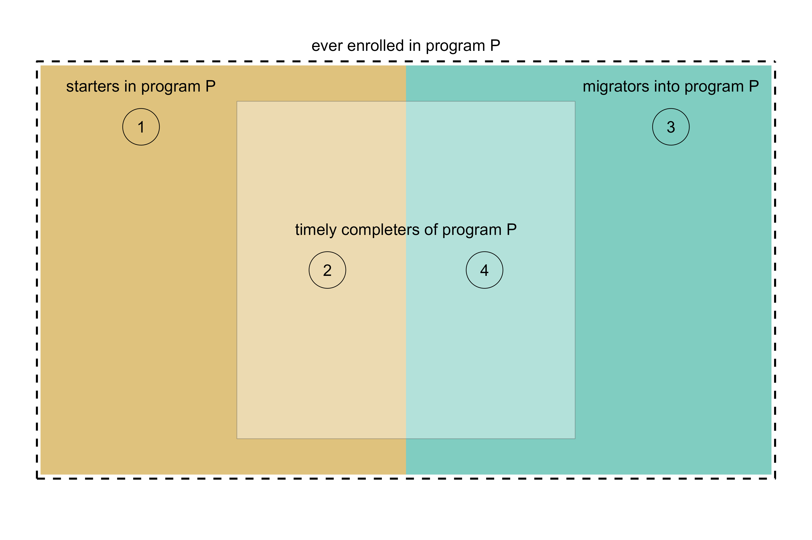

```{r setup}
#| include: false

# code chunks
knitr::opts_chunk$set(
  echo = TRUE,
  message = FALSE,
  warning = FALSE,
  collapse = FALSE,
  comment = "#>",
  error = FALSE
)

# figures
knitr::opts_chunk$set(
  fig.path = "../man/figures/art-080-graduation-rate-",
  fig.width = 6,
  fig.asp = 1 / 1.6,
  out.width = "70%",
  fig.align = "center"
)

# inline numbers
knitr::knit_hooks$set(inline = function(x) {
  if (!is.numeric(x)) {
    x
  } else if (x >= 10000) {
    prettyNum(round(x, 2), big.mark = ",")
  } else {
    prettyNum(round(x, 2))
  }
})

# accented text
accent <- function (text_string){
    kableExtra::text_spec(text_string, color = "#b35806", bold = TRUE)
}
```

Graduation rate is a widely used, though flawed, measure of academic achievement.  

The American Council on Education estimates that the conventional definition of graduation rate may exclude up to 60% of students at 4-year institutions [@Cook+Hartle:2011]. Nevertheless, as Cook and Hartle explain, 

> ... in the eyes of the public, policy makers, and the media, graduation
> rate is a clear, simple, and logical---if often misleading---number.

Recognizing that graduation rate is a popular metric, we propose a definition of graduation rate that includes all conventionally excluded students except migrators.

*You can skip the FYE content in this vignette if your study includes no FYE-style Engineering programs.* 


## Definitions

graduation rate (general) 

: Graduation rate $(G)$ is the ratio of the number of starter-completers $(N_{sc})$ to the number of starters $(N_s)$, 
$$
G=\frac{N_{sc}}{N_s}
$$

starter

: A degree-seeking student enrolled in their first term in a degree-granting program. 

starter-completer

: The subset of starters who graduate with a “timely” completion status from  their starting program. 

degree completion

: Graduating from a baccalaureate program 

timely completion criterion 

: Completing a program in no more than a specified span of years, in many cases, within 6 years after admission, or possibly less for some transfer students. 

migrator

: A student who leaves one program to enroll in another at  the same institution. Also called *switchers.*

undecided/unspecified

: The MIDFIELD taxonomy includes the non-IPEDS code (CIP 999999) for Undecided or Unspecified indicating instances in which a student has not declared a major or an institution had not recorded a program. 


## Starters and migrators

Migrators can be problematic in determining graduation rate. The metric accounts them starters in their original program but potentially ignores them in their subsequent programs.  

Relationships among migrators, starters, and completers of a given program *P* are illustrated in Figure 1.  The overall rectangle represents all students ever enrolled in program *P*. Combined regions 2 and 4 represent all graduates who completed program *P* within 6 years.

- Region 1 represents the graduation rate denominator $(N_s)$. 

- Region 2, a subset of region 1, represents the graduation rate numerator $(N_{sc})$.  

- Region 3 students are counted as starters in their original programs. 

- Region 4, a subset of region 3, represents migrators who complete program *P*.  

{width="100%"}
 
<br>When calculating graduation rate, whether migrator-completers (region 4) are included in the count of graduates depends how a program is defined in terms of CIP codes.  
 
- *Institution level*. Graduation rate computed at the institution level includes all migrators within the institution. For example, starters in  Engineering (CIP 14) who graduate in Business (CIP 52) are both starters and completers at the institution level. IPEDS defines this rate as the *institution completion rate.*

- *2-digit CIP*. Graduation rate includes migrator graduates within the same 2-digit CIP. For example, starters in Engineering (CIP 14) graduating in Business (CIP 52) are excluded from the count of Business graduates, but migrators within Engineering (all 6-digit CIP codes starting with 14) are both starters and completers in Engineering.

- *4-digit CIP*. Similar to the 2-digit case. For example, starters in Electrical Engineering (CIP 1410) graduating in Mechanical Engineering (CIP 1419) are excluded from the count of Mechanical Engineering graduates, but migrators within Electrical Engineering (all 6-digit CIP codes starting with 1410) are both starters and completers in Electrical Engineering. 

- *6-digit CIP*. Rarely used. Graduation rate at this CIP level excludes all migrators from the count of graduates. 

- *Multiple CIPs*. In some cases, a single program or major includes different  4-digit CIPs. For example, migrators between Systems Engineering (CIP 1427), Industrial Engineering (CIP 1435), Manufacturing Engineering (CIP 1436), and Operations Research (CIP 1437) might be considered both starters and completers in a general program of Industrial & Systems Engineering.

Because a migrator may have to complete remedial work in their new program, their time to graduation may exceed the defined acceptable span (typically 6 years). Yet graduation rate has no mechanism for extending the timely completion span. (Developing such a heuristic for MIDFIELD data is a potential topic of future work.)


## Who is a starter?

In the US, the predominant definition of graduation rate is that established by the US Department of Education, Integrated Postsecondary Education Data System (IPEDS). The IPEDS definition underlies the finding cited earlier that a   graduation rate metric may exclude up to 60% of students. 

Many of the IPEDS exclusions relate to how starters are defined. By expanding the starters definition, MIDFIELD proposes a graduation rate definition that includes all conventionally excluded students except migrators. 

graduation rate (IPEDS)

: The fraction of a cohort of full-time, first-time, degree-seeking undergraduates who complete their program within a percentage (100%, 150%, or 200%) of the "normal" time (typically 4 years) as defined by the institution. IPEDS excludes students who attend college part-time, who transfer between institutions, and who start in Winter or Spring terms  [@IPEDS:2020].   

graduation rate (MIDFIELD)

: The fraction of a cohort of degree-seeking undergraduates who complete their program in a timely manner (typically 6 years). MIDFIELD includes students who attend college part-time, who transfer between institutions, and who start in any term. Table 1 summarizes the comparison between the IPEDS and MIDFIELD graduation rate definitions. 
   
```{r}
#| echo: false
suppressPackageStartupMessages(library("data.table"))
wrapr::build_frame(
    "Item", "IPEDS", "MIDFIELD", "MIDFIELD notes" |
        "completion span:", "4, 6, or 8 years", "4, 6, or 8 years", "Typical usage is 6 years" |
        "students admitted in:", "Summer/Fall only", "any term", "" |
        "part-time students are:", "excluded", "included", "Timely completion same as full-time students" |
        "transfer students are:", "excluded", "included", "Timely completion span adjusted for level at entry" 
) |>
    kableExtra::kbl(align = "llll", caption = "Table 1: Comparing graduation rate definitions") |>
    kableExtra::kable_paper(lightable_options = "basic", full_width = TRUE) |>
    kableExtra::column_spec(1:2, color = "black", background = "white") |>
    kableExtra::row_spec(c(0), background = "#c7eae5")
```

<br>

First-Year Engineering (FYE) starters

: We estimate the degree-granting engineering program in which an FYE student  would have enrolled had they not been required to enroll in FYE. The FYE proxy, a 6-digit CIP code, denotes the program of which the FYE student can be considered a starter. For additional details, see the vignette [FYE proxies](art-070-fye-proxies.html). 


## Method

- steps

- steps 

This vignette in the MIDFIELD workflow.   

1. Planning  
1. Initial processing  
1. Blocs  
1. Grouping variables  
1. Metrics  
    - `r accent("Graduation rate")`  
    - Stickiness  
1. Results  


*Caveat:* The Student Unit Records included with midfieldr and midfielddata are practice data, not research data, suitable for practice working with SURs but not for drawing inferences about program attributes or student experiences.


## Load practice data

*Start a script*. If you are writing your own script to follow along, we use these packages in this vignette:

```{r}
# Graduation rate
# midfieldr vignette

# Packages
library("midfieldr")
library("midfielddata")
suppressPackageStartupMessages(library("data.table"))
suppressPackageStartupMessages(library("ggplot2"))

# Printing options for data.table
options(
  datatable.print.nrows = 21,
  datatable.print.topn = 5,
  datatable.print.class = TRUE
)
```

*Load source data.* MIDFIELD practice data tables as described in [Getting started](art-000-getting-started.html).

```{r}
# Load practice data sets
data(student, term, degree, package = "midfielddata")
```

*Optional.* A step to reduce the number of columns in the source data table(s) to the minimum number required by midfieldr functions. Particularly useful in interactive sessions when viewing the data tables at various stages of an analysis. 

```{r}
#| collapse: true

# Select required midfieldr variables
student <- select_required(student)
term    <- select_required(term)
degree  <- select_required(degree)

# View top few rows of the result
head(student, n = 3L)
head(term, n = 3L)
head(degree, n = 3L)
```

*Prepared data.* `study_programs`, included with midfieldr, contains the CIP codes and custom program names for the case study as developed in [Programs](art-030-programs.html#case-study).

```{r}
#| collapse: true

# Display prepared data
study_programs
```

`fye_proxy` contains the estimated FYE proxies for all FYE students in the midfielddata practice data as developed in [FYE proxies](art-070-fye-proxies.html).

```{r}
#| collapse: true

# Display prepared data
fye_proxy
```


### Initial processing

*Copying.* Prevents operations on `DT` from affecting `term` by reference  [@data.table-reference-semantics]. 

```{r}
# Working data frame
DT <- copy(term)
```

*Data sufficiency.* Obtain the IDs of all students for whom the data sufficiency criteria are satisfied. Code reproduced from [Data sufficiency](art-010-data-sufficiency.html).

```{r}
# Filter for data sufficiency
DT <- add_timely_term(DT, term)
DT <- add_data_sufficiency(DT, term)
DT <- DT[data_sufficiency == "include"]
```

*Degree seeking.* Filter to retain degree-seeking students only.  Code reproduced from [Degree seeking](art-020-data-seeking.html). 

```{r}
# Filter for degree seeking
DT <- DT[, .(mcid)]
DT <- unique(DT)
DT <- student[DT, .(mcid), on = c("mcid"), nomatch = NULL]

# Display the result
DT[]
```

## Starters 

We identify starters and their CIP codes before assigning and filtering for programs. 

*Create start variable.* Isolate the starting term and create the `start` variable. Code reproduced from [Starters](art-080-starters.html). 

```{r}
# Filter for initial term
DT <- term[DT, .(mcid, term, cip6), on = c("mcid")]
DT <- DT[!cip6 %like% "999999"]
setorderv(DT, cols = c("mcid", "term"))
DT <- DT[, .SD[1], by = c("mcid")]

# Create start variable
DT <- fye_proxy[DT, .(mcid, cip6, proxy), on = c("mcid")]
DT[, start := fcase(
  cip6 == "140102", proxy,
  cip6 != "140102", cip6
)]

# Display the result
DT[]
```

*Filter by program.* We join the case study programs labels to the data frame and filter to retain the desired programs. Code reproduced from [Starters](art-080-starters.html). 

```{r}
# Filter by program
join_labels <- copy(study_programs)
setnames(join_labels, old = "cip6", new = "start")
DT <- join_labels[DT, on = c("start")]
DT <- DT[!is.na(program)]
setcolorder(DT, c("mcid", "start"))

# Display the result
DT[]
```

*Copying.* Prevents operations on `starters` from affecting `DT` by reference [@data.table-reference-semantics]. 

```{r}
# Set aside for later use
starters <- copy(DT)
```

*Creating variables.* Add a group column with value `start` throughout to distinguish these observations from the observations of starters we derived earlier. 

```{r}
# Prepare the graduates
starters <- DT[, .(mcid, program)]
starters[, group := "start"]
starters <- unique(starters)

# Display the result
starters[]
```


## Graduates

In a graduation rate calculation, graduates are a subset starters. Thus, referring to Figure 1, the starters derived above correspond to region 1 and the graduates we derive next correspond to region 2. 

*Copying.* Prevents operations on `DT` from affecting `starters` by reference  [@data.table-reference-semantics].

```{r}
# Working data frame
DT <- copy(starters)
```

*Selecting.* We can start with the IDs only. 

```{r}
# Isolate IDs
DT <- DT[, .(mcid)]
DT <- unique(DT)

# Display the result
DT[]
```

The result has `r length(unique(DT$mcid))` unique IDs. These IDs, as a subset of starters, have already been filtered for data sufficiency and degree seeking. The next step is to determine the CIP code of the program from which they graduate. 

*Adding variables*. Add the degree information using a left-outer join with `degree`. The CIP code is the program (if any) from which the student graduated. 

```{r}
# Add degree information
DT <- degree[DT, on = "mcid"]

# Display the result
DT[]
```

*Filter by program.* Like we did for starters earlier, we join the case study program labels to the data frame and filter to retain the desired programs. Code reproduced from [Starters](art-080-starters.html). 

```{r}
# Filter by program
DT <- study_programs[DT, on = c("cip6")]
DT <- DT[!is.na(program)]

# Display the result
DT[]
```

*Completion status.* Add columns for timely completion term and completion status. Filter to retain observations for which completion is timely. Code reproduced from [Completion status](art-040-completion.html). 

```{r}
# Add completion status
DT <- add_timely_term(DT, term)
DT <- add_completion_status(DT, degree)
DT[, c("term_i", "level_i", "adj_span") := NULL]
DT <- DT[completion_status == "timely"]

# Display the result
DT[]
```

*Prepare for joining.* Rename the data frame to distinguish it from starters before merging. 

```{r}
# Rename to distinguish graduates from starters before merging
graduates <- copy(DT)
```

The result has `r nrow(graduates)` observations of `r length(unique(graduates$mcid))` unique IDs.  These two numbers are not necessarily equal in all cases. Had students in this example earned more than one degree in a term, the number of observations would be greater than the number of unique students. 

## Combine observations

To set up the data frame for grouping and summarizing, we want to combine the `starters` and `graduates` data frames. 

```{r}
# Rename program variable before merging
starters  <- starters[, .(mcid, program_start = program)]
graduates <- graduates[, .(mcid, program_grad = program)]

# Combine using a left outer join 
DT <- graduates[starters, on = "mcid"]
DT[]
```


## Closing

Summary of the vignette YBD


## References

<div id="refs"></div>


## Appendix

### Complete script

The vignette code chunks are collected below in a single, condensed script. 

```{r}
# Script
```


```{r}
#| echo: false

# to change the CSS file
# per https://github.com/rstudio/rmarkdown/issues/732
knitr::opts_chunk$set(echo = FALSE)
```

```{css}
blockquote {
    padding:     10px 20px;
    margin:      0 0 20px;
    border-left: 0px
}
caption {
    color:       #525252;
    text-align:  left;
    font-weight: normal;
    font-size:   medium;
    line-height: 1.5;
}
```


