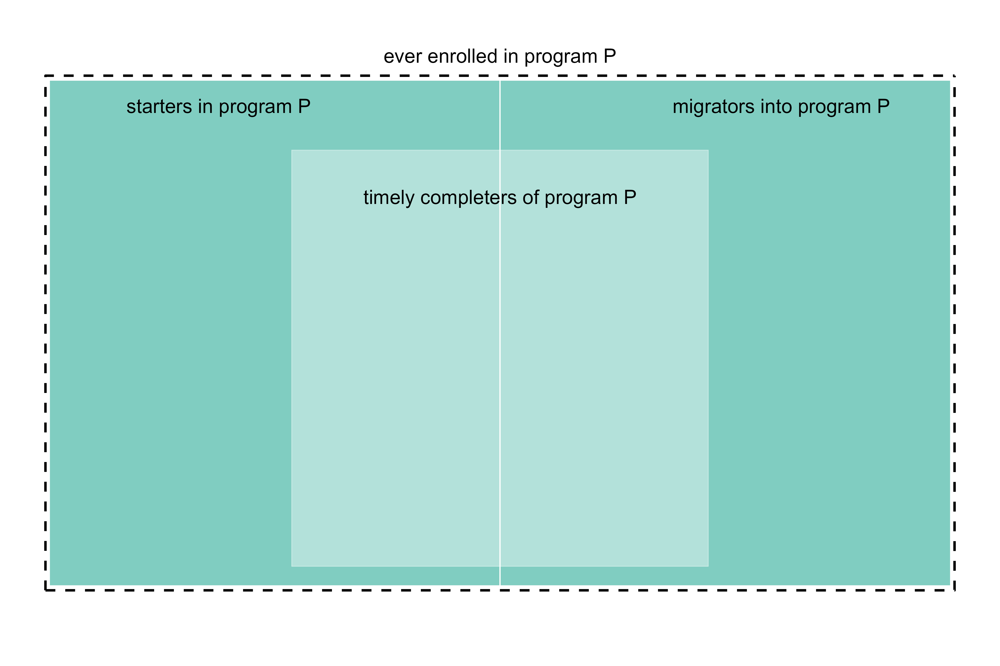

```{r setup}
#| include: false

# code chunks
knitr::opts_chunk$set(
  echo = TRUE,
  message = FALSE,
  warning = FALSE,
  collapse = FALSE,
  comment = "#>",
  error = FALSE
)

# figures
knitr::opts_chunk$set(
  fig.path = "../man/figures/art-110-stickiness-",
  fig.width = 6,
  fig.asp = 1 / 1.6,
  out.width = "80%",
  fig.align = "center"
)

# inline numbers
knitr::knit_hooks$set(inline = function(x) {
  if (!is.numeric(x)) {
    x
  } else if (x >= 10000) {
    prettyNum(round(x, 2), big.mark = ",")
  } else {
    prettyNum(round(x, 2))
  }
})

# data.table printout
options(
  datatable.print.nrows = 6,
  datatable.print.topn = 3,
  datatable.print.class = TRUE
)

# accented text
accent <- function(text_string) {
  kableExtra::text_spec(text_string, color = "#b35806", bold = TRUE)
}
```

Stickiness is a more-inclusive alternative to graduation rate as a measure of a program's success in attracting, keeping, and graduating their undergraduates. All students excluded by a conventional graduation rate metric--including migrators---are included in the stickiness metric [@Ohland+Orr+others:2012]. 


This vignette in the MIDFIELD workflow.   

1. Planning  
1. Initial processing  
1. Blocs  
1. Groupings  
1. `r accent("Metrics")`    
    - Graduation rate    
    - `r accent("Stickiness")`  
1. Displays  


## Definitions

stickiness

: Stickiness $(S)$ is the ratio of the number of graduates $(N_g)$ of a program to the number ever enrolled $(N_e)$ in the program, 

$$
S = \frac{N_g}{N_e}
$$


bloc

: A grouping of SURs dealt with as a unit, for example, starters, ever-enrolled, graduates, transfers, traditional, non-traditional, migrators, etc. 

ever-enrolled

: Bloc of all degree-seeking students enrolled in a program for at least one term, without regard to their starting programs.  

graduates

: Bloc of all graduates (timely completers) from a program, without regard to their starting programs. 

timely completion criterion 

: Completing a program in no more than a specified span of years, in many cases, within 6 years after admission (150% of the "normal" 4-year span), or possibly less for some transfer students.

migrators

: Bloc of students who leave one program to enroll in another at the same institution. Also called *switchers.*


## A more inclusive metric 

Stickiness, in comparison to [graduation rate](art-100-grad-rate.html), has these characteristics:

- Includes migrators, where graduation rate does not. 

- Is based on the bloc of ever enrolled rather than starters, so there is no need for [FYE proxies](art-060-fye-proxies.html).

- Counts all graduates (timely completers) in a program, eliminating the need to filter graduates based on their starting program. 

- Like the MIDFIELD definition of graduation rate (in contrast to the IPEDS definition), includes students who attend college part-time, who transfer between institutions, and who start in any term. 

As they pertain to the stickiness metric, relationships among starters, migrators, and graduates (timely completers) of a given program *P* are illustrated in Figure 1. 

- The interior rectangle represents the stickiness numerator $(N_g)$, the set of graduates (timely completers) of program *P*.   

- The overall rectangle represents the stickiness denominator $(N_e)$, the set of students ever enrolled in program *P*. 


{width="100%"}
 
<br> 


## Method

Demonstrating the following elements of a MIDFIELD workflow.  

1. *Planning.*  &nbsp; The metric is stickiness. Required blocs are ever-enrolled and graduates. Grouping variables are program, race/ethnicity, and sex. Programs are the four Engineering programs used throughout. 

1. *Initial processing.* &nbsp; Filter the source SURs for data sufficiency and degree-seeking.

1. *Blocs.* &nbsp; Gather ever enrolled, filter by program. Gather graduates, filter by program. 

1. *Groupings.* &nbsp; Add grouping variables. 

1. *Metrics* &nbsp; Summarize by grouping variables and compute stickiness.  

1. *Displays* &nbsp; Create multiway chart and results table. 

*Caveat.*  &nbsp; The data in ‘midfielddata’ are practice data, suitable for learning to work with Student Unit Records (SURs) generally. Unlike the MIDFIELD research database, the data tables in ‘midfielddata’ are not research data; they are not suitable for drawing inferences about program attributes or student experiences.


## Load data

*Open.* &nbsp; If you are writing your own script to follow along, we use these packages in this vignette:

```{r}
# midfieldr: Stickiness

# Packages
library("midfieldr")
library("midfielddata")
library("data.table")
library("ggplot2")
```

*Load.* &nbsp; MIDFIELD practice data tables. Described in [Getting started](art-000-getting-started.html).

```{r}
# Load practice data
data(student, term, degree, package = "midfielddata")
```


*Loads with midfieldr.* 

- `study_programs` (derived in [Programs](art-040-programs.html#reusable-code)). 


## Initial processing

*(Optional) Select.* &nbsp; Columns required by midfieldr functions. Code reproduced from [Getting started](art-000-getting-started.html#reusable-code). 

```{r}
# Optional. Copy of source files with all variables
source_student <- copy(student)
source_term <- copy(term)
source_degree <- copy(degree)

# Optional. Select variables required by midfieldr functions
student <- select_required(source_student)
term <- select_required(source_term)
degree <- select_required(source_degree)
```

*Work.* &nbsp; Using `copy()` avoids *by-reference* effects  [@data.table-reference-semantics].

```{r}
# Working data frame
DT <- copy(term)
```

*Data sufficiency.* Obtain the IDs of all students for whom the data sufficiency criteria are satisfied. Code reproduced from [Data sufficiency](art-020-data-sufficiency.html#reusable-code).

```{r}
# Filter for data sufficiency
DT <- add_timely_term(DT, term)
DT <- add_data_sufficiency(DT, term)
DT <- DT[data_sufficiency == "include"]
```

*Degree seeking.* Filter to retain degree-seeking students only.  Code reproduced from [Degree seeking](art-030-data-seeking.html#reusable-code). 

```{r}
# Filter for degree seeking
DT <- DT[, .(mcid)]
DT <- unique(DT)
DT <- student[DT, .(mcid), on = c("mcid"), nomatch = NULL]
DT[]
```

We preserve this data frame as a baseline for examples in the vignette.  

```{r}
baseline <- copy(DT)
```


## Ever enrolled 

*Preparation.* &nbsp; The baseline data frame we preserved earlier is the intake for this section.

```{r}
# Reset the working data frame
DT <- copy(baseline)
```

*Ever enrolled.* &nbsp; The summary code chunk from [Blocs](art-050-blocs.html#reusable-code-blocs). 

```{r}
# Ever-enrolled bloc
DT <- term[DT, .(mcid, cip6), on = c("mcid")]
DT <- unique(DT)

# Filter by program
DT <- study_programs[DT, on = c("cip6"), nomatch = NULL]
DT[, cip6 := NULL]
DT <- unique(DT)
DT[]
```

*Copy.* &nbsp; To prepare for joining with graduates. 

```{r}
# Prepare for joining
setcolorder(DT, c("mcid"))
ever_enrolled <- copy(DT)
ever_enrolled[]
```


## Graduates

*Preparation.* &nbsp; The baseline data frame we preserved earlier is the intake for this section.

```{r}
# Reset the working data frame
DT <- copy(baseline)
```

*Graduates* &nbsp; The summary code chunk from [Graduates](art-080-graduates.html#reusable-code)

```{r}
# Gather graduates and their degree CIPs
DT <- add_timely_term(DT, term)
DT <- add_completion_status(DT, degree)
DT <- DT[completion_status == "timely"]
DT <- degree[DT, .(mcid, cip6), on = c("mcid")]

# Filter by program
DT <- study_programs[DT, on = c("cip6"), nomatch = NULL]
DT[, cip6 := NULL]
DT <- unique(DT)
DT[]
```

*Copy.* &nbsp; To prepare for joining with ever enrolled 

```{r}
# Prepare for joining
setcolorder(DT, c("mcid"))
graduates <- copy(DT)
graduates[]
```


## Groupings

One of our grouping variables (`program`) is already included in the data frames. The next grouping variable is `bloc` to distinguish starters from graduates when the two data frames are combined.

*Add a variable.* &nbsp; Label eve enrolled and graduates. 

```{r}
# For grouping by bloc
ever_enrolled[, bloc := "ever_enrolled"]
graduates[, bloc := "graduates"]
```

*Join.* &nbsp; Combine the two blocs to prepare for summarizing. A graduate has two observations in these data: one as ever enrolled and one as a graduate. 

```{r}
# Prepare for summarizing
DT <- rbindlist(list(ever_enrolled, graduates))
DT[]
```

*Add variables.* &nbsp; Demographics from [Groupings](art-090-groupings.html#reusable-code)

```{r}
# Join race/ethnicity and sex
cols_we_want <- student[, .(mcid, race, sex)]
DT <- cols_we_want[DT, on = c("mcid")]
DT[]
```


## Stickiness

```{r}
#| echo: false
options(datatable.print.topn = 7)
```

*Summarize.* &nbsp; Count the numbers of observations for each combination of the grouping variables. 

```{r}
# Count observations by group
grouping_variables <- c("bloc", "program", "sex", "race")
DT <- DT[, .N, by = grouping_variables]
setorderv(DT, grouping_variables)
DT[]
```

*Reshape.* &nbsp; Transform to row-record form to set up the stickiness metric  calculation. Transform the *N* column into two columns, one for ever-enrolled  and one for graduates. 

```{r}
# Prepare to compute metric
DT <- dcast(DT, program + sex + race ~ bloc, value.var = "N", fill = 0)
DT[]
```

*Create a variable.*  &nbsp; Compute the metric. 

```{r}
# Compute metric
DT[, stickiness := round(100 * graduates / ever_enrolled, 1)]
DT[]
```


## Prepare for dissemination

```{r}
#| echo: false
options(datatable.print.topn = 3)
```

*Filter.* &nbsp; Let us assume that our study focuses on “domestic” students of known race/ethnicity. In that case, we omit observations labeled “International” and "Other/Unknown”.

```{r}
# Study design assumption
DT <- DT[!race %chin% c("International", "Other/Unknown")]
DT[]
```

*Filter.* &nbsp; To preserve the anonymity of the people involved, we remove observations with fewer than `N_threshold` graduates. With the research data, we typically set this threshold to 10; with the practice data, we demonstrate the procedure using a threshold of 5. 

```{r}
# Preserve anonymity
N_threshold <- 5
DT <- DT[graduates >= N_threshold]
DT[]
```

*Add a variable.* &nbsp; We combine race/ethnicity and sex to create a combined grouping variable. 

```{r}
# Create a combined category
DT[, people := paste(race, sex)]
DT[, `:=`(race = NULL, sex = NULL)]
setcolorder(DT, c("program", "people"))
DT[]
```

*Recode.* &nbsp;  Readers can more readily interpret our charts and tables if the programs are unabbreviated.

```{r}
# Recode values for chart and table readability
DT[, program := fcase(
  program %like% "CE", "Civil",
  program %like% "EE", "Electrical",
  program %like% "ME", "Mechanical",
  program %like% "ISE", "Industrial/Systems"
)]
DT[]
```


## Displays

*Order factors.* &nbsp; Order the levels of the categories. Code adapted from [Multiway data and charts](art-120-multiway.html#percentage-ordered-data). 

```{r}
# Order the categories
DT <- order_multiway(DT,
  quantity   = "stickiness",
  categories = c("program", "people"),
  method     = "percent",
  ratio_of   = c("graduates", "ever_enrolled")
)
DT[]
```


*Multiway chart.* &nbsp; Code adapted from [Multiway data and charts](art-120-multiway.html#percentage-ordered-charts). 

The vertical reference line is the aggregate stickiness of the program, independent of race/ethnicity and sex. 

```{r fig2}
#| fig-asp: 1.1
#| fig-cap: "Figure 2: Stickiness of four Engineering majors."

ggplot(DT, aes(x = stickiness, y = people)) +
  facet_wrap(vars(program), ncol = 1, as.table = FALSE) +
  geom_vline(aes(xintercept = program_stickiness), linetype = 2, linewidth = 0.5) +
  geom_point() +
  labs(x = "Stickiness (%)", y = "") +
  scale_x_continuous(limits = c(20, 65))
```

<br>


```{r}
#| echo: false
options(datatable.print.topn = 10)
```


*Results table.* &nbsp; Code adapted from [Multiway data and charts](art-120-multiway.html#tabulating-counts).

```{r}
# Select variables and remove factors
display_table <- copy(DT)
display_table <- display_table[, .(program, people, stickiness)]
display_table[, people := as.character(people)]
display_table[, program := as.character(program)]

# Construct table
display_table <- dcast(display_table, people ~ program, value.var = "stickiness")
setnames(display_table,
  old = c("people"),
  new = c("People"),
  skip_absent = TRUE
)
display_table[]
```

(Optional) Format the table nearer to publication quality. Here I use `kable()` from the knitr package. 

```{r}
knitr::kable(display_table,
  align = "lrrrr",
  caption = "Table 2: Stickiness (%) of four Engineering majors."
)
```

A value of NA indicates a group removed because the number of graduates was below the threshold set to preserve anonymity. 


## References

<div id="refs"></div>


```{r}
#| echo: false

# to change the CSS file
# per https://github.com/rstudio/rmarkdown/issues/732
knitr::opts_chunk$set(echo = FALSE)
```

```{css}
blockquote {
    padding:     10px 20px;
    margin:      0 0 20px;
    border-left: 0px
}
caption {
    color:       #525252;
    text-align:  left;
    font-weight: normal;
    font-size:   medium;
    line-height: 1.5;
}
```


