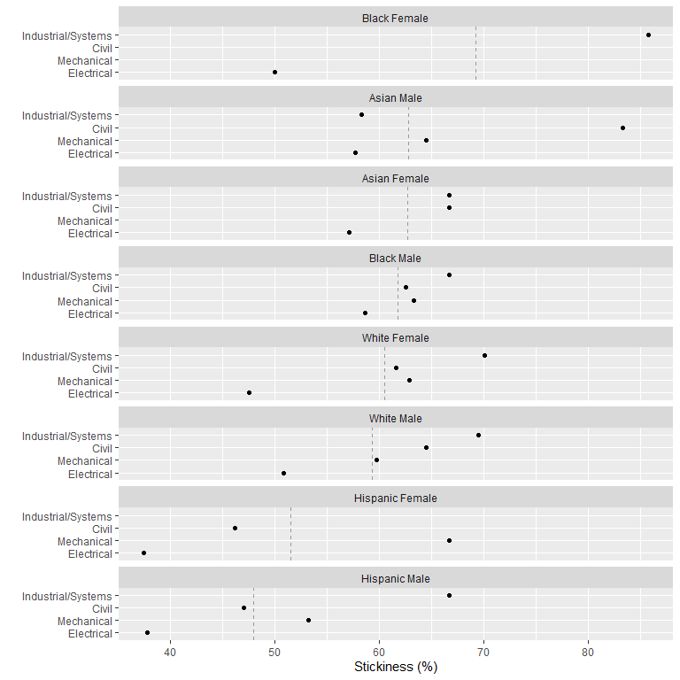
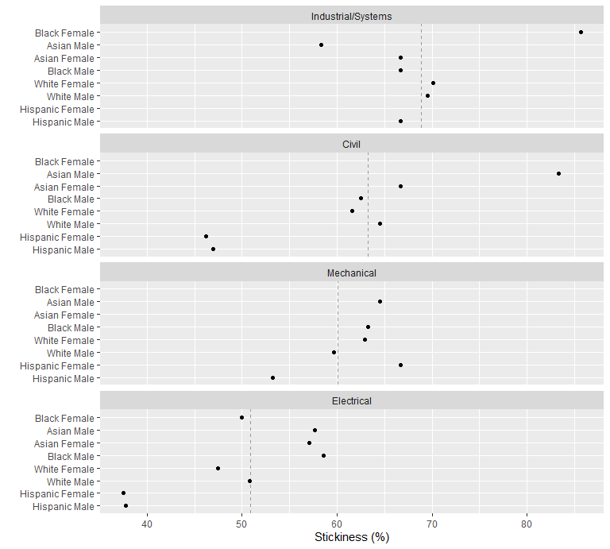

# Case study: Results


Part 3 of a case study in three parts, illustrating how we work with
longitudinal student-level records.

1.  *Goals.*   Introducing the study.

2.  *Data.*   Transforming the data to yield the observations of
    interest.

3.  *Results.*   Summary statistics, metric, chart, and table.

## Method

Our goal in this segment is to group and summarize the observations we
saved previously, calculate the stickiness metric, and display the
results.

*Reminder.*   midfielddata datasets are for practice, not research.

## Load data

*Start.*   If you are writing your own script to follow along, we use
these packages in this article:

``` r
library(midfieldr)
library(data.table)
library(ggplot2)
```

*Loads with midfieldr.*   Prepared data. View data dictionary via
`?study_observations`.

- `study_observations` (derived in [Case study:
  Data](art-002-case-data.html)).

## Group and summarize

*Initialize.*   Assign a working data frame.

``` r
# Working data frame
DT <- copy(study_observations)
DT
#>                 mcid          race    sex program          bloc
#>               <char>        <char> <char>  <char>        <char>
#>    1: MCID3111142965 International   Male      EE ever_enrolled
#>    2: MCID3111145102         White   Male      EE ever_enrolled
#>    3: MCID3111146537         Asian Female      EE ever_enrolled
#>   ---                                                          
#> 8915: MCID3112618976         White   Male      ME     graduates
#> 8916: MCID3112619484         White   Male      EE     graduates
#> 8917: MCID3112641535         White   Male      ME     graduates
```

The study observations data frame is designed with one column for each
grouping variable: `race`, `sex`, `program`, and `bloc`.

grouping variables  
Detailed information in the student-level data that further characterize
a bloc of records, typically used to create bloc subsets for comparison,
for example, program, race/ethnicity, sex, age, grade level, grades,
etc.

*Summarize.*   Count the numbers of observations for each combination of
the grouping variables.

``` r
# Group and summarize
DT <- DT[, .N, by = c("bloc", "program", "race", "sex")]
DT
#>              bloc program            race    sex     N
#>            <char>  <char>          <char> <char> <int>
#>  1: ever_enrolled      EE   International   Male   195
#>  2: ever_enrolled      EE           White   Male   864
#>  3: ever_enrolled      EE           Asian Female    21
#> ---                                                   
#> 96:     graduates      ME Native American   Male     1
#> 97:     graduates      CE Native American Female     1
#> 98:     graduates      EE   Other/Unknown Female     3
```

## Reshape

*Reshape.*   Transform from block-record form to row-record form to set
up the stickiness metric calculation. Transforms the *N* column into two
columns, one for ever-enrolled and one for graduates. This operation is
essentially a transformation from block records to row records—a process
known by a number of different names, e.g., pivot, crosstab, unstack,
spread, or widen ([Mount and Zumel
2019](#ref-Mount+Zumel:2019:fluid-data)). This step leaves the graphing
variables (program, race/ethnicity, and sex) in place.

``` r
# Prepare to compute metric
DT <- dcast(DT, program + sex + race ~ bloc, value.var = "N", fill = 0)
DT
#> Key: <program, sex, race>
#>     program    sex            race ever_enrolled graduates
#>      <char> <char>          <char>         <int>     <int>
#>  1:      CE Female           Asian            15        10
#>  2:      CE Female           Black             4         1
#>  3:      CE Female        Hispanic            13         6
#> ---                                                       
#> 48:      ME   Male Native American             5         1
#> 49:      ME   Male   Other/Unknown            80        41
#> 50:      ME   Male           White          1596       953
```

## Compute the metric

metric  
A quantitative measure derived from student-level data. Includes
statistical measures such as counts of program starters or graduates as
well as comparative ratios such as graduation rate or stickiness.
Typically involves comparisons of specific blocs of students and
programs.

stickiness  
Program “stickiness” $\small\left(S\right)$ is the ratio of the number
of graduates of a program $\small\left(N_g\right)$ to the number ever
enrolled in the program $\small\left(N_e\right)$. \[ S = \]

*Create a variable.*   Compute stickiness.

``` r
# Compute the metric
DT[, stickiness := round(100 * graduates / ever_enrolled, 1)]
setkey(DT, NULL)
DT
#>     program    sex            race ever_enrolled graduates stickiness
#>      <char> <char>          <char>         <int>     <int>      <num>
#>  1:      CE Female           Asian            15        10       66.7
#>  2:      CE Female           Black             4         1       25.0
#>  3:      CE Female        Hispanic            13         6       46.2
#> ---                                                                  
#> 48:      ME   Male Native American             5         1       20.0
#> 49:      ME   Male   Other/Unknown            80        41       51.2
#> 50:      ME   Male           White          1596       953       59.7
```

*Verify prepared data.*   `study_results`, included with midfieldr,
contains the case study information developed above. Here we verify that
the two data frames have the same content.

``` r
# Demonstrate equivalence
check_equiv_frames(DT, study_results)
#> [1] TRUE
```

## Prepare for dissemination

We take several additional steps to prepare the data for dissemination
in tables or charts.

*Filtering.* To preserve the anonymity of the people involved, we remove
observations with fewer than $N$ observations. When dealing with the
full MIDFIELD research data, we typically use $N = 10$, but for these
practice data, we use $N = 3$.

``` r
# Preserve anonymity
DT <- DT[graduates >= 3]

# Display the result
DT
#>     program    sex          race ever_enrolled graduates stickiness
#>      <char> <char>        <char>         <int>     <int>      <num>
#>  1:      CE Female         Asian            15        10       66.7
#>  2:      CE Female      Hispanic            13         6       46.2
#>  3:      CE Female International            23        13       56.5
#> ---                                                                
#> 39:      ME   Male International           178        89       50.0
#> 40:      ME   Male Other/Unknown            80        41       51.2
#> 41:      ME   Male         White          1596       953       59.7
```

*Note.*   MIDFIELD research findings are regularly grouped by program,
race/ethnicity, and sex. However, applied to the practice data these
groupings produce several groups with totals below the threshold we
impose to preserve anonymity, introducing a number of NA values in the
resulting charts and tables. These NAs are largely an artifact of
applying these groupings to practice data.

*Filtering.* Let us assume that our study focuses on “domestic” students
of known race/ethnicity. In that case, we omit observations labeled
“International” and Other/Unknown”.

``` r
# Filter by study design
DT <- DT[!race %chin% c("International", "Other/Unknown")]

# Display the result
DT
#>     program    sex     race ever_enrolled graduates stickiness
#>      <char> <char>   <char>         <int>     <int>      <num>
#>  1:      CE Female    Asian            15        10       66.7
#>  2:      CE Female Hispanic            13         6       46.2
#>  3:      CE Female    White           263       162       61.6
#> ---                                                           
#> 26:      ME   Male    Black            30        19       63.3
#> 27:      ME   Male Hispanic            79        42       53.2
#> 28:      ME   Male    White          1596       953       59.7
```

*Creating variables.* We have found it useful to report such data with a
variable that combines race/ethnicity and sex.

``` r
# Create a variable
DT[, people := paste(race, sex)]
DT[, c("race", "sex") := NULL]
setcolorder(DT, c("program", "people"))

# Display the result
DT
#>     program          people ever_enrolled graduates stickiness
#>      <char>          <char>         <int>     <int>      <num>
#>  1:      CE    Asian Female            15        10       66.7
#>  2:      CE Hispanic Female            13         6       46.2
#>  3:      CE    White Female           263       162       61.6
#> ---                                                           
#> 26:      ME      Black Male            30        19       63.3
#> 27:      ME   Hispanic Male            79        42       53.2
#> 28:      ME      White Male          1596       953       59.7
```

*Recoding values.* Readers can more readily interpret our charts and
tables if the programs are unabbreviated.

``` r
# Recode values for charts and tables
DT[, program := fcase(
  program %like% "CE", "Civil",
  program %like% "EE", "Electrical",
  program %like% "ME", "Mechanical",
  program %like% "ISE", "Industrial/Systems"
)]

# Display the result
DT
#>        program          people ever_enrolled graduates stickiness
#>         <char>          <char>         <int>     <int>      <num>
#>  1:      Civil    Asian Female            15        10       66.7
#>  2:      Civil Hispanic Female            13         6       46.2
#>  3:      Civil    White Female           263       162       61.6
#> ---                                                              
#> 26: Mechanical      Black Male            30        19       63.3
#> 27: Mechanical   Hispanic Male            79        42       53.2
#> 28: Mechanical      White Male          1596       953       59.7
```

With one quantitative variable (stickiness) for every combination of the
levels of two categorical variables (program and race/ethnicity/sex),
these data are *multiway data* ([Cleveland 1993](#ref-Cleveland:1993)).
How one orders the categorical variables is critical for visualizing
effects.

multiway data  
A data set of three variables: a category with *m* levels; a second
independent category with *n* levels; and a quantitative variable (the
response) of length *mn* such that there is a value of the response for
each combination of levels of the two categorical variables.

*Conditioning.* Convert the two categorical variables to ordered factors
to support the ordering of rows and panels in the chart.

``` r
# Convert categorical variables to factors
DT <- order_multiway(DT,
  quantity = "stickiness",
  categories = c("program", "people"),
  method = "percent",
  ratio_of = c("graduates", "ever_enrolled")
)

# Display the result
DT
#>        program          people graduates ever_enrolled stickiness
#>         <fctr>          <fctr>     <num>         <num>      <num>
#>  1:      Civil    Asian Female        10            15       66.7
#>  2:      Civil Hispanic Female         6            13       46.2
#>  3:      Civil    White Female       162           263       61.6
#> ---                                                              
#> 26: Mechanical      Black Male        19            30       63.3
#> 27: Mechanical   Hispanic Male        42            79       53.2
#> 28: Mechanical      White Male       953          1596       59.7
#>     program_stickiness people_stickiness
#>                  <num>             <num>
#>  1:               63.3              62.7
#>  2:               63.3              51.5
#>  3:               63.3              60.5
#> ---                                     
#> 26:               60.1              61.8
#> 27:               60.1              48.0
#> 28:               60.1              59.3
```

The column `program_stickiness` determines the order of the programs in
the chart; `people_stickiness` determines the order of the
race/ethnicity/sex groupings; the values in `stickiness` are the
quantitative values to be graphed.

## Charts

In the first multiway chart, the rows are programs and panels are
people, facilitating comparisons of different program for a single
group. Rows and panels are both ordered from bottom to top in order of
increasing stickiness.

multiway chart  
A multi-panel dot plot: horizontal, quantitative scales; rows that
encode one category; and panels that encode the second category. All
panels have identical axes. The ordering of the rows and panels is
crucial to the perception of effects.

``` r
ggplot(DT, aes(x = stickiness, y = program)) +
  facet_wrap(vars(people), ncol = 1, as.table = FALSE) +
  geom_vline(aes(xintercept = people_stickiness), linetype = 2, color = "gray60") +
  geom_point() +
  labs(x = "Stickiness (%)", y = "")
```



The vertical reference line is the overall stickiness of the people in a
panel.

Alternatively, we can consider the dual chart, swapping the roles of the
panels and rows. Here the rows are people and panels are programs,
facilitating comparisons of different people within a program. Over many
years of publishing research using MIDFIELD data, placing people on the
rows of the multiway chart has been perhaps our most frequently used
design.

``` r
ggplot(DT, aes(x = stickiness, y = people)) +
  facet_wrap(vars(program), ncol = 1, as.table = FALSE) +
  geom_vline(aes(xintercept = program_stickiness), linetype = 2, color = "gray60") +
  geom_point() +
  labs(x = "Stickiness (%)", y = "")
```



The vertical reference line is the overall stickiness of the program in
a panel.

The chart illustrates the importance of ordering the rows and panels. We
would conclude that Industrial/Systems Engineering is the stickiest
program of the four, followed by Civil, Mechanical, and Electrical in
descending order.

Because rows are ordered, one expects a generally increasing trend
within a panel. A response greater or smaller than expected creates a
visual asymmetry. For example, Asian students are asymmetrically lower
in Industrial/Systems Engineering.

## Tables

Data tables are often needed for publication. In this example, we format
the data in a conventional row-record form with the groups of people in
the first column labeling the rows and the program names labeling the
remaining columns.

``` r
# Select the columns I want for the table
DT <- DT[, .(program, people, stickiness)]

# Change factors to characters so rows/columns can be alphabetized
DT[, people := as.character(people)]
DT[, program := as.character(program)]

# Transform from block records to row records
DT <- dcast(DT, people ~ program, value.var = "stickiness")

# Edit one column header
setnames(DT, old = "people", new = "People", skip_absent = TRUE)
```

<div id="wmzylecvsq" style="padding-left:0px;padding-right:0px;padding-top:10px;padding-bottom:10px;overflow-x:auto;overflow-y:auto;width:auto;height:auto;">
<style>#wmzylecvsq table {
  font-family: system-ui, 'Segoe UI', Roboto, Helvetica, Arial, sans-serif, 'Apple Color Emoji', 'Segoe UI Emoji', 'Segoe UI Symbol', 'Noto Color Emoji';
  -webkit-font-smoothing: antialiased;
  -moz-osx-font-smoothing: grayscale;
}
&#10;#wmzylecvsq thead, #wmzylecvsq tbody, #wmzylecvsq tfoot, #wmzylecvsq tr, #wmzylecvsq td, #wmzylecvsq th {
  border-style: none;
}
&#10;#wmzylecvsq p {
  margin: 0;
  padding: 0;
}
&#10;#wmzylecvsq .gt_table {
  display: table;
  border-collapse: collapse;
  line-height: normal;
  margin-left: auto;
  margin-right: auto;
  color: #333333;
  font-size: small;
  font-weight: normal;
  font-style: normal;
  background-color: #FFFFFF;
  width: auto;
  border-top-style: solid;
  border-top-width: 2px;
  border-top-color: #000000;
  border-right-style: none;
  border-right-width: 2px;
  border-right-color: #D3D3D3;
  border-bottom-style: solid;
  border-bottom-width: 2px;
  border-bottom-color: #000000;
  border-left-style: none;
  border-left-width: 2px;
  border-left-color: #D3D3D3;
}
&#10;#wmzylecvsq .gt_caption {
  padding-top: 4px;
  padding-bottom: 4px;
}
&#10;#wmzylecvsq .gt_title {
  color: #333333;
  font-size: 125%;
  font-weight: initial;
  padding-top: 4px;
  padding-bottom: 4px;
  padding-left: 5px;
  padding-right: 5px;
  border-bottom-color: #FFFFFF;
  border-bottom-width: 0;
}
&#10;#wmzylecvsq .gt_subtitle {
  color: #333333;
  font-size: 85%;
  font-weight: initial;
  padding-top: 3px;
  padding-bottom: 5px;
  padding-left: 5px;
  padding-right: 5px;
  border-top-color: #FFFFFF;
  border-top-width: 0;
}
&#10;#wmzylecvsq .gt_heading {
  background-color: #FFFFFF;
  text-align: center;
  border-bottom-color: #FFFFFF;
  border-left-style: none;
  border-left-width: 1px;
  border-left-color: #D3D3D3;
  border-right-style: none;
  border-right-width: 1px;
  border-right-color: #D3D3D3;
}
&#10;#wmzylecvsq .gt_bottom_border {
  border-bottom-style: solid;
  border-bottom-width: 2px;
  border-bottom-color: #5F5F5F;
}
&#10;#wmzylecvsq .gt_col_headings {
  border-top-style: solid;
  border-top-width: 2px;
  border-top-color: #5F5F5F;
  border-bottom-style: solid;
  border-bottom-width: 2px;
  border-bottom-color: #5F5F5F;
  border-left-style: none;
  border-left-width: 1px;
  border-left-color: #D3D3D3;
  border-right-style: none;
  border-right-width: 1px;
  border-right-color: #D3D3D3;
}
&#10;#wmzylecvsq .gt_col_heading {
  color: #333333;
  background-color: #FFFFFF;
  font-size: 100%;
  font-weight: normal;
  text-transform: inherit;
  border-left-style: none;
  border-left-width: 1px;
  border-left-color: #D3D3D3;
  border-right-style: none;
  border-right-width: 1px;
  border-right-color: #D3D3D3;
  vertical-align: bottom;
  padding-top: 5px;
  padding-bottom: 6px;
  padding-left: 5px;
  padding-right: 5px;
  overflow-x: hidden;
}
&#10;#wmzylecvsq .gt_column_spanner_outer {
  color: #333333;
  background-color: #FFFFFF;
  font-size: 100%;
  font-weight: normal;
  text-transform: inherit;
  padding-top: 0;
  padding-bottom: 0;
  padding-left: 4px;
  padding-right: 4px;
}
&#10;#wmzylecvsq .gt_column_spanner_outer:first-child {
  padding-left: 0;
}
&#10;#wmzylecvsq .gt_column_spanner_outer:last-child {
  padding-right: 0;
}
&#10;#wmzylecvsq .gt_column_spanner {
  border-bottom-style: solid;
  border-bottom-width: 2px;
  border-bottom-color: #5F5F5F;
  vertical-align: bottom;
  padding-top: 5px;
  padding-bottom: 5px;
  overflow-x: hidden;
  display: inline-block;
  width: 100%;
}
&#10;#wmzylecvsq .gt_spanner_row {
  border-bottom-style: hidden;
}
&#10;#wmzylecvsq .gt_group_heading {
  padding-top: 8px;
  padding-bottom: 8px;
  padding-left: 5px;
  padding-right: 5px;
  color: #333333;
  background-color: #FFFFFF;
  font-size: 100%;
  font-weight: initial;
  text-transform: inherit;
  border-top-style: solid;
  border-top-width: 2px;
  border-top-color: #5F5F5F;
  border-bottom-style: solid;
  border-bottom-width: 2px;
  border-bottom-color: #5F5F5F;
  border-left-style: none;
  border-left-width: 1px;
  border-left-color: #D3D3D3;
  border-right-style: none;
  border-right-width: 1px;
  border-right-color: #D3D3D3;
  vertical-align: middle;
  text-align: left;
}
&#10;#wmzylecvsq .gt_empty_group_heading {
  padding: 0.5px;
  color: #333333;
  background-color: #FFFFFF;
  font-size: 100%;
  font-weight: initial;
  border-top-style: solid;
  border-top-width: 2px;
  border-top-color: #5F5F5F;
  border-bottom-style: solid;
  border-bottom-width: 2px;
  border-bottom-color: #5F5F5F;
  vertical-align: middle;
}
&#10;#wmzylecvsq .gt_from_md > :first-child {
  margin-top: 0;
}
&#10;#wmzylecvsq .gt_from_md > :last-child {
  margin-bottom: 0;
}
&#10;#wmzylecvsq .gt_row {
  padding-top: 8px;
  padding-bottom: 8px;
  padding-left: 5px;
  padding-right: 5px;
  margin: 10px;
  border-top-style: none;
  border-top-width: 1px;
  border-top-color: #D5D5D5;
  border-left-style: none;
  border-left-width: 1px;
  border-left-color: #D5D5D5;
  border-right-style: none;
  border-right-width: 1px;
  border-right-color: #D5D5D5;
  vertical-align: middle;
  overflow-x: hidden;
}
&#10;#wmzylecvsq .gt_stub {
  color: #FFFFFF;
  background-color: #5F5F5F;
  font-size: 100%;
  font-weight: initial;
  text-transform: inherit;
  border-right-style: solid;
  border-right-width: 2px;
  border-right-color: #5F5F5F;
  padding-left: 5px;
  padding-right: 5px;
}
&#10;#wmzylecvsq .gt_stub_row_group {
  color: #333333;
  background-color: #FFFFFF;
  font-size: 100%;
  font-weight: initial;
  text-transform: inherit;
  border-right-style: solid;
  border-right-width: 2px;
  border-right-color: #D3D3D3;
  padding-left: 5px;
  padding-right: 5px;
  vertical-align: top;
}
&#10;#wmzylecvsq .gt_row_group_first td {
  border-top-width: 2px;
}
&#10;#wmzylecvsq .gt_row_group_first th {
  border-top-width: 2px;
}
&#10;#wmzylecvsq .gt_summary_row {
  color: #333333;
  background-color: #FFFFFF;
  text-transform: inherit;
  padding-top: 8px;
  padding-bottom: 8px;
  padding-left: 5px;
  padding-right: 5px;
}
&#10;#wmzylecvsq .gt_first_summary_row {
  border-top-style: solid;
  border-top-color: #5F5F5F;
}
&#10;#wmzylecvsq .gt_first_summary_row.thick {
  border-top-width: 2px;
}
&#10;#wmzylecvsq .gt_last_summary_row {
  padding-top: 8px;
  padding-bottom: 8px;
  padding-left: 5px;
  padding-right: 5px;
  border-bottom-style: solid;
  border-bottom-width: 2px;
  border-bottom-color: #5F5F5F;
}
&#10;#wmzylecvsq .gt_grand_summary_row {
  color: #333333;
  background-color: #D5D5D5;
  text-transform: inherit;
  padding-top: 8px;
  padding-bottom: 8px;
  padding-left: 5px;
  padding-right: 5px;
}
&#10;#wmzylecvsq .gt_first_grand_summary_row {
  padding-top: 8px;
  padding-bottom: 8px;
  padding-left: 5px;
  padding-right: 5px;
  border-top-style: double;
  border-top-width: 6px;
  border-top-color: #5F5F5F;
}
&#10;#wmzylecvsq .gt_last_grand_summary_row_top {
  padding-top: 8px;
  padding-bottom: 8px;
  padding-left: 5px;
  padding-right: 5px;
  border-bottom-style: double;
  border-bottom-width: 6px;
  border-bottom-color: #5F5F5F;
}
&#10;#wmzylecvsq .gt_striped {
  background-color: #F4F4F4;
}
&#10;#wmzylecvsq .gt_table_body {
  border-top-style: solid;
  border-top-width: 2px;
  border-top-color: #5F5F5F;
  border-bottom-style: solid;
  border-bottom-width: 2px;
  border-bottom-color: #5F5F5F;
}
&#10;#wmzylecvsq .gt_footnotes {
  color: #333333;
  background-color: #FFFFFF;
  border-bottom-style: none;
  border-bottom-width: 2px;
  border-bottom-color: #D3D3D3;
  border-left-style: none;
  border-left-width: 2px;
  border-left-color: #D3D3D3;
  border-right-style: none;
  border-right-width: 2px;
  border-right-color: #D3D3D3;
}
&#10;#wmzylecvsq .gt_footnote {
  margin: 0px;
  font-size: 90%;
  padding-top: 4px;
  padding-bottom: 4px;
  padding-left: 5px;
  padding-right: 5px;
}
&#10;#wmzylecvsq .gt_sourcenotes {
  color: #333333;
  background-color: #FFFFFF;
  border-bottom-style: none;
  border-bottom-width: 2px;
  border-bottom-color: #D3D3D3;
  border-left-style: none;
  border-left-width: 2px;
  border-left-color: #D3D3D3;
  border-right-style: none;
  border-right-width: 2px;
  border-right-color: #D3D3D3;
}
&#10;#wmzylecvsq .gt_sourcenote {
  font-size: 90%;
  padding-top: 4px;
  padding-bottom: 4px;
  padding-left: 5px;
  padding-right: 5px;
}
&#10;#wmzylecvsq .gt_left {
  text-align: left;
}
&#10;#wmzylecvsq .gt_center {
  text-align: center;
}
&#10;#wmzylecvsq .gt_right {
  text-align: right;
  font-variant-numeric: tabular-nums;
}
&#10;#wmzylecvsq .gt_font_normal {
  font-weight: normal;
}
&#10;#wmzylecvsq .gt_font_bold {
  font-weight: bold;
}
&#10;#wmzylecvsq .gt_font_italic {
  font-style: italic;
}
&#10;#wmzylecvsq .gt_super {
  font-size: 65%;
}
&#10;#wmzylecvsq .gt_footnote_marks {
  font-size: 75%;
  vertical-align: 0.4em;
  position: initial;
}
&#10;#wmzylecvsq .gt_asterisk {
  font-size: 100%;
  vertical-align: 0;
}
&#10;#wmzylecvsq .gt_indent_1 {
  text-indent: 5px;
}
&#10;#wmzylecvsq .gt_indent_2 {
  text-indent: 10px;
}
&#10;#wmzylecvsq .gt_indent_3 {
  text-indent: 15px;
}
&#10;#wmzylecvsq .gt_indent_4 {
  text-indent: 20px;
}
&#10;#wmzylecvsq .gt_indent_5 {
  text-indent: 25px;
}
&#10;#wmzylecvsq .katex-display {
  display: inline-flex !important;
  margin-bottom: 0.75em !important;
}
&#10;#wmzylecvsq div.Reactable > div.rt-table > div.rt-thead > div.rt-tr.rt-tr-group-header > div.rt-th-group:after {
  height: 0px !important;
}
</style>
<table class="gt_table" data-quarto-disable-processing="false" data-quarto-bootstrap="false">
  <caption>Table 1. Progrm stickiness (%)</caption>
  <thead>
    <tr class="gt_col_headings">
      <th class="gt_col_heading gt_columns_bottom_border gt_left" rowspan="1" colspan="1" style="background-color: #C7EAE5;" scope="col" id="People">People</th>
      <th class="gt_col_heading gt_columns_bottom_border gt_right" rowspan="1" colspan="1" style="background-color: #C7EAE5;" scope="col" id="Civil">Civil</th>
      <th class="gt_col_heading gt_columns_bottom_border gt_right" rowspan="1" colspan="1" style="background-color: #C7EAE5;" scope="col" id="Electrical">Electrical</th>
      <th class="gt_col_heading gt_columns_bottom_border gt_right" rowspan="1" colspan="1" style="background-color: #C7EAE5;" scope="col" id="Industrial/Systems">Industrial/Systems</th>
      <th class="gt_col_heading gt_columns_bottom_border gt_right" rowspan="1" colspan="1" style="background-color: #C7EAE5;" scope="col" id="Mechanical">Mechanical</th>
    </tr>
  </thead>
  <tbody class="gt_table_body">
    <tr><td headers="People" class="gt_row gt_left">Asian Female</td>
<td headers="Civil" class="gt_row gt_right">66.7</td>
<td headers="Electrical" class="gt_row gt_right">57.1</td>
<td headers="Industrial/Systems" class="gt_row gt_right">66.7</td>
<td headers="Mechanical" class="gt_row gt_right">NA</td></tr>
    <tr><td headers="People" class="gt_row gt_left gt_striped">Asian Male</td>
<td headers="Civil" class="gt_row gt_right gt_striped">83.3</td>
<td headers="Electrical" class="gt_row gt_right gt_striped">57.7</td>
<td headers="Industrial/Systems" class="gt_row gt_right gt_striped">58.3</td>
<td headers="Mechanical" class="gt_row gt_right gt_striped">64.5</td></tr>
    <tr><td headers="People" class="gt_row gt_left">Black Female</td>
<td headers="Civil" class="gt_row gt_right">NA</td>
<td headers="Electrical" class="gt_row gt_right">50.0</td>
<td headers="Industrial/Systems" class="gt_row gt_right">85.7</td>
<td headers="Mechanical" class="gt_row gt_right">NA</td></tr>
    <tr><td headers="People" class="gt_row gt_left gt_striped">Black Male</td>
<td headers="Civil" class="gt_row gt_right gt_striped">62.5</td>
<td headers="Electrical" class="gt_row gt_right gt_striped">58.6</td>
<td headers="Industrial/Systems" class="gt_row gt_right gt_striped">66.7</td>
<td headers="Mechanical" class="gt_row gt_right gt_striped">63.3</td></tr>
    <tr><td headers="People" class="gt_row gt_left">Hispanic Female</td>
<td headers="Civil" class="gt_row gt_right">46.2</td>
<td headers="Electrical" class="gt_row gt_right">37.5</td>
<td headers="Industrial/Systems" class="gt_row gt_right">NA</td>
<td headers="Mechanical" class="gt_row gt_right">66.7</td></tr>
    <tr><td headers="People" class="gt_row gt_left gt_striped">Hispanic Male</td>
<td headers="Civil" class="gt_row gt_right gt_striped">47.0</td>
<td headers="Electrical" class="gt_row gt_right gt_striped">37.8</td>
<td headers="Industrial/Systems" class="gt_row gt_right gt_striped">66.7</td>
<td headers="Mechanical" class="gt_row gt_right gt_striped">53.2</td></tr>
    <tr><td headers="People" class="gt_row gt_left">White Female</td>
<td headers="Civil" class="gt_row gt_right">61.6</td>
<td headers="Electrical" class="gt_row gt_right">47.5</td>
<td headers="Industrial/Systems" class="gt_row gt_right">70.1</td>
<td headers="Mechanical" class="gt_row gt_right">62.9</td></tr>
    <tr><td headers="People" class="gt_row gt_left gt_striped">White Male</td>
<td headers="Civil" class="gt_row gt_right gt_striped">64.5</td>
<td headers="Electrical" class="gt_row gt_right gt_striped">50.8</td>
<td headers="Industrial/Systems" class="gt_row gt_right gt_striped">69.5</td>
<td headers="Mechanical" class="gt_row gt_right gt_striped">59.7</td></tr>
  </tbody>
  &#10;</table>
</div>

Groups with numbers below our reporting threshold are denoted NA or
omitted.

## References

<div id="refs" class="references csl-bib-body hanging-indent">

<div id="ref-Cleveland:1993" class="csl-entry">

Cleveland, William S. 1993. *Visualizing Data*. Hobart Press.

</div>

<div id="ref-Mount+Zumel:2019:fluid-data" class="csl-entry">

Mount, John, and Nina Zumel. 2019. *<span class="nocase">Coordinatized
data: A fluid data specification</span>*. Win Vector LLC.
<http://winvector.github.io/FluidData/RowsAndColumns.html>.

</div>

</div>

<!-- blockquote { -->

<!--     padding:     10px 20px; -->

<!--     margin:      0 0 20px; -->

<!--     border-left: 0px -->

<!-- } -->

<!-- caption { -->

<!--     color:       #525252; -->

<!--     text-align:  left; -->

<!--     font-weight: normal; -->

<!--     font-size:   medium; -->

<!--     line-height: 1.5; -->

<!-- } -->
