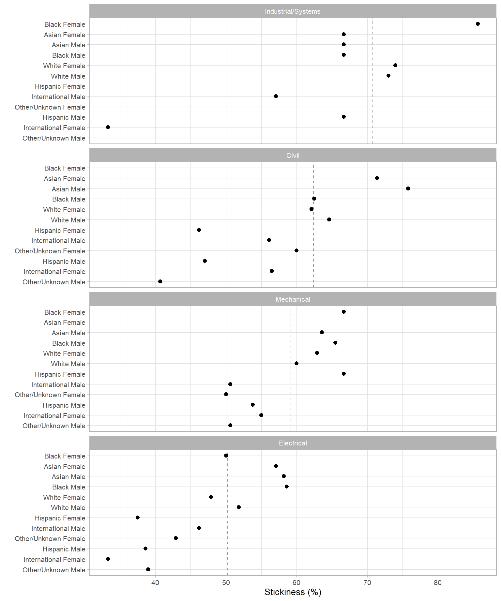
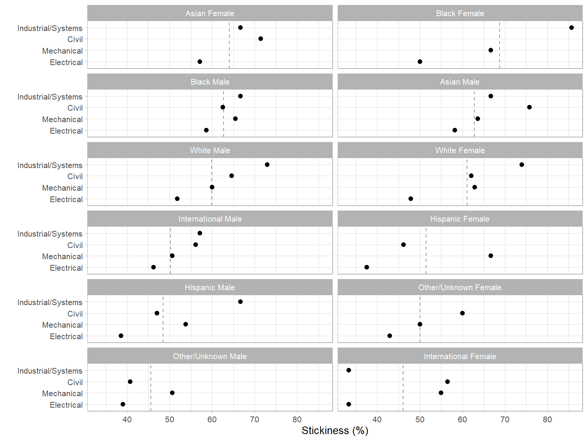

# Case study


How to work with longitudinal student data using midfieldr, focusing on
the overall *process* rather than software details. The work is
organized in three major topics:

1.  Obtaining a credible population and filtering the records to match.
2.  Manipulating the data to produce the desired metric and groupings.
3.  Conditioning the results for dissemination in tables and charts.

### *Scope*

*Records.*   Data: `student, term,` and `degree` from midfielddata,
excluding records later than a student’s first degree term (if any),
restricted to degree-seeking students, and filtered for data
sufficiency.

*Population.*   The set of unique student IDs from the above records.

*Programs.*   Data: `cip` from midfieldr. We study four Engineering
majors: Civil, Electrical, Industrial/Systems, and Mechanical.

*Quantitative metric.*   Program *stickiness:* the ratio $\small (S)$ of
the number of graduates of a program $\small (N_\textrm{grad})$ to the
number ever enrolled in the program $\small (N_\textrm{ever})$.

$$  \small S = \frac{\small N_\textrm{grad}}{\small N_\textrm{ever}} = \frac{\small\mathrm{number\ of\ graduates\ of\ a\ program}}{\small\mathrm{number\ ever\ enrolled\ in\ the\ program}}$$

However a student finds their way to a program (just entering college,
transferring, or switching majors), the program has an opportunity to
see the student through to graduation. Stickiness is the fraction of
students a program entices to “stick to” it through completion ([Ohland
et al. 2012](#ref-Ohland+Orr+others:2012)).

*Blocs.*   The metric requires two blocs: students ever enrolled in the
programs; and timely graduates of the programs.

*Groupings.*   Group the findings by program, race/ethnicity, and sex.

*Dissemination.*   Exclude groupings too small to preserve anonymity;
edit column names to suit the audience; condition/transform data as
needed for tables or charts.

### *Definitions*

For understanding our data manipulation process.

- The population is usually expected to be *degree-seeking,* i.e.,
  attempting to complete a program.

- *Program completion* means satisfying the requirements for a first
  baccalaureate degree.

- The *timely-completion term* is the term by which we would consider
  their completion “timely”, default 6 years after admission.

- The *data sufficiency* test identifies students whose admission term
  and projected timely completion term lie within the range of data
  available from their institution—a necessary and sufficient condition
  for determining completion status.

- *Completion status* is “NA” for non-completion; “timely” for students
  graduating no later than their timely-completion term; and “late”
  otherwise.

### *R packages*

``` r
library("midfieldr") # working with student records
library("midfielddata") # practice data
library("data.table") # data manipulation
library("gt") # tables
library("ggplot2") # charts
```

## Refining the records

We load three of the midfielddata data tables. This study does not
require the `course` data table. If it had been required, it would be
included here and in similar steps throughout the article.

``` r
data(student, term, degree)
```

We copy the original data sets, giving them new names
`{student_source, term_source, degree_source}` and new locations in
memory. This step allows us to use the more convenient names
`{student, term, degree}` for our “working” data tables without updating
the source tables “by reference.” Reference semantics in data.table is
documented in ([*Reference Semantics*
2026](#ref-reference-semantics:2026)).

``` r
student_source <- copy(student)
term_source <- copy(term)
degree_source <- copy(degree)
```

For comparing results as we refine the population, we start with the
following number of rows in the original data frames.

<div id="slbobhpqcv" style="padding-left:0px;padding-right:0px;padding-top:10px;padding-bottom:10px;overflow-x:auto;overflow-y:auto;width:auto;height:auto;">
<style>#slbobhpqcv table {
  font-family: system-ui, 'Segoe UI', Roboto, Helvetica, Arial, sans-serif, 'Apple Color Emoji', 'Segoe UI Emoji', 'Segoe UI Symbol', 'Noto Color Emoji';
  -webkit-font-smoothing: antialiased;
  -moz-osx-font-smoothing: grayscale;
}
&#10;#slbobhpqcv thead, #slbobhpqcv tbody, #slbobhpqcv tfoot, #slbobhpqcv tr, #slbobhpqcv td, #slbobhpqcv th {
  border-style: none;
}
&#10;#slbobhpqcv p {
  margin: 0;
  padding: 0;
}
&#10;#slbobhpqcv .gt_table {
  display: table;
  border-collapse: collapse;
  line-height: normal;
  margin-left: auto;
  margin-right: auto;
  color: #333333;
  font-size: small;
  font-weight: normal;
  font-style: normal;
  background-color: #FFFFFF;
  width: auto;
  border-top-style: solid;
  border-top-width: 2px;
  border-top-color: #000000;
  border-right-style: none;
  border-right-width: 2px;
  border-right-color: #D3D3D3;
  border-bottom-style: solid;
  border-bottom-width: 2px;
  border-bottom-color: #000000;
  border-left-style: none;
  border-left-width: 2px;
  border-left-color: #D3D3D3;
}
&#10;#slbobhpqcv .gt_caption {
  padding-top: 4px;
  padding-bottom: 4px;
}
&#10;#slbobhpqcv .gt_title {
  color: #333333;
  font-size: 125%;
  font-weight: initial;
  padding-top: 4px;
  padding-bottom: 4px;
  padding-left: 5px;
  padding-right: 5px;
  border-bottom-color: #FFFFFF;
  border-bottom-width: 0;
}
&#10;#slbobhpqcv .gt_subtitle {
  color: #333333;
  font-size: 85%;
  font-weight: initial;
  padding-top: 3px;
  padding-bottom: 5px;
  padding-left: 5px;
  padding-right: 5px;
  border-top-color: #FFFFFF;
  border-top-width: 0;
}
&#10;#slbobhpqcv .gt_heading {
  background-color: #FFFFFF;
  text-align: center;
  border-bottom-color: #FFFFFF;
  border-left-style: none;
  border-left-width: 1px;
  border-left-color: #D3D3D3;
  border-right-style: none;
  border-right-width: 1px;
  border-right-color: #D3D3D3;
}
&#10;#slbobhpqcv .gt_bottom_border {
  border-bottom-style: solid;
  border-bottom-width: 2px;
  border-bottom-color: #5F5F5F;
}
&#10;#slbobhpqcv .gt_col_headings {
  border-top-style: solid;
  border-top-width: 2px;
  border-top-color: #5F5F5F;
  border-bottom-style: solid;
  border-bottom-width: 2px;
  border-bottom-color: #5F5F5F;
  border-left-style: none;
  border-left-width: 1px;
  border-left-color: #D3D3D3;
  border-right-style: none;
  border-right-width: 1px;
  border-right-color: #D3D3D3;
}
&#10;#slbobhpqcv .gt_col_heading {
  color: #333333;
  background-color: #FFFFFF;
  font-size: 100%;
  font-weight: normal;
  text-transform: inherit;
  border-left-style: none;
  border-left-width: 1px;
  border-left-color: #D3D3D3;
  border-right-style: none;
  border-right-width: 1px;
  border-right-color: #D3D3D3;
  vertical-align: bottom;
  padding-top: 5px;
  padding-bottom: 6px;
  padding-left: 5px;
  padding-right: 5px;
  overflow-x: hidden;
}
&#10;#slbobhpqcv .gt_column_spanner_outer {
  color: #333333;
  background-color: #FFFFFF;
  font-size: 100%;
  font-weight: normal;
  text-transform: inherit;
  padding-top: 0;
  padding-bottom: 0;
  padding-left: 4px;
  padding-right: 4px;
}
&#10;#slbobhpqcv .gt_column_spanner_outer:first-child {
  padding-left: 0;
}
&#10;#slbobhpqcv .gt_column_spanner_outer:last-child {
  padding-right: 0;
}
&#10;#slbobhpqcv .gt_column_spanner {
  border-bottom-style: solid;
  border-bottom-width: 2px;
  border-bottom-color: #5F5F5F;
  vertical-align: bottom;
  padding-top: 5px;
  padding-bottom: 5px;
  overflow-x: hidden;
  display: inline-block;
  width: 100%;
}
&#10;#slbobhpqcv .gt_spanner_row {
  border-bottom-style: hidden;
}
&#10;#slbobhpqcv .gt_group_heading {
  padding-top: 8px;
  padding-bottom: 8px;
  padding-left: 5px;
  padding-right: 5px;
  color: #333333;
  background-color: #FFFFFF;
  font-size: 100%;
  font-weight: initial;
  text-transform: inherit;
  border-top-style: solid;
  border-top-width: 2px;
  border-top-color: #5F5F5F;
  border-bottom-style: solid;
  border-bottom-width: 2px;
  border-bottom-color: #5F5F5F;
  border-left-style: none;
  border-left-width: 1px;
  border-left-color: #D3D3D3;
  border-right-style: none;
  border-right-width: 1px;
  border-right-color: #D3D3D3;
  vertical-align: middle;
  text-align: left;
}
&#10;#slbobhpqcv .gt_empty_group_heading {
  padding: 0.5px;
  color: #333333;
  background-color: #FFFFFF;
  font-size: 100%;
  font-weight: initial;
  border-top-style: solid;
  border-top-width: 2px;
  border-top-color: #5F5F5F;
  border-bottom-style: solid;
  border-bottom-width: 2px;
  border-bottom-color: #5F5F5F;
  vertical-align: middle;
}
&#10;#slbobhpqcv .gt_from_md > :first-child {
  margin-top: 0;
}
&#10;#slbobhpqcv .gt_from_md > :last-child {
  margin-bottom: 0;
}
&#10;#slbobhpqcv .gt_row {
  padding-top: 8px;
  padding-bottom: 8px;
  padding-left: 5px;
  padding-right: 5px;
  margin: 10px;
  border-top-style: none;
  border-top-width: 1px;
  border-top-color: #D5D5D5;
  border-left-style: none;
  border-left-width: 1px;
  border-left-color: #D5D5D5;
  border-right-style: none;
  border-right-width: 1px;
  border-right-color: #D5D5D5;
  vertical-align: middle;
  overflow-x: hidden;
}
&#10;#slbobhpqcv .gt_stub {
  color: #FFFFFF;
  background-color: #5F5F5F;
  font-size: 100%;
  font-weight: initial;
  text-transform: inherit;
  border-right-style: solid;
  border-right-width: 2px;
  border-right-color: #5F5F5F;
  padding-left: 5px;
  padding-right: 5px;
}
&#10;#slbobhpqcv .gt_stub_row_group {
  color: #333333;
  background-color: #FFFFFF;
  font-size: 100%;
  font-weight: initial;
  text-transform: inherit;
  border-right-style: solid;
  border-right-width: 2px;
  border-right-color: #D3D3D3;
  padding-left: 5px;
  padding-right: 5px;
  vertical-align: top;
}
&#10;#slbobhpqcv .gt_row_group_first td {
  border-top-width: 2px;
}
&#10;#slbobhpqcv .gt_row_group_first th {
  border-top-width: 2px;
}
&#10;#slbobhpqcv .gt_summary_row {
  color: #333333;
  background-color: #FFFFFF;
  text-transform: inherit;
  padding-top: 8px;
  padding-bottom: 8px;
  padding-left: 5px;
  padding-right: 5px;
}
&#10;#slbobhpqcv .gt_first_summary_row {
  border-top-style: solid;
  border-top-color: #5F5F5F;
}
&#10;#slbobhpqcv .gt_first_summary_row.thick {
  border-top-width: 2px;
}
&#10;#slbobhpqcv .gt_last_summary_row {
  padding-top: 8px;
  padding-bottom: 8px;
  padding-left: 5px;
  padding-right: 5px;
  border-bottom-style: solid;
  border-bottom-width: 2px;
  border-bottom-color: #5F5F5F;
}
&#10;#slbobhpqcv .gt_grand_summary_row {
  color: #333333;
  background-color: #D5D5D5;
  text-transform: inherit;
  padding-top: 8px;
  padding-bottom: 8px;
  padding-left: 5px;
  padding-right: 5px;
}
&#10;#slbobhpqcv .gt_first_grand_summary_row {
  padding-top: 8px;
  padding-bottom: 8px;
  padding-left: 5px;
  padding-right: 5px;
  border-top-style: double;
  border-top-width: 6px;
  border-top-color: #5F5F5F;
}
&#10;#slbobhpqcv .gt_last_grand_summary_row_top {
  padding-top: 8px;
  padding-bottom: 8px;
  padding-left: 5px;
  padding-right: 5px;
  border-bottom-style: double;
  border-bottom-width: 6px;
  border-bottom-color: #5F5F5F;
}
&#10;#slbobhpqcv .gt_striped {
  background-color: #F4F4F4;
}
&#10;#slbobhpqcv .gt_table_body {
  border-top-style: solid;
  border-top-width: 2px;
  border-top-color: #5F5F5F;
  border-bottom-style: solid;
  border-bottom-width: 2px;
  border-bottom-color: #5F5F5F;
}
&#10;#slbobhpqcv .gt_footnotes {
  color: #333333;
  background-color: #FFFFFF;
  border-bottom-style: none;
  border-bottom-width: 2px;
  border-bottom-color: #D3D3D3;
  border-left-style: none;
  border-left-width: 2px;
  border-left-color: #D3D3D3;
  border-right-style: none;
  border-right-width: 2px;
  border-right-color: #D3D3D3;
}
&#10;#slbobhpqcv .gt_footnote {
  margin: 0px;
  font-size: 90%;
  padding-top: 4px;
  padding-bottom: 4px;
  padding-left: 5px;
  padding-right: 5px;
}
&#10;#slbobhpqcv .gt_sourcenotes {
  color: #333333;
  background-color: #FFFFFF;
  border-bottom-style: none;
  border-bottom-width: 2px;
  border-bottom-color: #D3D3D3;
  border-left-style: none;
  border-left-width: 2px;
  border-left-color: #D3D3D3;
  border-right-style: none;
  border-right-width: 2px;
  border-right-color: #D3D3D3;
}
&#10;#slbobhpqcv .gt_sourcenote {
  font-size: 90%;
  padding-top: 4px;
  padding-bottom: 4px;
  padding-left: 5px;
  padding-right: 5px;
}
&#10;#slbobhpqcv .gt_left {
  text-align: left;
}
&#10;#slbobhpqcv .gt_center {
  text-align: center;
}
&#10;#slbobhpqcv .gt_right {
  text-align: right;
  font-variant-numeric: tabular-nums;
}
&#10;#slbobhpqcv .gt_font_normal {
  font-weight: normal;
}
&#10;#slbobhpqcv .gt_font_bold {
  font-weight: bold;
}
&#10;#slbobhpqcv .gt_font_italic {
  font-style: italic;
}
&#10;#slbobhpqcv .gt_super {
  font-size: 65%;
}
&#10;#slbobhpqcv .gt_footnote_marks {
  font-size: 75%;
  vertical-align: 0.4em;
  position: initial;
}
&#10;#slbobhpqcv .gt_asterisk {
  font-size: 100%;
  vertical-align: 0;
}
&#10;#slbobhpqcv .gt_indent_1 {
  text-indent: 5px;
}
&#10;#slbobhpqcv .gt_indent_2 {
  text-indent: 10px;
}
&#10;#slbobhpqcv .gt_indent_3 {
  text-indent: 15px;
}
&#10;#slbobhpqcv .gt_indent_4 {
  text-indent: 20px;
}
&#10;#slbobhpqcv .gt_indent_5 {
  text-indent: 25px;
}
&#10;#slbobhpqcv .katex-display {
  display: inline-flex !important;
  margin-bottom: 0.75em !important;
}
&#10;#slbobhpqcv div.Reactable > div.rt-table > div.rt-thead > div.rt-tr.rt-tr-group-header > div.rt-th-group:after {
  height: 0px !important;
}
</style>
<table class="gt_table" data-quarto-disable-processing="false" data-quarto-bootstrap="false">
  <caption>Table 1(a). Number of rows.</caption>
  <thead>
    <tr class="gt_col_headings">
      <th class="gt_col_heading gt_columns_bottom_border gt_left" rowspan="1" colspan="1" style="background-color: #C7EAE5;" scope="col" id="Table">Table</th>
      <th class="gt_col_heading gt_columns_bottom_border gt_right" rowspan="1" colspan="1" style="background-color: #C7EAE5;" scope="col" id="Original-tables">Original tables</th>
    </tr>
  </thead>
  <tbody class="gt_table_body">
    <tr><td headers="Table" class="gt_row gt_left">student</td>
<td headers="Original tables" class="gt_row gt_right">97,555</td></tr>
    <tr><td headers="Table" class="gt_row gt_left gt_striped">term</td>
<td headers="Original tables" class="gt_row gt_right gt_striped">639,915</td></tr>
    <tr><td headers="Table" class="gt_row gt_left">degree</td>
<td headers="Original tables" class="gt_row gt_right">49,665</td></tr>
  </tbody>
  &#10;</table>
</div>

### *Required variables*

For this first section of the work, we (optionally) use
`select_basic_cols()` to subset the data tables, retaining only those
variables needed by midfieldr functions.

``` r
student <- select_basic_cols(student)
term <- select_basic_cols(term)
degree <- select_basic_cols(degree)

student
#>                  mcid          race    sex
#>                <char>        <char> <char>
#>     1: MCID3111142225         Asian   Male
#>     2: MCID3111142283         Asian Female
#>     3: MCID3111142290         Asian   Male
#>    ---                                    
#> 97553: MCID3112898894         White Female
#> 97554: MCID3112898895         White Female
#> 97555: MCID3112898940 Other/Unknown   Male

term
#>                   mcid   term   cip6   institution         level
#>                 <char> <char> <char>        <char>        <char>
#>      1: MCID3111142225  19881 140901 Institution B 01 First-year
#>      2: MCID3111142283  19881 240102 Institution J 01 First-year
#>      3: MCID3111142283  19883 240102 Institution J 01 First-year
#>     ---                                                         
#> 639913: MCID3112898894  20181 451001 Institution B 01 First-year
#> 639914: MCID3112898895  20181 302001 Institution B 01 First-year
#> 639915: MCID3112898940  20181 050103 Institution B 01 First-year

degree
#>                  mcid term_degree   cip6
#>                <char>      <char> <char>
#>     1: MCID3111142225       19881 141001
#>     2: MCID3111142290       19921 141001
#>     3: MCID3111142294       19903 141001
#>    ---                                  
#> 49663: MCID3112839623       20181 160102
#> 49664: MCID3112845220       20181 270101
#> 49665: MCID3112845673       20174 090101
```

### *Data sufficiency*

Only those records passing the data sufficiency test are included in a
population study. We start with the full set of unique student IDs.

``` r
DT <- term[, .(mcid)]
DT <- unique(DT)
DT
#>                  mcid
#>                <char>
#>     1: MCID3111142225
#>     2: MCID3111142283
#>     3: MCID3111142290
#>    ---               
#> 97553: MCID3112898894
#> 97554: MCID3112898895
#> 97555: MCID3112898940
```

We use `timely_term()` to determine the timely completion term for every
student and add columns to the data frame to support those findings.

``` r
DT <- timely_term(DT, midf_table = term)
DT
#>                  mcid term_i       level_i adj_span timely_term
#>                <char> <char>        <char>    <num>      <char>
#>     1: MCID3111142225  19881 01 First-year        6       19933
#>     2: MCID3111142283  19881 01 First-year        6       19933
#>     3: MCID3111142290  19881 01 First-year        6       19933
#>    ---                                                         
#> 97553: MCID3112898894  20181 01 First-year        6       20233
#> 97554: MCID3112898895  20181 01 First-year        6       20233
#> 97555: MCID3112898940  20181 01 First-year        6       20233
```

Next, we can (optionally) reduce the number of columns to just those
needed in the next step.

``` r
DT <- DT[, .(mcid, term_i, timely_term)]
DT
#>                  mcid term_i timely_term
#>                <char> <char>      <char>
#>     1: MCID3111142225  19881       19933
#>     2: MCID3111142283  19881       19933
#>     3: MCID3111142290  19881       19933
#>    ---                                  
#> 97553: MCID3112898894  20181       20233
#> 97554: MCID3112898895  20181       20233
#> 97555: MCID3112898940  20181       20233
```

We operate on this output with `data_sufficiency()` to identify records
that pass or fail the data sufficiency test and add columns to the data
frame to support those findings.

``` r
DT <- data_sufficiency(DT, midf_table = term)
DT
#>                  mcid term_i timely_term  data_range data_sufficiency
#>                <char> <char>      <char>      <char>           <char>
#>     1: MCID3111142225  19881       19933 19881-20181    exclude-lower
#>     2: MCID3111142283  19881       19933 19881-20096    exclude-lower
#>     3: MCID3111142290  19881       19933 19881-20096    exclude-lower
#>    ---                                                               
#> 97553: MCID3112898894  20181       20233 19881-20181    exclude-upper
#> 97554: MCID3112898895  20181       20233 19881-20181    exclude-upper
#> 97555: MCID3112898940  20181       20233 19881-20181    exclude-upper
```

*Summary check.*   A brief aside to summarize the numbers of students
identified to include and exclude. We run a similar summary at a number
of points in the analysis as a credibility check.

``` r
DT[, .N, by = c("data_sufficiency")][order(-N)]
#>    data_sufficiency     N
#>              <char> <int>
#> 1:          include 76875
#> 2:    exclude-upper 17934
#> 3:    exclude-lower  2746
```

We filter to retain rows labeled “include” and drop all but the ID
column.

``` r
DT <- DT[data_sufficiency == "include", .(mcid)]
DT
#>                  mcid
#>                <char>
#>     1: MCID3111142689
#>     2: MCID3111142782
#>     3: MCID3111142881
#>    ---               
#> 76873: MCID3112785480
#> 76874: MCID3112800920
#> 76875: MCID3112870009
```

### *Degree seeking*

We require all students in our study to be degree-seeking. By design,
the `student` table contains only degree-seeking students. We inner-join
the ID column from the `student` table with our working data frame `DT`,
matching on `mcid`, to remove any non-degree-seeking students.

``` r
student_col <- student[, .(mcid)]
DT <- student_col[DT, on = "mcid", nomatch = NULL]
DT
#>                  mcid
#>                <char>
#>     1: MCID3111142689
#>     2: MCID3111142782
#>     3: MCID3111142881
#>    ---               
#> 76873: MCID3112785480
#> 76874: MCID3112800920
#> 76875: MCID3112870009
```

In this instance, no students were removed because the midfielddata
practice data contains only degree-seeking students. However, our
process would not be complete without this step.

### *Population*

The steps above—filtering for data sufficiency and degree-seeking—yield
the baseline population for this study.

``` r
population <- copy(DT)
```

We use an inner join, matching on `mcid,` to subset the data tables to
retain records for this population only.

``` r
student_refined <- population[student_source, on = "mcid", nomatch = NULL]
term_refined <- population[term_source, on = "mcid", nomatch = NULL]
degree_refined <- population[degree_source, on = "mcid", nomatch = NULL]
```

<div id="lwmuonohoq" style="padding-left:0px;padding-right:0px;padding-top:10px;padding-bottom:10px;overflow-x:auto;overflow-y:auto;width:auto;height:auto;">
<style>#lwmuonohoq table {
  font-family: system-ui, 'Segoe UI', Roboto, Helvetica, Arial, sans-serif, 'Apple Color Emoji', 'Segoe UI Emoji', 'Segoe UI Symbol', 'Noto Color Emoji';
  -webkit-font-smoothing: antialiased;
  -moz-osx-font-smoothing: grayscale;
}
&#10;#lwmuonohoq thead, #lwmuonohoq tbody, #lwmuonohoq tfoot, #lwmuonohoq tr, #lwmuonohoq td, #lwmuonohoq th {
  border-style: none;
}
&#10;#lwmuonohoq p {
  margin: 0;
  padding: 0;
}
&#10;#lwmuonohoq .gt_table {
  display: table;
  border-collapse: collapse;
  line-height: normal;
  margin-left: auto;
  margin-right: auto;
  color: #333333;
  font-size: small;
  font-weight: normal;
  font-style: normal;
  background-color: #FFFFFF;
  width: auto;
  border-top-style: solid;
  border-top-width: 2px;
  border-top-color: #000000;
  border-right-style: none;
  border-right-width: 2px;
  border-right-color: #D3D3D3;
  border-bottom-style: solid;
  border-bottom-width: 2px;
  border-bottom-color: #000000;
  border-left-style: none;
  border-left-width: 2px;
  border-left-color: #D3D3D3;
}
&#10;#lwmuonohoq .gt_caption {
  padding-top: 4px;
  padding-bottom: 4px;
}
&#10;#lwmuonohoq .gt_title {
  color: #333333;
  font-size: 125%;
  font-weight: initial;
  padding-top: 4px;
  padding-bottom: 4px;
  padding-left: 5px;
  padding-right: 5px;
  border-bottom-color: #FFFFFF;
  border-bottom-width: 0;
}
&#10;#lwmuonohoq .gt_subtitle {
  color: #333333;
  font-size: 85%;
  font-weight: initial;
  padding-top: 3px;
  padding-bottom: 5px;
  padding-left: 5px;
  padding-right: 5px;
  border-top-color: #FFFFFF;
  border-top-width: 0;
}
&#10;#lwmuonohoq .gt_heading {
  background-color: #FFFFFF;
  text-align: center;
  border-bottom-color: #FFFFFF;
  border-left-style: none;
  border-left-width: 1px;
  border-left-color: #D3D3D3;
  border-right-style: none;
  border-right-width: 1px;
  border-right-color: #D3D3D3;
}
&#10;#lwmuonohoq .gt_bottom_border {
  border-bottom-style: solid;
  border-bottom-width: 2px;
  border-bottom-color: #5F5F5F;
}
&#10;#lwmuonohoq .gt_col_headings {
  border-top-style: solid;
  border-top-width: 2px;
  border-top-color: #5F5F5F;
  border-bottom-style: solid;
  border-bottom-width: 2px;
  border-bottom-color: #5F5F5F;
  border-left-style: none;
  border-left-width: 1px;
  border-left-color: #D3D3D3;
  border-right-style: none;
  border-right-width: 1px;
  border-right-color: #D3D3D3;
}
&#10;#lwmuonohoq .gt_col_heading {
  color: #333333;
  background-color: #FFFFFF;
  font-size: 100%;
  font-weight: normal;
  text-transform: inherit;
  border-left-style: none;
  border-left-width: 1px;
  border-left-color: #D3D3D3;
  border-right-style: none;
  border-right-width: 1px;
  border-right-color: #D3D3D3;
  vertical-align: bottom;
  padding-top: 5px;
  padding-bottom: 6px;
  padding-left: 5px;
  padding-right: 5px;
  overflow-x: hidden;
}
&#10;#lwmuonohoq .gt_column_spanner_outer {
  color: #333333;
  background-color: #FFFFFF;
  font-size: 100%;
  font-weight: normal;
  text-transform: inherit;
  padding-top: 0;
  padding-bottom: 0;
  padding-left: 4px;
  padding-right: 4px;
}
&#10;#lwmuonohoq .gt_column_spanner_outer:first-child {
  padding-left: 0;
}
&#10;#lwmuonohoq .gt_column_spanner_outer:last-child {
  padding-right: 0;
}
&#10;#lwmuonohoq .gt_column_spanner {
  border-bottom-style: solid;
  border-bottom-width: 2px;
  border-bottom-color: #5F5F5F;
  vertical-align: bottom;
  padding-top: 5px;
  padding-bottom: 5px;
  overflow-x: hidden;
  display: inline-block;
  width: 100%;
}
&#10;#lwmuonohoq .gt_spanner_row {
  border-bottom-style: hidden;
}
&#10;#lwmuonohoq .gt_group_heading {
  padding-top: 8px;
  padding-bottom: 8px;
  padding-left: 5px;
  padding-right: 5px;
  color: #333333;
  background-color: #FFFFFF;
  font-size: 100%;
  font-weight: initial;
  text-transform: inherit;
  border-top-style: solid;
  border-top-width: 2px;
  border-top-color: #5F5F5F;
  border-bottom-style: solid;
  border-bottom-width: 2px;
  border-bottom-color: #5F5F5F;
  border-left-style: none;
  border-left-width: 1px;
  border-left-color: #D3D3D3;
  border-right-style: none;
  border-right-width: 1px;
  border-right-color: #D3D3D3;
  vertical-align: middle;
  text-align: left;
}
&#10;#lwmuonohoq .gt_empty_group_heading {
  padding: 0.5px;
  color: #333333;
  background-color: #FFFFFF;
  font-size: 100%;
  font-weight: initial;
  border-top-style: solid;
  border-top-width: 2px;
  border-top-color: #5F5F5F;
  border-bottom-style: solid;
  border-bottom-width: 2px;
  border-bottom-color: #5F5F5F;
  vertical-align: middle;
}
&#10;#lwmuonohoq .gt_from_md > :first-child {
  margin-top: 0;
}
&#10;#lwmuonohoq .gt_from_md > :last-child {
  margin-bottom: 0;
}
&#10;#lwmuonohoq .gt_row {
  padding-top: 8px;
  padding-bottom: 8px;
  padding-left: 5px;
  padding-right: 5px;
  margin: 10px;
  border-top-style: none;
  border-top-width: 1px;
  border-top-color: #D5D5D5;
  border-left-style: none;
  border-left-width: 1px;
  border-left-color: #D5D5D5;
  border-right-style: none;
  border-right-width: 1px;
  border-right-color: #D5D5D5;
  vertical-align: middle;
  overflow-x: hidden;
}
&#10;#lwmuonohoq .gt_stub {
  color: #FFFFFF;
  background-color: #5F5F5F;
  font-size: 100%;
  font-weight: initial;
  text-transform: inherit;
  border-right-style: solid;
  border-right-width: 2px;
  border-right-color: #5F5F5F;
  padding-left: 5px;
  padding-right: 5px;
}
&#10;#lwmuonohoq .gt_stub_row_group {
  color: #333333;
  background-color: #FFFFFF;
  font-size: 100%;
  font-weight: initial;
  text-transform: inherit;
  border-right-style: solid;
  border-right-width: 2px;
  border-right-color: #D3D3D3;
  padding-left: 5px;
  padding-right: 5px;
  vertical-align: top;
}
&#10;#lwmuonohoq .gt_row_group_first td {
  border-top-width: 2px;
}
&#10;#lwmuonohoq .gt_row_group_first th {
  border-top-width: 2px;
}
&#10;#lwmuonohoq .gt_summary_row {
  color: #333333;
  background-color: #FFFFFF;
  text-transform: inherit;
  padding-top: 8px;
  padding-bottom: 8px;
  padding-left: 5px;
  padding-right: 5px;
}
&#10;#lwmuonohoq .gt_first_summary_row {
  border-top-style: solid;
  border-top-color: #5F5F5F;
}
&#10;#lwmuonohoq .gt_first_summary_row.thick {
  border-top-width: 2px;
}
&#10;#lwmuonohoq .gt_last_summary_row {
  padding-top: 8px;
  padding-bottom: 8px;
  padding-left: 5px;
  padding-right: 5px;
  border-bottom-style: solid;
  border-bottom-width: 2px;
  border-bottom-color: #5F5F5F;
}
&#10;#lwmuonohoq .gt_grand_summary_row {
  color: #333333;
  background-color: #D5D5D5;
  text-transform: inherit;
  padding-top: 8px;
  padding-bottom: 8px;
  padding-left: 5px;
  padding-right: 5px;
}
&#10;#lwmuonohoq .gt_first_grand_summary_row {
  padding-top: 8px;
  padding-bottom: 8px;
  padding-left: 5px;
  padding-right: 5px;
  border-top-style: double;
  border-top-width: 6px;
  border-top-color: #5F5F5F;
}
&#10;#lwmuonohoq .gt_last_grand_summary_row_top {
  padding-top: 8px;
  padding-bottom: 8px;
  padding-left: 5px;
  padding-right: 5px;
  border-bottom-style: double;
  border-bottom-width: 6px;
  border-bottom-color: #5F5F5F;
}
&#10;#lwmuonohoq .gt_striped {
  background-color: #F4F4F4;
}
&#10;#lwmuonohoq .gt_table_body {
  border-top-style: solid;
  border-top-width: 2px;
  border-top-color: #5F5F5F;
  border-bottom-style: solid;
  border-bottom-width: 2px;
  border-bottom-color: #5F5F5F;
}
&#10;#lwmuonohoq .gt_footnotes {
  color: #333333;
  background-color: #FFFFFF;
  border-bottom-style: none;
  border-bottom-width: 2px;
  border-bottom-color: #D3D3D3;
  border-left-style: none;
  border-left-width: 2px;
  border-left-color: #D3D3D3;
  border-right-style: none;
  border-right-width: 2px;
  border-right-color: #D3D3D3;
}
&#10;#lwmuonohoq .gt_footnote {
  margin: 0px;
  font-size: 90%;
  padding-top: 4px;
  padding-bottom: 4px;
  padding-left: 5px;
  padding-right: 5px;
}
&#10;#lwmuonohoq .gt_sourcenotes {
  color: #333333;
  background-color: #FFFFFF;
  border-bottom-style: none;
  border-bottom-width: 2px;
  border-bottom-color: #D3D3D3;
  border-left-style: none;
  border-left-width: 2px;
  border-left-color: #D3D3D3;
  border-right-style: none;
  border-right-width: 2px;
  border-right-color: #D3D3D3;
}
&#10;#lwmuonohoq .gt_sourcenote {
  font-size: 90%;
  padding-top: 4px;
  padding-bottom: 4px;
  padding-left: 5px;
  padding-right: 5px;
}
&#10;#lwmuonohoq .gt_left {
  text-align: left;
}
&#10;#lwmuonohoq .gt_center {
  text-align: center;
}
&#10;#lwmuonohoq .gt_right {
  text-align: right;
  font-variant-numeric: tabular-nums;
}
&#10;#lwmuonohoq .gt_font_normal {
  font-weight: normal;
}
&#10;#lwmuonohoq .gt_font_bold {
  font-weight: bold;
}
&#10;#lwmuonohoq .gt_font_italic {
  font-style: italic;
}
&#10;#lwmuonohoq .gt_super {
  font-size: 65%;
}
&#10;#lwmuonohoq .gt_footnote_marks {
  font-size: 75%;
  vertical-align: 0.4em;
  position: initial;
}
&#10;#lwmuonohoq .gt_asterisk {
  font-size: 100%;
  vertical-align: 0;
}
&#10;#lwmuonohoq .gt_indent_1 {
  text-indent: 5px;
}
&#10;#lwmuonohoq .gt_indent_2 {
  text-indent: 10px;
}
&#10;#lwmuonohoq .gt_indent_3 {
  text-indent: 15px;
}
&#10;#lwmuonohoq .gt_indent_4 {
  text-indent: 20px;
}
&#10;#lwmuonohoq .gt_indent_5 {
  text-indent: 25px;
}
&#10;#lwmuonohoq .katex-display {
  display: inline-flex !important;
  margin-bottom: 0.75em !important;
}
&#10;#lwmuonohoq div.Reactable > div.rt-table > div.rt-thead > div.rt-tr.rt-tr-group-header > div.rt-th-group:after {
  height: 0px !important;
}
</style>
<table class="gt_table" data-quarto-disable-processing="false" data-quarto-bootstrap="false">
  <caption>Table 1(b). Number of rows</caption>
  <thead>
    <tr class="gt_col_headings">
      <th class="gt_col_heading gt_columns_bottom_border gt_left" rowspan="1" colspan="1" style="background-color: #C7EAE5;" scope="col" id="Table">Table</th>
      <th class="gt_col_heading gt_columns_bottom_border gt_right" rowspan="1" colspan="1" style="background-color: #C7EAE5;" scope="col" id="Original-tables">Original tables</th>
      <th class="gt_col_heading gt_columns_bottom_border gt_right" rowspan="1" colspan="1" style="background-color: #C7EAE5;" scope="col" id="Refined-population">Refined population</th>
    </tr>
  </thead>
  <tbody class="gt_table_body">
    <tr><td headers="Table" class="gt_row gt_left">student</td>
<td headers="Original tables" class="gt_row gt_right">97,555</td>
<td headers="Refined population" class="gt_row gt_right">76,875</td></tr>
    <tr><td headers="Table" class="gt_row gt_left gt_striped">term</td>
<td headers="Original tables" class="gt_row gt_right gt_striped">639,915</td>
<td headers="Refined population" class="gt_row gt_right gt_striped">531,419</td></tr>
    <tr><td headers="Table" class="gt_row gt_left">degree</td>
<td headers="Original tables" class="gt_row gt_right">49,665</td>
<td headers="Refined population" class="gt_row gt_right">43,903</td></tr>
  </tbody>
  &#10;</table>
</div>

### *Post-completion terms*

We are generally not interested in data past the first degree term, so
we identify and exclude post-first-degree terms in the source data
frames. The procedure applies to the data tables having columns of term
values `{term$term, course$term_course, degree$term_degree}.`

``` r
term <- copy(term_refined)
degree <- copy(degree_refined)
```

Every term value occurs before or after a student completes their first
degree. We use `post_completion_terms()` to label each term “before” or
“after” relative to a student’s first completion (if any) and add
columns to the data frame to support those findings.

``` r
term <- post_completion_terms(term, midf_table = degree)
degree <- post_completion_terms(degree, midf_table = degree)

# View relevant columns
term[order(-before_or_after), .(mcid, term, before_or_after, first_term_degree)]
#>                   mcid   term before_or_after first_term_degree
#>                 <char> <char>          <char>            <char>
#>      1: MCID3111142689  19883          before             19913
#>      2: MCID3111142782  19883          before             19903
#>      3: MCID3111142782  19885          before             19903
#>     ---                                                        
#> 531417: MCID3112501004  20161           after             20133
#> 531418: MCID3112595308  20161           after             20154
#> 531419: MCID3112619703  20161           after             20154

degree[order(-before_or_after), .(mcid, term_degree, before_or_after, first_term_degree)]
#>                  mcid term_degree before_or_after first_term_degree
#>                <char>      <char>          <char>            <char>
#>     1: MCID3111142689       19913          before             19913
#>     2: MCID3111142782       19903          before             19903
#>     3: MCID3111142881       19894          before             19894
#>    ---                                                             
#> 43901: MCID3112290406       20143           after             20111
#> 43902: MCID3112347391       20133           after             20101
#> 43903: MCID3112407729       20133           after             20123
```

*Summary check.*   Numbers of students in each category.

``` r
term[, .N, by = c("before_or_after")][order(-N)]
#>    before_or_after      N
#>             <char>  <int>
#> 1:          before 525446
#> 2:           after   5973

degree[, .N, by = c("before_or_after")][order(-N)]
#>    before_or_after     N
#>             <char> <int>
#> 1:          before 43857
#> 2:           after    46
```

We keep the rows labeled “before.” Note that we are dropping rows by
values in the *term* variable without affecting the number of students
in the *population.*

``` r
term <- term[before_or_after == "before"]
degree <- degree[before_or_after == "before"]

# drop temporary columns
term[, c("before_or_after", "first_term_degree") := NULL]
degree[, c("before_or_after", "first_term_degree") := NULL]
```

With this step, we conclude the development of what we are calling our
`_baseline` tables, filtered for data sufficiency and degree-seeking and
excluding post-first-degree terms.

``` r
student_baseline <- copy(student_refined)
term_baseline <- copy(term)
degree_baseline <- copy(degree)
```

Review the results.

``` r
look_at(student_baseline)
#> Classes 'data.table' and 'data.frame':   76875 obs. of  13 variables:
#>  $ mcid          : chr  "MCID3111142689" "MCID3111142782" "MCID3111142881" "M"..
#>  $ race          : chr  "Hispanic" "Hispanic" "International" "International" ..
#>  $ sex           : chr  "Female" "Female" "Male" "Male" ...
#>  $ institution   : chr  "Institution B" "Institution J" "Institution B" "Inst"..
#>  $ transfer      : chr  "First-Time Transfer" "First-Time Transfer" "First-Ti"..
#>  $ hours_transfer: num  NA NA NA NA NA NA NA NA NA NA ...
#>  $ age_desc      : chr  "Under 25" "Under 25" "25 and Older" "Under 25" ...
#>  $ us_citizen    : chr  "Yes" "Yes" "Yes" "No" ...
#>  $ home_zip      : chr  NA "22101" NA NA ...
#>  $ high_school   : chr  NA "471395" NA NA ...
#>  $ sat_math      : num  NA 520 NA NA NA NA NA NA NA NA ...
#>  $ sat_verbal    : num  NA 490 NA NA NA NA NA NA NA NA ...
#>  $ act_comp      : num  NA NA NA NA NA NA NA NA NA NA ...

look_at(term_baseline)
#> Classes 'data.table' and 'data.frame':   525446 obs. of  13 variables:
#>  $ mcid               : chr  "MCID3111142689" "MCID3111142782" "MCID311114278"..
#>  $ term               : chr  "19883" "19883" "19885" "19893" ...
#>  $ cip6               : chr  "090401" "260101" "260101" "260101" ...
#>  $ institution        : chr  "Institution B" "Institution J" "Institution J" "..
#>  $ level              : chr  "01 First-year" "01 First-year" "02 Second-year""..
#>  $ standing           : chr  "Good Standing" "Good Standing" "Good Standing" "..
#>  $ coop               : chr  "No" "No" "No" "No" ...
#>  $ hours_term         : num  9 16 4 13 4 4 10 9 18 6 ...
#>  $ hours_term_attempt : num  9 16 4 13 4 4 10 9 18 6 ...
#>  $ hours_cumul        : num  18 26 30 56 60 64 74 83 21 27 ...
#>  $ hours_cumul_attempt: num  18 26 30 56 60 64 74 83 21 27 ...
#>  $ gpa_term           : num  3.33 2.8 3 2.84 4 3.25 2.26 2.43 2.55 2.15 ...
#>  $ gpa_cumul          : num  3.05 2.57 2.63 2.53 2.63 2.67 2.61 2.59 2.76 2.62..

look_at(degree_baseline)
#> Classes 'data.table' and 'data.frame':   43857 obs. of  5 variables:
#>  $ mcid       : chr  "MCID3111142689" "MCID3111142782" "MCID3111142881" "MCID"..
#>  $ term_degree: chr  "19913" "19903" "19894" "19901" ...
#>  $ cip6       : chr  "090401" "260101" "450601" "141001" ...
#>  $ institution: chr  "Institution B" "Institution J" "Institution B" "Institu"..
#>  $ degree     : chr  "Bachelor of Arts in Journalism" "Bachelor of Science in"..

look_at(population)
#> Classes 'data.table' and 'data.frame':   76875 obs. of  1 variable:
#>  $ mcid: chr  "MCID3111142689" "MCID3111142782" "MCID3111142881" "MCID3111142"..
```

<div id="vipsfehsgh" style="padding-left:0px;padding-right:0px;padding-top:10px;padding-bottom:10px;overflow-x:auto;overflow-y:auto;width:auto;height:auto;">
<style>#vipsfehsgh table {
  font-family: system-ui, 'Segoe UI', Roboto, Helvetica, Arial, sans-serif, 'Apple Color Emoji', 'Segoe UI Emoji', 'Segoe UI Symbol', 'Noto Color Emoji';
  -webkit-font-smoothing: antialiased;
  -moz-osx-font-smoothing: grayscale;
}
&#10;#vipsfehsgh thead, #vipsfehsgh tbody, #vipsfehsgh tfoot, #vipsfehsgh tr, #vipsfehsgh td, #vipsfehsgh th {
  border-style: none;
}
&#10;#vipsfehsgh p {
  margin: 0;
  padding: 0;
}
&#10;#vipsfehsgh .gt_table {
  display: table;
  border-collapse: collapse;
  line-height: normal;
  margin-left: auto;
  margin-right: auto;
  color: #333333;
  font-size: small;
  font-weight: normal;
  font-style: normal;
  background-color: #FFFFFF;
  width: auto;
  border-top-style: solid;
  border-top-width: 2px;
  border-top-color: #000000;
  border-right-style: none;
  border-right-width: 2px;
  border-right-color: #D3D3D3;
  border-bottom-style: solid;
  border-bottom-width: 2px;
  border-bottom-color: #000000;
  border-left-style: none;
  border-left-width: 2px;
  border-left-color: #D3D3D3;
}
&#10;#vipsfehsgh .gt_caption {
  padding-top: 4px;
  padding-bottom: 4px;
}
&#10;#vipsfehsgh .gt_title {
  color: #333333;
  font-size: 125%;
  font-weight: initial;
  padding-top: 4px;
  padding-bottom: 4px;
  padding-left: 5px;
  padding-right: 5px;
  border-bottom-color: #FFFFFF;
  border-bottom-width: 0;
}
&#10;#vipsfehsgh .gt_subtitle {
  color: #333333;
  font-size: 85%;
  font-weight: initial;
  padding-top: 3px;
  padding-bottom: 5px;
  padding-left: 5px;
  padding-right: 5px;
  border-top-color: #FFFFFF;
  border-top-width: 0;
}
&#10;#vipsfehsgh .gt_heading {
  background-color: #FFFFFF;
  text-align: center;
  border-bottom-color: #FFFFFF;
  border-left-style: none;
  border-left-width: 1px;
  border-left-color: #D3D3D3;
  border-right-style: none;
  border-right-width: 1px;
  border-right-color: #D3D3D3;
}
&#10;#vipsfehsgh .gt_bottom_border {
  border-bottom-style: solid;
  border-bottom-width: 2px;
  border-bottom-color: #5F5F5F;
}
&#10;#vipsfehsgh .gt_col_headings {
  border-top-style: solid;
  border-top-width: 2px;
  border-top-color: #5F5F5F;
  border-bottom-style: solid;
  border-bottom-width: 2px;
  border-bottom-color: #5F5F5F;
  border-left-style: none;
  border-left-width: 1px;
  border-left-color: #D3D3D3;
  border-right-style: none;
  border-right-width: 1px;
  border-right-color: #D3D3D3;
}
&#10;#vipsfehsgh .gt_col_heading {
  color: #333333;
  background-color: #FFFFFF;
  font-size: 100%;
  font-weight: normal;
  text-transform: inherit;
  border-left-style: none;
  border-left-width: 1px;
  border-left-color: #D3D3D3;
  border-right-style: none;
  border-right-width: 1px;
  border-right-color: #D3D3D3;
  vertical-align: bottom;
  padding-top: 5px;
  padding-bottom: 6px;
  padding-left: 5px;
  padding-right: 5px;
  overflow-x: hidden;
}
&#10;#vipsfehsgh .gt_column_spanner_outer {
  color: #333333;
  background-color: #FFFFFF;
  font-size: 100%;
  font-weight: normal;
  text-transform: inherit;
  padding-top: 0;
  padding-bottom: 0;
  padding-left: 4px;
  padding-right: 4px;
}
&#10;#vipsfehsgh .gt_column_spanner_outer:first-child {
  padding-left: 0;
}
&#10;#vipsfehsgh .gt_column_spanner_outer:last-child {
  padding-right: 0;
}
&#10;#vipsfehsgh .gt_column_spanner {
  border-bottom-style: solid;
  border-bottom-width: 2px;
  border-bottom-color: #5F5F5F;
  vertical-align: bottom;
  padding-top: 5px;
  padding-bottom: 5px;
  overflow-x: hidden;
  display: inline-block;
  width: 100%;
}
&#10;#vipsfehsgh .gt_spanner_row {
  border-bottom-style: hidden;
}
&#10;#vipsfehsgh .gt_group_heading {
  padding-top: 8px;
  padding-bottom: 8px;
  padding-left: 5px;
  padding-right: 5px;
  color: #333333;
  background-color: #FFFFFF;
  font-size: 100%;
  font-weight: initial;
  text-transform: inherit;
  border-top-style: solid;
  border-top-width: 2px;
  border-top-color: #5F5F5F;
  border-bottom-style: solid;
  border-bottom-width: 2px;
  border-bottom-color: #5F5F5F;
  border-left-style: none;
  border-left-width: 1px;
  border-left-color: #D3D3D3;
  border-right-style: none;
  border-right-width: 1px;
  border-right-color: #D3D3D3;
  vertical-align: middle;
  text-align: left;
}
&#10;#vipsfehsgh .gt_empty_group_heading {
  padding: 0.5px;
  color: #333333;
  background-color: #FFFFFF;
  font-size: 100%;
  font-weight: initial;
  border-top-style: solid;
  border-top-width: 2px;
  border-top-color: #5F5F5F;
  border-bottom-style: solid;
  border-bottom-width: 2px;
  border-bottom-color: #5F5F5F;
  vertical-align: middle;
}
&#10;#vipsfehsgh .gt_from_md > :first-child {
  margin-top: 0;
}
&#10;#vipsfehsgh .gt_from_md > :last-child {
  margin-bottom: 0;
}
&#10;#vipsfehsgh .gt_row {
  padding-top: 8px;
  padding-bottom: 8px;
  padding-left: 5px;
  padding-right: 5px;
  margin: 10px;
  border-top-style: none;
  border-top-width: 1px;
  border-top-color: #D5D5D5;
  border-left-style: none;
  border-left-width: 1px;
  border-left-color: #D5D5D5;
  border-right-style: none;
  border-right-width: 1px;
  border-right-color: #D5D5D5;
  vertical-align: middle;
  overflow-x: hidden;
}
&#10;#vipsfehsgh .gt_stub {
  color: #FFFFFF;
  background-color: #5F5F5F;
  font-size: 100%;
  font-weight: initial;
  text-transform: inherit;
  border-right-style: solid;
  border-right-width: 2px;
  border-right-color: #5F5F5F;
  padding-left: 5px;
  padding-right: 5px;
}
&#10;#vipsfehsgh .gt_stub_row_group {
  color: #333333;
  background-color: #FFFFFF;
  font-size: 100%;
  font-weight: initial;
  text-transform: inherit;
  border-right-style: solid;
  border-right-width: 2px;
  border-right-color: #D3D3D3;
  padding-left: 5px;
  padding-right: 5px;
  vertical-align: top;
}
&#10;#vipsfehsgh .gt_row_group_first td {
  border-top-width: 2px;
}
&#10;#vipsfehsgh .gt_row_group_first th {
  border-top-width: 2px;
}
&#10;#vipsfehsgh .gt_summary_row {
  color: #333333;
  background-color: #FFFFFF;
  text-transform: inherit;
  padding-top: 8px;
  padding-bottom: 8px;
  padding-left: 5px;
  padding-right: 5px;
}
&#10;#vipsfehsgh .gt_first_summary_row {
  border-top-style: solid;
  border-top-color: #5F5F5F;
}
&#10;#vipsfehsgh .gt_first_summary_row.thick {
  border-top-width: 2px;
}
&#10;#vipsfehsgh .gt_last_summary_row {
  padding-top: 8px;
  padding-bottom: 8px;
  padding-left: 5px;
  padding-right: 5px;
  border-bottom-style: solid;
  border-bottom-width: 2px;
  border-bottom-color: #5F5F5F;
}
&#10;#vipsfehsgh .gt_grand_summary_row {
  color: #333333;
  background-color: #D5D5D5;
  text-transform: inherit;
  padding-top: 8px;
  padding-bottom: 8px;
  padding-left: 5px;
  padding-right: 5px;
}
&#10;#vipsfehsgh .gt_first_grand_summary_row {
  padding-top: 8px;
  padding-bottom: 8px;
  padding-left: 5px;
  padding-right: 5px;
  border-top-style: double;
  border-top-width: 6px;
  border-top-color: #5F5F5F;
}
&#10;#vipsfehsgh .gt_last_grand_summary_row_top {
  padding-top: 8px;
  padding-bottom: 8px;
  padding-left: 5px;
  padding-right: 5px;
  border-bottom-style: double;
  border-bottom-width: 6px;
  border-bottom-color: #5F5F5F;
}
&#10;#vipsfehsgh .gt_striped {
  background-color: #F4F4F4;
}
&#10;#vipsfehsgh .gt_table_body {
  border-top-style: solid;
  border-top-width: 2px;
  border-top-color: #5F5F5F;
  border-bottom-style: solid;
  border-bottom-width: 2px;
  border-bottom-color: #5F5F5F;
}
&#10;#vipsfehsgh .gt_footnotes {
  color: #333333;
  background-color: #FFFFFF;
  border-bottom-style: none;
  border-bottom-width: 2px;
  border-bottom-color: #D3D3D3;
  border-left-style: none;
  border-left-width: 2px;
  border-left-color: #D3D3D3;
  border-right-style: none;
  border-right-width: 2px;
  border-right-color: #D3D3D3;
}
&#10;#vipsfehsgh .gt_footnote {
  margin: 0px;
  font-size: 90%;
  padding-top: 4px;
  padding-bottom: 4px;
  padding-left: 5px;
  padding-right: 5px;
}
&#10;#vipsfehsgh .gt_sourcenotes {
  color: #333333;
  background-color: #FFFFFF;
  border-bottom-style: none;
  border-bottom-width: 2px;
  border-bottom-color: #D3D3D3;
  border-left-style: none;
  border-left-width: 2px;
  border-left-color: #D3D3D3;
  border-right-style: none;
  border-right-width: 2px;
  border-right-color: #D3D3D3;
}
&#10;#vipsfehsgh .gt_sourcenote {
  font-size: 90%;
  padding-top: 4px;
  padding-bottom: 4px;
  padding-left: 5px;
  padding-right: 5px;
}
&#10;#vipsfehsgh .gt_left {
  text-align: left;
}
&#10;#vipsfehsgh .gt_center {
  text-align: center;
}
&#10;#vipsfehsgh .gt_right {
  text-align: right;
  font-variant-numeric: tabular-nums;
}
&#10;#vipsfehsgh .gt_font_normal {
  font-weight: normal;
}
&#10;#vipsfehsgh .gt_font_bold {
  font-weight: bold;
}
&#10;#vipsfehsgh .gt_font_italic {
  font-style: italic;
}
&#10;#vipsfehsgh .gt_super {
  font-size: 65%;
}
&#10;#vipsfehsgh .gt_footnote_marks {
  font-size: 75%;
  vertical-align: 0.4em;
  position: initial;
}
&#10;#vipsfehsgh .gt_asterisk {
  font-size: 100%;
  vertical-align: 0;
}
&#10;#vipsfehsgh .gt_indent_1 {
  text-indent: 5px;
}
&#10;#vipsfehsgh .gt_indent_2 {
  text-indent: 10px;
}
&#10;#vipsfehsgh .gt_indent_3 {
  text-indent: 15px;
}
&#10;#vipsfehsgh .gt_indent_4 {
  text-indent: 20px;
}
&#10;#vipsfehsgh .gt_indent_5 {
  text-indent: 25px;
}
&#10;#vipsfehsgh .katex-display {
  display: inline-flex !important;
  margin-bottom: 0.75em !important;
}
&#10;#vipsfehsgh div.Reactable > div.rt-table > div.rt-thead > div.rt-tr.rt-tr-group-header > div.rt-th-group:after {
  height: 0px !important;
}
</style>
<table class="gt_table" data-quarto-disable-processing="false" data-quarto-bootstrap="false">
  <caption>Table 1(c). Number of rows.</caption>
  <thead>
    <tr class="gt_col_headings">
      <th class="gt_col_heading gt_columns_bottom_border gt_left" rowspan="1" colspan="1" style="background-color: #C7EAE5;" scope="col" id="Table">Table</th>
      <th class="gt_col_heading gt_columns_bottom_border gt_right" rowspan="1" colspan="1" style="background-color: #C7EAE5;" scope="col" id="Original-tables">Original tables</th>
      <th class="gt_col_heading gt_columns_bottom_border gt_right" rowspan="1" colspan="1" style="background-color: #C7EAE5;" scope="col" id="Refined-population">Refined population</th>
      <th class="gt_col_heading gt_columns_bottom_border gt_right" rowspan="1" colspan="1" style="background-color: #C7EAE5;" scope="col" id="Baseline-tables">Baseline tables</th>
    </tr>
  </thead>
  <tbody class="gt_table_body">
    <tr><td headers="Table" class="gt_row gt_left">student</td>
<td headers="Original tables" class="gt_row gt_right">97,555</td>
<td headers="Refined population" class="gt_row gt_right">76,875</td>
<td headers="Baseline tables" class="gt_row gt_right">76,875</td></tr>
    <tr><td headers="Table" class="gt_row gt_left gt_striped">term</td>
<td headers="Original tables" class="gt_row gt_right gt_striped">639,915</td>
<td headers="Refined population" class="gt_row gt_right gt_striped">531,419</td>
<td headers="Baseline tables" class="gt_row gt_right gt_striped">525,446</td></tr>
    <tr><td headers="Table" class="gt_row gt_left">degree</td>
<td headers="Original tables" class="gt_row gt_right">49,665</td>
<td headers="Refined population" class="gt_row gt_right">43,903</td>
<td headers="Baseline tables" class="gt_row gt_right">43,857</td></tr>
  </tbody>
  &#10;</table>
</div>

From this point forward, anytime we need a fresh copy of any of the data
tables, we copy the `_baseline` version. Anytime we need a starting
population, we copy `population.`

## Programs

Here we begin the procedures that transform our baseline records and
population into case-specific programs, blocs, metrics, and groupings.
In this section we to search the CIP data table for the 6-digit codes
for our programs. The `cip` dataset loads with midfieldr.

### *Search for program codes*

`filter_programs()` searches `dframe` for string patterns. Searching for
“engineering” yields 2-digit CIP codes 14, 15, 29, and 51. From the
program names, the 2-digit code we want is 14.

``` r
filter_programs(dframe = cip, pattern = "engineering")
#>                                                              cip6name   cip6
#>                                                                <char> <char>
#>   1:                                             Engineering, General 140101
#>   2:                                                  Pre-Engineering 140102
#>   3:     Aerospace, Aeronautical and Astronautical, Space Engineering 140201
#>   4:          Agricultural, Biological Engineering and Bioengineering 140301
#>   5:                                        Architectural Engineering 140401
#>   6:                                  Biomedical, Medical Engineering 140501
#>  ---                                                                        
#> 114:                                Engineering-Related Fields, Other 151599
#> 115:                                                   Nanotechnology 151601
#> 116:             Engineering Related Technologies, Technicians, Other 159999
#> 117:                                       Combat Systems Engineering 290301
#> 118:                                            Engineering Acoustics 290303
#> 119: Assistive, Augmentative Technology and Rehabiliation Engineering 512312
#>                                                     cip4name   cip4
#>                                                       <char> <char>
#>   1:                                    Engineering, General   1401
#>   2:                                    Engineering, General   1401
#>   3:   Aerospace, Aeronautical and Astronautical Engineering   1402
#>   4: Agricultural, Biological Engineering and Bioengineering   1403
#>   5:                               Architectural Engineering   1404
#>   6:                         Biomedical, Medical Engineering   1405
#>  ---                                                               
#> 114:                              Engineering-Related Fields   1515
#> 115:                                          Nanotechnology   1516
#> 116:    Engineering-Related Technologies, Technicians, Other   1599
#> 117:                               Military Applied Sciences   2903
#> 118:                               Military Applied Sciences   2903
#> 119:              Rehabilitation and Therapeutic Professions   5123
#>                                              cip2name   cip2
#>                                                <char> <char>
#>   1:                                      Engineering     14
#>   2:                                      Engineering     14
#>   3:                                      Engineering     14
#>   4:                                      Engineering     14
#>   5:                                      Engineering     14
#>   6:                                      Engineering     14
#>  ---                                                        
#> 114:                           Engineering Technology     15
#> 115:                           Engineering Technology     15
#> 116:                           Engineering Technology     15
#> 117:                            Military Technologies     29
#> 118:                            Military Technologies     29
#> 119: Health Professions and Related Clinical Sciences     51
```

Subset the full `cip` for the Engineering code 14 and search that result
for “civil”. We find that Civil Engineering is encoded by the 4-digit
code 1408.

``` r
engr_cip <- filter_programs(cip, "^14")
filter_programs(engr_cip, "civil")
#>                                  cip6name   cip6          cip4name   cip4
#>                                    <char> <char>            <char> <char>
#> 1:             Civil Engineering, General 140801 Civil Engineering   1408
#> 2:               Geotechnical Engineering 140802 Civil Engineering   1408
#> 3:                 Structural Engineering 140803 Civil Engineering   1408
#> 4: Transportation and Highway Engineering 140804 Civil Engineering   1408
#> 5:            Water Resources Engineering 140805 Civil Engineering   1408
#> 6:               Civil Engineering, Other 140899 Civil Engineering   1408
#>       cip2name   cip2
#>         <char> <char>
#> 1: Engineering     14
#> 2: Engineering     14
#> 3: Engineering     14
#> 4: Engineering     14
#> 5: Engineering     14
#> 6: Engineering     14
```

Repeat for “electrical” and obtain the 4-digit code 1410.

``` r
filter_programs(engr_cip, "electrical")
#>                                                         cip6name   cip6
#>                                                           <char> <char>
#> 1:        Electrical, Electronics and Communications Engineering 141001
#> 2:                                 Laser and Optical Engineering 141003
#> 3:                                Telecommunications Engineering 141004
#> 4: Electrical, Electronics and Communications Engineering, Other 141099
#>                                                  cip4name   cip4    cip2name
#>                                                    <char> <char>      <char>
#> 1: Electrical, Electronics and Communications Engineering   1410 Engineering
#> 2: Electrical, Electronics and Communications Engineering   1410 Engineering
#> 3: Electrical, Electronics and Communications Engineering   1410 Engineering
#> 4: Electrical, Electronics and Communications Engineering   1410 Engineering
#>      cip2
#>    <char>
#> 1:     14
#> 2:     14
#> 3:     14
#> 4:     14
```

Continuing in a similar fashion, we find that our programs have the
following 4-digit codes.

- Civil Engineering 1408
- Electrical Engineering 1410
- Mechanical Engineering 1419  
- Industrial/Systems Engineering 1427, 1435, 1436, and 1437.

Note that in general an accredited engineering degree-granting program
is encoded by a single 4-digit CIP code, but not always. In addition,
the code or codes used by a degree-granting program can vary over time
and by institution.

### *Construct the programs table*

We create a search string of the desired 4-digit codes.

``` r
codes_we_want <- c("^1408", "^1410", "^1419", "^1427", "^1435", "^1436", "^1437")
programs <- filter_programs(engr_cip, codes_we_want)
programs
#>                                                          cip6name   cip6
#>                                                            <char> <char>
#>  1:                                    Civil Engineering, General 140801
#>  2:                                      Geotechnical Engineering 140802
#>  3:                                        Structural Engineering 140803
#>  4:                        Transportation and Highway Engineering 140804
#>  5:                                   Water Resources Engineering 140805
#>  6:                                      Civil Engineering, Other 140899
#> ---                                                                     
#> 10: Electrical, Electronics and Communications Engineering, Other 141099
#> 11:                                        Mechanical Engineering 141901
#> 12:                                           Systems Engineering 142701
#> 13:                                        Industrial Engineering 143501
#> 14:                                     Manufacturing Engineering 143601
#> 15:                                           Operations Research 143701
#>                                                   cip4name   cip4    cip2name
#>                                                     <char> <char>      <char>
#>  1:                                      Civil Engineering   1408 Engineering
#>  2:                                      Civil Engineering   1408 Engineering
#>  3:                                      Civil Engineering   1408 Engineering
#>  4:                                      Civil Engineering   1408 Engineering
#>  5:                                      Civil Engineering   1408 Engineering
#>  6:                                      Civil Engineering   1408 Engineering
#> ---                                                                          
#> 10: Electrical, Electronics and Communications Engineering   1410 Engineering
#> 11:                                 Mechanical Engineering   1419 Engineering
#> 12:                                    Systems Engineering   1427 Engineering
#> 13:                                 Industrial Engineering   1435 Engineering
#> 14:                              Manufacturing Engineering   1436 Engineering
#> 15:                                    Operations Research   1437 Engineering
#>       cip2
#>     <char>
#>  1:     14
#>  2:     14
#>  3:     14
#>  4:     14
#>  5:     14
#>  6:     14
#> ---       
#> 10:     14
#> 11:     14
#> 12:     14
#> 13:     14
#> 14:     14
#> 15:     14
```

While we searched `cip` using 4-digit codes, it is the 6-digit codes
that we want for matching to the student records later. Here we drop all
but the 6-digit information.

``` r
programs <- programs[, .(cip6name, cip6)]
programs
#>                                                          cip6name   cip6
#>                                                            <char> <char>
#>  1:                                    Civil Engineering, General 140801
#>  2:                                      Geotechnical Engineering 140802
#>  3:                                        Structural Engineering 140803
#>  4:                        Transportation and Highway Engineering 140804
#>  5:                                   Water Resources Engineering 140805
#>  6:                                      Civil Engineering, Other 140899
#>  7:        Electrical, Electronics and Communications Engineering 141001
#>  8:                                 Laser and Optical Engineering 141003
#>  9:                                Telecommunications Engineering 141004
#> 10: Electrical, Electronics and Communications Engineering, Other 141099
#> 11:                                        Mechanical Engineering 141901
#> 12:                                           Systems Engineering 142701
#> 13:                                        Industrial Engineering 143501
#> 14:                                     Manufacturing Engineering 143601
#> 15:                                           Operations Research 143701
```

The program names in `cip` are usually too long for effective
use—user-defined names are nearly always required. So we add a `program`
variable with values “CE” (Civil Engineering), “EE” (electrical), “ME”
(Mechanical), and “ISE” (Industrial/Systems Engineering).

``` r
programs[, program := fcase(
  cip6 %like% "^1408", "CE",
  cip6 %like% "^1410", "EE",
  cip6 %like% "^1419", "ME",
  cip6 %like% c("^1427|^1435|^1436|^1437"), "ISE",
  default = NA_character_
)]
```

While we don’t use the original 6-digit program names, we can preserve
them for reference. Here we abbreviate some of them for a more compact
display.

``` r
programs[, cip6name := gsub("Engineering", "Engng", cip6name)]
programs[, cip6name := gsub("Communications", "Commns", cip6name)]
programs[, cip6name := gsub("Electrical, Electronics", "Elec, Electr,", cip6name)]

programs
#>                                  cip6name   cip6 program
#>                                    <char> <char>  <char>
#>  1:                  Civil Engng, General 140801      CE
#>  2:                    Geotechnical Engng 140802      CE
#>  3:                      Structural Engng 140803      CE
#>  4:      Transportation and Highway Engng 140804      CE
#>  5:                 Water Resources Engng 140805      CE
#>  6:                    Civil Engng, Other 140899      CE
#>  7:        Elec, Electr, and Commns Engng 141001      EE
#>  8:               Laser and Optical Engng 141003      EE
#>  9:              Telecommunications Engng 141004      EE
#> 10: Elec, Electr, and Commns Engng, Other 141099      EE
#> 11:                      Mechanical Engng 141901      ME
#> 12:                         Systems Engng 142701     ISE
#> 13:                      Industrial Engng 143501     ISE
#> 14:                   Manufacturing Engng 143601     ISE
#> 15:                   Operations Research 143701     ISE
```

Our programs data frame is complete: 15 six-digit codes are encoded
using 4 program labels. This data frame can sit in memory (or written to
file) until we’re ready to filter the blocs by program, joining data
frames by matching on the `cip6` variable.

## Blocs and groupings

The stickiness metric requires these blocs:

- students with timely completion from the study programs
- students ever enrolled in these programs

And we selected these groupings:

- program
- race/ethnicity
- sex

We have a lot of flexibility in the order in which we construct our
blocs and groupings, so what follows is only one of several effective
solutions. Our approach here is to construct a bloc, filter by program,
join the demographics, and repeat for the next bloc.

First, we copy so our work will not affect the baseline material by
reference.

``` r
student <- copy(student_baseline)
term <- copy(term_baseline)
degree <- copy(degree_baseline)
```

## Timely graduates

We start with the baseline population. Like we did with the original
data files, we copy it to protect `population` from changes by
reference.

``` r
DT <- copy(population)
DT
#>                  mcid
#>                <char>
#>     1: MCID3111142689
#>     2: MCID3111142782
#>     3: MCID3111142881
#>    ---               
#> 76873: MCID3112785480
#> 76874: MCID3112800920
#> 76875: MCID3112870009
```

### *Filter by program*

We left-join the CIP column from the `degree` table, matching on `mcid`.
That the number of rows has increased indicates that some students have
more than one degree in their first degree term.

``` r
degree_col <- degree[, .(mcid, cip6)]
DT <- degree_col[DT, on = "mcid"]
DT
#>                  mcid   cip6
#>                <char> <char>
#>     1: MCID3111142689 090401
#>     2: MCID3111142782 260101
#>     3: MCID3111142881 450601
#>    ---                      
#> 76944: MCID3112785480   <NA>
#> 76945: MCID3112800920   <NA>
#> 76946: MCID3112870009   <NA>
```

*Summary check.*   Numbers of students completing $\small N$ degrees.

``` r
x <- DT[, .(N_degrees = .N), by = "mcid"]
x[, .(N_students = .N), by = "N_degrees"]
#>    N_degrees N_students
#>        <int>      <int>
#> 1:         1      76804
#> 2:         2         71
```

We use an inner-join with our `programs` data frame to retain only the
rows that have matching CIP codes in both tables.

``` r
programs_cols <- programs[, .(cip6, program)]
DT <- programs_cols[DT, on = "cip6", nomatch = NULL]
DT
#>         cip6 program           mcid
#>       <char>  <char>         <char>
#>    1: 141001      EE MCID3111142965
#>    2: 141001      EE MCID3111145102
#>    3: 141001      EE MCID3111146537
#>   ---                              
#> 3429: 141901      ME MCID3112618976
#> 3430: 141001      EE MCID3112619484
#> 3431: 141901      ME MCID3112641535
```

We drop the `cip6` column, leaving the `program` column with our
user-defined program labels. These students all have a degree in one or
more of our four engineering programs.

``` r
DT[, cip6 := NULL]
DT <- unique(DT)
DT
#>       program           mcid
#>        <char>         <char>
#>    1:      EE MCID3111142965
#>    2:      EE MCID3111145102
#>    3:      EE MCID3111146537
#>   ---                       
#> 3429:      ME MCID3112618976
#> 3430:      EE MCID3112619484
#> 3431:      ME MCID3112641535
```

### *Filter for timely completion*

We want to retain timely graduates only. We start by obtaining the
timely completion term then selecting the variables we need to go
forward.

``` r
DT <- timely_term(DT)
DT <- DT[, .(mcid, program, timely_term)]
DT
#>                 mcid program timely_term
#>               <char>  <char>      <char>
#>    1: MCID3111142965      EE       19941
#>    2: MCID3111145102      EE       19941
#>    3: MCID3111146537      EE       19931
#>   ---                                   
#> 3429: MCID3112618976      ME       20181
#> 3430: MCID3112619484      EE       20181
#> 3431: MCID3112641535      ME       20173
```

`completion_status()` builds on the output from `timely_term()` to label
rows to indicate whether a student completes a degree timely or late
compared to their timely completion term (or NA for no completion).

``` r
DT <- completion_status(DT)
DT
#>                 mcid program timely_term completion_term completion_status
#>               <char>  <char>      <char>          <char>            <char>
#>    1: MCID3111142965      EE       19941           19901            timely
#>    2: MCID3111145102      EE       19941           19893            timely
#>    3: MCID3111146537      EE       19931           19913            timely
#>   ---                                                                     
#> 3429: MCID3112618976      ME       20181           20153            timely
#> 3430: MCID3112619484      EE       20181           20133            timely
#> 3431: MCID3112641535      ME       20173           20143            timely
```

*Summary check.*   Numbers of students by completion status. In this
case, all students completed, thus no NAs.

``` r
DT[, .N, by = c("completion_status")][order(-N)]
#>    completion_status     N
#>               <char> <int>
#> 1:            timely  3263
#> 2:              late   168
```

We retain the rows labeled “timely” and the drop all the columns except
the ID and program columns.

``` r
DT <- DT[completion_status == "timely", .(mcid, program)]
DT
#>                 mcid program
#>               <char>  <char>
#>    1: MCID3111142965      EE
#>    2: MCID3111145102      EE
#>    3: MCID3111146537      EE
#>   ---                       
#> 3261: MCID3112618976      ME
#> 3262: MCID3112619484      EE
#> 3263: MCID3112641535      ME
```

### *Join demographics*

To add columns for student demographics, we left-join selected columns
from the `student` table, matching on `mcid`.

``` r
student <- select_basic_cols(student)
DT <- student[DT, on = "mcid"]
DT
#>                 mcid          race    sex program
#>               <char>        <char> <char>  <char>
#>    1: MCID3111142965 International   Male      EE
#>    2: MCID3111145102         White   Male      EE
#>    3: MCID3111146537         Asian Female      EE
#>   ---                                            
#> 3261: MCID3112618976         White   Male      ME
#> 3262: MCID3112619484         White   Male      EE
#> 3263: MCID3112641535         White   Male      ME
```

### *Bloc of timely graduates*

We now have the bloc of timely graduates required by our metric. We add
a `bloc` variable with the value “grad” and ensure we have unique rows.

``` r
DT[, bloc := "grad"]
graduates <- unique(DT)
graduates
#>                 mcid          race    sex program   bloc
#>               <char>        <char> <char>  <char> <char>
#>    1: MCID3111142965 International   Male      EE   grad
#>    2: MCID3111145102         White   Male      EE   grad
#>    3: MCID3111146537         Asian Female      EE   grad
#>   ---                                                   
#> 3261: MCID3112618976         White   Male      ME   grad
#> 3262: MCID3112619484         White   Male      EE   grad
#> 3263: MCID3112641535         White   Male      ME   grad
```

*Summary check.*   Numbers of timely graduates by program.

``` r
graduates[, .N, by = c("program")][order(-N)]
#>    program     N
#>     <char> <int>
#> 1:      ME  1353
#> 2:      CE   936
#> 3:      EE   736
#> 4:     ISE   238
```

## Ever enrolled

Again we start with the baseline population.

``` r
DT <- copy(population)
DT
#>                  mcid
#>                <char>
#>     1: MCID3111142689
#>     2: MCID3111142782
#>     3: MCID3111142881
#>    ---               
#> 76873: MCID3112785480
#> 76874: MCID3112800920
#> 76875: MCID3112870009
```

### *Filter by program*

We left-join the CIP column from the `term` table, matching on `mcid`.

``` r
term_cols <- term[, .(mcid, cip6)]
term_cols <- unique(term_cols)
DT <- term_cols[DT, on = "mcid"]
DT
#>                   mcid   cip6
#>                 <char> <char>
#>      1: MCID3111142689 090401
#>      2: MCID3111142782 260101
#>      3: MCID3111142881 450601
#>     ---                      
#> 126176: MCID3112800920 240102
#> 126177: MCID3112800920 240199
#> 126178: MCID3112870009 240102
```

CIP codes are also present in the `degree` table. Students working in a
multidisciplinary program may have CIP codes at graduation that do not
appear in the `term` data, where only their primary major is recorded.
We assume that if a student earns a degree in such a program we can
consider them “ever enrolled” in the program.

From `degree,` we extract the CIP codes by ID and join them by rows to
the previous data frame.

``` r
extra_cip <- copy(population)
degree_cols <- unique(degree[, .(mcid, cip6)])
extra_cip <- degree_cols[extra_cip, on = "mcid", nomatch = NULL]
DT <- unique(rbindlist(list(DT, extra_cip)))
DT
#>                   mcid   cip6
#>                 <char> <char>
#>      1: MCID3111142689 090401
#>      2: MCID3111142782 260101
#>      3: MCID3111142881 450601
#>     ---                      
#> 128460: MCID3112603386 030103
#> 128461: MCID3112610194 270301
#> 128462: MCID3112616507 302001
```

We repeat the process we used earlier to inner-join our `programs` data
frame, matching on `cip6`.

``` r
programs_cols <- programs[, .(cip6, program)]
DT <- programs_cols[DT, on = "cip6", nomatch = NULL]
DT[, cip6 := NULL]
```

With the CIP code removed, we filter for unique rows. A student may
switch CIP codes yet stay within a program as defined by our custom
labels. We want to avoid counting that student as ever-enrolled in the
same program more than once.

``` r
DT <- unique(DT)
DT
#>       program           mcid
#>        <char>         <char>
#>    1:      EE MCID3111142965
#>    2:      EE MCID3111145102
#>    3:      EE MCID3111146537
#>   ---                       
#> 5603:      ME MCID3112414647
#> 5604:      ME MCID3112415453
#> 5605:      ME MCID3112475209
```

### *Join demographics*

Again, we left-join selected columns from the `student` table, matching
on `mcid`.

``` r
DT <- student[DT, on = "mcid"]
DT
#>                 mcid          race    sex program
#>               <char>        <char> <char>  <char>
#>    1: MCID3111142965 International   Male      EE
#>    2: MCID3111145102         White   Male      EE
#>    3: MCID3111146537         Asian Female      EE
#>   ---                                            
#> 5603: MCID3112414647         White   Male      ME
#> 5604: MCID3112415453         White   Male      ME
#> 5605: MCID3112475209         White Female      ME
```

### *Bloc of ever-enrolled*

We now have the bloc of students ever enrolled in our programs required
by our metric. We add a `bloc` variable with the value “ever” and ensure
we have unique rows.

``` r
DT[, bloc := "ever"]
ever_enrolled <- unique(DT)
ever_enrolled
#>                 mcid          race    sex program   bloc
#>               <char>        <char> <char>  <char> <char>
#>    1: MCID3111142965 International   Male      EE   ever
#>    2: MCID3111145102         White   Male      EE   ever
#>    3: MCID3111146537         Asian Female      EE   ever
#>   ---                                                   
#> 5603: MCID3112414647         White   Male      ME   ever
#> 5604: MCID3112415453         White   Male      ME   ever
#> 5605: MCID3112475209         White Female      ME   ever
```

*Summary check.*   Numbers of students ever enrolled by program.

``` r
ever_enrolled[, .N, by = c("program")][order(-N)]
#>    program     N
#>     <char> <int>
#> 1:      ME  2296
#> 2:      CE  1504
#> 3:      EE  1469
#> 4:     ISE   336
```

## Outcomes

Combining the two data frames (blocs) by rows, we obtain the data
structure we need for grouping and summarizing.

``` r
DT <- rbindlist(list(graduates, ever_enrolled))
DT
#>                 mcid          race    sex program   bloc
#>               <char>        <char> <char>  <char> <char>
#>    1: MCID3111142965 International   Male      EE   grad
#>    2: MCID3111145102         White   Male      EE   grad
#>    3: MCID3111146537         Asian Female      EE   grad
#>   ---                                                   
#> 8866: MCID3112414647         White   Male      ME   ever
#> 8867: MCID3112415453         White   Male      ME   ever
#> 8868: MCID3112475209         White Female      ME   ever
```

### *Group and summarize*

Count the numbers of observations for each combination of the grouping
variables. These data are in block-record form with four keys, one value
column, and one row per value.

``` r
DT <- DT[, .N, by = c("bloc", "program", "race", "sex")]
DT
#>       bloc program            race    sex     N
#>     <char>  <char>          <char> <char> <int>
#>  1:   grad      EE   International   Male    90
#>  2:   grad      EE           White   Male   439
#>  3:   grad      EE           Asian Female    12
#> ---                                            
#> 96:   ever      ME Native American   Male     5
#> 97:   ever      ME   Other/Unknown Female     8
#> 98:   ever      CE Native American Female     1
```

### *Reshape*

*Reshaping the data frame to calculate the metric.*

We want to separate the $\small N$ column into two columns—one for the
number of graduates and the other for the number of ever enrolled. This
operation is known by a number of different names, e.g., pivot,
crosstab, unstack, spread, or widen ([Mount and Zumel
2019](#ref-Mount+Zumel:2019:fluid-data)).

The data.table package uses `dcast()` for this operation. The key
columns `program, race,` and `sex` remain in place, the `bloc` column
yields the new key columns `ever` and `grad,` and the values in the new
columns are taken from the `N` column. The `fill` argument replaces
missing values with zero.

``` r
DT <- dcast(DT,
  program + sex + race ~ bloc,
  value.var = "N",
  fill = 0
)
setkey(DT, NULL)
DT
#>     program    sex            race  ever  grad
#>      <char> <char>          <char> <int> <int>
#>  1:      CE Female           Asian    14    10
#>  2:      CE Female           Black     4     1
#>  3:      CE Female        Hispanic    13     6
#> ---                                           
#> 48:      ME   Male Native American     5     1
#> 49:      ME   Male   Other/Unknown    81    41
#> 50:      ME   Male           White  1587   952
```

These data are in block-record form with three keys and two value
columns. This is the data structure we called out in our project
description for calculating the metric.

### *Calculate the metric*

*Completes the analysis.*

Before calculating the metric, we have to omit rows in which `ever` (the
denominator of the metric) is zero. In this example, no rows are
removed.

``` r
DT <- DT[ever != 0]
setorderv(DT, c("program", "sex", "race"))
DT
#>     program    sex            race  ever  grad
#>      <char> <char>          <char> <int> <int>
#>  1:      CE Female           Asian    14    10
#>  2:      CE Female           Black     4     1
#>  3:      CE Female        Hispanic    13     6
#> ---                                           
#> 48:      ME   Male Native American     5     1
#> 49:      ME   Male   Other/Unknown    81    41
#> 50:      ME   Male           White  1587   952
```

Stickiness is the ratio of the number of graduates to the number ever
enrolled, expressed as a percentage. Stickiness is calculated for each
combination of program, race/ethnicity, and sex.

``` r
DT[, stick := round(100 * grad / ever, 1)]
setkey(DT, NULL)
DT
#>     program    sex            race  ever  grad stick
#>      <char> <char>          <char> <int> <int> <num>
#>  1:      CE Female           Asian    14    10  71.4
#>  2:      CE Female           Black     4     1  25.0
#>  3:      CE Female        Hispanic    13     6  46.2
#> ---                                                 
#> 48:      ME   Male Native American     5     1  20.0
#> 49:      ME   Male   Other/Unknown    81    41  50.6
#> 50:      ME   Male           White  1587   952  60.0
```

These data are in block-record form with three key columns (the grouping
variables), one value column (stick), and thus one row per value.

## Dissemination

We take several additional steps before disseminating these results.

First, we remove rows with summary values that are small enough that
student anonymity can no longer be assured. Here, for example, we have
13 rows with three or fewer graduates.

``` r
head(DT[order(grad, ever)], 15L)
#>     program    sex            race  ever  grad stick
#>      <char> <char>          <char> <int> <int> <num>
#>  1:      EE Female Native American     1     0   0.0
#>  2:      EE   Male Native American     3     0   0.0
#>  3:      CE Female Native American     1     1 100.0
#>  4:      CE   Male Native American     3     1  33.3
#>  5:      CE Female           Black     4     1  25.0
#>  6:      ME   Male Native American     5     1  20.0
#>  7:      ME Female           Asian     7     1  14.3
#>  8:      ME Female           Black     3     2  66.7
#>  9:     ISE Female   International     6     2  33.3
#> 10:      CE Female   Other/Unknown     5     3  60.0
#> 11:      EE Female           Black     6     3  50.0
#> 12:      EE Female   Other/Unknown     7     3  42.9
#> 13:      EE Female        Hispanic     8     3  37.5
#> 14:     ISE   Male        Hispanic     6     4  66.7
#> 15:      ME Female   Other/Unknown     8     4  50.0
```

When dealing with the full MIDFIELD research data, we typically use
$\small N > 10$, but for these practice data we illustrate the procedure
using $\small N > 3$ in the graduate column.

``` r
DT <- DT[grad > 3]
DT
#>     program    sex          race  ever  grad stick
#>      <char> <char>        <char> <int> <int> <num>
#>  1:      CE Female         Asian    14    10  71.4
#>  2:      CE Female      Hispanic    13     6  46.2
#>  3:      CE Female International    23    13  56.5
#> ---                                               
#> 35:      ME   Male International   176    89  50.6
#> 36:      ME   Male Other/Unknown    81    41  50.6
#> 37:      ME   Male         White  1587   952  60.0
```

We have found it useful to report such data with a variable that
combines race/ethnicity and sex.

``` r
DT[, people := paste(race, sex)]
setcolorder(DT)
DT
#>     program    sex          race  ever  grad stick               people
#>      <char> <char>        <char> <int> <int> <num>               <char>
#>  1:      CE Female         Asian    14    10  71.4         Asian Female
#>  2:      CE Female      Hispanic    13     6  46.2      Hispanic Female
#>  3:      CE Female International    23    13  56.5 International Female
#> ---                                                                    
#> 35:      ME   Male International   176    89  50.6   International Male
#> 36:      ME   Male Other/Unknown    81    41  50.6   Other/Unknown Male
#> 37:      ME   Male         White  1587   952  60.0           White Male
```

Readers can more readily interpret our charts and tables if the programs
are unabbreviated.

``` r
DT[, program := fcase(
  program %like% "CE", "Civil",
  program %like% "EE", "Electrical",
  program %like% "ME", "Mechanical",
  program %like% "ISE", "Industrial/Systems"
)]
DT
#>        program    sex          race  ever  grad stick               people
#>         <char> <char>        <char> <int> <int> <num>               <char>
#>  1:      Civil Female         Asian    14    10  71.4         Asian Female
#>  2:      Civil Female      Hispanic    13     6  46.2      Hispanic Female
#>  3:      Civil Female International    23    13  56.5 International Female
#> ---                                                                       
#> 35: Mechanical   Male International   176    89  50.6   International Male
#> 36: Mechanical   Male Other/Unknown    81    41  50.6   Other/Unknown Male
#> 37: Mechanical   Male         White  1587   952  60.0           White Male
```

### *Table*

Retain the columns that appear in the table. The result is in
block-record with two key column and one value column.

``` r
DT_table <- DT[, .(people, program, stick)]
setorderv(DT_table, c("people", "program"))
DT_table
#>           people            program stick
#>           <char>             <char> <num>
#>  1: Asian Female              Civil  71.4
#>  2: Asian Female         Electrical  57.1
#>  3: Asian Female Industrial/Systems  66.7
#>  4:   Asian Male              Civil  75.8
#>  5:   Asian Male         Electrical  58.2
#>  6:   Asian Male Industrial/Systems  66.7
#> ---                                      
#> 32: White Female Industrial/Systems  74.0
#> 33: White Female         Mechanical  62.9
#> 34:   White Male              Civil  64.6
#> 35:   White Male         Electrical  51.8
#> 36:   White Male Industrial/Systems  73.0
#> 37:   White Male         Mechanical  60.0
```

Transform the data to row-record form. The key column `{people}` remains
in place, the `{program}` column yields the new key columns
`{Civil, Electrical, etc.}`, and the values in the new columns are taken
from the `{stick}` column. The `fill` argument replaces missing values
with NA.

``` r
DT_table <- dcast(DT_table,
  people ~ program,
  value.var = "stick",
  fill = NA
)
setnames(DT_table, old = "people", new = "People")
setkey(DT_table, NULL)
DT_table
#>                   People Civil Electrical Industrial/Systems Mechanical
#>                   <char> <num>      <num>              <num>      <num>
#>  1:         Asian Female  71.4       57.1               66.7         NA
#>  2:           Asian Male  75.8       58.2               66.7       63.6
#>  3:         Black Female    NA         NA               85.7         NA
#>  4:           Black Male  62.5       58.6               66.7       65.5
#>  5:      Hispanic Female  46.2         NA                 NA       66.7
#>  6:        Hispanic Male  47.0       38.6               66.7       53.8
#>  7: International Female  56.5       33.3                 NA       55.0
#>  8:   International Male  56.1       46.2               57.1       50.6
#>  9: Other/Unknown Female    NA         NA                 NA       50.0
#> 10:   Other/Unknown Male  40.7       39.0                 NA       50.6
#> 11:         White Female  62.1       47.9               74.0       62.9
#> 12:           White Male  64.6       51.8               73.0       60.0
```

Format the table for publication. The `sub_missing()` argument replaces
NAs with an em-dash to improve readability.

``` r
DT_table |>
  gt() |>
  sub_missing() |>
  tab_caption("Table 1. Engineering program stickiness (%)") |>
  tab_options(table.font.size = "small") |>
  opt_stylize(style = 1, color = "gray") |>
  tab_style(
    style = list(cell_fill(color = "#c7eae5")),
    locations = cells_column_labels(columns = everything())
  )
```

<div id="ugfptddzrk" style="padding-left:0px;padding-right:0px;padding-top:10px;padding-bottom:10px;overflow-x:auto;overflow-y:auto;width:auto;height:auto;">
<style>#ugfptddzrk table {
  font-family: system-ui, 'Segoe UI', Roboto, Helvetica, Arial, sans-serif, 'Apple Color Emoji', 'Segoe UI Emoji', 'Segoe UI Symbol', 'Noto Color Emoji';
  -webkit-font-smoothing: antialiased;
  -moz-osx-font-smoothing: grayscale;
}
&#10;#ugfptddzrk thead, #ugfptddzrk tbody, #ugfptddzrk tfoot, #ugfptddzrk tr, #ugfptddzrk td, #ugfptddzrk th {
  border-style: none;
}
&#10;#ugfptddzrk p {
  margin: 0;
  padding: 0;
}
&#10;#ugfptddzrk .gt_table {
  display: table;
  border-collapse: collapse;
  line-height: normal;
  margin-left: auto;
  margin-right: auto;
  color: #333333;
  font-size: small;
  font-weight: normal;
  font-style: normal;
  background-color: #FFFFFF;
  width: auto;
  border-top-style: solid;
  border-top-width: 2px;
  border-top-color: #000000;
  border-right-style: none;
  border-right-width: 2px;
  border-right-color: #D3D3D3;
  border-bottom-style: solid;
  border-bottom-width: 2px;
  border-bottom-color: #000000;
  border-left-style: none;
  border-left-width: 2px;
  border-left-color: #D3D3D3;
}
&#10;#ugfptddzrk .gt_caption {
  padding-top: 4px;
  padding-bottom: 4px;
}
&#10;#ugfptddzrk .gt_title {
  color: #333333;
  font-size: 125%;
  font-weight: initial;
  padding-top: 4px;
  padding-bottom: 4px;
  padding-left: 5px;
  padding-right: 5px;
  border-bottom-color: #FFFFFF;
  border-bottom-width: 0;
}
&#10;#ugfptddzrk .gt_subtitle {
  color: #333333;
  font-size: 85%;
  font-weight: initial;
  padding-top: 3px;
  padding-bottom: 5px;
  padding-left: 5px;
  padding-right: 5px;
  border-top-color: #FFFFFF;
  border-top-width: 0;
}
&#10;#ugfptddzrk .gt_heading {
  background-color: #FFFFFF;
  text-align: center;
  border-bottom-color: #FFFFFF;
  border-left-style: none;
  border-left-width: 1px;
  border-left-color: #D3D3D3;
  border-right-style: none;
  border-right-width: 1px;
  border-right-color: #D3D3D3;
}
&#10;#ugfptddzrk .gt_bottom_border {
  border-bottom-style: solid;
  border-bottom-width: 2px;
  border-bottom-color: #5F5F5F;
}
&#10;#ugfptddzrk .gt_col_headings {
  border-top-style: solid;
  border-top-width: 2px;
  border-top-color: #5F5F5F;
  border-bottom-style: solid;
  border-bottom-width: 2px;
  border-bottom-color: #5F5F5F;
  border-left-style: none;
  border-left-width: 1px;
  border-left-color: #D3D3D3;
  border-right-style: none;
  border-right-width: 1px;
  border-right-color: #D3D3D3;
}
&#10;#ugfptddzrk .gt_col_heading {
  color: #333333;
  background-color: #FFFFFF;
  font-size: 100%;
  font-weight: normal;
  text-transform: inherit;
  border-left-style: none;
  border-left-width: 1px;
  border-left-color: #D3D3D3;
  border-right-style: none;
  border-right-width: 1px;
  border-right-color: #D3D3D3;
  vertical-align: bottom;
  padding-top: 5px;
  padding-bottom: 6px;
  padding-left: 5px;
  padding-right: 5px;
  overflow-x: hidden;
}
&#10;#ugfptddzrk .gt_column_spanner_outer {
  color: #333333;
  background-color: #FFFFFF;
  font-size: 100%;
  font-weight: normal;
  text-transform: inherit;
  padding-top: 0;
  padding-bottom: 0;
  padding-left: 4px;
  padding-right: 4px;
}
&#10;#ugfptddzrk .gt_column_spanner_outer:first-child {
  padding-left: 0;
}
&#10;#ugfptddzrk .gt_column_spanner_outer:last-child {
  padding-right: 0;
}
&#10;#ugfptddzrk .gt_column_spanner {
  border-bottom-style: solid;
  border-bottom-width: 2px;
  border-bottom-color: #5F5F5F;
  vertical-align: bottom;
  padding-top: 5px;
  padding-bottom: 5px;
  overflow-x: hidden;
  display: inline-block;
  width: 100%;
}
&#10;#ugfptddzrk .gt_spanner_row {
  border-bottom-style: hidden;
}
&#10;#ugfptddzrk .gt_group_heading {
  padding-top: 8px;
  padding-bottom: 8px;
  padding-left: 5px;
  padding-right: 5px;
  color: #333333;
  background-color: #FFFFFF;
  font-size: 100%;
  font-weight: initial;
  text-transform: inherit;
  border-top-style: solid;
  border-top-width: 2px;
  border-top-color: #5F5F5F;
  border-bottom-style: solid;
  border-bottom-width: 2px;
  border-bottom-color: #5F5F5F;
  border-left-style: none;
  border-left-width: 1px;
  border-left-color: #D3D3D3;
  border-right-style: none;
  border-right-width: 1px;
  border-right-color: #D3D3D3;
  vertical-align: middle;
  text-align: left;
}
&#10;#ugfptddzrk .gt_empty_group_heading {
  padding: 0.5px;
  color: #333333;
  background-color: #FFFFFF;
  font-size: 100%;
  font-weight: initial;
  border-top-style: solid;
  border-top-width: 2px;
  border-top-color: #5F5F5F;
  border-bottom-style: solid;
  border-bottom-width: 2px;
  border-bottom-color: #5F5F5F;
  vertical-align: middle;
}
&#10;#ugfptddzrk .gt_from_md > :first-child {
  margin-top: 0;
}
&#10;#ugfptddzrk .gt_from_md > :last-child {
  margin-bottom: 0;
}
&#10;#ugfptddzrk .gt_row {
  padding-top: 8px;
  padding-bottom: 8px;
  padding-left: 5px;
  padding-right: 5px;
  margin: 10px;
  border-top-style: none;
  border-top-width: 1px;
  border-top-color: #D5D5D5;
  border-left-style: none;
  border-left-width: 1px;
  border-left-color: #D5D5D5;
  border-right-style: none;
  border-right-width: 1px;
  border-right-color: #D5D5D5;
  vertical-align: middle;
  overflow-x: hidden;
}
&#10;#ugfptddzrk .gt_stub {
  color: #FFFFFF;
  background-color: #5F5F5F;
  font-size: 100%;
  font-weight: initial;
  text-transform: inherit;
  border-right-style: solid;
  border-right-width: 2px;
  border-right-color: #5F5F5F;
  padding-left: 5px;
  padding-right: 5px;
}
&#10;#ugfptddzrk .gt_stub_row_group {
  color: #333333;
  background-color: #FFFFFF;
  font-size: 100%;
  font-weight: initial;
  text-transform: inherit;
  border-right-style: solid;
  border-right-width: 2px;
  border-right-color: #D3D3D3;
  padding-left: 5px;
  padding-right: 5px;
  vertical-align: top;
}
&#10;#ugfptddzrk .gt_row_group_first td {
  border-top-width: 2px;
}
&#10;#ugfptddzrk .gt_row_group_first th {
  border-top-width: 2px;
}
&#10;#ugfptddzrk .gt_summary_row {
  color: #333333;
  background-color: #FFFFFF;
  text-transform: inherit;
  padding-top: 8px;
  padding-bottom: 8px;
  padding-left: 5px;
  padding-right: 5px;
}
&#10;#ugfptddzrk .gt_first_summary_row {
  border-top-style: solid;
  border-top-color: #5F5F5F;
}
&#10;#ugfptddzrk .gt_first_summary_row.thick {
  border-top-width: 2px;
}
&#10;#ugfptddzrk .gt_last_summary_row {
  padding-top: 8px;
  padding-bottom: 8px;
  padding-left: 5px;
  padding-right: 5px;
  border-bottom-style: solid;
  border-bottom-width: 2px;
  border-bottom-color: #5F5F5F;
}
&#10;#ugfptddzrk .gt_grand_summary_row {
  color: #333333;
  background-color: #D5D5D5;
  text-transform: inherit;
  padding-top: 8px;
  padding-bottom: 8px;
  padding-left: 5px;
  padding-right: 5px;
}
&#10;#ugfptddzrk .gt_first_grand_summary_row {
  padding-top: 8px;
  padding-bottom: 8px;
  padding-left: 5px;
  padding-right: 5px;
  border-top-style: double;
  border-top-width: 6px;
  border-top-color: #5F5F5F;
}
&#10;#ugfptddzrk .gt_last_grand_summary_row_top {
  padding-top: 8px;
  padding-bottom: 8px;
  padding-left: 5px;
  padding-right: 5px;
  border-bottom-style: double;
  border-bottom-width: 6px;
  border-bottom-color: #5F5F5F;
}
&#10;#ugfptddzrk .gt_striped {
  background-color: #F4F4F4;
}
&#10;#ugfptddzrk .gt_table_body {
  border-top-style: solid;
  border-top-width: 2px;
  border-top-color: #5F5F5F;
  border-bottom-style: solid;
  border-bottom-width: 2px;
  border-bottom-color: #5F5F5F;
}
&#10;#ugfptddzrk .gt_footnotes {
  color: #333333;
  background-color: #FFFFFF;
  border-bottom-style: none;
  border-bottom-width: 2px;
  border-bottom-color: #D3D3D3;
  border-left-style: none;
  border-left-width: 2px;
  border-left-color: #D3D3D3;
  border-right-style: none;
  border-right-width: 2px;
  border-right-color: #D3D3D3;
}
&#10;#ugfptddzrk .gt_footnote {
  margin: 0px;
  font-size: 90%;
  padding-top: 4px;
  padding-bottom: 4px;
  padding-left: 5px;
  padding-right: 5px;
}
&#10;#ugfptddzrk .gt_sourcenotes {
  color: #333333;
  background-color: #FFFFFF;
  border-bottom-style: none;
  border-bottom-width: 2px;
  border-bottom-color: #D3D3D3;
  border-left-style: none;
  border-left-width: 2px;
  border-left-color: #D3D3D3;
  border-right-style: none;
  border-right-width: 2px;
  border-right-color: #D3D3D3;
}
&#10;#ugfptddzrk .gt_sourcenote {
  font-size: 90%;
  padding-top: 4px;
  padding-bottom: 4px;
  padding-left: 5px;
  padding-right: 5px;
}
&#10;#ugfptddzrk .gt_left {
  text-align: left;
}
&#10;#ugfptddzrk .gt_center {
  text-align: center;
}
&#10;#ugfptddzrk .gt_right {
  text-align: right;
  font-variant-numeric: tabular-nums;
}
&#10;#ugfptddzrk .gt_font_normal {
  font-weight: normal;
}
&#10;#ugfptddzrk .gt_font_bold {
  font-weight: bold;
}
&#10;#ugfptddzrk .gt_font_italic {
  font-style: italic;
}
&#10;#ugfptddzrk .gt_super {
  font-size: 65%;
}
&#10;#ugfptddzrk .gt_footnote_marks {
  font-size: 75%;
  vertical-align: 0.4em;
  position: initial;
}
&#10;#ugfptddzrk .gt_asterisk {
  font-size: 100%;
  vertical-align: 0;
}
&#10;#ugfptddzrk .gt_indent_1 {
  text-indent: 5px;
}
&#10;#ugfptddzrk .gt_indent_2 {
  text-indent: 10px;
}
&#10;#ugfptddzrk .gt_indent_3 {
  text-indent: 15px;
}
&#10;#ugfptddzrk .gt_indent_4 {
  text-indent: 20px;
}
&#10;#ugfptddzrk .gt_indent_5 {
  text-indent: 25px;
}
&#10;#ugfptddzrk .katex-display {
  display: inline-flex !important;
  margin-bottom: 0.75em !important;
}
&#10;#ugfptddzrk div.Reactable > div.rt-table > div.rt-thead > div.rt-tr.rt-tr-group-header > div.rt-th-group:after {
  height: 0px !important;
}
</style>
<table class="gt_table" data-quarto-disable-processing="false" data-quarto-bootstrap="false">
  <caption>Table 1. Engineering program stickiness (%)</caption>
  <thead>
    <tr class="gt_col_headings">
      <th class="gt_col_heading gt_columns_bottom_border gt_left" rowspan="1" colspan="1" style="background-color: #C7EAE5;" scope="col" id="People">People</th>
      <th class="gt_col_heading gt_columns_bottom_border gt_right" rowspan="1" colspan="1" style="background-color: #C7EAE5;" scope="col" id="Civil">Civil</th>
      <th class="gt_col_heading gt_columns_bottom_border gt_right" rowspan="1" colspan="1" style="background-color: #C7EAE5;" scope="col" id="Electrical">Electrical</th>
      <th class="gt_col_heading gt_columns_bottom_border gt_right" rowspan="1" colspan="1" style="background-color: #C7EAE5;" scope="col" id="Industrial/Systems">Industrial/Systems</th>
      <th class="gt_col_heading gt_columns_bottom_border gt_right" rowspan="1" colspan="1" style="background-color: #C7EAE5;" scope="col" id="Mechanical">Mechanical</th>
    </tr>
  </thead>
  <tbody class="gt_table_body">
    <tr><td headers="People" class="gt_row gt_left">Asian Female</td>
<td headers="Civil" class="gt_row gt_right">71.4</td>
<td headers="Electrical" class="gt_row gt_right">57.1</td>
<td headers="Industrial/Systems" class="gt_row gt_right">66.7</td>
<td headers="Mechanical" class="gt_row gt_right">—</td></tr>
    <tr><td headers="People" class="gt_row gt_left gt_striped">Asian Male</td>
<td headers="Civil" class="gt_row gt_right gt_striped">75.8</td>
<td headers="Electrical" class="gt_row gt_right gt_striped">58.2</td>
<td headers="Industrial/Systems" class="gt_row gt_right gt_striped">66.7</td>
<td headers="Mechanical" class="gt_row gt_right gt_striped">63.6</td></tr>
    <tr><td headers="People" class="gt_row gt_left">Black Female</td>
<td headers="Civil" class="gt_row gt_right">—</td>
<td headers="Electrical" class="gt_row gt_right">—</td>
<td headers="Industrial/Systems" class="gt_row gt_right">85.7</td>
<td headers="Mechanical" class="gt_row gt_right">—</td></tr>
    <tr><td headers="People" class="gt_row gt_left gt_striped">Black Male</td>
<td headers="Civil" class="gt_row gt_right gt_striped">62.5</td>
<td headers="Electrical" class="gt_row gt_right gt_striped">58.6</td>
<td headers="Industrial/Systems" class="gt_row gt_right gt_striped">66.7</td>
<td headers="Mechanical" class="gt_row gt_right gt_striped">65.5</td></tr>
    <tr><td headers="People" class="gt_row gt_left">Hispanic Female</td>
<td headers="Civil" class="gt_row gt_right">46.2</td>
<td headers="Electrical" class="gt_row gt_right">—</td>
<td headers="Industrial/Systems" class="gt_row gt_right">—</td>
<td headers="Mechanical" class="gt_row gt_right">66.7</td></tr>
    <tr><td headers="People" class="gt_row gt_left gt_striped">Hispanic Male</td>
<td headers="Civil" class="gt_row gt_right gt_striped">47.0</td>
<td headers="Electrical" class="gt_row gt_right gt_striped">38.6</td>
<td headers="Industrial/Systems" class="gt_row gt_right gt_striped">66.7</td>
<td headers="Mechanical" class="gt_row gt_right gt_striped">53.8</td></tr>
    <tr><td headers="People" class="gt_row gt_left">International Female</td>
<td headers="Civil" class="gt_row gt_right">56.5</td>
<td headers="Electrical" class="gt_row gt_right">33.3</td>
<td headers="Industrial/Systems" class="gt_row gt_right">—</td>
<td headers="Mechanical" class="gt_row gt_right">55.0</td></tr>
    <tr><td headers="People" class="gt_row gt_left gt_striped">International Male</td>
<td headers="Civil" class="gt_row gt_right gt_striped">56.1</td>
<td headers="Electrical" class="gt_row gt_right gt_striped">46.2</td>
<td headers="Industrial/Systems" class="gt_row gt_right gt_striped">57.1</td>
<td headers="Mechanical" class="gt_row gt_right gt_striped">50.6</td></tr>
    <tr><td headers="People" class="gt_row gt_left">Other/Unknown Female</td>
<td headers="Civil" class="gt_row gt_right">—</td>
<td headers="Electrical" class="gt_row gt_right">—</td>
<td headers="Industrial/Systems" class="gt_row gt_right">—</td>
<td headers="Mechanical" class="gt_row gt_right">50.0</td></tr>
    <tr><td headers="People" class="gt_row gt_left gt_striped">Other/Unknown Male</td>
<td headers="Civil" class="gt_row gt_right gt_striped">40.7</td>
<td headers="Electrical" class="gt_row gt_right gt_striped">39.0</td>
<td headers="Industrial/Systems" class="gt_row gt_right gt_striped">—</td>
<td headers="Mechanical" class="gt_row gt_right gt_striped">50.6</td></tr>
    <tr><td headers="People" class="gt_row gt_left">White Female</td>
<td headers="Civil" class="gt_row gt_right">62.1</td>
<td headers="Electrical" class="gt_row gt_right">47.9</td>
<td headers="Industrial/Systems" class="gt_row gt_right">74.0</td>
<td headers="Mechanical" class="gt_row gt_right">62.9</td></tr>
    <tr><td headers="People" class="gt_row gt_left gt_striped">White Male</td>
<td headers="Civil" class="gt_row gt_right gt_striped">64.6</td>
<td headers="Electrical" class="gt_row gt_right gt_striped">51.8</td>
<td headers="Industrial/Systems" class="gt_row gt_right gt_striped">73.0</td>
<td headers="Mechanical" class="gt_row gt_right gt_striped">60.0</td></tr>
  </tbody>
  &#10;</table>
</div>

### *Chart*

To use `ggplot()`, we want the data in its original block-record form
with one value column (stickiness). We can drop two columns as well.

``` r
DT_chart <- copy(DT)
DT_chart[, c("race", "sex") := NULL]
```

We (optionally) rearrange the order of columns and rows.

``` r
setcolorder(DT_chart, c("people", "program"))
setkeyv(DT_chart, c("people", "program"))
setkey(DT_chart, NULL)
DT_chart
#>           people            program  ever  grad stick
#>           <char>             <char> <int> <int> <num>
#>  1: Asian Female              Civil    14    10  71.4
#>  2: Asian Female         Electrical    21    12  57.1
#>  3: Asian Female Industrial/Systems    15    10  66.7
#>  4:   Asian Male              Civil    33    25  75.8
#>  5:   Asian Male         Electrical   122    71  58.2
#>  6:   Asian Male Industrial/Systems    21    14  66.7
#> ---                                                  
#> 32: White Female Industrial/Systems    73    54  74.0
#> 33: White Female         Mechanical   213   134  62.9
#> 34:   White Male              Civil   948   612  64.6
#> 35:   White Male         Electrical   848   439  51.8
#> 36:   White Male Industrial/Systems   178   130  73.0
#> 37:   White Male         Mechanical  1587   952  60.0
```

With one quantitative variable (stickiness) for every combination of the
levels of two categorical variables (program and people), these are
*multiway data* ([Cleveland 1993](#ref-Cleveland:1993)). How one orders
the categorical variables is critical for visualizing effects.

`order_multiway()` converts the two categorical variables to ordered
factors to support the ordering of rows and panels in the chart.
Ordering is based on a calculation of aggregate stickiness values
reported in two columns added to the data frame, one column per
category.

``` r
DT_chart <- order_multiway(DT_chart,
  quantity = "stick",
  categories = c("people", "program"),
  method = "percent",
  ratio_of = c("grad", "ever")
)
DT_chart[, c("ever", "grad") := NULL]
DT_chart
#>           people            program stick people_metric program_metric
#>           <fctr>             <fctr> <num>         <num>          <num>
#>  1: Asian Female              Civil  71.4          64.0           62.4
#>  2: Asian Female         Electrical  57.1          64.0           50.3
#>  3: Asian Female Industrial/Systems  66.7          64.0           71.5
#>  4:   Asian Male              Civil  75.8          62.8           62.4
#>  5:   Asian Male         Electrical  58.2          62.8           50.3
#>  6:   Asian Male Industrial/Systems  66.7          62.8           71.5
#> ---                                                                   
#> 32: White Female Industrial/Systems  74.0          61.1           71.5
#> 33: White Female         Mechanical  62.9          61.1           59.1
#> 34:   White Male              Civil  64.6          59.9           62.4
#> 35:   White Male         Electrical  51.8          59.9           50.3
#> 36:   White Male Industrial/Systems  73.0          59.9           71.5
#> 37:   White Male         Mechanical  60.0          59.9           59.1
```

Format the chart for publication. No arguments for ordering the data are
required because the two categorical variables are ordered factors.

``` r
ggplot(DT_chart, aes(x = stick, y = people)) +
  facet_wrap(vars(program),
    ncol = 1,
    as.table = FALSE
  ) +
  geom_vline(aes(xintercept = program_metric),
    linetype = 2,
    color = "gray60"
  ) +
  geom_point(size = 1.8) +
  labs(x = "Stickiness (%)", y = "") +
  theme_light(base_size = 10)
```



The vertical dashed line in each panel represents the overall stickiness
of the program, calculated without regard to race/ethnicity and sex. The
panels are ordered by those values, increasing from bottom to top. The
stickiness of each “people” group, calculated without regard to program,
determines the row order, also increasing from bottom to top.

In the next chart, we swap the roles of panels and rows.

``` r
ggplot(DT_chart, aes(x = stick, y = program)) +
  facet_wrap(vars(people),
    ncol = 2,
    as.table = FALSE
  ) +
  geom_vline(aes(xintercept = people_metric),
    linetype = 2,
    color = "gray60"
  ) +
  geom_point(size = 1.8) +
  labs(x = "Stickiness (%)", y = "") +
  theme_light(base_size = 10)
```



In this version, the vertical dashed line in each panel represents the
overall stickiness of the people group, calculated without regard to
program. Panels are ordered by increasing group stickiness from left to
right and from bottom to top.

## References

<div id="refs" class="references csl-bib-body hanging-indent">

<div id="ref-Cleveland:1993" class="csl-entry">

Cleveland, William S. 1993. *Visualizing Data*. Hobart Press.

</div>

<div id="ref-Mount+Zumel:2019:fluid-data" class="csl-entry">

Mount, John, and Nina Zumel. 2019. *<span class="nocase">Coordinatized
data: A fluid data specification</span>*. Win Vector LLC.
<http://winvector.github.io/FluidData/RowsAndColumns.html>.

</div>

<div id="ref-Ohland+Orr+others:2012" class="csl-entry">

Ohland, Matthew, Marisa Orr, Richard Layton, Susan Lord, and Russell
Long. 2012. “<span class="nocase">Introducing stickiness as a versatile
metric of engineering persistence</span>.”
*<span class="nocase">Proceedings of the Frontiers in Education
Conference</span>*, 1–5.

</div>

<div id="ref-reference-semantics:2026" class="csl-entry">

*Reference Semantics*. 2026.
<https://r-datatable.com/articles/datatable-reference-semantics.html>.

</div>

</div>
