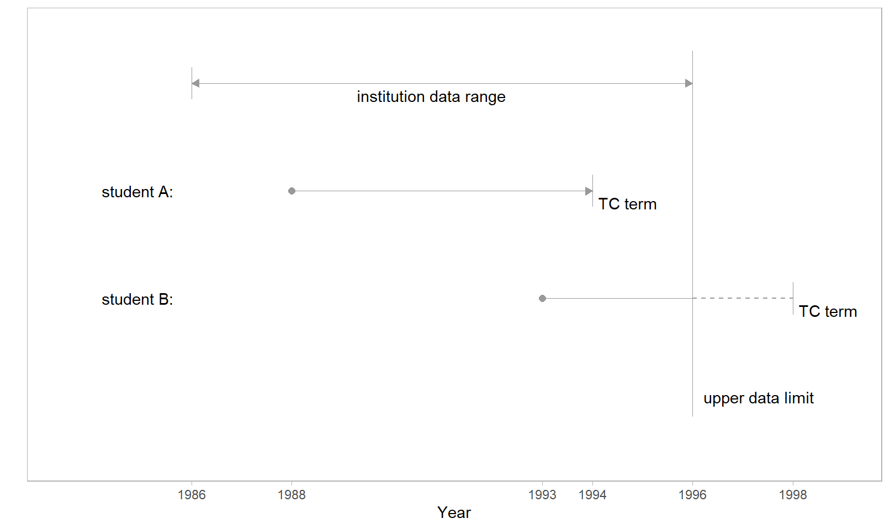
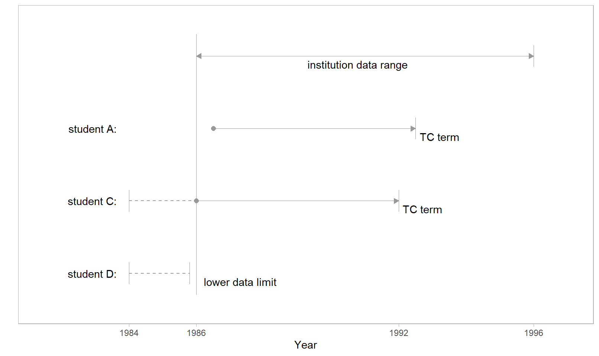

# Data sufficiency


The requirement that an institution’s data range brackets a student’s
entry term and timely completion term for the student to be included in
a research population.

## Introduction

The *data* having a *sufficient* number of terms is the necessary and
sufficient condition for positively determining a student’s completion
status, which (in turn) is required for a student to be included in a
research population.

- *Program completion.* Satisfying the requirements for a first
  baccalaureate degree.
- *Timely-completion term.* The latest term by which we would consider a
  student’s completion “timely”, default 6 years after admission.
- *Completion status.* Status levels are “timely” for students
  graduating no later than their timely-completion term; “late” for
  graduating afterwards; and “NA” for non-completion. Status levels can
  be positively determined only for records meeting the data sufficiency
  criteria.
- *Data sufficiency.* Identifying students whose: 1) entry term is at
  least one term later than the lower limit of their institution’s data
  range; and 2) timely-completion term is no later than the upper limit
  of the data range.

## Rationale

### *Upper-limit data sufficiency*

For students admitted too near the upper limit of their institution’s
data range, the available data cover an insufficient number of years to
know if completion is timely. To illustrate, in the figure we compare
students admitted in different terms with representative time spans
shown for timely completion. In this scenario, we assume institution
data is available from 1986 to 1996.

<br>



Student A  
Student A enters in Fall 1988 with a timely completion (TC) term of
Spring 1994. In both of the following cases, the data sufficiency
criteria are satisfied and the students are included in the research
population.

- A-1: First time in college (FTIC), so we know their first term is
  their entry term (i.e., they are not a continuing student) and we can
  determine their TC term.

- A-2: Transfer student, and we know their first term in a MIDFIELD
  institution. We have no knowledge of how much time was spent
  accumulating their pre-MIDFIELD credit hours, but we can estimate a TC
  term with respect to their “level” at entry, that is, entering as a
  first-year student, second-year student, etc.

Student B  
Student B enters in Fall 1993 with a TC term of Spring 1998, two years
beyond the range of the data. We have several possible cases,

- B-1: On or before the data limit, the student completes their program
  (documented timely completion)

- B-2: Before the data limit, the student leaves the data base
  (documented non-completion)

- B-3: After the data limit, the student completes before their TC term
  (undocumented timely completion)

- B-4: After the data limit, the student completes after their TC term
  or fails to complete (undocumented late completion or non-completion)

Because the outcomes in cases B-3 and B-4 are not in the record, to
include case B-1 and B-2 invariably produces a miscount of timely
completers, late completers, and non-completers. Thus all student B
records are excluded from a research population.

### *Lower-limit data sufficiency*

To determine data sufficiency at the lower limit of the data range, we
compare a student’s first term (non-summer) to the first term of the
data range (also non-summer). When these two terms are identical, the
student is excluded from the research population. We illustrate with the
three scenarios described below.

<br>



Student A  
Like Student A in Figure 1, they enter the dataset in a term following
the data lower limit and are included in the research population.

Student C  
Student C enters the institution before the lower limit of the data
range (a “continuing” student) or they enter the institution at the
lower limit precisely.

- C-1: If student C is continuing, regardless of status (FTIC or
  transfer), making an estimate of their TC term invariably leads to
  false counts because we have no knowledge of how much time was spent
  accumulating credit hours at their MIDFIELD institution before the
  lower data limit. Including C-1 would also produce false counts
  because of student D (discussed below).

- C-2: If student C is not continuing, that is, their first time entry
  to a MIDFIELD institution is at the lower data limit (here, 1986), we
  would include them in a study if we could. Unfortunately, we cannot
  distinguish them from continuing students. Having to exclude C-1
  inherently excludes C-2 as well.

Student D  
Student D enters the institution at the same time as continuing student
C but leaves the database before the data lower limit term.

- D-1: Student D did not timely-complete their program. In this case, if
  we include student C our count of *non-completers* is low (D-1 cases
  are missing), resulting in an inflated ratio of completers to
  non-completers.

- D-2: Student D did timely-complete their program. Here, if we include
  student C our count of *completers* is low (D-2 cases are missing),
  resulting in a diminished ratio of completers to non-completers.

The balance of these two effects is unknowable. Since student D cannot
possibly be included, Student C must also be excluded.

## Application

We examine the records of specific students in the practice data and
interpret the results.

``` r
# packages
library("midfieldr")
library("midfielddata")
library("data.table")

# setup
data(student, term)
DT <- student[, .(mcid)]
```

### `timely_term()`

*Determines the latest term by which program completion would be
considered timely.*

``` r
timely_term(dframe,  # requires mcid
  midf_table = term, # requires mcid, term, level
  span,              # default 6
  sched_span         # default 4
) 
```

In the examples, we use the default span of 6 years based on 150% of the
default scheduled span of 4 years.

``` r
DT <- timely_term(DT, term)
DT[order(-adj_span)]
#>                  mcid entry_term    entry_level adj_span timely_term
#>                <char>     <char>         <char>    <num>      <char>
#>     1: MCID3111142225      19881  01 First-year        6       19933
#>     2: MCID3111142283      19881  01 First-year        6       19933
#>     3: MCID3111142290      19881  01 First-year        6       19933
#>    ---                                                              
#> 97553: MCID3111858641      20013  03 Third-year        4       20051
#> 97554: MCID3111860641      20013  03 Third-year        4       20051
#> 97555: MCID3111602161      19991 04 Fourth-year        3       20013
```

#### *Example 1*

``` r
DT[mcid == "MCID3111142225"]
#>              mcid entry_term   entry_level adj_span timely_term
#>            <char>     <char>        <char>    <num>      <char>
#> 1: MCID3111142225      19881 01 First-year        6       19933
```

*Input values:* The student’s entry term is Fall 1988 (encoded `19881`)
and their entry level is `01 First-year.`

*Output values:* Adjusted span is the default 6 years. Counting Fall 88
through Spring 89 as the first year, the five subsequent years end in
Spring 1990, 91, 92, 93, 94, yielding a timely completion term of Spring
1994 (encoded `19933`).

#### *Example 2*

``` r
DT[mcid == "MCID3111860641"]
#>              mcid entry_term   entry_level adj_span timely_term
#>            <char>     <char>        <char>    <num>      <char>
#> 1: MCID3111860641      20013 03 Third-year        4       20051
```

*Input values:* The student’s entry term is Spring 2002 (encoded
`20013`) and their entry level is `03 Third-year` from which we infer
they have completed two years of their program.

*Output values:* Adjusted span is 4 years. Counting Spring 02 through
Fall 02 as the first year, the three subsequent years end in Fall 2003,
04, and 05, yielding a timely completion term of Fall 2005 (encoded
`20051`).

### `data_sufficiency()`

*Identifies records to exclude due to insufficient data.*

``` r
data_sufficiency(dframe, # requires mcid, entry_term, timely_term
  midf_table = term      # requires mcid, term, institution
) 
```

We select the required columns in the input to reduce clutter in the
output.

``` r
# setup
DT <- DT[, .(mcid, entry_term, timely_term)]

# apply
DT <- data_sufficiency(DT, term)
DT[order(sufficiency)]
#>                  mcid entry_term timely_term  data_range sufficiency
#>                <char>     <char>      <char>      <char>      <char>
#>     1: MCID3111142225      19881       19933 19881-20181  fail-lower
#>     2: MCID3111142283      19881       19933 19881-20096  fail-lower
#>     3: MCID3111142290      19881       19933 19881-20096  fail-lower
#>    ---                                                              
#> 97553: MCID3112785480      20071       20123 19901-20154   satisfied
#> 97554: MCID3112800920      20101       20153 19881-20181   satisfied
#> 97555: MCID3112870009      19951       20003 19881-20181   satisfied
```

#### *Example 3*

Exemplifies “Student A” in Figure 1 or Figure 2.

``` r
DT[mcid == "MCID3112785480"]
#>              mcid entry_term timely_term  data_range sufficiency
#>            <char>     <char>      <char>      <char>      <char>
#> 1: MCID3112785480      20071       20123 19901-20154   satisfied
```

*Input values:* Entry term of Fall 2007; timely completion term of
Spring 2013; institution data range of Fall 1990 through Summer 2015.

*Output values:* Data sufficiency is satisfied. Data range lower limit
is before the entry term; upper limit is after the timely completion
term.

#### *Example 4*

Exemplifies “Student B” in Figure 1.

``` r
DT[mcid == "MCID3111170322"]
#>              mcid entry_term timely_term  data_range sufficiency
#>            <char>     <char>      <char>      <char>      <char>
#> 1: MCID3111170322      20133       20191 19881-20181  fail-upper
```

*Input values:* Entry term of Spring 2013; timely completion term of
Fall 2019; institution data range of Fall 1988 through Fall 2018.

*Output values:* Data sufficiency fails at the upper limit of the data
range. Timely completion term is after the upper limit.

#### *Example 5*

Exemplifies “Student C” in Figure 2.

``` r
DT[mcid == "MCID3112056754"]
#>              mcid entry_term timely_term  data_range sufficiency
#>            <char>     <char>      <char>      <char>      <char>
#> 1: MCID3112056754      19881       19933 19881-20096  fail-lower
```

*Input values:* Entry term of Fall 1988; timely completion term of
Spring 1993; institution data range of Fall 1988 through Summer 2009

*Output values:* Data sufficiency fails at the lower limit of the data
range. Entry term and lower limit are identical.

## References

<div id="refs">

</div>
