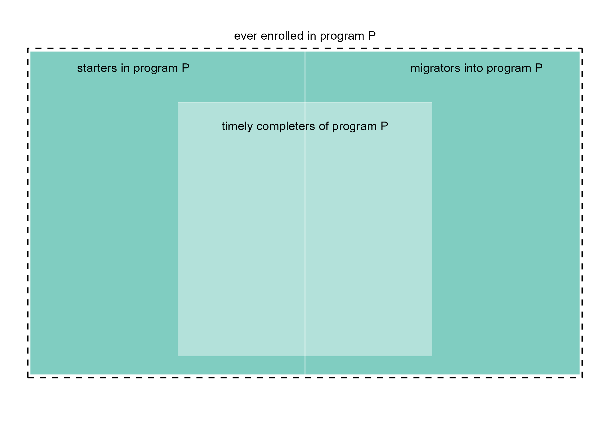
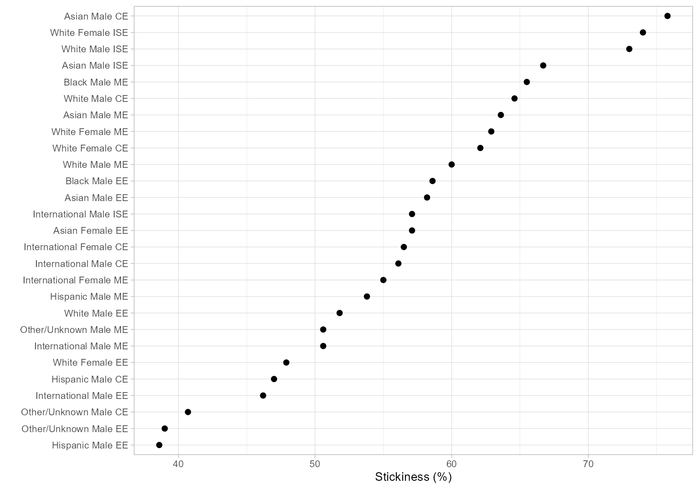

# Stickiness


Stickiness is a more-inclusive alternative to graduation rate as a
measure of a program’s success in attracting, keeping, and graduating
their undergraduates. Students excluded by a conventional graduation
rate metric–including migrators—are included in the stickiness metric
([Ohland et al., 2012](#ref-Ohland+Orr+others:2012)).

## An inclusive metric

Program *stickiness* $\small(S)$ is the ratio of the number of graduates
of a program $\small(N_g)$ to the number ever enrolled in the program
$\small(N_e)$.

$$
S = \frac{N_g}{N_e}
$$

Stickiness, in comparison to graduation rate, has these characteristics:

- Includes migrators, where graduation rate does not.

- Is based on the bloc of ever enrolled rather than starters, so there
  is no need for FYE proxies.

- Counts all graduates (timely completers) in a program, eliminating the
  need to filter graduates based on their starting program.

- Like the MIDFIELD definition of graduation rate (in contrast to the
  IPEDS definition), includes students who attend college part-time, who
  transfer between institutions, and who start in any term.

As they pertain to the stickiness metric, relationships among starters,
migrators, and graduates (timely completers) of a given program *P* are
illustrated in Figure 1.

- The overall rectangle represents the stickiness denominator $(N_e)$,
  the number of students ever enrolled in program *P*, including
  starters and migrators.

- The interior rectangle represents the stickiness numerator $(N_g)$,
  the number of graduates (timely completers) of program *P*.



## Application

In our [Case study](art-004-case-study.html), we construct the two major
blocs required to calculate stickiness—the numbers of graduates
$\small(N_g)$ and ever-enrolled $\small(N_e)$.

Rather than duplicate the complete case, we pick it up at an
intermediate step just before grouping and summarizing. Those data load
with midfieldr as `case_blocs.`

``` r
library("midfieldr")
library("data.table")

DT <- copy(case_blocs)
DT
#>                 mcid program       people   bloc
#>               <char>  <char>       <char> <char>
#>    1: MCID3111287755      CE Asian Female   ever
#>    2: MCID3111379307      CE Asian Female   ever
#>    3: MCID3111394108      CE Asian Female   ever
#>   ---                                           
#> 8866: MCID3112610409      ME   White Male   grad
#> 8867: MCID3112618976      ME   White Male   grad
#> 8868: MCID3112641535      ME   White Male   grad
```

### *Group and summarize*

Count the numbers of observations for each combination of the grouping
variables. Convert the count from integer to double format.

``` r
DT <- DT[, .(N = as.double(.N)), by = c("program", "people", "bloc")]
DT
#>     program             people   bloc     N
#>      <char>             <char> <char> <num>
#>  1:      CE       Asian Female   ever    14
#>  2:      CE         Asian Male   ever    33
#>  3:      CE       Black Female   ever     4
#> ---                                        
#> 96:      ME Other/Unknown Male   grad    41
#> 97:      ME       White Female   grad   134
#> 98:      ME         White Male   grad   952
```

### *Reshape*

We want to separate the $\small N$ column into two columns—one for the
number of graduates and the other for the number of ever enrolled. This
operation is known by a number of different names, e.g., pivot,
crosstab, unstack, spread, or widen ([Mount & Zumel,
2019](#ref-Mount+Zumel:2019:fluid-data)).

The data.table package uses `dcast()` for this operation. The key
columns `program` and `people` remain in place. The `bloc` column yields
the new key columns `ever` and `grad` with values taken from the `N`
column.

``` r
DT <- dcast(DT,
  program + people ~ bloc,
  value.var = "N",
  drop = FALSE, # keep all combinations
  fill = NA_real_ # NA if no value
)
setkey(DT, NULL)
DT
#>     program                 people  ever  grad
#>      <char>                 <char> <num> <num>
#>  1:      CE           Asian Female    14    10
#>  2:      CE             Asian Male    33    25
#>  3:      CE           Black Female     4     1
#>  4:      CE             Black Male     8     5
#>  5:      CE        Hispanic Female    13     6
#>  6:      CE          Hispanic Male    66    31
#>  7:      CE   International Female    23    13
#>  8:      CE     International Male    98    55
#>  9:      CE Native American Female     1     1
#> 10:      CE   Native American Male     3     1
#> 11:      CE   Other/Unknown Female     5     3
#> 12:      CE     Other/Unknown Male    27    11
#> 13:      CE           White Female   261   162
#> 14:      CE             White Male   948   612
#> ---                                           
#> 43:      ME           Asian Female     7     1
#> 44:      ME             Asian Male    77    49
#> 45:      ME           Black Female     3     2
#> 46:      ME             Black Male    29    19
#> 47:      ME        Hispanic Female    12     8
#> 48:      ME          Hispanic Male    78    42
#> 49:      ME   International Female    20    11
#> 50:      ME     International Male   176    89
#> 51:      ME Native American Female    NA    NA
#> 52:      ME   Native American Male     5     1
#> 53:      ME   Other/Unknown Female     8     4
#> 54:      ME     Other/Unknown Male    81    41
#> 55:      ME           White Female   213   134
#> 56:      ME             White Male  1587   952
```

### *Calculate the metric*

Before calculating the metric, we address possible “divide by zero”
errors by converting any zero values of `ever` to NA. Not required in
this case, but included for completeness.

``` r
DT[ever == 0, ever := NA_real_]
```

Stickiness is calculated for each combination of program and people.

``` r
DT[, stick := round(100 * grad / ever, 1)]
DT
#> Index: <ever>
#>     program                 people  ever  grad stick
#>      <char>                 <char> <num> <num> <num>
#>  1:      CE           Asian Female    14    10  71.4
#>  2:      CE             Asian Male    33    25  75.8
#>  3:      CE           Black Female     4     1  25.0
#>  4:      CE             Black Male     8     5  62.5
#>  5:      CE        Hispanic Female    13     6  46.2
#>  6:      CE          Hispanic Male    66    31  47.0
#>  7:      CE   International Female    23    13  56.5
#>  8:      CE     International Male    98    55  56.1
#>  9:      CE Native American Female     1     1 100.0
#> 10:      CE   Native American Male     3     1  33.3
#> 11:      CE   Other/Unknown Female     5     3  60.0
#> 12:      CE     Other/Unknown Male    27    11  40.7
#> 13:      CE           White Female   261   162  62.1
#> 14:      CE             White Male   948   612  64.6
#> ---                                                 
#> 43:      ME           Asian Female     7     1  14.3
#> 44:      ME             Asian Male    77    49  63.6
#> 45:      ME           Black Female     3     2  66.7
#> 46:      ME             Black Male    29    19  65.5
#> 47:      ME        Hispanic Female    12     8  66.7
#> 48:      ME          Hispanic Male    78    42  53.8
#> 49:      ME   International Female    20    11  55.0
#> 50:      ME     International Male   176    89  50.6
#> 51:      ME Native American Female    NA    NA    NA
#> 52:      ME   Native American Male     5     1  20.0
#> 53:      ME   Other/Unknown Female     8     4  50.0
#> 54:      ME     Other/Unknown Male    81    41  50.6
#> 55:      ME           White Female   213   134  62.9
#> 56:      ME             White Male  1587   952  60.0
```

We plot a subset of the results below for a quick overview of its range
and distribution. For charts better designed for making comparisons, see
the [Case study](art-004-case-study.html).

``` r
library("ggplot2")
dframe <- DT[grad > 10, group := paste(people, program)]
dframe <- na.omit(dframe)
ggplot(dframe, aes(x = stick, y = reorder(group, stick))) +
  geom_point(size = 1.8, na.rm = TRUE) +
  labs(x = "Stickiness (%)", y = "") +
  theme_light(base_size = 10)
```



## References

<div id="refs" class="references csl-bib-body hanging-indent"
data-entry-spacing="0" data-line-spacing="2">

<div id="ref-Mount+Zumel:2019:fluid-data" class="csl-entry">

Mount, J., & Zumel, N. (2019). *<span class="nocase">Coordinatized data:
A fluid data specification</span>*. Win Vector LLC.
<http://winvector.github.io/FluidData/RowsAndColumns.html>

</div>

<div id="ref-Ohland+Orr+others:2012" class="csl-entry">

Ohland, M., Orr, M., Layton, R., Lord, S., & Long, R. (2012).
<span class="nocase">Introducing stickiness as a versatile metric of
engineering persistence</span>. *<span class="nocase">Proceedings of the
Frontiers in Education Conference</span>*, 1–5.

</div>

</div>
