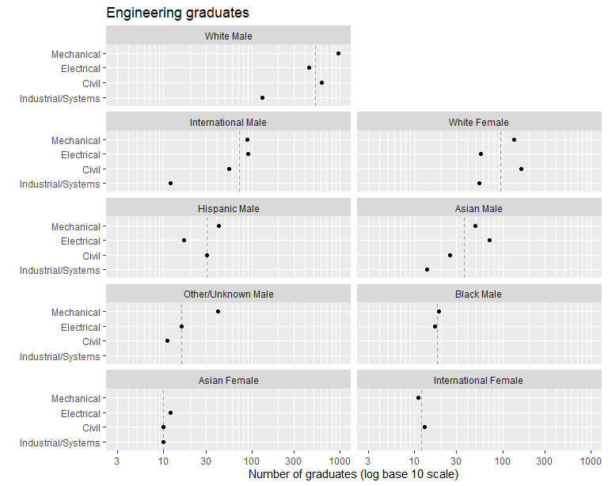
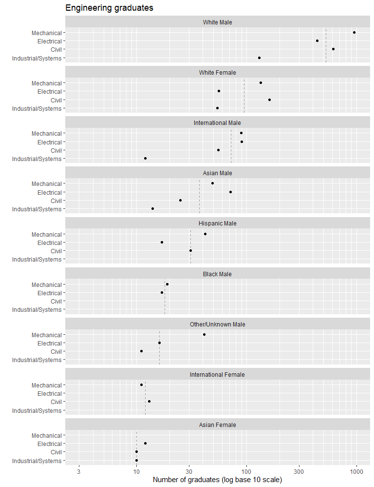
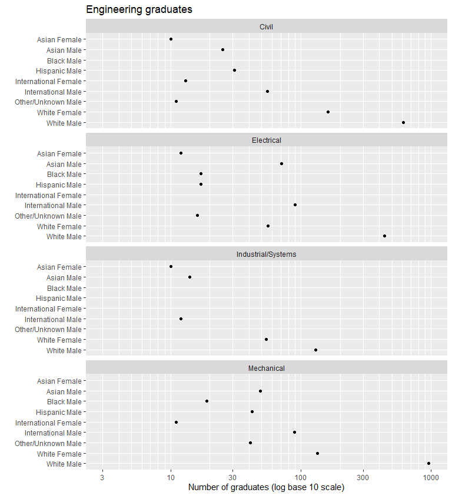
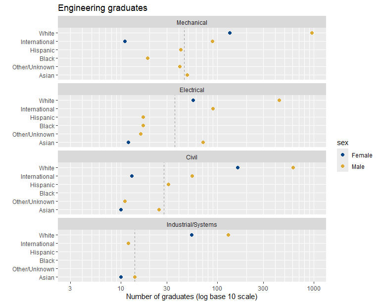
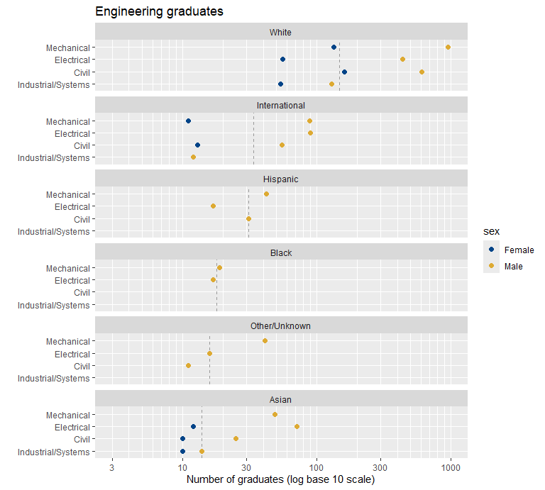
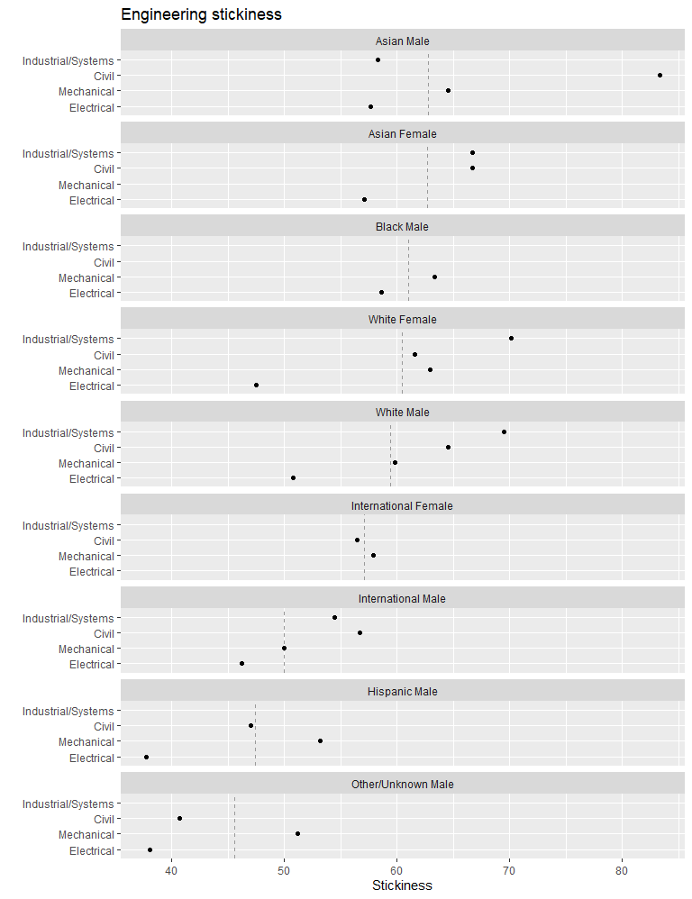
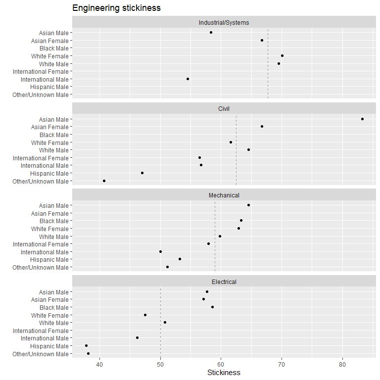

# Multiway data and charts


In working with longitudinal student-level records, we regularly
encounter data structured as *multiway data*. We explore that data
visually using *multiway dot plots* as described by William Cleveland
([1993, 302–6](#ref-Cleveland:1993)). Quotations, unless noted
otherwise, are from this source.

Note that “multiway” in our context refers to the data structure and
chart design defined by Cleveland.

This article in the MIDFIELD workflow:

1.  Planning  
2.  Initial processing  
3.  Blocs  
4.  Groupings
5.  Metrics  
6.  Displays
    - <span class="accent">Multiway charts</span>
    - <span class="accent">Tables</span>

## Definitions

multiway data  
A data set of three variables: a category with $\small m$ levels; a
second independent category with $\small n$ levels; and a quantitative
variable (the response) of length $\small m \times n$ such that there is
a value of the response for each combination of levels of the two
categorical variables.

multiway chart  
A multi-panel dot plot: horizontal, quantitative scales; rows that
encode one category; and panels that encode the second category. All
panels have identical axes. The ordering of the rows and panels is
crucial to the perception of effects.

multiway superposition  
Multiway data can be extended to include a third category of $\small p$
levels; the quantitative response has length
$\small m \times n \times p$, one for each combination of levels of
*three* categories; the rows and panels encode the first two categories
as usual; $\small p$ data markers encode the third category on each row.
Clarity usually requires that $\small p=2$ but not more.

stickiness  
Program “stickiness” $\small(S)$ is the ratio of the number of graduates
of a program $\small(N_g)$ to the number ever enrolled in the program
$\small(N_e)$.

## Method

We start with the results data frame from the [Case study:
Results](art-003-case-results.html) vignette, containing data from four
engineering programs (Civil, Electrical, Industrial/Systems, and
Mechanical Engineering) grouped by program, race/ethnicity, and sex.
These data have been filtered for data sufficiency, degree seeking, and
program, and graduates are filtered for timely completion.

We prepare the data for use as input to `order_multiway()` and use the
results to construct multiway charts ordered by category median values
and by category percentage values.

*Reminder.*   midfielddata is for practice, not research.

## Load data

*Start.*   If you are writing your own script to follow along, we use
these packages in this article:

``` r
library("midfieldr")
library("data.table")
library("ggplot2")
```

*Loads with* `midfieldr.`   Prepared data. View data dictionary via
`?study_results`.

- `study_results` (derived in [Stickiness](art-110-stickiness.html)).

## Initial processing

*Initialize.*   Assign a working data frame.

``` r
# Working data frame
DT <- copy(study_results)
```

*Filter.*   Human subject privacy is potentially at risk for small
populations even with anonymized observations. Therefore, before
tabulating or graphing the data for dissemination, we omit observations
with fewer than 10 graduates. The magnitude of the bound
(`graduates >= 10`) can vary depending on one’s data.

``` r
# Protecting privacy of small populations
DT <- DT[graduates >= 10]
```

*Note.*   MIDFIELD research findings are regularly grouped by program,
race/ethnicity, and sex. However, applied to the practice data these
groupings produce several groups with totals below the threshold we
impose to preserve anonymity, introducing a number of NA values in the
resulting charts and tables. These NAs are largely an artifact of
applying these groupings to practice data.

## Preparing the categorical variables

Before we apply the `order_multiway()` function, we edit the categorical
variables to create the forms we want in the final charts or tables.

*Recode.*   The first multiway categorical variable is `program`. To
improve the readability of the charts, we recode the program
abbreviations.

``` r
# Recode for panel and row labels
DT[, program := fcase(
  program %like% "CE", "Civil",
  program %like% "EE", "Electrical",
  program %like% "ME", "Mechanical",
  program %like% "ISE", "Industrial/Systems"
)]
```

*Create a variable.*   We combine `race` and `sex` into a single
categorical variable (denoted `people`) as our second, independent
categorical variable.

``` r
# Create a new category
DT[, people := paste(race, sex)]
setcolorder(DT, c("program", "people", "race", "sex"))
DT
#>        program               people          race    sex ever_enrolled
#>         <char>               <char>        <char> <char>         <int>
#>  1:      Civil         Asian Female         Asian Female            15
#>  2:      Civil International Female International Female            23
#>  3:      Civil         White Female         White Female           263
#> ---                                                                   
#> 27: Mechanical   International Male International   Male           178
#> 28: Mechanical   Other/Unknown Male Other/Unknown   Male            80
#> 29: Mechanical           White Male         White   Male          1596
#>     graduates stickiness
#>         <int>      <num>
#>  1:        10       66.7
#>  2:        13       56.5
#>  3:       162       61.6
#> ---                     
#> 27:        89       50.0
#> 28:        41       51.2
#> 29:       955       59.8
```

At this point, the multiway categories (`programs` and `people`) are
“character” class.

## `order_multiway()`

Converts the categorical variables to factors ordered by the
quantitative variable.

*Arguments.*

- **`dframe`**   Data frame with multiway data in columns. Two
  additional numeric columns required when using the percentage ordering
  method.

- **`quantity`**   Name (in quotes) of the single multiway quantitative
  variable.

- **`categories`**   Vector of names (in quotes) of the two multiway
  categorical variables.

- **`method`**   “median” (default) or “percent”, method of ordering the
  levels of the categories. Argument to be used by name.

- **`ratio_of`**   Vector with the names (in quotes) of the numerator
  and denominator columns that produced the quantitative variable,
  required when using percentage ordering method. Argument to be used by
  name.

*Equivalent usage.*   The following implementations yield identical
results,

``` r
# Required arguments in order and explicitly named
x <- order_multiway(
  dframe = DT,
  quantity = "stickiness",
  categories = c("program", "people"),
  method = "median"
)

# Required arguments in order, but not named, method implicit
y <- order_multiway(DT, "stickiness", c("program", "people"))

# Demonstrate equivalence
check_equiv_frames(x, y)
#> [1] TRUE
```

*Output.*   Adds two columns to the data frame containing the computed
values that determine the ordering of factors. The column names and
values depend on the ordering method:

- **`method = "median"`**   Yields medians of the quantitative variable
  grouped by the categorical variables.

- **`method = "percent"`**   Yields percentages based on the same ratio
  that produces the quantitative variable but grouped by the categorical
  variables.

## Median-ordered data

For this example, we select the count of graduates (`graduates`) as our
quantitative variable and use `order_multiway()` to order the categories
by median numbers of graduates.

To minimize the number of columns in the printout, we select the three
multiway variables and drop other columns.

``` r
# Select multiway variables when quantity is count
DT_count <- copy(DT)
# DT_count <- DT_count[, .(program, people, graduates)]
DT_count
#>        program               people          race    sex ever_enrolled
#>         <char>               <char>        <char> <char>         <int>
#>  1:      Civil         Asian Female         Asian Female            15
#>  2:      Civil International Female International Female            23
#>  3:      Civil         White Female         White Female           263
#> ---                                                                   
#> 27: Mechanical   International Male International   Male           178
#> 28: Mechanical   Other/Unknown Male Other/Unknown   Male            80
#> 29: Mechanical           White Male         White   Male          1596
#>     graduates stickiness
#>         <int>      <num>
#>  1:        10       66.7
#>  2:        13       56.5
#>  3:       162       61.6
#> ---                     
#> 27:        89       50.0
#> 28:        41       51.2
#> 29:       955       59.8
```

Applying `order_multiway()`, we specify `"graduates"` as the
quantitative column, `"program"` and `"people"` as the two categorical
columns, and `"median"` as the method of ordering levels.

``` r
# Convert categories to factors ordered by median
DT_count <- order_multiway(DT_count,
  quantity = "graduates",
  categories = c("program", "people"),
  method = "median"
)
DT_count
#>        program               people          race    sex ever_enrolled
#>         <fctr>               <fctr>        <char> <char>         <int>
#>  1:      Civil         Asian Female         Asian Female            15
#>  2:      Civil International Female International Female            23
#>  3:      Civil         White Female         White Female           263
#> ---                                                                   
#> 27: Mechanical   International Male International   Male           178
#> 28: Mechanical   Other/Unknown Male Other/Unknown   Male            80
#> 29: Mechanical           White Male         White   Male          1596
#>     graduates stickiness program_median people_median
#>         <num>      <num>          <num>         <num>
#>  1:        10       66.7           28.0          10.0
#>  2:        13       56.5           28.0          12.0
#>  3:       162       61.6           28.0          95.0
#> ---                                                  
#> 27:        89       50.0           45.5          72.0
#> 28:        41       51.2           45.5          16.0
#> 29:       955       59.8           45.5         525.5
```

The function adds two columns (`program_median` and `people_median`) to
display the computed median values used to order the factors. In the
median method, the new column names are a combination of the category
variable names (from `categories`) plus `median`.

For example, the results show that the median number of Civil
Engineering graduates is 28 and that the median number of Asian Female
graduates is 10. We confirm these results by computing the median values
independently.

The following values agree with those in the `program_median` variable
above,

``` r
# Verify order_multiway() output
temp <- DT_count[, lapply(.SD, median), .SDcols = c("graduates"), by = c("program")]
temp
#>               program graduates
#>                <fctr>     <num>
#> 1:              Civil      28.0
#> 2:         Electrical      36.5
#> 3: Industrial/Systems      14.0
#> 4:         Mechanical      45.5
```

And the next result agrees with the values in `people_median`.

``` r
# Verify order_multiway() output
temp <- DT_count[, lapply(.SD, median), .SDcols = c("graduates"), by = c("people")]
temp
#>                   people graduates
#>                   <fctr>     <num>
#>  1:         Asian Female      10.0
#>  2: International Female      12.0
#>  3:         White Female      95.0
#> ---                               
#>  7:   Other/Unknown Male      16.0
#>  8:           White Male     525.5
#>  9:           Black Male      18.0
```

Below we demonstrate that both categories are “factor” class: `program`
is a factor with 4 levels; `people` is a factor with 9 levels; and
neither is ordered alphabetically—ordering is by increasing median value
as expected.

``` r
# Verify first category is a factor
class(DT_count$program)
#> [1] "factor"
levels(DT_count$program)
#> [1] "Industrial/Systems" "Civil"              "Electrical"        
#> [4] "Mechanical"

# Verify second category is a factor
class(DT_count$people)
#> [1] "factor"
levels(DT_count$people)
#> [1] "Asian Female"         "International Female" "Other/Unknown Male"  
#> [4] "Black Male"           "Hispanic Male"        "Asian Male"          
#> [7] "International Male"   "White Female"         "White Male"
```

## Median-ordered charts

We use conventional ggplot2 functions to create the multiway graphs.

We create a set of axis labels and scale specifications for a series of
median-ordered charts. We use a logarithmic scale in this case because
the numbers span three orders of magnitude.

``` r
# Common x-scale and axis labels for median-ordered charts
common_scale_x_log10 <- scale_x_log10(
  limits = c(3, 1000),
  breaks = c(3, 10, 30, 100, 300, 1000),
  minor_breaks = c(seq(3, 10, 1), seq(20, 100, 10), seq(200, 1000, 100))
)
common_labs <- labs(
  x = "Number of graduates (log base 10 scale)",
  y = "",
  title = "Engineering graduates"
)
ref_line_color <- "gray60"
```

The first of two multiway charts encodes *programs by rows* and *people
by panels*. The `as.table = FALSE` argument places rows and panels in
“graphical order”, that is, increasing from left to right and from
bottom to top. The panel median value is drawn as a vertical reference
line in each panel.

``` r
# Two columns of panels
ggplot(DT_count, aes(x = graduates, y = program)) +
  facet_wrap(vars(people), ncol = 2, as.table = FALSE) +
  geom_vline(aes(xintercept = people_median), linetype = 2, color = ref_line_color) +
  common_scale_x_log10 +
  common_labs +
  geom_point()
```



<br>The programs are assigned to rows such that the program medians
increase from bottom to top. Industrial/Systems has the smallest median;
Mechanical Engineering the largest.

We drew the chart above in two columns to illustrate the graph order of
panels. Asian Female students have the smallest median number of
graduates, followed by International Female, Other/Unknown Male, Black
Male, etc.

When space permits, however, laying out the panels in a single column
can be useful for seeing effects. Here, we redraw the panels in one
column.

``` r
# Programs encoded by rows
ggplot(DT_count, aes(x = graduates, y = program)) +
  facet_wrap(vars(people), ncol = 1, as.table = FALSE) +
  geom_vline(aes(xintercept = people_median), linetype = 2, color = ref_line_color) +
  common_scale_x_log10 +
  common_labs +
  geom_point()
```



<br>Reading a multiway graph

- We can more effectively compare values within a panel than between
  panels.
- Because rows are ordered, one expects a generally increasing trend
  within a panel. A response greater or smaller than expected creates a
  visual asymmetry. The interesting stories are often in these visual
  anomalies.

For example, the White Female panel shows a clear separation between two
groupings of majors, Mechanical and Civil compared to Electrical and
Industrial/Systems.

However, this chart does not permit us to effectively compare the eight
values for a given program. For that we create a second multiway in
which we switch the aesthetic roles of the categories—in this example by
encoding *people by rows* and *programs by panels*.

``` r
# People encoded by rows
ggplot(DT_count, aes(x = graduates, y = people)) +
  facet_wrap(vars(program), ncol = 1, as.table = FALSE) +
  geom_vline(aes(xintercept = program_median), linetype = 2, color = ref_line_color) +
  common_scale_x_log10 +
  common_labs +
  geom_point()
```


<br>In this chart, the visual asymmetry that stands out most is
Electrical Engineering, White Female, low given their overall rank.

## Avoid alphabetical order

In the next figure, the same data are plotted in alphabetical order,
which reveals none of the effects seen in the previous chart. An
ordering scheme based on the values of the quantitative variable is
necessary if a multiway chart is to reveal how the response is affected
by the categories.

``` r
# Create alphabetical ordering
DT_alpha <- copy(DT)
DT_alpha[, people := factor(people, levels = sort(unique(people), decreasing = TRUE))]

# People encoded by rows, alphabetically
ggplot(DT_alpha, aes(x = graduates, y = people)) +
  facet_wrap(vars(program), ncol = 1, as.table = TRUE) +
  common_scale_x_log10 +
  common_labs +
  geom_point()
```



## Multiway superposition

To illustrate superposing data, we return to the data set with separate
columns for race/ethnicity and sex. Let’s use `graduates` as our
quantitative variable and omit unnecessary variables.

``` r
# Select multiway variables with a superposed category
DT_count <- copy(DT)
# DT_count <- DT_count[, .(program, race, sex, graduates)]
DT_count
#>        program               people          race    sex ever_enrolled
#>         <char>               <char>        <char> <char>         <int>
#>  1:      Civil         Asian Female         Asian Female            15
#>  2:      Civil International Female International Female            23
#>  3:      Civil         White Female         White Female           263
#> ---                                                                   
#> 27: Mechanical   International Male International   Male           178
#> 28: Mechanical   Other/Unknown Male Other/Unknown   Male            80
#> 29: Mechanical           White Male         White   Male          1596
#>     graduates stickiness
#>         <int>      <num>
#>  1:        10       66.7
#>  2:        13       56.5
#>  3:       162       61.6
#> ---                     
#> 27:        89       50.0
#> 28:        41       51.2
#> 29:       955       59.8
```

The superposed category is `sex`. The multiway data to be conditioned
are `graduates`, the quantitative variable, and `program` and `race`,
the two categorical variables.

``` r
# Convert categories to factors ordered by median
DT_count <- order_multiway(DT_count,
  quantity = "graduates",
  categories = c("program", "race")
)
DT_count
#>        program               people          race    sex ever_enrolled
#>         <fctr>               <char>        <fctr> <char>         <int>
#>  1:      Civil         Asian Female         Asian Female            15
#>  2:      Civil International Female International Female            23
#>  3:      Civil         White Female         White Female           263
#> ---                                                                   
#> 27: Mechanical   International Male International   Male           178
#> 28: Mechanical   Other/Unknown Male Other/Unknown   Male            80
#> 29: Mechanical           White Male         White   Male          1596
#>     graduates stickiness program_median race_median
#>         <num>      <num>          <num>       <num>
#>  1:        10       66.7           28.0          14
#>  2:        13       56.5           28.0          34
#>  3:       162       61.6           28.0         148
#> ---                                                
#> 27:        89       50.0           45.5          34
#> 28:        41       51.2           45.5          16
#> 29:       955       59.8           45.5         148
```

In this example, `program` and `race` are factors, ordered by median
number of graduates while `sex` remains an unordered character variable.

Using conventional ggplot syntax, the aesthetics include `x` and `y` as
before. We superpose data markers for sex in rows by assigning
`color = sex` inside the `aes()` function.

``` r
# Race/ethnicity encoded by rows, sex superposed
ggplot(DT_count, aes(x = graduates, y = race, color = sex)) +
  facet_wrap(vars(program), ncol = 1, as.table = FALSE) +
  geom_vline(aes(xintercept = program_median), linetype = 2, color = ref_line_color) +
  common_scale_x_log10 +
  common_labs +
  geom_point(size = 2) +
  scale_color_manual(values = c("#004488", "#DDAA33"))
```



<br>By superposing data by sex, we facilitate a direct comparison of
Male and Female students within a program and by race.

Swapping rows and panels yields the next chart, in which we can directly
compare Male and Female students within their race/ethnicity category
across programs. Because men tend to outnumber women in engineering
programs, this chart clearly shows clusters by sex.

``` r
# Program encoded by rows, sex superposed
ggplot(DT_count, aes(x = graduates, y = program, color = sex)) +
  facet_wrap(vars(race), ncol = 1, as.table = FALSE) +
  geom_vline(aes(xintercept = race_median), linetype = 2, color = ref_line_color) +
  common_scale_x_log10 +
  common_labs +
  geom_point(size = 2) +
  scale_color_manual(values = c("#004488", "#DDAA33"))
```



## Percentage-ordered data

For persistence metrics such as stickiness or graduation rate, the
quantitative variable is a ratio or percentage. Here, we return to the
original case study results and select stickiness (`stickiness`) as the
quantitative variable.

``` r
# Select multiway variables when quantity is a percentage
DT_ratio <- copy(DT)
# DT_ratio[, c("race", "sex") := NULL]
DT_ratio
#>        program               people          race    sex ever_enrolled
#>         <char>               <char>        <char> <char>         <int>
#>  1:      Civil         Asian Female         Asian Female            15
#>  2:      Civil International Female International Female            23
#>  3:      Civil         White Female         White Female           263
#> ---                                                                   
#> 27: Mechanical   International Male International   Male           178
#> 28: Mechanical   Other/Unknown Male Other/Unknown   Male            80
#> 29: Mechanical           White Male         White   Male          1596
#>     graduates stickiness
#>         <int>      <num>
#>  1:        10       66.7
#>  2:        13       56.5
#>  3:       162       61.6
#> ---                     
#> 27:        89       50.0
#> 28:        41       51.2
#> 29:       955       59.8
```

Because stickiness is a ratio, we set `method` to “percent” and assign
`graduates` and `ever_enrolled` to the `ratio_of` argument.
`order_multiway()` then sums the `ever_enrolled` and `graduates` counts
by category and produces grouped percentages to order the category
levels.

``` r
# Convert categories to factors ordered by group percentages
DT_ratio <- order_multiway(DT_ratio,
  quantity = "stickiness",
  categories = c("program", "people"),
  method = "percent",
  ratio_of = c("graduates", "ever_enrolled")
)
DT_ratio
#>        program               people          race    sex ever_enrolled
#>         <fctr>               <fctr>        <char> <char>         <num>
#>  1:      Civil         Asian Female         Asian Female            15
#>  2:      Civil International Female International Female            23
#>  3:      Civil         White Female         White Female           263
#> ---                                                                   
#> 27: Mechanical   International Male International   Male           178
#> 28: Mechanical   Other/Unknown Male Other/Unknown   Male            80
#> 29: Mechanical           White Male         White   Male          1596
#>     graduates stickiness program_metric people_metric
#>         <num>      <num>          <num>         <num>
#>  1:        10       66.7           62.5          62.7
#>  2:        13       56.5           62.5          57.1
#>  3:       162       61.6           62.5          60.5
#> ---                                                  
#> 27:        89       50.0           59.0          50.0
#> 28:        41       51.2           59.0          45.6
#> 29:       955       59.8           59.0          59.4
```

The function again converts the categories to factors and adds two
columns (`program_metric` and `people_metric`) to display the computed
percentages used to order the factors. In the percentage method, the new
column names are a combination of the category variable names (from
`categories`) plus `metric.`

For example, the results show that the stickiness of Civil Engineering
(`program_metric`) is 62.5%, and of Asian Females, 62.7%
(`people_metric`). We confirm these results by computing the group
stickiness values independently.

The following values agree with those in the `program_metric` variable
above,

``` r
# Verify order_multiway() output
temp <- DT[, lapply(.SD, sum), .SDcols = c("ever_enrolled", "graduates"), by = c("program")]
temp[, stickiness := round(100 * graduates / ever_enrolled, 1)]
temp
#>               program ever_enrolled graduates stickiness
#>                <char>         <int>     <int>      <num>
#> 1:              Civil          1470       919       62.5
#> 2:         Electrical          1437       718       50.0
#> 3: Industrial/Systems           325       220       67.7
#> 4:         Mechanical          2271      1340       59.0
```

And the next result agrees with the values in `people_stickiness`.

``` r
# Verify order_multiway() output
temp <- DT[, lapply(.SD, sum), .SDcols = c("ever_enrolled", "graduates"), by = c("people")]
temp[, stickiness := round(100 * graduates / ever_enrolled, 1)]
temp
#>                   people ever_enrolled graduates stickiness
#>                   <char>         <int>     <int>      <num>
#>  1:         Asian Female            51        32       62.7
#>  2: International Female            42        24       57.1
#>  3:         White Female           671       406       60.5
#> ---                                                        
#>  7:   Other/Unknown Male           149        68       45.6
#>  8:           White Male          3596      2136       59.4
#>  9:           Black Male            59        36       61.0
```

## Percentage-ordered charts

Here the quantitative variable is group stickiness. The first chart
encodes *programs by rows* and *people by panels*. Row-order is
determined by program stickiness computed over all students; panel order
is determined by people stickiness computed over all programs.

The order of rows and panels has changed from the earlier charts.

``` r
# Programs encoded by rows
ggplot(DT_ratio, aes(x = stickiness, y = program)) +
  facet_wrap(vars(people), ncol = 1, as.table = FALSE) +
  geom_vline(aes(xintercept = people_metric), linetype = 2, color = ref_line_color) +
  labs(x = "Stickiness", y = "", title = "Engineering stickiness") +
  geom_point()
```



<br>The visual asymmetries in this chart that stand out are

- Industrial/Systems, Asian Male, low stickiness given given the
  program’s overall rank.
- Civil, White Female, low stickiness given the program’s overall rank.

Again, we cannot compare the eight values for a given program as
effectively. This is done far better in the second chart that encodes
*people by rows* and *programs by panels*.

``` r
# People encoded by rows
ggplot(DT_ratio, aes(x = stickiness, y = people)) +
  facet_wrap(vars(program), ncol = 1, as.table = FALSE) +
  geom_vline(aes(xintercept = program_metric), linetype = 2, color = ref_line_color) +
  labs(x = "Stickiness", y = "", title = "Engineering stickiness") +
  geom_point()
```



<br>This chart shows a lot of variability. The visual asymmetries that
stand out are

- Asian Female, Mechanical Engineering, high given the group’s overall
  rank
- Asian Male and Female contrast, Civil

## Tabulating counts

Readers and reviewers of charts often want to see the exact numbers
represented by data markers. To serve that need, we tabulate multiway
data after transforming it from block-record form (convenient for use
with ggplot2) to row-record form—that is, from “long” to “wide” form.

To illustrate, let’s tabulate the number of graduates by people and
program. Start by selecting the desired variables only.

``` r
# Select the desired variables
tbl <- copy(DT)
tbl <- tbl[, .(program, people, graduates)]
tbl
#>        program               people graduates
#>         <char>               <char>     <int>
#>  1:      Civil         Asian Female        10
#>  2:      Civil International Female        13
#>  3:      Civil         White Female       162
#> ---                                          
#> 27: Mechanical   International Male        89
#> 28: Mechanical   Other/Unknown Male        41
#> 29: Mechanical           White Male       955
```

Use `dcast()` to transform the block records to row records.

``` r
# Transform shape to row-record form
tbl <- dcast(tbl, people ~ program, value.var = "graduates")
tbl
#> Key: <people>
#>                 people Civil Electrical Industrial/Systems Mechanical
#>                 <char> <int>      <int>              <int>      <int>
#>  1:       Asian Female    10         12                 10         NA
#>  2:         Asian Male    25         71                 14         49
#>  3:         Black Male    NA         17                 NA         19
#> ---                                                                  
#>  7: Other/Unknown Male    11         16                 NA         41
#>  8:       White Female   162         56                 54        134
#>  9:         White Male   612        439                130        955
```

Edit one column name and print the table.

``` r
# Edit column header
setnames(tbl, old = "people", new = "Group", skip_absent = TRUE)
```

<div id="ieugsunova" style="padding-left:0px;padding-right:0px;padding-top:10px;padding-bottom:10px;overflow-x:auto;overflow-y:auto;width:auto;height:auto;">
<style>#ieugsunova table {
  font-family: system-ui, 'Segoe UI', Roboto, Helvetica, Arial, sans-serif, 'Apple Color Emoji', 'Segoe UI Emoji', 'Segoe UI Symbol', 'Noto Color Emoji';
  -webkit-font-smoothing: antialiased;
  -moz-osx-font-smoothing: grayscale;
}
&#10;#ieugsunova thead, #ieugsunova tbody, #ieugsunova tfoot, #ieugsunova tr, #ieugsunova td, #ieugsunova th {
  border-style: none;
}
&#10;#ieugsunova p {
  margin: 0;
  padding: 0;
}
&#10;#ieugsunova .gt_table {
  display: table;
  border-collapse: collapse;
  line-height: normal;
  margin-left: auto;
  margin-right: auto;
  color: #333333;
  font-size: small;
  font-weight: normal;
  font-style: normal;
  background-color: #FFFFFF;
  width: auto;
  border-top-style: solid;
  border-top-width: 2px;
  border-top-color: #000000;
  border-right-style: none;
  border-right-width: 2px;
  border-right-color: #D3D3D3;
  border-bottom-style: solid;
  border-bottom-width: 2px;
  border-bottom-color: #000000;
  border-left-style: none;
  border-left-width: 2px;
  border-left-color: #D3D3D3;
}
&#10;#ieugsunova .gt_caption {
  padding-top: 4px;
  padding-bottom: 4px;
}
&#10;#ieugsunova .gt_title {
  color: #333333;
  font-size: 125%;
  font-weight: initial;
  padding-top: 4px;
  padding-bottom: 4px;
  padding-left: 5px;
  padding-right: 5px;
  border-bottom-color: #FFFFFF;
  border-bottom-width: 0;
}
&#10;#ieugsunova .gt_subtitle {
  color: #333333;
  font-size: 85%;
  font-weight: initial;
  padding-top: 3px;
  padding-bottom: 5px;
  padding-left: 5px;
  padding-right: 5px;
  border-top-color: #FFFFFF;
  border-top-width: 0;
}
&#10;#ieugsunova .gt_heading {
  background-color: #FFFFFF;
  text-align: center;
  border-bottom-color: #FFFFFF;
  border-left-style: none;
  border-left-width: 1px;
  border-left-color: #D3D3D3;
  border-right-style: none;
  border-right-width: 1px;
  border-right-color: #D3D3D3;
}
&#10;#ieugsunova .gt_bottom_border {
  border-bottom-style: solid;
  border-bottom-width: 2px;
  border-bottom-color: #5F5F5F;
}
&#10;#ieugsunova .gt_col_headings {
  border-top-style: solid;
  border-top-width: 2px;
  border-top-color: #5F5F5F;
  border-bottom-style: solid;
  border-bottom-width: 2px;
  border-bottom-color: #5F5F5F;
  border-left-style: none;
  border-left-width: 1px;
  border-left-color: #D3D3D3;
  border-right-style: none;
  border-right-width: 1px;
  border-right-color: #D3D3D3;
}
&#10;#ieugsunova .gt_col_heading {
  color: #333333;
  background-color: #FFFFFF;
  font-size: 100%;
  font-weight: normal;
  text-transform: inherit;
  border-left-style: none;
  border-left-width: 1px;
  border-left-color: #D3D3D3;
  border-right-style: none;
  border-right-width: 1px;
  border-right-color: #D3D3D3;
  vertical-align: bottom;
  padding-top: 5px;
  padding-bottom: 6px;
  padding-left: 5px;
  padding-right: 5px;
  overflow-x: hidden;
}
&#10;#ieugsunova .gt_column_spanner_outer {
  color: #333333;
  background-color: #FFFFFF;
  font-size: 100%;
  font-weight: normal;
  text-transform: inherit;
  padding-top: 0;
  padding-bottom: 0;
  padding-left: 4px;
  padding-right: 4px;
}
&#10;#ieugsunova .gt_column_spanner_outer:first-child {
  padding-left: 0;
}
&#10;#ieugsunova .gt_column_spanner_outer:last-child {
  padding-right: 0;
}
&#10;#ieugsunova .gt_column_spanner {
  border-bottom-style: solid;
  border-bottom-width: 2px;
  border-bottom-color: #5F5F5F;
  vertical-align: bottom;
  padding-top: 5px;
  padding-bottom: 5px;
  overflow-x: hidden;
  display: inline-block;
  width: 100%;
}
&#10;#ieugsunova .gt_spanner_row {
  border-bottom-style: hidden;
}
&#10;#ieugsunova .gt_group_heading {
  padding-top: 8px;
  padding-bottom: 8px;
  padding-left: 5px;
  padding-right: 5px;
  color: #333333;
  background-color: #FFFFFF;
  font-size: 100%;
  font-weight: initial;
  text-transform: inherit;
  border-top-style: solid;
  border-top-width: 2px;
  border-top-color: #5F5F5F;
  border-bottom-style: solid;
  border-bottom-width: 2px;
  border-bottom-color: #5F5F5F;
  border-left-style: none;
  border-left-width: 1px;
  border-left-color: #D3D3D3;
  border-right-style: none;
  border-right-width: 1px;
  border-right-color: #D3D3D3;
  vertical-align: middle;
  text-align: left;
}
&#10;#ieugsunova .gt_empty_group_heading {
  padding: 0.5px;
  color: #333333;
  background-color: #FFFFFF;
  font-size: 100%;
  font-weight: initial;
  border-top-style: solid;
  border-top-width: 2px;
  border-top-color: #5F5F5F;
  border-bottom-style: solid;
  border-bottom-width: 2px;
  border-bottom-color: #5F5F5F;
  vertical-align: middle;
}
&#10;#ieugsunova .gt_from_md > :first-child {
  margin-top: 0;
}
&#10;#ieugsunova .gt_from_md > :last-child {
  margin-bottom: 0;
}
&#10;#ieugsunova .gt_row {
  padding-top: 8px;
  padding-bottom: 8px;
  padding-left: 5px;
  padding-right: 5px;
  margin: 10px;
  border-top-style: none;
  border-top-width: 1px;
  border-top-color: #D5D5D5;
  border-left-style: none;
  border-left-width: 1px;
  border-left-color: #D5D5D5;
  border-right-style: none;
  border-right-width: 1px;
  border-right-color: #D5D5D5;
  vertical-align: middle;
  overflow-x: hidden;
}
&#10;#ieugsunova .gt_stub {
  color: #FFFFFF;
  background-color: #5F5F5F;
  font-size: 100%;
  font-weight: initial;
  text-transform: inherit;
  border-right-style: solid;
  border-right-width: 2px;
  border-right-color: #5F5F5F;
  padding-left: 5px;
  padding-right: 5px;
}
&#10;#ieugsunova .gt_stub_row_group {
  color: #333333;
  background-color: #FFFFFF;
  font-size: 100%;
  font-weight: initial;
  text-transform: inherit;
  border-right-style: solid;
  border-right-width: 2px;
  border-right-color: #D3D3D3;
  padding-left: 5px;
  padding-right: 5px;
  vertical-align: top;
}
&#10;#ieugsunova .gt_row_group_first td {
  border-top-width: 2px;
}
&#10;#ieugsunova .gt_row_group_first th {
  border-top-width: 2px;
}
&#10;#ieugsunova .gt_summary_row {
  color: #333333;
  background-color: #FFFFFF;
  text-transform: inherit;
  padding-top: 8px;
  padding-bottom: 8px;
  padding-left: 5px;
  padding-right: 5px;
}
&#10;#ieugsunova .gt_first_summary_row {
  border-top-style: solid;
  border-top-color: #5F5F5F;
}
&#10;#ieugsunova .gt_first_summary_row.thick {
  border-top-width: 2px;
}
&#10;#ieugsunova .gt_last_summary_row {
  padding-top: 8px;
  padding-bottom: 8px;
  padding-left: 5px;
  padding-right: 5px;
  border-bottom-style: solid;
  border-bottom-width: 2px;
  border-bottom-color: #5F5F5F;
}
&#10;#ieugsunova .gt_grand_summary_row {
  color: #333333;
  background-color: #D5D5D5;
  text-transform: inherit;
  padding-top: 8px;
  padding-bottom: 8px;
  padding-left: 5px;
  padding-right: 5px;
}
&#10;#ieugsunova .gt_first_grand_summary_row {
  padding-top: 8px;
  padding-bottom: 8px;
  padding-left: 5px;
  padding-right: 5px;
  border-top-style: double;
  border-top-width: 6px;
  border-top-color: #5F5F5F;
}
&#10;#ieugsunova .gt_last_grand_summary_row_top {
  padding-top: 8px;
  padding-bottom: 8px;
  padding-left: 5px;
  padding-right: 5px;
  border-bottom-style: double;
  border-bottom-width: 6px;
  border-bottom-color: #5F5F5F;
}
&#10;#ieugsunova .gt_striped {
  background-color: #F4F4F4;
}
&#10;#ieugsunova .gt_table_body {
  border-top-style: solid;
  border-top-width: 2px;
  border-top-color: #5F5F5F;
  border-bottom-style: solid;
  border-bottom-width: 2px;
  border-bottom-color: #5F5F5F;
}
&#10;#ieugsunova .gt_footnotes {
  color: #333333;
  background-color: #FFFFFF;
  border-bottom-style: none;
  border-bottom-width: 2px;
  border-bottom-color: #D3D3D3;
  border-left-style: none;
  border-left-width: 2px;
  border-left-color: #D3D3D3;
  border-right-style: none;
  border-right-width: 2px;
  border-right-color: #D3D3D3;
}
&#10;#ieugsunova .gt_footnote {
  margin: 0px;
  font-size: 90%;
  padding-top: 4px;
  padding-bottom: 4px;
  padding-left: 5px;
  padding-right: 5px;
}
&#10;#ieugsunova .gt_sourcenotes {
  color: #333333;
  background-color: #FFFFFF;
  border-bottom-style: none;
  border-bottom-width: 2px;
  border-bottom-color: #D3D3D3;
  border-left-style: none;
  border-left-width: 2px;
  border-left-color: #D3D3D3;
  border-right-style: none;
  border-right-width: 2px;
  border-right-color: #D3D3D3;
}
&#10;#ieugsunova .gt_sourcenote {
  font-size: 90%;
  padding-top: 4px;
  padding-bottom: 4px;
  padding-left: 5px;
  padding-right: 5px;
}
&#10;#ieugsunova .gt_left {
  text-align: left;
}
&#10;#ieugsunova .gt_center {
  text-align: center;
}
&#10;#ieugsunova .gt_right {
  text-align: right;
  font-variant-numeric: tabular-nums;
}
&#10;#ieugsunova .gt_font_normal {
  font-weight: normal;
}
&#10;#ieugsunova .gt_font_bold {
  font-weight: bold;
}
&#10;#ieugsunova .gt_font_italic {
  font-style: italic;
}
&#10;#ieugsunova .gt_super {
  font-size: 65%;
}
&#10;#ieugsunova .gt_footnote_marks {
  font-size: 75%;
  vertical-align: 0.4em;
  position: initial;
}
&#10;#ieugsunova .gt_asterisk {
  font-size: 100%;
  vertical-align: 0;
}
&#10;#ieugsunova .gt_indent_1 {
  text-indent: 5px;
}
&#10;#ieugsunova .gt_indent_2 {
  text-indent: 10px;
}
&#10;#ieugsunova .gt_indent_3 {
  text-indent: 15px;
}
&#10;#ieugsunova .gt_indent_4 {
  text-indent: 20px;
}
&#10;#ieugsunova .gt_indent_5 {
  text-indent: 25px;
}
&#10;#ieugsunova .katex-display {
  display: inline-flex !important;
  margin-bottom: 0.75em !important;
}
&#10;#ieugsunova div.Reactable > div.rt-table > div.rt-thead > div.rt-tr.rt-tr-group-header > div.rt-th-group:after {
  height: 0px !important;
}
</style>
<table class="gt_table" data-quarto-disable-processing="false" data-quarto-bootstrap="false">
  <caption>Table 1: Number of engineering graduates</caption>
  <thead>
    <tr class="gt_col_headings">
      <th class="gt_col_heading gt_columns_bottom_border gt_left" rowspan="1" colspan="1" style="background-color: #C7EAE5;" scope="col" id="Group">Group</th>
      <th class="gt_col_heading gt_columns_bottom_border gt_right" rowspan="1" colspan="1" style="background-color: #C7EAE5;" scope="col" id="Civil">Civil</th>
      <th class="gt_col_heading gt_columns_bottom_border gt_right" rowspan="1" colspan="1" style="background-color: #C7EAE5;" scope="col" id="Electrical">Electrical</th>
      <th class="gt_col_heading gt_columns_bottom_border gt_right" rowspan="1" colspan="1" style="background-color: #C7EAE5;" scope="col" id="Industrial/Systems">Industrial/Systems</th>
      <th class="gt_col_heading gt_columns_bottom_border gt_right" rowspan="1" colspan="1" style="background-color: #C7EAE5;" scope="col" id="Mechanical">Mechanical</th>
    </tr>
  </thead>
  <tbody class="gt_table_body">
    <tr><td headers="Group" class="gt_row gt_left">Asian Female</td>
<td headers="Civil" class="gt_row gt_right">10</td>
<td headers="Electrical" class="gt_row gt_right">12</td>
<td headers="Industrial/Systems" class="gt_row gt_right">10</td>
<td headers="Mechanical" class="gt_row gt_right">NA</td></tr>
    <tr><td headers="Group" class="gt_row gt_left gt_striped">Asian Male</td>
<td headers="Civil" class="gt_row gt_right gt_striped">25</td>
<td headers="Electrical" class="gt_row gt_right gt_striped">71</td>
<td headers="Industrial/Systems" class="gt_row gt_right gt_striped">14</td>
<td headers="Mechanical" class="gt_row gt_right gt_striped">49</td></tr>
    <tr><td headers="Group" class="gt_row gt_left">Black Male</td>
<td headers="Civil" class="gt_row gt_right">NA</td>
<td headers="Electrical" class="gt_row gt_right">17</td>
<td headers="Industrial/Systems" class="gt_row gt_right">NA</td>
<td headers="Mechanical" class="gt_row gt_right">19</td></tr>
    <tr><td headers="Group" class="gt_row gt_left gt_striped">Hispanic Male</td>
<td headers="Civil" class="gt_row gt_right gt_striped">31</td>
<td headers="Electrical" class="gt_row gt_right gt_striped">17</td>
<td headers="Industrial/Systems" class="gt_row gt_right gt_striped">NA</td>
<td headers="Mechanical" class="gt_row gt_right gt_striped">42</td></tr>
    <tr><td headers="Group" class="gt_row gt_left">International Female</td>
<td headers="Civil" class="gt_row gt_right">13</td>
<td headers="Electrical" class="gt_row gt_right">NA</td>
<td headers="Industrial/Systems" class="gt_row gt_right">NA</td>
<td headers="Mechanical" class="gt_row gt_right">11</td></tr>
    <tr><td headers="Group" class="gt_row gt_left gt_striped">International Male</td>
<td headers="Civil" class="gt_row gt_right gt_striped">55</td>
<td headers="Electrical" class="gt_row gt_right gt_striped">90</td>
<td headers="Industrial/Systems" class="gt_row gt_right gt_striped">12</td>
<td headers="Mechanical" class="gt_row gt_right gt_striped">89</td></tr>
    <tr><td headers="Group" class="gt_row gt_left">Other/Unknown Male</td>
<td headers="Civil" class="gt_row gt_right">11</td>
<td headers="Electrical" class="gt_row gt_right">16</td>
<td headers="Industrial/Systems" class="gt_row gt_right">NA</td>
<td headers="Mechanical" class="gt_row gt_right">41</td></tr>
    <tr><td headers="Group" class="gt_row gt_left gt_striped">White Female</td>
<td headers="Civil" class="gt_row gt_right gt_striped">162</td>
<td headers="Electrical" class="gt_row gt_right gt_striped">56</td>
<td headers="Industrial/Systems" class="gt_row gt_right gt_striped">54</td>
<td headers="Mechanical" class="gt_row gt_right gt_striped">134</td></tr>
    <tr><td headers="Group" class="gt_row gt_left">White Male</td>
<td headers="Civil" class="gt_row gt_right">612</td>
<td headers="Electrical" class="gt_row gt_right">439</td>
<td headers="Industrial/Systems" class="gt_row gt_right">130</td>
<td headers="Mechanical" class="gt_row gt_right">955</td></tr>
  </tbody>
  &#10;</table>
</div>

Multiway data structure lends itself to tables of this type. The levels
of one category are in the first column; the levels of the second
category are in the table header; and the quantitative variable fills
the cells—a response value for each combination of levels of the two
categories.

## Tabulating percentages

When tabulating percentages, readers and reviewers are likely to want
the percentage values as well as the underlying ratios of integers. In
this example, we suggest one way these values can be presented in a
single table.

``` r
# Select the desired variables
tbl <- copy(DT)
tbl <- tbl[, .(program, people, graduates, ever_enrolled, stickiness)]
tbl
#>        program               people graduates ever_enrolled stickiness
#>         <char>               <char>     <int>         <int>      <num>
#>  1:      Civil         Asian Female        10            15       66.7
#>  2:      Civil International Female        13            23       56.5
#>  3:      Civil         White Female       162           263       61.6
#> ---                                                                   
#> 27: Mechanical   International Male        89           178       50.0
#> 28: Mechanical   Other/Unknown Male        41            80       51.2
#> 29: Mechanical           White Male       955          1596       59.8
```

In this step, we concatenate a character string with the number of
students ever enrolled in parentheses followed by the percentage
stickiness e.g., `(16) 56.2`.

``` r
# Construct new cell values
tbl[, results := paste0("\u0028", ever_enrolled, "\u0029", "\u00A0", round(stickiness, 1), "%")]
tbl
#>        program               people graduates ever_enrolled stickiness
#>         <char>               <char>     <int>         <int>      <num>
#>  1:      Civil         Asian Female        10            15       66.7
#>  2:      Civil International Female        13            23       56.5
#>  3:      Civil         White Female       162           263       61.6
#> ---                                                                   
#> 27: Mechanical   International Male        89           178       50.0
#> 28: Mechanical   Other/Unknown Male        41            80       51.2
#> 29: Mechanical           White Male       955          1596       59.8
#>          results
#>           <char>
#>  1:   (15) 66.7%
#>  2:   (23) 56.5%
#>  3:  (263) 61.6%
#> ---             
#> 27:    (178) 50%
#> 28:   (80) 51.2%
#> 29: (1596) 59.8%
```

Now we can perform the transformation from block records to row records
as we did above.

``` r
# Transform shape to row-record form
tbl <- dcast(tbl, people ~ program, value.var = "results", fill = NA_character_)
tbl
#> Key: <people>
#>                 people       Civil  Electrical Industrial/Systems   Mechanical
#>                 <char>      <char>      <char>             <char>       <char>
#>  1:       Asian Female  (15) 66.7%  (21) 57.1%         (15) 66.7%         <NA>
#>  2:         Asian Male  (30) 83.3% (123) 57.7%         (24) 58.3%   (76) 64.5%
#>  3:         Black Male        <NA>  (29) 58.6%               <NA>   (30) 63.3%
#> ---                                                                           
#>  7: Other/Unknown Male  (27) 40.7%  (42) 38.1%               <NA>   (80) 51.2%
#>  8:       White Female (263) 61.6% (118) 47.5%         (77) 70.1%  (213) 62.9%
#>  9:         White Male (949) 64.5% (864) 50.8%        (187) 69.5% (1596) 59.8%
```

Edit one column name and print the table.

``` r
# Edit column header
setnames(tbl, old = "people", new = "Group", skip_absent = TRUE)
```

<div id="padatgkrcc" style="padding-left:0px;padding-right:0px;padding-top:10px;padding-bottom:10px;overflow-x:auto;overflow-y:auto;width:auto;height:auto;">
<style>#padatgkrcc table {
  font-family: system-ui, 'Segoe UI', Roboto, Helvetica, Arial, sans-serif, 'Apple Color Emoji', 'Segoe UI Emoji', 'Segoe UI Symbol', 'Noto Color Emoji';
  -webkit-font-smoothing: antialiased;
  -moz-osx-font-smoothing: grayscale;
}
&#10;#padatgkrcc thead, #padatgkrcc tbody, #padatgkrcc tfoot, #padatgkrcc tr, #padatgkrcc td, #padatgkrcc th {
  border-style: none;
}
&#10;#padatgkrcc p {
  margin: 0;
  padding: 0;
}
&#10;#padatgkrcc .gt_table {
  display: table;
  border-collapse: collapse;
  line-height: normal;
  margin-left: auto;
  margin-right: auto;
  color: #333333;
  font-size: small;
  font-weight: normal;
  font-style: normal;
  background-color: #FFFFFF;
  width: auto;
  border-top-style: solid;
  border-top-width: 2px;
  border-top-color: #000000;
  border-right-style: none;
  border-right-width: 2px;
  border-right-color: #D3D3D3;
  border-bottom-style: solid;
  border-bottom-width: 2px;
  border-bottom-color: #000000;
  border-left-style: none;
  border-left-width: 2px;
  border-left-color: #D3D3D3;
}
&#10;#padatgkrcc .gt_caption {
  padding-top: 4px;
  padding-bottom: 4px;
}
&#10;#padatgkrcc .gt_title {
  color: #333333;
  font-size: 125%;
  font-weight: initial;
  padding-top: 4px;
  padding-bottom: 4px;
  padding-left: 5px;
  padding-right: 5px;
  border-bottom-color: #FFFFFF;
  border-bottom-width: 0;
}
&#10;#padatgkrcc .gt_subtitle {
  color: #333333;
  font-size: 85%;
  font-weight: initial;
  padding-top: 3px;
  padding-bottom: 5px;
  padding-left: 5px;
  padding-right: 5px;
  border-top-color: #FFFFFF;
  border-top-width: 0;
}
&#10;#padatgkrcc .gt_heading {
  background-color: #FFFFFF;
  text-align: center;
  border-bottom-color: #FFFFFF;
  border-left-style: none;
  border-left-width: 1px;
  border-left-color: #D3D3D3;
  border-right-style: none;
  border-right-width: 1px;
  border-right-color: #D3D3D3;
}
&#10;#padatgkrcc .gt_bottom_border {
  border-bottom-style: solid;
  border-bottom-width: 2px;
  border-bottom-color: #5F5F5F;
}
&#10;#padatgkrcc .gt_col_headings {
  border-top-style: solid;
  border-top-width: 2px;
  border-top-color: #5F5F5F;
  border-bottom-style: solid;
  border-bottom-width: 2px;
  border-bottom-color: #5F5F5F;
  border-left-style: none;
  border-left-width: 1px;
  border-left-color: #D3D3D3;
  border-right-style: none;
  border-right-width: 1px;
  border-right-color: #D3D3D3;
}
&#10;#padatgkrcc .gt_col_heading {
  color: #333333;
  background-color: #FFFFFF;
  font-size: 100%;
  font-weight: normal;
  text-transform: inherit;
  border-left-style: none;
  border-left-width: 1px;
  border-left-color: #D3D3D3;
  border-right-style: none;
  border-right-width: 1px;
  border-right-color: #D3D3D3;
  vertical-align: bottom;
  padding-top: 5px;
  padding-bottom: 6px;
  padding-left: 5px;
  padding-right: 5px;
  overflow-x: hidden;
}
&#10;#padatgkrcc .gt_column_spanner_outer {
  color: #333333;
  background-color: #FFFFFF;
  font-size: 100%;
  font-weight: normal;
  text-transform: inherit;
  padding-top: 0;
  padding-bottom: 0;
  padding-left: 4px;
  padding-right: 4px;
}
&#10;#padatgkrcc .gt_column_spanner_outer:first-child {
  padding-left: 0;
}
&#10;#padatgkrcc .gt_column_spanner_outer:last-child {
  padding-right: 0;
}
&#10;#padatgkrcc .gt_column_spanner {
  border-bottom-style: solid;
  border-bottom-width: 2px;
  border-bottom-color: #5F5F5F;
  vertical-align: bottom;
  padding-top: 5px;
  padding-bottom: 5px;
  overflow-x: hidden;
  display: inline-block;
  width: 100%;
}
&#10;#padatgkrcc .gt_spanner_row {
  border-bottom-style: hidden;
}
&#10;#padatgkrcc .gt_group_heading {
  padding-top: 8px;
  padding-bottom: 8px;
  padding-left: 5px;
  padding-right: 5px;
  color: #333333;
  background-color: #FFFFFF;
  font-size: 100%;
  font-weight: initial;
  text-transform: inherit;
  border-top-style: solid;
  border-top-width: 2px;
  border-top-color: #5F5F5F;
  border-bottom-style: solid;
  border-bottom-width: 2px;
  border-bottom-color: #5F5F5F;
  border-left-style: none;
  border-left-width: 1px;
  border-left-color: #D3D3D3;
  border-right-style: none;
  border-right-width: 1px;
  border-right-color: #D3D3D3;
  vertical-align: middle;
  text-align: left;
}
&#10;#padatgkrcc .gt_empty_group_heading {
  padding: 0.5px;
  color: #333333;
  background-color: #FFFFFF;
  font-size: 100%;
  font-weight: initial;
  border-top-style: solid;
  border-top-width: 2px;
  border-top-color: #5F5F5F;
  border-bottom-style: solid;
  border-bottom-width: 2px;
  border-bottom-color: #5F5F5F;
  vertical-align: middle;
}
&#10;#padatgkrcc .gt_from_md > :first-child {
  margin-top: 0;
}
&#10;#padatgkrcc .gt_from_md > :last-child {
  margin-bottom: 0;
}
&#10;#padatgkrcc .gt_row {
  padding-top: 8px;
  padding-bottom: 8px;
  padding-left: 5px;
  padding-right: 5px;
  margin: 10px;
  border-top-style: none;
  border-top-width: 1px;
  border-top-color: #D5D5D5;
  border-left-style: none;
  border-left-width: 1px;
  border-left-color: #D5D5D5;
  border-right-style: none;
  border-right-width: 1px;
  border-right-color: #D5D5D5;
  vertical-align: middle;
  overflow-x: hidden;
}
&#10;#padatgkrcc .gt_stub {
  color: #FFFFFF;
  background-color: #5F5F5F;
  font-size: 100%;
  font-weight: initial;
  text-transform: inherit;
  border-right-style: solid;
  border-right-width: 2px;
  border-right-color: #5F5F5F;
  padding-left: 5px;
  padding-right: 5px;
}
&#10;#padatgkrcc .gt_stub_row_group {
  color: #333333;
  background-color: #FFFFFF;
  font-size: 100%;
  font-weight: initial;
  text-transform: inherit;
  border-right-style: solid;
  border-right-width: 2px;
  border-right-color: #D3D3D3;
  padding-left: 5px;
  padding-right: 5px;
  vertical-align: top;
}
&#10;#padatgkrcc .gt_row_group_first td {
  border-top-width: 2px;
}
&#10;#padatgkrcc .gt_row_group_first th {
  border-top-width: 2px;
}
&#10;#padatgkrcc .gt_summary_row {
  color: #333333;
  background-color: #FFFFFF;
  text-transform: inherit;
  padding-top: 8px;
  padding-bottom: 8px;
  padding-left: 5px;
  padding-right: 5px;
}
&#10;#padatgkrcc .gt_first_summary_row {
  border-top-style: solid;
  border-top-color: #5F5F5F;
}
&#10;#padatgkrcc .gt_first_summary_row.thick {
  border-top-width: 2px;
}
&#10;#padatgkrcc .gt_last_summary_row {
  padding-top: 8px;
  padding-bottom: 8px;
  padding-left: 5px;
  padding-right: 5px;
  border-bottom-style: solid;
  border-bottom-width: 2px;
  border-bottom-color: #5F5F5F;
}
&#10;#padatgkrcc .gt_grand_summary_row {
  color: #333333;
  background-color: #D5D5D5;
  text-transform: inherit;
  padding-top: 8px;
  padding-bottom: 8px;
  padding-left: 5px;
  padding-right: 5px;
}
&#10;#padatgkrcc .gt_first_grand_summary_row {
  padding-top: 8px;
  padding-bottom: 8px;
  padding-left: 5px;
  padding-right: 5px;
  border-top-style: double;
  border-top-width: 6px;
  border-top-color: #5F5F5F;
}
&#10;#padatgkrcc .gt_last_grand_summary_row_top {
  padding-top: 8px;
  padding-bottom: 8px;
  padding-left: 5px;
  padding-right: 5px;
  border-bottom-style: double;
  border-bottom-width: 6px;
  border-bottom-color: #5F5F5F;
}
&#10;#padatgkrcc .gt_striped {
  background-color: #F4F4F4;
}
&#10;#padatgkrcc .gt_table_body {
  border-top-style: solid;
  border-top-width: 2px;
  border-top-color: #5F5F5F;
  border-bottom-style: solid;
  border-bottom-width: 2px;
  border-bottom-color: #5F5F5F;
}
&#10;#padatgkrcc .gt_footnotes {
  color: #333333;
  background-color: #FFFFFF;
  border-bottom-style: none;
  border-bottom-width: 2px;
  border-bottom-color: #D3D3D3;
  border-left-style: none;
  border-left-width: 2px;
  border-left-color: #D3D3D3;
  border-right-style: none;
  border-right-width: 2px;
  border-right-color: #D3D3D3;
}
&#10;#padatgkrcc .gt_footnote {
  margin: 0px;
  font-size: 90%;
  padding-top: 4px;
  padding-bottom: 4px;
  padding-left: 5px;
  padding-right: 5px;
}
&#10;#padatgkrcc .gt_sourcenotes {
  color: #333333;
  background-color: #FFFFFF;
  border-bottom-style: none;
  border-bottom-width: 2px;
  border-bottom-color: #D3D3D3;
  border-left-style: none;
  border-left-width: 2px;
  border-left-color: #D3D3D3;
  border-right-style: none;
  border-right-width: 2px;
  border-right-color: #D3D3D3;
}
&#10;#padatgkrcc .gt_sourcenote {
  font-size: 90%;
  padding-top: 4px;
  padding-bottom: 4px;
  padding-left: 5px;
  padding-right: 5px;
}
&#10;#padatgkrcc .gt_left {
  text-align: left;
}
&#10;#padatgkrcc .gt_center {
  text-align: center;
}
&#10;#padatgkrcc .gt_right {
  text-align: right;
  font-variant-numeric: tabular-nums;
}
&#10;#padatgkrcc .gt_font_normal {
  font-weight: normal;
}
&#10;#padatgkrcc .gt_font_bold {
  font-weight: bold;
}
&#10;#padatgkrcc .gt_font_italic {
  font-style: italic;
}
&#10;#padatgkrcc .gt_super {
  font-size: 65%;
}
&#10;#padatgkrcc .gt_footnote_marks {
  font-size: 75%;
  vertical-align: 0.4em;
  position: initial;
}
&#10;#padatgkrcc .gt_asterisk {
  font-size: 100%;
  vertical-align: 0;
}
&#10;#padatgkrcc .gt_indent_1 {
  text-indent: 5px;
}
&#10;#padatgkrcc .gt_indent_2 {
  text-indent: 10px;
}
&#10;#padatgkrcc .gt_indent_3 {
  text-indent: 15px;
}
&#10;#padatgkrcc .gt_indent_4 {
  text-indent: 20px;
}
&#10;#padatgkrcc .gt_indent_5 {
  text-indent: 25px;
}
&#10;#padatgkrcc .katex-display {
  display: inline-flex !important;
  margin-bottom: 0.75em !important;
}
&#10;#padatgkrcc div.Reactable > div.rt-table > div.rt-thead > div.rt-tr.rt-tr-group-header > div.rt-th-group:after {
  height: 0px !important;
}
</style>
<table class="gt_table" data-quarto-disable-processing="false" data-quarto-bootstrap="false">
  <caption>Table 2: Four programs (N ever enrolled) percent stickiness</caption>
  <thead>
    <tr class="gt_col_headings">
      <th class="gt_col_heading gt_columns_bottom_border gt_left" rowspan="1" colspan="1" style="background-color: #C7EAE5;" scope="col" id="Group">Group</th>
      <th class="gt_col_heading gt_columns_bottom_border gt_left" rowspan="1" colspan="1" style="background-color: #C7EAE5;" scope="col" id="Civil">Civil</th>
      <th class="gt_col_heading gt_columns_bottom_border gt_left" rowspan="1" colspan="1" style="background-color: #C7EAE5;" scope="col" id="Electrical">Electrical</th>
      <th class="gt_col_heading gt_columns_bottom_border gt_left" rowspan="1" colspan="1" style="background-color: #C7EAE5;" scope="col" id="Industrial/Systems">Industrial/Systems</th>
      <th class="gt_col_heading gt_columns_bottom_border gt_left" rowspan="1" colspan="1" style="background-color: #C7EAE5;" scope="col" id="Mechanical">Mechanical</th>
    </tr>
  </thead>
  <tbody class="gt_table_body">
    <tr><td headers="Group" class="gt_row gt_left">Asian Female</td>
<td headers="Civil" class="gt_row gt_left">(15) 66.7%</td>
<td headers="Electrical" class="gt_row gt_left">(21) 57.1%</td>
<td headers="Industrial/Systems" class="gt_row gt_left">(15) 66.7%</td>
<td headers="Mechanical" class="gt_row gt_left">NA</td></tr>
    <tr><td headers="Group" class="gt_row gt_left gt_striped">Asian Male</td>
<td headers="Civil" class="gt_row gt_left gt_striped">(30) 83.3%</td>
<td headers="Electrical" class="gt_row gt_left gt_striped">(123) 57.7%</td>
<td headers="Industrial/Systems" class="gt_row gt_left gt_striped">(24) 58.3%</td>
<td headers="Mechanical" class="gt_row gt_left gt_striped">(76) 64.5%</td></tr>
    <tr><td headers="Group" class="gt_row gt_left">Black Male</td>
<td headers="Civil" class="gt_row gt_left">NA</td>
<td headers="Electrical" class="gt_row gt_left">(29) 58.6%</td>
<td headers="Industrial/Systems" class="gt_row gt_left">NA</td>
<td headers="Mechanical" class="gt_row gt_left">(30) 63.3%</td></tr>
    <tr><td headers="Group" class="gt_row gt_left gt_striped">Hispanic Male</td>
<td headers="Civil" class="gt_row gt_left gt_striped">(66) 47%</td>
<td headers="Electrical" class="gt_row gt_left gt_striped">(45) 37.8%</td>
<td headers="Industrial/Systems" class="gt_row gt_left gt_striped">NA</td>
<td headers="Mechanical" class="gt_row gt_left gt_striped">(79) 53.2%</td></tr>
    <tr><td headers="Group" class="gt_row gt_left">International Female</td>
<td headers="Civil" class="gt_row gt_left">(23) 56.5%</td>
<td headers="Electrical" class="gt_row gt_left">NA</td>
<td headers="Industrial/Systems" class="gt_row gt_left">NA</td>
<td headers="Mechanical" class="gt_row gt_left">(19) 57.9%</td></tr>
    <tr><td headers="Group" class="gt_row gt_left gt_striped">International Male</td>
<td headers="Civil" class="gt_row gt_left gt_striped">(97) 56.7%</td>
<td headers="Electrical" class="gt_row gt_left gt_striped">(195) 46.2%</td>
<td headers="Industrial/Systems" class="gt_row gt_left gt_striped">(22) 54.5%</td>
<td headers="Mechanical" class="gt_row gt_left gt_striped">(178) 50%</td></tr>
    <tr><td headers="Group" class="gt_row gt_left">Other/Unknown Male</td>
<td headers="Civil" class="gt_row gt_left">(27) 40.7%</td>
<td headers="Electrical" class="gt_row gt_left">(42) 38.1%</td>
<td headers="Industrial/Systems" class="gt_row gt_left">NA</td>
<td headers="Mechanical" class="gt_row gt_left">(80) 51.2%</td></tr>
    <tr><td headers="Group" class="gt_row gt_left gt_striped">White Female</td>
<td headers="Civil" class="gt_row gt_left gt_striped">(263) 61.6%</td>
<td headers="Electrical" class="gt_row gt_left gt_striped">(118) 47.5%</td>
<td headers="Industrial/Systems" class="gt_row gt_left gt_striped">(77) 70.1%</td>
<td headers="Mechanical" class="gt_row gt_left gt_striped">(213) 62.9%</td></tr>
    <tr><td headers="Group" class="gt_row gt_left">White Male</td>
<td headers="Civil" class="gt_row gt_left">(949) 64.5%</td>
<td headers="Electrical" class="gt_row gt_left">(864) 50.8%</td>
<td headers="Industrial/Systems" class="gt_row gt_left">(187) 69.5%</td>
<td headers="Mechanical" class="gt_row gt_left">(1596) 59.8%</td></tr>
  </tbody>
  &#10;</table>
</div>

## References

<div id="refs" class="references csl-bib-body hanging-indent">

<div id="ref-Cleveland:1993" class="csl-entry">

Cleveland, William S. 1993. *Visualizing Data*. Hobart Press.

</div>

</div>
